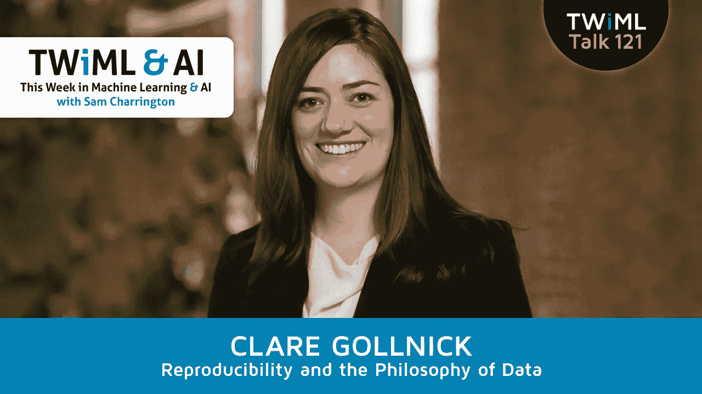

# 再现性危机以及为什么它对人工智能有害

> 原文：<https://towardsdatascience.com/the-reproducibility-crisis-and-why-its-bad-for-ai-c8179b0f5d38?source=collection_archive---------5----------------------->

2016 年《自然》[的一项调查](https://www.nature.com/news/1-500-scientists-lift-the-lid-on-reproducibility-1.19970)显示，超过 70%的研究人员试图重现另一位科学家的实验，但失败了，超过一半的人没有重现自己的实验。这一令人担忧的发现对数据科学产生了影响，在数据科学中，越来越多的同类问题正在涌现。在最近对铽实验室首席技术官 Clare Gollnick 的采访中，我讨论了科学中所谓的“再现性危机”的含义及其对数据科学家的影响。

绝对值得去看看[完整采访](https://twimlai.com/twiml-talk-121-reproducibility-philosophy-data-clare-gollnick/)。克莱尔很好地解释了再现性危机，并就这个问题如何影响人工智能从业者提供了深刻的见解。

Subscribe: [iTunes](https://itunes.apple.com/us/podcast/this-week-in-machine-learning/id1116303051?mt=2) / [SoundCloud](https://soundcloud.com/twiml) / [Google Play](https://goo.gl/app/playmusic?ibi=com.google.PlayMusic&isi=691797987&ius=googleplaymusic&link=https://play.google.com/music/m/Ihs3mamzsef2akrfycfkq3sspti?t%3DThis_Week_in_Machine_Learning_%2526_AI_Podcast) / [Stitcher](http://www.stitcher.com/s?fid=92079&refid=stpr) / [RSS](https://twimlai.com/feed)

以下是她的一些主要观点的简要概述:

*   **数据钓鱼和黑客攻击。**再现性危机的一个促成因素是“p-hacking”——即在确定潜在因果关系的特定假设之前，检查一个人的实验数据，直到发现符合统计显著性标准的模式。P-hacking 也被称为“数据钓鱼”,这是有原因的:您正在从您的数据逆向工作到一个模式，这打破了最初决定统计显著性的假设。
*   **深度学习不透明。Gollnick 指出，数据钓鱼正是机器学习算法所做的——它们从数据逆向工作到模式或关系。因此，你可以说 p-hacking 本质上相当于 ML 中的过度拟合。数据科学家很清楚，交叉验证是纠正这个问题的必要实践。但是人工智能中仍然存在大量的可复制性问题。Pete Warden 最近发表的一篇博客文章谈到了数据科学家和其他从业者面临的一些核心挑战。Warden 提到了当前 ML 和深度学习方法的深度迭代性质，以及数据科学家不容易记录他们在每次迭代中的步骤的事实。此外，深度学习的数据科学堆栈有许多移动的部分，这些层中任何一层的变化——深度学习框架、GPU 驱动程序或训练或验证数据集——都可能影响结果。**
*   **数据科学的哲学。** Gollnick 和其他相关的数据科学家一致主张更深入地理解我们使用的模型如何以及为什么工作。这样做可能意味着重新审视科学方法的基础，探索“数据哲学”。也就是对科学知识的哲学探索，它对某些事情意味着什么，以及数据如何支持这些。显而易见，任何迫使我们面对关于可解释性、因果性和确定性等问题的棘手问题的思维练习，在我们扩大现代机器学习方法的应用时，都可能具有巨大的价值。

ML 和 AI 中的再现性问题是每个数据科学家都应该关注的问题，因为它的影响深远。如果你想了解更多关于这个问题的信息，或者对 Gollnick 或我有任何意见，请访问我们的[节目页面](https://twimlai.com/twiml-talk-121-reproducibility-philosophy-data-clare-gollnick/)，收听完整的播客并加入讨论。

*2018 年 4 月 17 日编辑:格式修复。纠正深度学习是“一个黑匣子”到“不透明；前者是过于强烈的描述，而且不准确。*

*原载于 2018 年 3 月 22 日*[*twimlai.com*](https://twimlai.com/twiml-talk-121-reproducibility-philosophy-data-clare-gollnick/)*。*