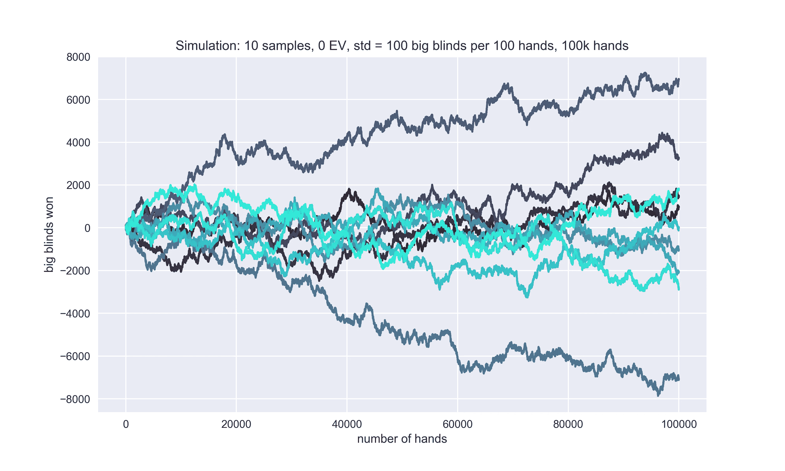
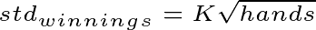
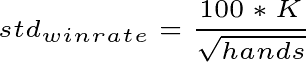
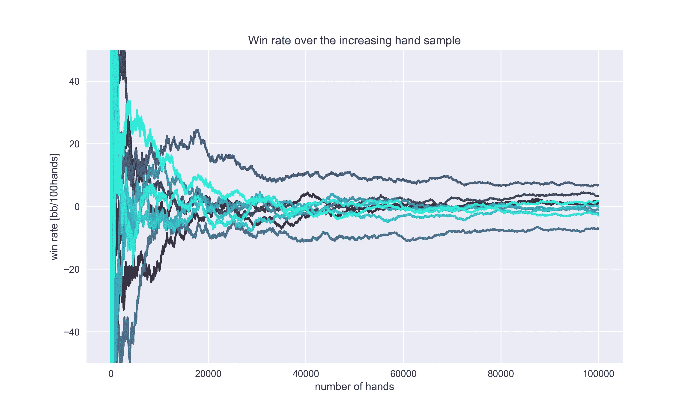
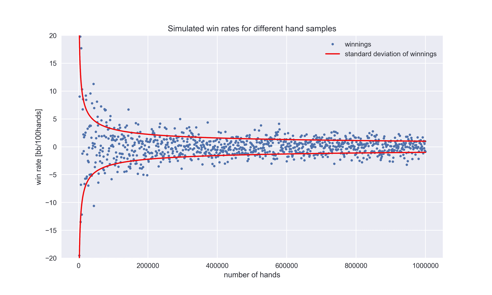

# 运气在扑克中的作用:玩的手数如何影响方差

> 原文：<https://towardsdatascience.com/the-role-of-luck-in-poker-how-the-number-of-hands-played-affects-the-variance-51f561a3c9f1?source=collection_archive---------1----------------------->

## 是什么让扑克同时最惊险和痛苦？方差。每个人都可以成为赢家。但是能持续多久呢？

几个月前，我和我的牌友们进行了一场辩论:“随着手牌样本的增加，方差会发生什么变化？”答案对每个人来说都是显而易见的，但令人惊讶的是——不同。每个人的论点、推理和逻辑似乎都是合法的。但是统计可能很棘手，有时，就像在扑克中，你的“感觉”是不够的。所以我，这个小组里最书呆子的家伙，决定炫耀一下。

# 基础

一位智者曾经说过:“一半的答案存在于一个精心设计的问题中。”。如果我是第一个说出来的，那我就是那个聪明人。所以，我们来分解一下。首先，方差的定义:“方差是一个数字，它衡量一组数字围绕均值分布的程度。”一个更有用的术语是标准差，它是方差的平方根。两者都代表你的扑克成绩有多好。但是标准差可以告诉你更多的东西。让我们来看一个扑克的例子。一个英雄玩期望值为 0(EV)的游戏，每 100 手牌的标准差为 100 倍大盲注(无限注德州扑克 6 人现金游戏的常见标准差)。他的技能水平(0 EV)将在整个帖子中保持不变。由于这一确切的标准差，他的资金在 100 手牌后有 68%的机会会发生不到 100 倍大盲注的变化。但是如果英雄玩了不同数量的手牌会怎么样呢？

# 赢款的差异

让我们从最明显的开始，赢款的方差。它告诉你在大盲注或金钱方面你可以预期有多少波动。但是，随着玩的牌越多，它是变得越小还是越大呢？为自己考虑，但要小心。你的农民逻辑会被女人的变化打败。这次你不能怪她。

这里有七个不同的英雄通过 100k 手样品赢得的模拟图。为了让这些图表更容易理解，你可以把它们想象成技能水平完全相同的玩家的图表。

Graph 1

有点难以置信，那些都是 0 EV 玩家的模拟图。如你所见，线条越来越分散。这意味着更大的方差和标准差。如果你仍然有“运气会在一天结束时抵消”这样的想法，让我给你看另一个图表。假设英雄玩 1k 手牌，在一手牌样本结束时，他赢了一点。然后他又从头开始，做了 2k 手牌。再点。然后是 3k 手，4k，5k…等等，直到 1M 手。以下是他得到的结果:

Graph 2

再来一次，它就分散了。为了让事情更清楚，我甚至展示了获胜的标准差线。它与手数的平方根成正比。标准差的等式等于

在我们的例子中，K 等于 10。例如，如果你的标准差是 85bbs/100hands，那么 K 的值就是 8.5。实际上，你可以从上面的等式中计算出一些有趣而有用的信息。你可以看到任何固定的手样本都有相同的标准差，不管它在图上的位置。

乍一看，这些结果有些难以理解，所以让我们举几个例子，它们具有“逻辑”意义:

*   你一手牌不能赢一叠以上。多玩几手，就有多赢的可能。微小的部分会增加扩散。
*   假设你在不完全平坦且有沙子的混凝土上直线滚动一个球。球最终会出界。它形成的线越长，就越有可能远离初始线。最后一张图从鸟瞰的角度展示了这种情况。

在你开始尽可能少玩以降低方差之前，请继续阅读。

# 胜率的方差

这个案子扭转了整个局面。胜率的定义是大盲注赢款除以玩的手数。考虑到这一点，我们得到一个有点不同的标准差公式:

事实上，事情发生了巨大的变化。随着手动样本的增加，标准差变小了。让我们将赢款除以手数/100，这是我们从图 1 中得到的结果:

Graph 3

胜率越来越接近 0bb/100 手，这是 hero 的正版胜率。图表 2 也是如此:

Graph 4

显然，你玩的牌越多，你的胜率就应该越准确。使用第二个等式，我们可以计算出将标准差降低到 1bb/100 手需要多少手。这意味着，如果你的胜率是 1bb/100 手，你可以 67%确定你的胜率在 0 到 2bb/100 手之间。为此，你需要一百万只手。所以继续努力吧…

# 结论

理解变化是成为一名优秀扑克玩家的关键因素之一，尤其是因为你的心理游戏。你应该预料到会有不好的事情发生，并有能力面对它们。不要太在意那些扑克软件系列。它们并不像你想象的那样能很好地预测你的技能，即使是 EV 线。请记住，永远不要低估方差和高估你的扑克技巧。我祝你在牌桌上一切顺利。

# 关于作者

Miha Gazvoda 是一名扑克玩家，他指责 variance 没有成为职业选手。然而，幸运的是，他有足够的技巧成为 2014 年斯洛文尼亚扑克冠军。

*原载于 2015 年 9 月 14 日*[*【www.pokerstrategy.com】*](https://www.pokerstrategy.com/forum/thread.php?threadid=349465)*。*