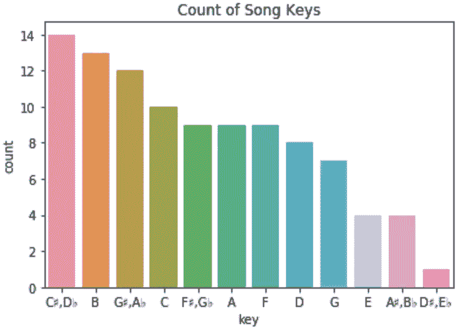
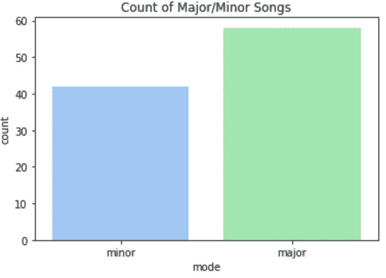
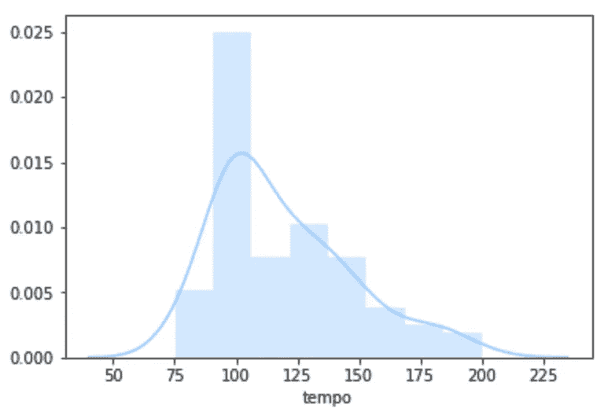
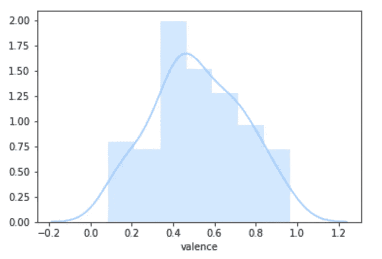
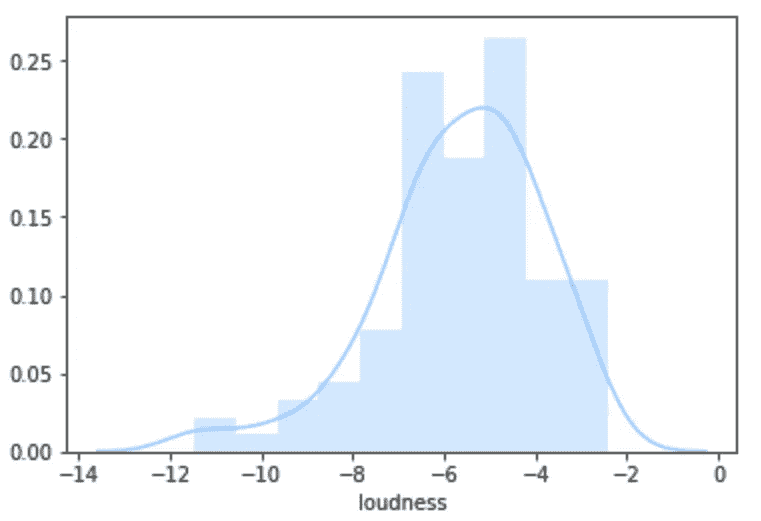
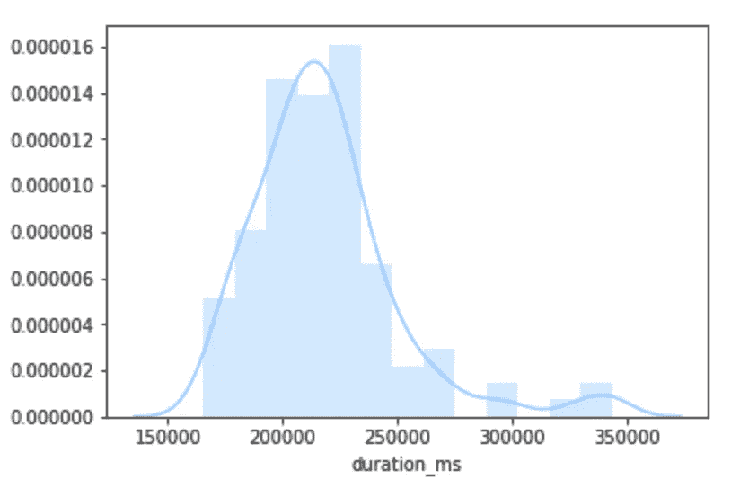

# 预测热门歌曲的科学！

> 原文：<https://towardsdatascience.com/the-science-of-predicting-a-hit-song-7c42a522d652?source=collection_archive---------1----------------------->

F 或者很多全职音乐艺人，拿到高排行榜位置就是他们的饭票；为了赚钱，他们需要在行业中有突出的地位，图表位置是显示他们有多突出的一种明确方式。每年年底，Spotify 都会编辑一份当年最常播放的歌曲列表。今年的播放列表包括 100 首歌曲。问题是:这些顶级歌曲有什么共同点？人们为什么喜欢它们？

要回答这个问题，我必须借助数据科学！我使用了 spotify 的 2017 年热门歌曲列表数据集:([https://github . com/kayguxe/hit _ songs _ data _ science/blob/master/featuresdf . CSV](https://github.com/kayguxe/hit_songs_data_science/blob/master/featuresdf.csv))每首歌曲的音频特征都是使用 Spotify Web API 提取的。

# 可跳舞性:

平均值为 0.697，很明显大多数顶级曲目都有很高的可跳性评级。在八十年代以前，一首歌曲的可舞性与其流行潜力并不十分相关。从那时起，适合跳舞的歌曲更有可能成为热门歌曲。这显示了音乐产业发展的程度。

# 音乐键和模式:

music keys count in 2017 top tracks list

顶级曲目中最常见的基调是 C♯/D♭.那么这一切意味着什么呢？嗯，在某种程度上，它揭示了我们在音乐中更常见的声音类型:勇敢、乐观的大调往往会击败忧郁的小调。这也揭示了 Spotify 大部分收藏(更倾向于西方音乐)的来源。

# 拍子

节奏的平均值为每分钟 119.202 次，与八十年代的平均节奏(每分钟 70-89 次)相比，2017 年热门歌曲的节奏非常快。

# 效价

心理学家用“化合价”这个词来描述某样东西是否有可能让某人感到快乐(正化合价)或悲伤(负化合价)。这有点像这个词的电子意义。

快乐和悲伤的歌曲相当均匀地分布在 0.517。
我们对音乐的反应是情绪化的。有些让我们快乐，有些让我们悲伤，歌曲的范围介于快乐和悲伤之间。

# 音量

平均而言，排行榜上的所有歌曲都很吵。此外，点击率相对高于那些在排行榜底部徘徊的歌曲。

# 持续时间

持续时间的平均值是 218387 毫秒，大约是 3 分 38 秒。一篇连线文章提出，20 世纪 60 年代之前流行歌曲的时间长度是基于留声机的。起初，这些留声机是圆柱形的。后来，它们以 10 英寸磁盘的形式出现。这些磁盘以每分钟 78 转的速度旋转，可以存储大约 3 分钟的音乐。这也是到目前为止正常的歌曲长度。

 [## 为什么广播里的歌曲长度都差不多？

### 这实际上是我的一个孩子提出的问题。“为什么这些歌的长度都差不多？怎么会有…

www.wired.com](https://www.wired.com/2014/07/why-are-songs-on-the-radio-about-the-same-length/) 

**结论**

音频特性是艺术家在发行前测试其歌曲成功与否的一项重要措施。然而，如果要正确评估诸如响度之类的音频特性，那么在正确评估歌曲之前，似乎需要对歌曲进行完整的编写、制作、混音和掌握，这必然会花费时间、金钱和精力。

但有一点是明确的，即研究领域不会有任何进展，尤其是随着音乐人工智能的进步。众所周知，如今越来越多的热门歌曲是由那些知道如何给公众提供数据所显示的他们想要的东西的制作人根据一个经过时间考验的公式制作出来的。对照成功的数学方程式测试配方，并最终使用算法生成热门歌曲，是热门歌曲制作工厂合乎逻辑的下一步。