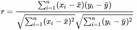
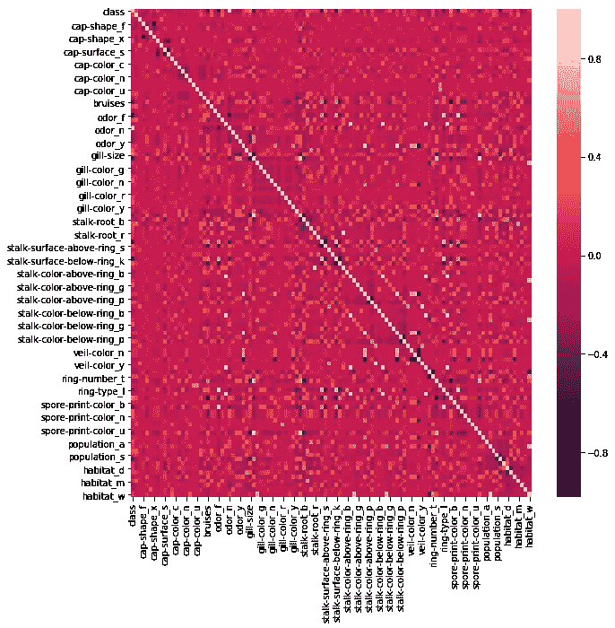
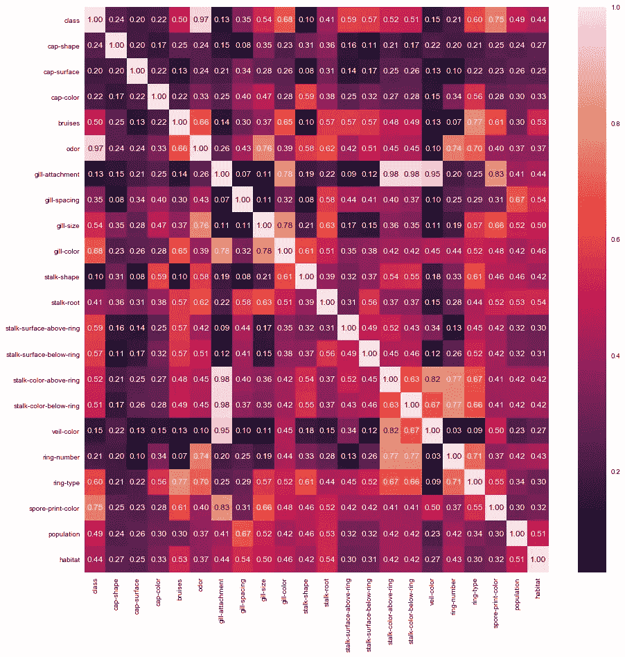
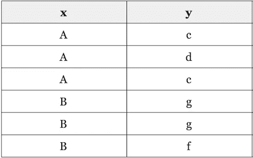
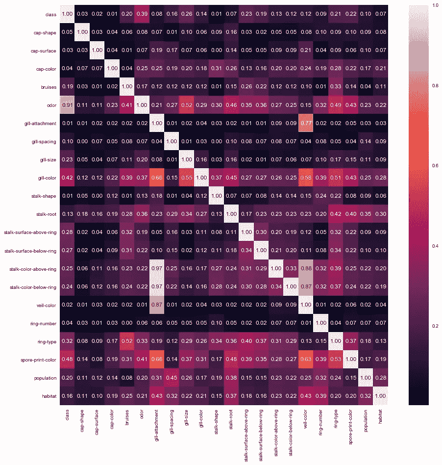

# 对范畴相关的探索

> 原文：<https://towardsdatascience.com/the-search-for-categorical-correlation-a1cf7f1888c9?source=collection_archive---------2----------------------->

*本帖中出现的所有代码都是我的* [*GitHub 页面*](https://github.com/shakedzy) *上的* `[dython](https://github.com/shakedzy/dython)` *库的一部分。
如有任何代码相关问题，请在本库的 GitHub 页面* [*开题*](https://github.com/shakedzy/dython/issues) *。*


不久前，我在 Kaggle 上偶然发现了一个蘑菇数据集，其中收集了 20 多种不同特征的食用和有毒蘑菇，并进行了分类。寻找可能指出吃随机蘑菇有多安全的模式的想法似乎是一个不错的挑战——我甚至发现自己在我后来出版的的[内核后面创造了一个完整的故事情节——一个在森林里迷路的人。](https://www.kaggle.com/shakedzy/alone-in-the-woods-using-theil-s-u-for-survival)

在浏览其他用户的内核时，很容易看到随机森林和其他简单的方法无需太多努力就可以达到极高的准确性，所以我也认为没有理由这样做——我决定看看我是否可以自己找到哪些功能指向我可以安全食用的蘑菇，如果我需要的话。我意识到我实际上在寻找的是特征和蘑菇类型之间的相关性，但这是一个问题，因为特征都是分类的，在这种情况下相关性没有定义。

## 什么是相关性？

在我们讨论相关性不是什么之前，我们先来讨论它是什么。在人类语言中，相关性是对两个特征如何相关的度量；就像一年中的月份与日平均温度相关，一天中的时间与户外的光照量相关。从数学上来说，通常使用的相关性定义是数据样本的 [Pearson's R](https://en.wikipedia.org/wiki/Pearson_correlation_coefficient) (产生范围为[-1，1]的值):



Pearson’s R for data sample. Taken from Wikipedia

但是，从上面的等式可以看出，当数据是分类的时，皮尔逊的 R 没有被定义；让我们假设 *x* 是一个颜色特征——如何从颜色的*平均值中减去*黄色*？我们需要别的东西。*

处理这种情况的一个常见选项是首先使用一次性编码，并将每个分类特征的每个可能选项分解为 0 或 1 特征。这将允许使用相关性，但它很容易变得过于复杂而无法分析。例如，one-hot 编码将蘑菇数据集的 22 个分类特征转换为 112 个特征的数据集，当将相关表绘制为热图时，我们会得到如下结果:



Correlation of the mushrooms data-set, transformed using one-hot encoding

这不是可以轻易用来获得新见解的东西。所以我们还需要别的东西。

## 直言不讳

我们需要的是*看起来*像相关，但对分类值有效的东西——或者更正式地说，我们在寻找两个分类特征之间关联的*度量。介绍:[克莱默 V](https://en.wikipedia.org/wiki/Cram%C3%A9r%27s_V) 。它是基于皮尔森卡方检验的一个名义上的变化，并且有一些内在的好处:*

1.  与相关类似，输出在[0，1]的范围内，其中 0 表示没有关联，1 表示完全关联。(与相关性不同，不存在负值，因为不存在负相关这种东西。要么有，要么没有)
2.  像相关性一样，克莱姆的 V 是对称的——它对交换 *x* 和 *y* 不敏感

更好的是——有人已经将其实现为一个 [Python 函数](https://stackoverflow.com/a/46498792/5863503)。这是我编辑过的原文:

```
**def** cramers_v(x, y):confusion_matrix = pd.crosstab(x,y)
    chi2 = ss.chi2_contingency(confusion_matrix)[0]
    n = confusion_matrix.sum().sum()
    phi2 = chi2/n
    r,k = confusion_matrix.shape
    phi2corr = max(0, phi2-((k-1)*(r-1))/(n-1))
    rcorr = r-((r-1)**2)/(n-1)
    kcorr = k-((k-1)**2)/(n-1)
    **return** np.sqrt(phi2corr/min((kcorr-1),(rcorr-1)))
```

当应用于蘑菇数据集时，它看起来像这样:



Cramer’s V calculated for the mushrooms data-set

那不是很漂亮吗？通过观察这张热图，我们可以看到*气味*与蘑菇的*类*(可食用/有毒)高度相关，并且*鳃附着*特征与其他三种特征高度相关。

## 对称的诅咒

思考克莱姆 V 的输出，我意识到由于它的对称性，我正在失去有价值的信息。为了更好地证明这一点，请考虑以下数据集:



我们可以看到，如果已知 *x* 的值，仍然无法确定 *y* 的值，但是如果已知 *y* 的值——那么就保证了 *x* 的值。当使用克莱姆的 V 时，由于它的对称性，这些有价值的信息丢失了，所以为了保存它，我们需要一个*非对称的*分类特征之间关联的度量。这正是泰尔的 U。

[泰尔的 U](https://en.wikipedia.org/wiki/Uncertainty_coefficient) ，也称为不确定系数，是基于 *x* 和 *y —* 之间的*条件熵*或者用人类的语言来说，给定 *x* 的值， *y* 有多少种可能的状态，以及它们出现的频率。就像克莱姆的 V 一样，输出值在[0，1]的范围内，与之前的解释相同——但与克莱姆的 V 不同，它是不对称的，意思是 *U(x，y)*≦*U(y，x)* (而 *V(x，y)=V(y，x)* ，其中 *V* 是克莱姆的 V *)* 。在上面这个简单的例子中使用 Theil 的 U 会让我们发现，知道 *y* 就意味着我们知道 *x* ，反之则不然。

将公式实现为 Python 函数产生了这个*(关于* `conditional_entropy` *函数的完整代码可以在我的 Github 页面上找到——链接在帖子顶部)*:

```
**def** theils_u(x, y):s_xy = conditional_entropy(x,y)
    x_counter = Counter(x)
    total_occurrences = sum(x_counter.values())
    p_x = list(map(**lambda** n: n/total_occurrences, x_counter.values()))
    s_x = ss.entropy(p_x)
    **if** s_x == 0:
        **return** 1
    **else**:
        **return** (s_x - s_xy) / s_x
```

将此应用于蘑菇数据集:



Theil’s U calculated for the mushrooms data-set

这个新的计算让我们从克莱姆的 V 中看到了更多的关联——例如，我们现在看到，虽然知道*气味*比蘑菇的*种类*提供了很多信息，但反过来却不是这样。泰尔的 U 确实给了我们更多关于不同特征之间真实关系的信息。

## 当我们把东西混在一起时会发生什么？

因此，现在我们有了一种方法来衡量两个连续特征之间的相关性，以及两种方法来衡量两个分类特征之间的关联。但是一对连续特征和一个分类特征呢？为此，我们可以使用[相关比率](https://en.wikipedia.org/wiki/Correlation_ratio)(通常使用希腊字母 *eta* 来标记)。数学上定义为每个类别均值的加权方差除以所有样本的方差；在人类的语言中，相关比回答了下面这个问题:*给定一个连续数，你能多好地知道它属于哪一类？*就像我们之前看到的两个系数一样，这里的输出也在[0，1]的范围内。

Python 中的实现如下所示:

```
**def** correlation_ratio(categories, measurements):
    fcat, _ = pd.factorize(categories)
    cat_num = np.max(fcat)+1
    y_avg_array = np.zeros(cat_num)
    n_array = np.zeros(cat_num)
    **for** i **in** range(0,cat_num):
        cat_measures = measurements[np.argwhere(fcat == i).flatten()]
        n_array[i] = len(cat_measures)
        y_avg_array[i] = np.average(cat_measures)
    y_total_avg = np.sum(np.multiply(y_avg_array,n_array))/np.sum(n_array)
    numerator = np.sum(np.multiply(n_array,np.power(np.subtract(y_avg_array,y_total_avg),2)))
    denominator = np.sum(np.power(np.subtract(measurements,y_total_avg),2))
    **if** numerator == 0:
        eta = 0.0
    **else**:
        eta = np.sqrt(numerator/denominator)
    **return** eta
```

## 最后的话

我相信我可以宣布，对分类特征的关联度量的研究是成功的，特别是当某些要求——例如对非对称度量的需要——在开始时没有被预期到。在探索包含分类特征的数据集时，这三个新指标非常有用，并帮助我对我探索的数据集获得更多见解。我只能希望这能像对我一样对你有用，如果没有的话，至少你现在知道如何识别可食用的蘑菇了。