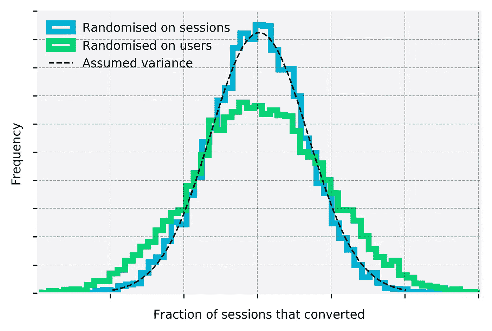
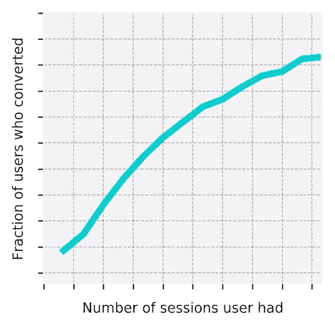
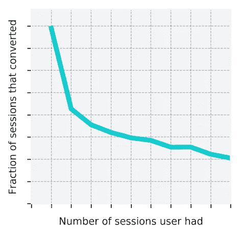
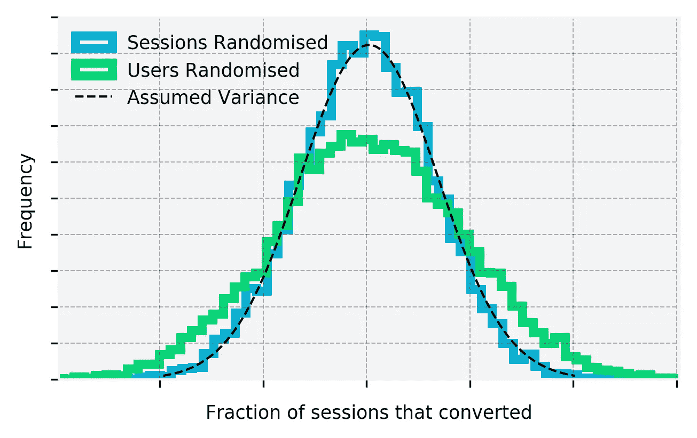
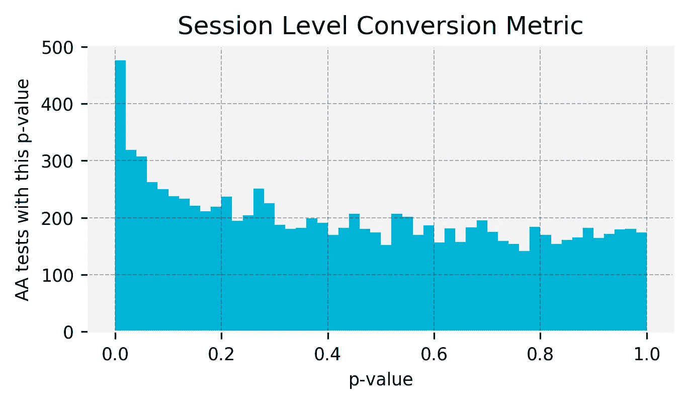
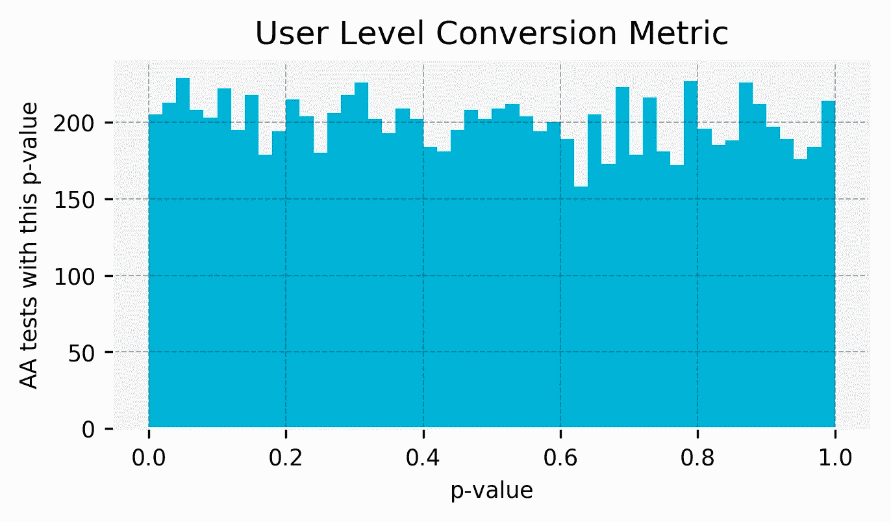
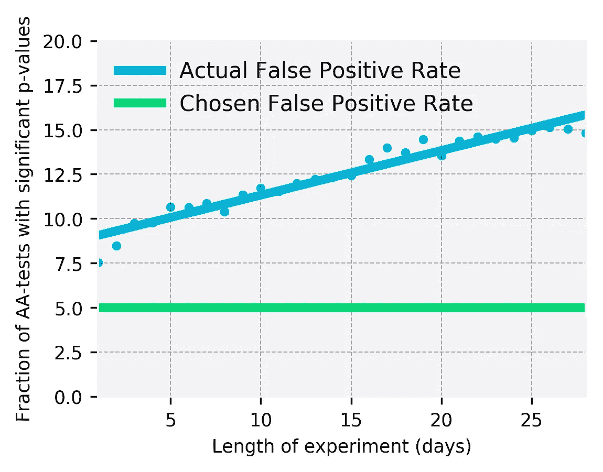

# 实验的第二个幽灵:基于会话的度量的谬误

> 原文：<https://towardsdatascience.com/the-second-ghost-of-experimentation-the-fallacy-of-session-based-metrics-fb65006d30ff?source=collection_archive---------2----------------------->

利齐·埃德里，科林·麦克法兰和汤姆·奥利弗

The second Ghost of Experimentation: The fallacy of session based metrics

👻这篇文章是探索导致[追逐统计幽灵](https://medium.com/@SkyscannerCodevoyagers/chasing-statistical-ghosts-in-experimentation-3f393323a1c1)的实验从业者普遍误解的系列文章的一部分。

标准统计检验允许我们判断 A/B 检验的结果是否显著(不太可能仅仅是由于偶然变化)或者不依赖于每个“观察”是独立的假设。对于会话级指标，如每个会话的转换，观察单位是会话。

然而，在 A/B 测试中，通常将*用户*分配到 A 组或 B 组，以避免同一个人同时看到两个版本，扰乱用户体验。这样会话就不是独立的了，因为一个用户可以有多个会话，一个会话中发生的事情会影响或改变我们对用户其他会话中发生的事情的预期。例如，在 [Skyscanner](http://skyscanner.net?utm_medium=blog&utm_source=engmediumblogpost&utm_campaign=second_ghost_of_experimentation) 中，我们发现用户会话越多，就越有可能转化:

但是，如果用户使用多个会话进行会话，则单个会话不太可能被转换。

会话的这种*非独立性*非常重要，因为这意味着如果我们随机选取一组用户，并查看他们所有会话中已转换的部分，我们预计平均而言，与我们随机选取每个会话相比，结果对真实会话转换率的估计不太准确。举一个极端的例子，如果每个用户有 1000 个会话，我们选择五个用户，那么最终的平均会话转换率将在很大程度上取决于我们选择哪五个用户。然而，如果我们随机选择 5000 个会话，结果将更能代表真实的总体平均值，因为我们已经选择了 5000 个会话，而不是 5 个随机选择。

我们在 Skyscanner 上模拟了这如何影响我们的转化率估计，方法是多次选择会话组，并查看平均会话转化率的变化。在第一个例子中，我们通过在 28 天的时间内随机选择(替换)500，000 个用户及其所有相关会话来模拟实验设置。下面的绿色直方图显示了 10，000 个随机组的平均会话转换率的分布。在第二个实例(蓝色直方图)中，我们独立处理会话，并从同一时间段随机选择相同数量的会话，而不管是哪个用户创建的。

这里的虚线表示当样本中的每个观察值独立且同分布( [i.i.d.](https://en.wikipedia.org/wiki/Independent_and_identically_distributed_random_variables) )时的理论方差，这是普通统计检验(χ2 检验、z 检验、t 检验等)中内置的假设。).当我们将会话视为独立时，它就像预期的那样严格遵循这个假设的方差。然而，当我们随机选择用户而不是会话时，正如我们在 A/B 测试中基本上所做的那样，方差比显著性计算中假设的要大——它可能看起来是一个小差异，但当我们选择用户而不是会话时，我们根据理论称之为“不太可能”的结果(>平均值的 2σ)实际上是三倍常见。

其结果是，当应用于会话级度量时，标准统计测试不可靠，并导致更多的误报。我们可以通过模拟 AA 测试(两组用户看到完全相同的东西的实验)来估计这对实验结果的影响。当我们使用 95%的置信度时，我们预计只有 5%的测试会出现假阳性。例如，当没有真实效应时，如 AA 测试的情况，我们应该只推断 5%的显著差异。

Skewed!

左边的图显示了从一周的 Skyscanner 数据中计算的 p 值，随机选择用户组成两组，从两组的会话转换率之间的差异计算 p 值，然后多次重复该过程。如本系列的[第一个幽灵](https://medium.com/towards-data-science/the-first-ghost-of-experimentation-its-either-significant-or-noise-b897e3058655)所示，p 值应该是均匀分布的，因为我们知道没有真正的影响，但是它们偏向低 p，其中大约 10%的 p 值为 0.05，所以我们 95%的置信度实际上只是 90%的置信度。

Uniform

以上都不是用户级指标的问题，因为用户是独立的——他们被随机分配到 A 或 B，我们不希望一个用户的行为影响另一个用户的行为。如果我们看一个用户级的指标，比如转化的用户比例，我们得到了预期的结果；从同一周的数据中，我们看到 5%的模拟 AA 测试显示出显著差异。

在我们的例子中，实验时间越长，影响越大，因为每个用户的平均会话数更高。在不同的时间范围内重复上述过程，我们可以看到假阳性率——被发现有意义的 AA 实验的百分比——如何取决于实验的长度。正如您在下图中看到的，当使用 95%的置信度时，为期一个月的会话转化率实验的假阳性率将超过 15%。这意味着我们实际上只能达到 85%的置信度，并且发现**三**倍于预期的假阳性！

This ghost could give us three times as many false positives

# 如何才能避免被这个统计幽灵抓到？

尽管我们在这里关注的是会话级指标，但是每当你试图测量一个速率指标时，这个问题就会发生，这个指标是由你随机选择的以外的东西定义的。例如，如果你随机选择用户，点击率(总点击量/总浏览量)，或者每页面浏览量，每点击量，或者每用户日指标都会受到影响。我们认为有三种选择可以避免被这个统计幽灵所迷惑:

## a)面向用户指标

如果你对用户进行随机选择，那么在大多数情况下，使用用户级别的度量标准将满足常见的统计显著性测试的假设，并避免上面看到的虚高的假阳性率。考虑到当分析单位(分母)不是随机化单位时，对转换率等比率指标的解释可能是不明确的，因此向用户级指标的转变在任何情况下都可能是有益的。例如，会话级转换率的增加可以指示改善的、减弱的或未改变的用户体验，这取决于分子(转换)或分母(会话)或两者是否已经改变。

## b)应用适当的修正

在有必要测量一个指标的情况下，有一些方法可以估计真实的方差并计算出精确的 p 值。你可以在微软团队[这里](https://alexdeng.github.io/public/files/jsm2011-deng.pdf)和[这里](http://www.exp-platform.com/Documents/2017WSDMDengLuLitz.pdf)找到关于这些方法的更详尽的讨论。常见的技术有 bootstrapping 或“delta method”，但是这些方法在计算上可能很昂贵，因为它们需要处理数据的全部分布，而不是简单地处理聚合平均值，否则这些平均值就足以满足二项式检验的要求。

## c)预计会有更多的误报

最后，如果您没有执行方差计算和实施上述校正之一的基础设施或意愿，您至少应该意识到，根据您选择的显著性水平，您将具有比预期更高的假阳性率。我们建议您查看 AA 测试，以充分了解您的指标是如何受到影响的，因为这高度依赖于所讨论的数据和指标。

👻更:[追统计鬼](https://medium.com/@SkyscannerCodevoyagers/chasing-statistical-ghosts-in-experimentation-3f393323a1c1)。

# 与我们合作

我们在 Skyscanner 以不同的方式做事，我们正在全球办事处寻找更多的工程团队成员。看看我们的 [Skyscanner 职位](https://www.skyscanner.net/jobs/)寻找更多空缺。

Work with us