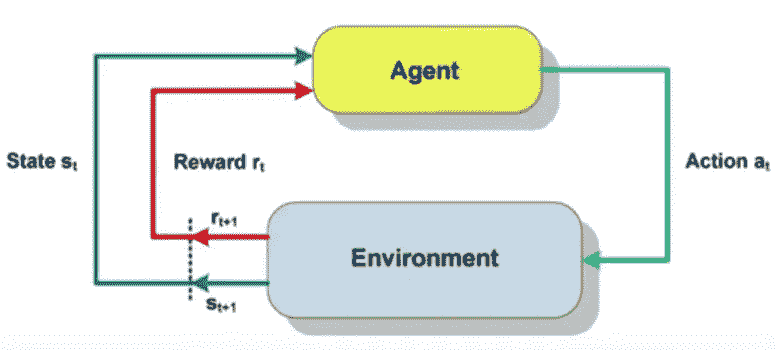
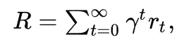
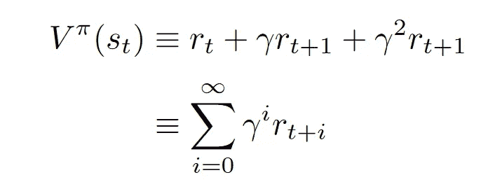
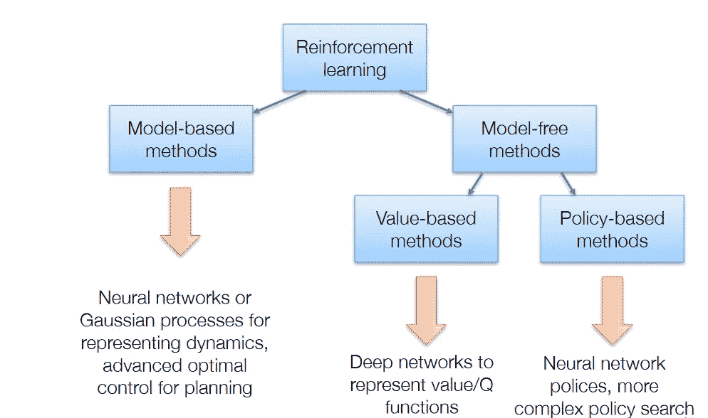

# 强化学习背后的秘密

> 原文：<https://towardsdatascience.com/the-secrets-behind-reinforcement-learning-25b87befb2d3?source=collection_archive---------9----------------------->

玩 Dota2 的机器人，打败世界上最好的围棋选手的人工智能，擅长毁灭的计算机。这是怎么回事？AI 社区一直这么忙着玩游戏是有原因的吗？

让我这么说吧。如果你想让机器人学会走路，你会怎么做？你造了一个，编了程序，然后在纽约的大街上发布？当然不是。你建立一个模拟，一个游戏，你用那个虚拟空间教它如何在它周围移动。零成本，零风险。这就是为什么游戏在研究领域如此有用。但是你怎么教它走路呢？答案是今天文章的主题，也可能是当时最令人兴奋的机器学习领域:

你可能知道有两种类型的机器学习。有人监督和无人监督。嗯，还有第三种，叫强化学习。RL 可以说是 ML 中最难理解的领域，因为有太多太多的事情同时发生。我会尽可能地简化，因为这是一个非常惊人的领域，你肯定应该了解它。但是让我警告你。它涉及到复杂的思维，需要 100%的专注去把握。和一些数学。所以，深呼吸，让我们开始吧:

# 马尔可夫决策过程

强化学习是一个反复试验的过程，其中 AI ( **代理**)在**环境**中执行若干**动作**。每个独特的时刻，代理都有一个**状态**，并从这个给定的状态到一个新的状态。这个特殊的行为可能会有奖励。因此，我们可以说每一个学习时期(或事件)都可以表示为一系列的状态、行动和回报。每个状态仅依赖于先前的状态和动作，并且由于环境本身是随机的(我们不知道下一个状态)，这个过程满足[马尔可夫性质](https://en.wikipedia.org/wiki/Markov_property)。马尔可夫性质表明，过程未来状态的条件概率分布只取决于当前状态，而不取决于之前的事件序列。整个过程被称为[马尔可夫决策过程](https://en.wikipedia.org/wiki/Markov_decision_process)。马尔可夫决策过程是主要的数学工具，我们用它来构建几乎所有的 RL 问题，这种方法很容易研究和试验不同的解决方案。

让我们看一个使用超级马里奥的真实例子。在这种情况下:

*   代理人当然是受人爱戴的马里奥
*   状态就是当前的情况(比如说我们屏幕的框架)
*   动作有:向左、向右移动和跳跃
*   环境是每个层次的虚拟世界；
*   奖励就是马里奥是死是活。

好了，我们已经恰当地定义了问题。下一步是什么？我们需要一个解决方案。但首先，我们需要一种方法来评估解决方案有多好？

我想说的是每集的奖励是不够的。想象一个马里奥游戏，其中马里奥由代理控制。他在整个关卡中不断获得正面奖励，但就在最后一面旗帜前，他被一个锤子兄弟杀死了(我讨厌那些家伙)。你看，每个人的奖励都不足以让我们赢得比赛。我们需要一个能抓住整体水平的奖励。这就是**贴现的累积预期回报**的期限发挥作用的地方。

它无非是所有奖励的总和减去一个因子 gamma，其中 gamma 属于[0，1]。折扣是必不可少的，因为回报往往在开始时比结束时更重要。这很有道理。

接下来就是解决问题了。为了做到这一点，我们定义学习任务的目标是:代理人需要学习在给定的状态下执行哪一个动作，使累积奖励随时间最大化。或者学习**策略π: S- > A.** 策略只是状态和动作之间的映射。

综上所述，我们使用以下等式:

其中 V ( **值**)是一项政策(π)从一个州(s)获得的**预期**长期回报。

你还和我在一起吗？如果是的话，让我们暂停 5 秒钟，因为这有点让人不知所措:

1…2…3…4…5

既然我们恢复了头脑清醒，让我们回顾一下。我们将问题定义为马尔可夫决策过程，我们的目标是学习最佳策略或最佳价值。我们如何进行？

我们需要一个算法(谢谢你，夏洛克……)

好吧，这些年来有大量开发的 RL 算法。每种算法关注的都是不同的东西，无论是价值最大化还是策略最大化或者两者都是。是否使用模型(如神经网络)来模拟环境。它是否会捕捉到每一步或最后的回报。正如你所猜测的，将所有这些算法分类并不容易，但这正是我要做的。

如您所见，我们可以将 RL 算法分为两大类:基于模型的和无模型的:

# 基于模型的

这些算法旨在从其观察中了解环境如何工作(其动力学)，然后使用该模型规划解决方案。当他们有一个模型时，他们使用一些计划方法来寻找最佳策略。众所周知，它们是数据高效的，但是当状态空间太大时，它们就失效了。尝试建立一个基于模型的算法来下围棋。不会的。

[动态规划](https://en.wikipedia.org/wiki/Dynamic_programming)方法是基于模型的方法的一个例子，因为它们需要环境的完整知识，例如转移概率和回报。

# 无模型

无模型算法不需要学习环境和存储所有状态和动作的组合。根据培训的最终目标，可以分为两类。

**基于策略的**方法试图找到最优策略，无论它是随机的还是确定的。像策略梯度和加强算法属于这一类。它们的优点是在高维或连续的作用空间上有更好的收敛性和有效性。

基于策略的方法本质上是一个优化问题，在这里我们找到一个策略函数的最大值。这就是为什么我们也使用像进化策略和爬山这样的算法。

**基于价值的**方法则相反，试图找到最优价值。这一类别的很大一部分是一个称为 [Q-learning](https://en.wikipedia.org/wiki/Q-learning) 的算法家族，它学习优化 Q 值。我计划在下一篇文章中彻底分析 Q-learning，因为它是强化学习的一个重要方面。其他算法涉及 SARSA 和值迭代。

在策略和基于价值的方法的交叉点，我们发现了**行动者-批评家**方法，其目标是优化策略和价值函数。

现在是最酷的部分。在过去的几年里，镇上出现了一个新人。不可避免地会影响和增强所有现有的解决强化学习的方法。我相信你猜到了。深度学习。因此，我们有了一个新的术语来代表所有这些新的研究想法。

# 深度强化学习

深度神经网络已经被用于对环境的动态进行建模(基于模式)、增强策略搜索(基于策略)以及逼近价值函数(基于价值)。对最后一个(这是我最喜欢的)的研究产生了一个名为 [Deep Q Network](https://deepmind.com/research/dqn/) 的模型，该模型及其许多改进促成了该领域一些最惊人的突破(以雅达利为例)。更让你兴奋的是，我们不仅使用简单的神经网络，还使用卷积、递归和许多其他网络。

好了，我觉得第一次接触强化学习就够了。我只是想给你整个想法背后的基础，并给你一个这些年来实现的所有重要技术的概述。同时，也给你一个这个领域未来发展的提示。

强化学习在工业和研究中都有应用。仅举几个例子:机器人控制、优化化学反应、推荐系统、广告、产品设计、供应链优化、股票交易。我可以永远继续下去。

这可能是人工智能目前最令人兴奋的领域，在我看来，它拥有一切权利。

这是一系列帖子中的第一篇，我们将揭开强化学习的秘密，并试图解释所有不同算法背后的直觉和数学。主要焦点将是深度学习如何被用来大大增强现有技术，以及它如何在短短几年内带来革命性的结果。

下一次，我们将深入 Q 学习，贝尔曼方程，并解释为什么 2015 年提出的深度 Q 网络打开了人工智能新时代的大门。

直到我的下一篇文章，敬请关注。

> ***如果您有任何想法、评论、问题或者您只想了解我的最新内容，请随时在***[**Linkedin**](https://www.linkedin.com/in/sergios-karagiannakos/)**，**[**Twitter**](https://twitter.com/KarSergios)**，**[**insta gram**](https://www.instagram.com/sergios_krg/)**，**[**Github**](https://github.com/SergiosKar)**或在我的**

要阅读整个深度强化学习课程，学习所有你需要了解的人工智能知识，请前往[此处](https://medium.com/@SergiosKar/deep-reinforcement-learning-course-baa50d3daa62)。

*原载于 2018 年 9 月 23 日*[*sergioskar . github . io*](https://sergioskar.github.io/Reinforcement_learning/)*。*