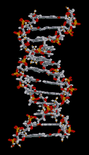
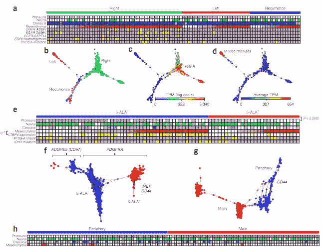
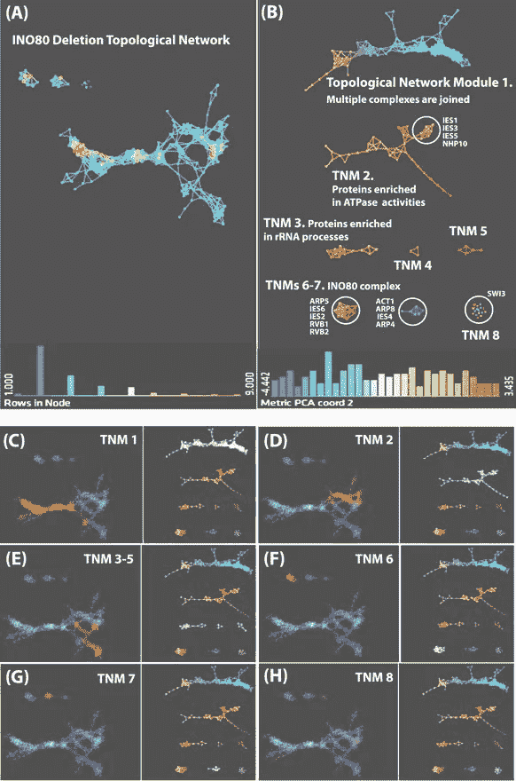
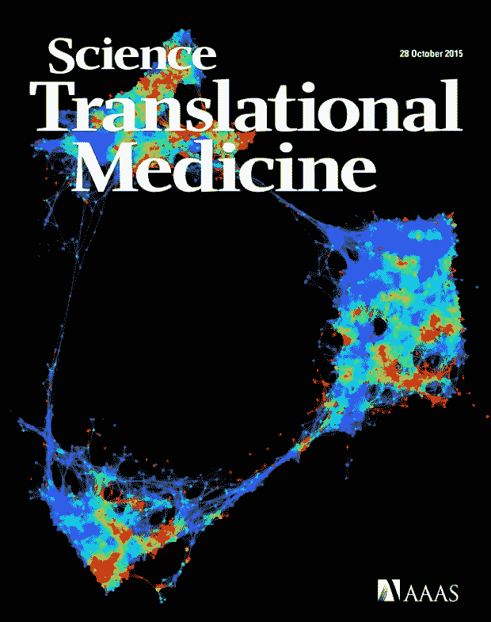

# 基因组的形状:用拓扑数据分析超越双螺旋

> 原文：<https://towardsdatascience.com/the-shape-of-the-genome-going-beyond-the-double-helix-with-topological-data-analysis-29021b860ebc?source=collection_archive---------5----------------------->

这篇原创的[博客](https://www.ayasdi.com/blog/topology/shape-genome-going-beyond-double-helix-topological-data-analysis/)最早出现在 2017 年的 Ayasdi 网站上。

在科学领域，或者说整个 20 世纪，最具标志性的形状之一是双螺旋。

1953 年，弗朗西斯·克里克和詹姆斯·沃森发现了 DNA 的形状(归功于莫里斯·威尔金斯和[罗莎琳德·富兰克林](http://www.biomath.nyu.edu/index/course/hw_articles/nature4.pdf))，这是理解人类基因组的一个重要里程碑，也是一些非凡研究的起点。

从我们的角度来看，值得注意的是使用拓扑数据分析研究“组学”数据集的合作者数量。在这篇文章中，我们引用了一些 TDA 最近发表的突破性发现。

我们在哥伦比亚大学的合作者刚刚在[自然遗传学](https://s3.amazonaws.com/cdn.ayasdi.com/wp-content/uploads/2017/03/29155642/ng.3806.pdf)发表了一篇论文，题为“时空基因组架构为胶质母细胞瘤(GBM)的精确肿瘤学提供信息”这篇论文使用我们的软件观察了 52 个个体的基因组和表达谱。他们发现，来自相同肿瘤块的样本共享基因组和表达特征，而地理上分离的多灶性肿瘤和/或长期复发性肿瘤来自不同的克隆。这些发现可以为 GBM 患者的靶向治疗干预提供信息，有可能通过基因组特征实现癌症的精确药物治疗。

UCSF 几周前刚刚发表了一篇论文，题为“在 PLOS 一中使用拓扑数据分析揭示创伤性脑损伤中精确的表型生物标记关联”在这里，该团队再次使用 TDA 揭示了数据驱动的患者结果模式，以确定潜在的康复生物标志物。使用更传统的单变量统计检验方法，这可以显著预测创伤性脑损伤后患者的预后恢复。这是我们与 UCSF 合作的第二份出版物。这些分析可能为 TBI 患者的未来临床试验中的患者分层和治疗计划提供一种可靠的方法。

stowers Institute of Medical Research 上个月刚刚在 [Nature Scientific Reports](http://www.nature.com/articles/srep43845) 发表了一篇名为《扰动蛋白质相互作用网络中拓扑网络模块的识别》的论文。这是我们与 Stowers 合作的第三份出版物( [PLOS 报纸](http://journals.plos.org/plosone/article?id=10.1371/journal.pone.0155492)和 [EMBO 报道](https://s3.amazonaws.com/cdn.ayasdi.com/wp-content/uploads/2015/02/13112500/publication_Conserved_abundance.pdf))。斯托斯的科学家们确定了拓扑网络模块，这些模块由在网络中特定位置发现的具有共享属性的蛋白质组成。生物网络由功能模块组成，然而识别和表征这些模块是困难的。第一作者 Mihaela Sardiu 的机场类比非常贴切，“把蛋白质想象成轴辐系统中的机场。该系统在其正常状态下以一种方式工作。但是当一场暴风雪关闭了一个主要的枢纽会发生什么呢？网络的一部分受到影响。网络中某个部分的变化不仅会影响该部分，还会影响周围的部分。”随着更多受干扰的蛋白质相互作用网络变得可用，用像我们这样的高级数学工具分析这些数据集可能会为癌症等疾病的研究提供新的见解&其他人类遗传疾病，其中蛋白质相互作用网络因化疗或固有疾病本身而改变。通过研究蛋白质及其环境，研究人员希望深入了解广泛的生物功能，包括耐药性和导致癌症的突变。

我们在这方面的工作可以追溯到几年前。

例如，在 2016 年，欧洲医学研究联盟 UBIOPRED(呼吸疾病结果预测中的无偏生物标志物)使用我们的软件发现了 1700 个基因签名，以有意义地区分严重哮喘与非哮喘和轻中度哮喘。通过对哮喘人群进行细分，研究人员希望为对治疗有反应的患者开发有针对性的治疗方法。这种疗法在治疗只涉及少量基因的疾病方面一直很有效。开发针对哮喘等涉及成百上千个基因的疾病的靶向药物更具挑战性。这项研究发表在[美国呼吸重症医学杂志](http://www.atsjournals.org/doi/abs/10.1164/rccm.201604-0866OC)上，包括 11 个欧洲国家 16 个地点的 610 名患者，补充了[之前发表在](http://www.jacionline.org/article/S0091-6749(15)00104-9/pdf)[过敏和临床免疫学杂志](https://s3.amazonaws.com/cdn.ayasdi.com/wp-content/uploads/2016/02/13110727/PIIS0091674915031176.pdf)上的两篇论文。

几年来，斯坦福大学的大卫·施奈德已经将 TDA 用于复杂的疾病康复领域。在 2016 年发表的一篇论文中，该团队使用我们的软件复制了感染疟原虫的小鼠和人类在转录阶段空间中从健康状态到患病状态，再回到健康状态的圆形轨迹。

2015 年，西奈山的一个团队使用 Ayasdi 的软件探索了 11210 名二型糖尿病患者的表型空间，并确定了 3 个以前没有报道过的具有不同遗传和疾病关联的患者亚组。这是主流新闻，被[快速公司](https://www.ayasdi.com/blog/bigdata/fast-company-times-two/)采用，并成为[科学](https://s3.amazonaws.com/cdn.ayasdi.com/wp-content/uploads/2016/01/13110822/mtsinai.pdf)的封面。

在 2015 年之前有几十篇论文，但有几篇值得注意，包括[病毒进化的拓扑结构](https://s3.amazonaws.com/cdn.ayasdi.com/wp-content/uploads/2015/02/13112457/Ayasdi_TopologyofViralEvolution.pdf)，来自哥伦比亚的团队提出使用遗传相空间的持续同源性来研究网状进化，并将这一想法应用于病毒的重配和重组。本质上是“进化中的革命”这是 TDA 将现实世界数据中的相关结构可视化的另一个例子，这是经典技术看不到的。数学生物学按照达尔文的生命树模拟了进化。也就是说，进化网络是树状的，在模拟时间进化的基础网络中没有任何循环。这篇论文表明，这种循环存在于真实数据中，TDA 需要找到并理解它们。这是这种结构存在的第一次严格和系统的确立——现在很明显，这是一种普遍存在的现象。

最后，来自 [Nicolau 等人](https://s3.amazonaws.com/cdn.ayasdi.com/wp-content/uploads/2015/02/13112456/Topology_Based_Data_Analysis_Identifies_a_Subgroup_of_Breast_Cancer_with_a_unique_mutational_profile_and_excellent_survival.pdf)的一篇论文于 2011 年在 PNAS 发表，详细描述了该团队如何使用 TDA 构建乳腺癌肿瘤转录相空间的低维拓扑表示，确定了一组先前未报告的具有良好预后和独特分子签名的患者。

如果你感兴趣，你可以在[系统生物学最新观点](https://s3.amazonaws.com/cdn.ayasdi.com/wp-content/uploads/2017/03/29160211/1-s2.0-S2452310016300270-main.pdf)中找到我们的哥伦比亚合作者引用这些突破性论文的评论论文。

在激动人心的遗传学领域，我们将有更多的顶级论文发表！敬请关注。

要成为合作者，请发邮件给我们，我们的名字是[collaborations@ayasdi.com](mailto:collaborations@aysadi.com)。