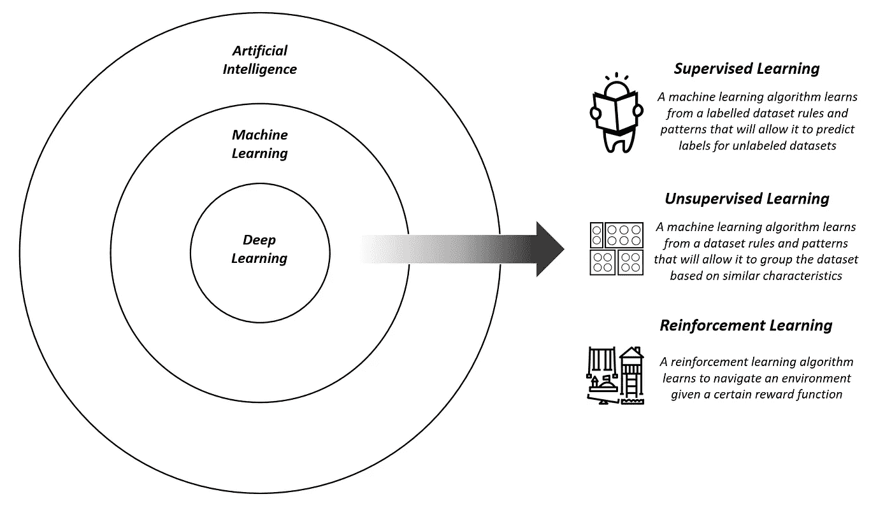
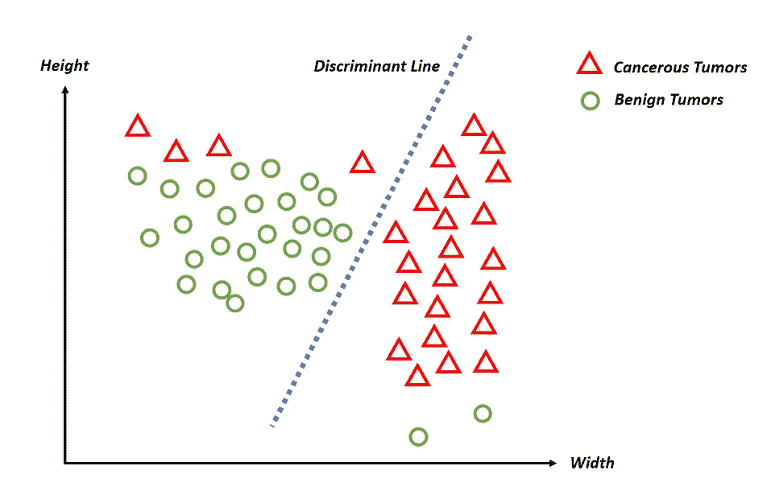
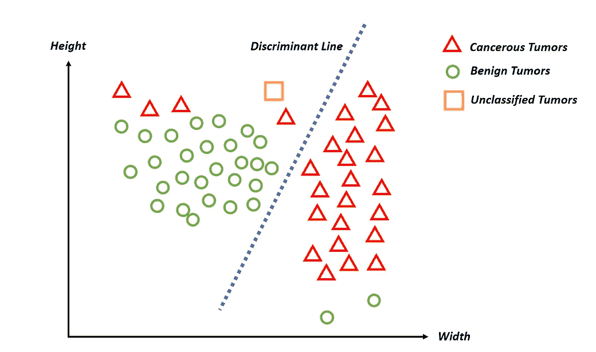

# 人工智能的短期伦理关注

> 原文：<https://towardsdatascience.com/the-short-term-ethical-concerns-of-ai-c201c03bc0ac?source=collection_archive---------8----------------------->

本文是关于人工智能引起的短期和长期伦理问题系列文章的一部分。如果你对 AI 有技术上的理解，一定要跳过前两部分。

围绕人工智能突破的炒作一直让我们陷入歇斯底里，这提醒我们，我们正处于将我们所关心的一切都输给机器的边缘。从暗示[机器已经发展出自己的语言](https://www.independent.co.uk/life-style/gadgets-and-tech/news/facebook-artificial-intelligence-ai-chatbot-new-language-research-openai-google-a7869706.html)的文章，到受流行文化启发的对人工智能[危险的描述](https://www.forbes.com/sites/robertadams/2016/03/25/is-artificial-intelligence-dangerous/#3bef6481358b)，我们正在慢慢失去从虚构中过滤事实的能力，看不到噪音中的信号。这篇文章绝不是人工智能及其进展所引发的所有伦理问题的详尽清单，而是正确定义人工智能是什么、不是什么的入门读物，以及对算法给我们的劳动力市场、公民自由和政治带来的一些短期缺陷和危险的务实审视。

## **狭义人工智能 vs 人工广义智能**

为了全面剖析人工智能广泛的伦理问题以及这个领域是如何发展的，对人工智能有一个正确的理解是必不可少的。人工智能*(以下简称 AI)* 是一个计算机系统，它可以执行通常留给人类认知的任务。这些任务的范围可以从狭义的任务到理论上更广义的任务。狭义人工智能(Narrow AI)，是智能系统在狭窄领域和用例中的应用，如下棋、驾驶汽车和在 X 射线上识别癌症。举个狭义 AI 的具体例子， [Waymo 的](https://waymo.com/)自动驾驶汽车系统可能在驾驶汽车方面很优秀，但它永远不会开飞机，也不会下棋。或者，广义人工智能*(将被称为 AGI )* 是一个可以完成无数任务的人工智能系统。需要注意的是，AGI 系统并不存在*(还没有)*，今天所有的人工智能应用都被认为是狭义的。我们已经获得的最接近某种形式的普通智能的东西是 Deepmind 的 AlphaZero，它能够在没有任何事先指令的情况下征服围棋、象棋和松木游戏。我们对 AGI 的概念化，无论是关于如何到达那里，还是它广泛的伦理问题，仍然是基于理论的。然而，这是一个至关重要的研究领域，因为强大的 AGI，没有正确的价值取向*(在未来的博客文章中会有更多关于价值取向的内容)* [有能力**从根本上**改变我们生活的世界。](https://www.youtube.com/watch?v=MnT1xgZgkpk)

## **人工智能技术前景**

除了将人工智能划分为狭义的人工智能和 AGI，对当前人工智能应用的技术前景有一个模糊的理解是值得的。最近，流行媒体一直在交替使用诸如*、【人工智能】、*、*、【深度学习】、*等术语。然而，为了更清楚地理解人工智能中的伦理问题，必须区分这些术语。我们可以将这三个术语视为同心圆，人工智能包含机器学习，机器学习包含深度学习。

机器学习围绕着创建可以从大型数据集学习有用模式的系统，并因此提供有用的见解。机器学习本身分为三个主要类别——第一个是**监督学习**，它需要创建理解一组数据点*(输入)*和标签*(输出)*之间关系的系统，从而在未标记的数据点上提供结果。例子包括对借款人是否会拖欠贷款进行分类的系统，预测未来股票价格的系统等。或者，**无监督学习**正在构建可以简单地基于相似特征或特性从数据集中识别有意义模式的系统。例如，根据相似的购物行为对客户进行聚类，通过异常检测识别欺诈行为，以及根据用户的相似兴趣推荐电影。最后，**强化学习**是机器学习的一个分支，它试图在一个定义良好的环境中坑一个智能代理，有一组可能的动作和一个目标函数*(奖励)*最大化。我们可以想到自动驾驶汽车*(代理)*行驶在高速公路上*(环境)*其唯一的目标是不发生事故*(奖励)*例如。

最后，深度学习是机器学习中使用的一种技术，它利用大量数据和神经网络——一种受大脑结构启发的机器学习技术——来理解数据集内的模式。最近人工智能在计算机视觉和语音识别等领域的突破几乎都导致了深度学习研究，更重要的是计算能力的商品化。

直观地说，把机器学习想象成对孩子大脑建模的尝试。儿童从其他人的动作中学习**(监督学习)**试图辨别世界上不同物体之间的相似性，例如将形状相似的乐高积木组合在一起**(无监督学习)**并在没有直接输入的情况下导航困难的环境，例如攀登架**(强化学习)**。深度学习是机器学习中的一种技术，是人工智能最近突破的根源。

The AI Technical Landscape

# 短期道德问题

目前笼罩着人工智能的短期伦理担忧，与寻求接管地球的类人机器人的好莱坞转世毫无相似之处。与其通过天真的拟人化来思考人工智能的危险，不如将人工智能视为有能力在公共和私人领域取代人类决策的计算机系统或算法。也就是说，人工智能系统将在直接影响我们生活的后台进程中，自动实现不同利益相关者之间的信息流动。这可以是看似良性的过程，比如我们在脸书*上看到的帖子(在最近的丑闻之后就不那么良性了)，或者*我们在网飞上得到的[电影推荐，也可以是更重要的过程，比如](http://www.wired.co.uk/article/how-do-netflixs-algorithms-work-machine-learning-helps-to-predict-what-viewers-will-like)[信用评级](https://www.technologyreview.com/s/603604/an-ai-fueled-credit-formula-might-help-you-get-a-loan/)和[预测个人的累犯率](https://www.propublica.org/article/machine-bias-risk-assessments-in-criminal-sentencing)。

The Trap of Hollywood Inspired Anthropomorphism When Thinking About the Dangers of AI

事实上，人工智能的短期伦理担忧主要源于管理自动信息流的系统的脆弱性，它们被拉拢和侵蚀集体真理概念的能力。因此，通过人工智能对劳动力市场的影响*(即其自动化信息流的能力)*、其强化现有刻板印象和偏见的能力以及其刺激威权倾向的能力来看待人工智能的短期危险是有用的。

## **I)人工智能及其对劳动力市场的影响**

在他的书《第三次工业革命》中，杰里米·里夫金假设能源、通信和运输技术创新的融合是结构性经济变革的根源。根据里夫金的说法，这些创新的融合引入了所有以前的工业革命。例如，廉价蒸汽动力印刷机*(通讯)*、煤炭*(能源)*的发现以及蒸汽机驱动火车*(交通)*的发明是第一次工业革命的根源。相反，他认为电话的发明*(通讯)*、石油的发现*(能源)*和汽车的发明*(交通工具)*是第二次工业革命的关键。展望未来，他预计互联网通信技术*(通信)、*可再生能源*(能源)*以及自动驾驶汽车和卡车*(交通)*的发展将迎来第三次工业革命——这是一个以零*(或几乎为零)*边际成本运行的价值链将通过相互通信的传感器在“物联网”上协调的范式，所有这些都由人工智能系统管理。

无论人们认为里夫金是对还是错，都有待辩论——但不值得辩论的是，人工智能系统将使信息流自动化，并侵蚀我们在不断扩大的经济活动范围内对人类决策的需求。围绕这一范式转变已经说了很多，公众对劳动力市场结构性变化的焦虑是可以理解的。然而，对于人工智能在劳动力市场的不同影响，以及它如何导致失业率上升，改变就业动态，加剧经济不平等和改变全球经济相互依赖，有一个清晰的视角至关重要。

人工智能系统对失业率的潜在负面影响存在广泛分歧。当前的研究领域充满了相互竞争的数字，从仅在美国就有 47%的工作面临自动化风险，到整个经合组织经济体中只有 9%的工作面临自动化风险。这些差异背后的原因源于不同的方法——研究指向更高的预期失业率[着眼于整体工作](https://www.oxfordmartin.ox.ac.uk/downloads/academic/The_Future_of_Employment.pdf)，而预测较低预期失业率的研究倾向于着眼于工作中的[任务。](http://www.ifuturo.org/sites/default/files/docs/automation.pdf)我怀疑真相介于两者之间——需要对自动化对一个行业的影响进行更深入的分析，纵观整个潜在职业链，从高度重复的*(即自动化的高风险)*到不重复的*(即自动化的低风险)*。

Income Inequality Being at the Heart of 21st Century Populism

一旦我们考虑到人工智能的广泛使用加剧收入不平等的潜在可能性，正确识别预期失业率的需求就变得尤为突出。一种观点是，自动化投资将被吸引到机器人的比较优势将比人类高几个数量级的经济领域*(即智能工厂)*，将机器比较优势较低的工作留给人类*。然而，并不能保证这些工作会有高薪。因此，收入不平等将会加剧，因为中低收入工作的工资将开始下降，为政治动荡和剧变铺平道路，西方世界最近兴起的一系列民粹主义运动就是明证。*

此外，人工智能不仅仅是破坏劳动力市场的稳定，还可以在改变现有和未来工作的动态方面发挥作用。从一个角度来看，技术乐观主义者经常指出，数字化和计算机化的兴起催生了共享经济——这是事实。然而，重要的是要看看共享经济生态系统核心的不同服务中存在的动态，以及人工智能如何在管理这些服务的中央机构和填充这些服务的工人之间存在的信息和权力不对称中发挥作用。AI Now 最近的一份报告探讨了当前正在进行的研究，即优步如何使用其司机数据来激励他们乘坐无利可图的车辆，以推进其为客户提供便捷用户体验的目标。除了算法形式的管理，传统经济将经历动态变化，未来的工作不再要求专业化，而是普遍化。此外，创造力和技术知识将是基本工具包的一部分，此外还有与机器沟通和一起工作的能力——因此，重新培训当前的工人和重新想象当前的教育系统都是最大限度地减少人工智能对不断发展的劳动力动态的破坏所必需的。

2017 年，麦肯锡全球研究所估计，全球超过 60%的工作中，有 30%的任务面临自动化的风险。然而，重要的是要注意到，对就业影响的分布因国而异。专家指出，第三次工业革命将会有赢家和输家，高出生率的发展中国家是其中最大的输家——一些人甚至出去说，发展中国家几乎 70%的工作面临自动化的风险。正如我们今天所知，发展中国家主导生产价值链支柱的当前经济相互依存模式可能会不复存在，因为机器人生产的竞争成本将迫使发达国家的制造商在国内生产。这种经济相互依赖的变化将带来政治不稳定、大规模移民以及随之而来的焦虑。因此，为迎接即将到来的价值创造转变，对劳动力市场进行再培训至关重要。

## **II)人工智能系统中的偏差**

人工智能系统*(更具体地说是一种机器学习算法)*的关键目标之一是根据我们提供的关于两个或更多人口的一些数据集，在这些人口之间划出一条区别线。例如，根据两个肿瘤群体(一个是癌性的，一个不是癌性的)的数据训练的机器学习算法，提供的数据集是肿瘤的高度和宽度，可以预测未来的肿瘤是否是癌性的。该算法通过识别一条线*(一条判别线)*来做到这一点，这条线最好地区分了癌性肿瘤和非癌性肿瘤。

A Machine Learning Algorithm Learns to Discriminate Between Cancerous and Benign Tumors

在获得贷款、医疗保险和其他问题上推断这一过程，分析与社会*(即种族、地址、性别等)*、经济*(收入水平、教育等)*和政治*(政治派别)*维度相关的数据，很容易看出人工智能系统可能会强化当今社会中存在的偏见。

人工智能系统中的偏差可能有不同的原因。之前提到的[人工智能 Now 报告](https://ainowinstitute.org/AI_Now_2017_Report.pdf)深入研究了人工智能偏见的起源。简而言之，机器学习算法需要对数据进行训练，才能输出预测。训练数据经常会有偏差、扭曲、不完整或不准确。举个例子，2015 年，谷歌图像分类算法将两个黑人归类为“大猩猩”——这个问题可能源于不平衡的训练数据，并显示了当前人工智能系统的不完善，这些系统在狭窄的任务中可以拥有超人的智能，但缺乏常识。尽管他们尽了最大努力，谷歌对这个问题的[解决方案](https://www.wired.com/story/when-it-comes-to-gorillas-google-photos-remains-blind/)是阻止图像识别算法一起识别大猩猩。此外，收集数据的方式往往会导致有偏见的结果。数据要么是由人工标记的，要么是从现有的网络服务上刮下来的，而且很少受到审核机制的约束。此外，嵌入到机器学习算法中的任何偏见都很难解释，从而更难发现。这导致机器学习应用程序的偏见在部署后被发现，正如 [Propublica exposé](https://www.propublica.org/article/machine-bias-risk-assessments-in-criminal-sentencing) 所证明的那样，一个机器学习应用程序在预测累犯率和批准假释方面对黑人有偏见。

超越训练数据不平衡——机器学习算法受制于复杂性和可解释性之间的权衡。也就是说，通常在机器学习算法的性能和决策透明性之间存在权衡。由于回归和决策树等基本机器学习算法为我们提供了理解他们为什么做出决策的能力，因此深度学习模型等更复杂的系统仍然是一个“黑匣子”。使深度学习模型更加可解释的研究仍在进行中。然而，我们今天使用的许多应用程序，如面部和语音识别软件，无法解释他们为什么做出这样的决定。

## **三)人工智能，政治和政府**

人工智能可以被视为一种通用技术——与电力类似，它的影响可以横向追溯到人类生活的各个方面，用例出现在医疗保健、工业、金融等领域。它的无处不在不仅有能力在我们的经济体系中产生结构性变化，而且有能力颠覆我们当前政治和治理框架中的现有关系——有可能强化专制倾向和扩大现有的权力不对称。更重要的是，人工智能受益于我们生活中的连续数字技术，这使我们开发出一种有效的*【监控】*设备，由私营和公共部门提供支持。越来越多的企业*(更重要的是科技公司)*以提供更个性化的体验和更好的广告定位为名，依赖于收集客户信息，从脸书喜好到位置数据。另一方面，政府一直以国家安全的名义压制公民自由和隐私权，爱德华·斯诺登等告密者的证词就是明证。在此需要说明的是，这种*“监控”*设备的发展因国家而异，可以采取许多不同的形式，这在很大程度上取决于数据隐私法的性质、私营部门和公共部门之间的合作程度，以及最重要的基础设施限制。因此，有必要将人工智能对政治和治理构成的潜在危险视为一场针对现有治理形式的突然政变，而是朝着数字专制的缓慢而模糊的前进。

抛开警告不谈，AI 提供了一系列先进的模式识别工具，如果建立在这个*“监视”*设备之上，将大大降低政府压迫的成本，动摇现有的社会政治安排，并侵蚀客观真理的概念。由[人类未来研究所](https://humanrightscommission.house.gov/sites/humanrightscommission.house.gov/files/documents/FHI%20-%20Artificial%20Intelligence%20the%20Consequences%20for%20Human%20Rights.pdf)最近发布的一份报告提供了大量关于人工智能可能实现专制特征的方式的描述。首先，人工智能提供了一种具有成本效益的方法来识别潜在的政治异议者——因为我们在网上留下的数字痕迹从食物偏好到我们喜欢看什么类型的节目，可以为政治倾向提供具有统计意义的预测。最近的美国选举和[剑桥分析公司丑闻](https://motherboard.vice.com/en_us/article/mg9vvn/how-our-likes-helped-trump-win)证明了这一点，脸书的数据被用来推断用户的政治倾向和[心理特征](https://en.wikipedia.org/wiki/Psychographics)以便更好地将他们作为政治广告的目标。为了更好地孤立持不同政见者，更好地预测他们的行动，并制造各种形式的反对意见的抑制因素，可以采用同样的程序。主要是，大赦国际提供的工具包使政府能够使持不同政见者成为持不同政见者更昂贵的选择，因为改进的识别和监测技术为在持不同政见之前或之后逮捕和惩罚持不同政见者提供了有利条件。此外，政府可以建立社会信用体系，这是一种政府可以根据某种信任程度给其公民打分的措施。[中国计划](http://www.wired.co.uk/article/chinese-government-social-credit-score-privacy-invasion)在 2020 年前实施社会信用体系，该计划利用了各种数据点，包括金融数据、与个人在线关系相关的人际数据以及其他社会维度。这种信用体系将是一个人的孩子接受什么类型的教育，是否有机会获得公共住房，工作资格，甚至恋爱关系的决定性因素。这种信用系统有可能强化专制政权的权力基础，并系统地自动惩罚异议行为。

An Illustration of Deepfakes in Action, Transposing the Face of Actress Gal Gadot on a Pornographic Video

此外，政府有能力以前所未有的水平制造同意，有能力使用人工智能机器人渗透到在线社区，这些机器人可以有效地回应异议团体，并促进政府的谈话要点。这些机器人还可以通过人工智能支持的视频和音频编辑技术*(也被称为“deep fakes”)*来实现，这些技术可以创建非常可信的篡改视频。Deepfakes 最近变得引人注目，因为某些 Reddit 社区开始使用它在色情视频中移植名人的脸。虽然 Deepfakes 本身值得探索*(在未来的博客文章中会有更多介绍)*，它有能力将假新闻、网络欺凌以及社会凝聚力碎片化，但它侵蚀对异议的信任的能力是惊人的。

## **结束语**

我在开始这篇文章时，并没有详尽地列出人工智能的短期伦理问题，而是介绍了如何思考人工智能的崛起所引发的伦理问题。这样做的目的并不是支持某种新排外主义，而是提出关于技术将在我们生活中扮演的角色的重要问题。技术乐观主义者可以写一篇更长的文章，讨论人工智能的短期和长期好处，它有助于药物发现，实现个性化和预测性医疗，为个人提供更高程度的自主权，并有可能将我们从人类的苦差事中解放出来。这篇文章没有停留在光谱的任何一端，而是在一个务实的中间，承认人工智能的潜力，同时保持警惕，并对其缺点提出问题。这些问题需要政策制定者、政治家，最重要的是公民做出细致入微、深思熟虑的回应。关于如何弥合安全和人道的未来与技术进步之间的差距，需要我们做出结合硬科学和社会科学的深思熟虑的回应。

最终，技术专家通常会分化成两个对立的阵营，一个认为技术是中立的，另一个认为技术不是。然而，我们的数字生活和线下生活之间的桥梁，以及人工智能的崛起及其组织我们的社会、经济和政治的能力，彻底颠覆了这一鸿沟，并让我们不禁要问: ***我们希望它保持中立吗？***