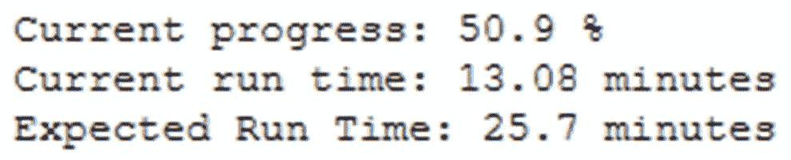
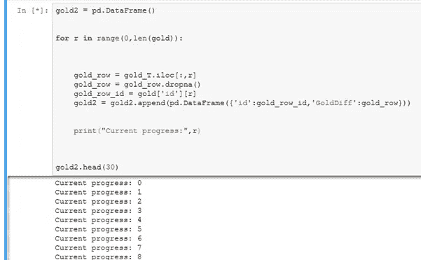
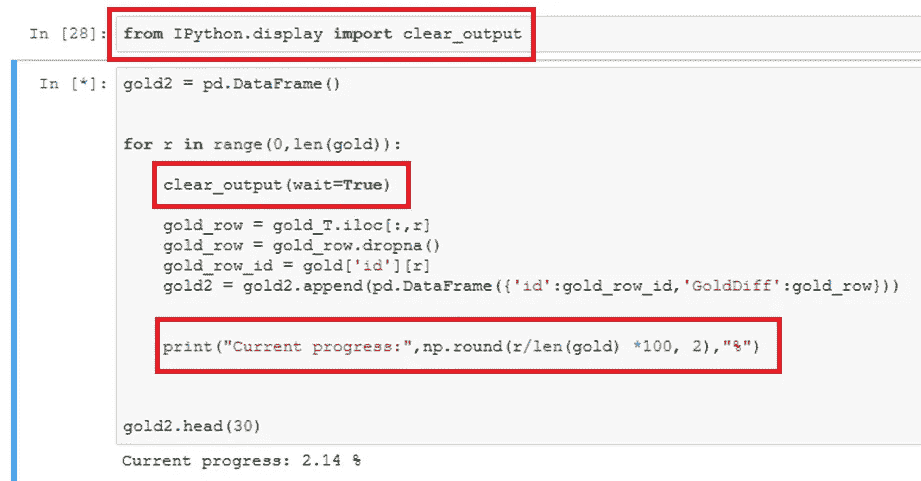
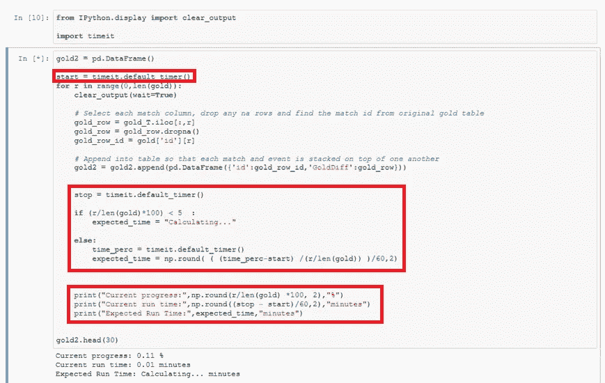

# 在 Python 笔记本中跟踪 for 循环的进度和预期运行时间的最简单、最干净的方法

> 原文：<https://towardsdatascience.com/the-simplest-cleanest-method-for-tracking-a-for-loops-progress-and-expected-run-time-in-python-972675392b3?source=collection_archive---------6----------------------->

一段时间以来，当谈到我在笔记本上的代码单元的进展时，我经常感到被遗忘在黑暗中。因此，我想找到一种简单明了的方法来跟踪 for 循环进行到什么程度。

最终输出应该告诉我当前的进度、当前的运行时间和预期的运行时间，如第一幅图所示:

Final Output Example

虽然使用 IPython 小部件可能有更好看的解决方案，但下面的方法是我发现的最简单的实现方法。在过去，我倾向于简单地打印当前的循环进度，但是这样做意味着我们将有一个很长的循环每个阶段的列表，如下所示。

Previous Method used for Tracking Progress

相反，我希望进度输出在同一行中。我们可以通过三个简单的步骤实现这一目标:

1)从 IPython.display 导入“clear_output”函数

2)在每个循环结束时，打印当前进度

3)在下一循环步骤开始时删除当前进度

这意味着我们本质上是在循环的每个阶段替换文本，也意味着我们没有一个长列表，否则我们可能会有。这显示在下面的代码示例中，其中突出显示了提到的三个部分。

Print Replacement Method for Cell Output

我们可以通过估计预期的总运行时间来进一步改进这个输出。这可以通过交叉引用当前花费了多长时间和进展了多远来实现。当然，这是一个非常粗略的计算，并且假设花费的时间是线性的，但是它至少给出了大概需要多长时间。在下面的代码中突出显示了新的计算方法，我们还免除了前 5%的预期时间计算，以避免不准确。

Print Replacement Further Improved

我希望你觉得这是有趣和有用的，如果你有任何问题，请让我知道。

谢谢

哲学（philosophy 的缩写）