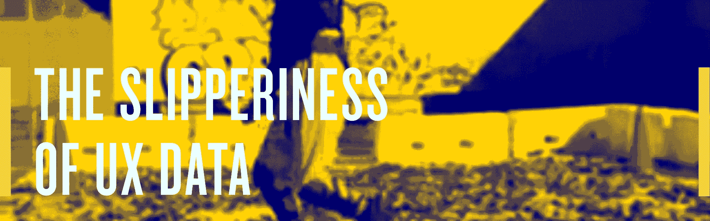
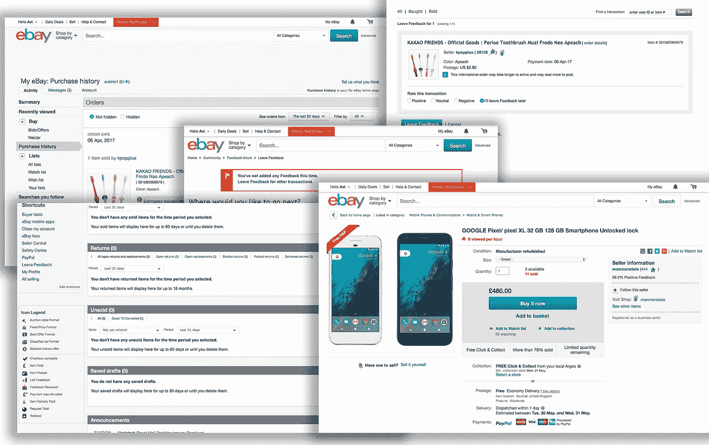

# UX 数据的不稳定性

> 原文：<https://towardsdatascience.com/the-slipperiness-of-ux-data-b4f185a4f659?source=collection_archive---------12----------------------->

在我的文章[证明设计](https://medium.com/@superavi/proving-your-design-cd3fe3346a7c)中，我谈到了拥有做出正确产品或产品决策的证据有多难。有些项目非常昂贵，以至于需要很强的说服力才能获得预算。这是一种自然的权衡。在你完成了项目的一部分之后，或者甚至在你已经完成了项目并且现在有兴趣进行第二阶段的开发之后，事情并不会变得更容易。

许多 UX 专业人士谈论数据的重要性，但让我们诚实地说，在设计和决策的周期中，有无数的事情是无法衡量的。

# 可以衡量什么？

1.  人们需要你的产品吗？
2.  产品本身以及人们如何使用它。
3.  想法和迭代——使用用户研究。

基本上你和你的团队能做的一切。它占创作过程的 20%左右。

> 你创造了什么？是什么启发了你的想法？你是否受到其他你无法衡量的设计的影响？太好了。

# 什么是不可测量的？

## 竞争对手

你不知道为什么你的竞争对手会这样做。你没有他们的数据，也无法知道他们的决策过程。

## 产品前行为

有许多营销产品正在试图解决这个问题。然而，在用户旅程的这一部分，设计师没有控制权。无论是操作系统还是平台，用户之旅都是由推动者推动的。每个平台都会为你提供一些数据和测量结果，但它并不完全是在监测 UX，它更多的是通用的和市场导向的。在大型组织中，获取这些数据点也是一个挑战。另外，每一条数据都要核实。有了平台，几乎不可能验证。

## 分析学

在您的服务中，您需要通过不同的工具(MixPanel、GTM、Data studio 等)进行检查和关联。).对于 UX 和产品角色来说，理解分析工具已经变得至关重要。这就是公司如何做出关键决策的原因，也是为什么通常用三到四个系统对数据进行检查和交叉匹配，以比较和查看数据是否可靠。

## 操作系统设计模式

事实上，谷歌决定某样东西应该看起来是这样的，但这并不意味着它是最好的方式。这意味着他们可能测量了它，它是有效的。这也意味着，凭借他们的影响力，许多应用程序将采用它，它将变得熟悉。但不一定代表更好。其中一些决定是为了与 iOS 或 Windows 等其他平台区分开来。其他决定是一个伟大设计的折衷解决方案，因为该设计可能会申请专利。这正是谷歌和微软收购摩托罗拉和诺基亚，剥夺他们的专利，然后卖给别人的原因。所以如果你见过一个设计，即使它很有名，也不意味着它是最佳实践。

仅仅因为它有效，并不意味着它是一个很好的体验。许多公司看不到改变的理由。当一家公司处于垄断地位时，这是很常见的..比如在易贝买东西……有用吗？，是啊…这是一个很好的体验吗？不，一切都很麻烦:接收信息，发送信息，浏览 2000 年至今的易贝版本。

It works but it ain’t nice and at times very confusing

相比之下，亚马逊更加雄心勃勃，并且“非常缓慢地”重新设计他们的体验，使之实用和令人愉快。

# 你已经拿到数据了！但是，等等，可能会有偏差。

让我们来看看这是如何发生的。

## 错误的实现

仅仅一行简单的代码或一个错误事件的选择就可能导致每次点击都被计为两次。这就是为什么检查多个系统很重要——正如我前面提到的，在用户旅程真正开始之前的阶段可能会有问题。

## 意图

即使你有很多经过验证的数据，你怎么能相信你看到的数据呢？每个收集数据的人(甚至可以说是科学家)都试图以一种迎合他们议程的方式展示数据。数据可以以非中立的方式收集和呈现。这很自然，从营销公司到 UX 设计师，每个人都希望自己的项目成功。

Source giphy.com

## 介绍会；展示会

媒介是武器，理解为什么选择某样东西很重要，就像理解平面设计决策一样:它们向我展示了什么，又向我展示了什么。

## 当前几个有偏差数据的例子及其使用方法:

1.  [脸书第十次承认测量错误](http://marketingland.com/facebook-admits-10th-measurement-error-214819?utm_source=Daily+Lab+email+list&utm_campaign=35fa688a7c-dailylabemail3&utm_medium=email&utm_term=0_d68264fd5e-35fa688a7c-396071437)
2.  脸书被指责是假新闻问题的一部分…谷歌也是，但它很少用于休闲和内容消费。
3.  脸书正在删除成千上万的[虚假用户](https://www.theguardian.com/technology/2017/apr/18/facebook-purges-tens-of-thousands-of-fake-accounts-to-combat-spam-ring)，这就是为什么他们不断调整新闻提要，谷歌也在对搜索结果做同样的事情。
4.  [剑桥分析公司(Cambridge Analytica)因其影响英国/美国用户的方法而受到怀疑和质疑](https://www.theguardian.com/politics/2017/mar/04/nigel-oakes-cambridge-analytica-what-role-brexit-trump)。

# 处理它的主要方法

## 批评家

要苛刻挑剔，尽量找角度。如果你总是认为每个人都有兴趣，生活会很糟糕，但即使意识到了会让人悲伤，用批判的眼光看待事情更聪明，尤其是在商业中。所以当你看到一个新功能，在你兴奋完或者嘘完之后，想想他们为什么要创造它？这是谁的决定，他们的兴趣是什么？将其价值与商业、营销、用户满意度、设计等联系起来。猜猜这个概念是哪个部门想出来的？想想接下来他们会把它带到哪里。它的未来是什么？

## 受影响但意识到

没有什么是公开的，你有的只是用户体验数据的踪迹。我之前写的一篇关于脸书的帖子得到了回复，上面写道“但是数据在哪里？”答案是:这些数据是内部的，其他任何人都无法获得。太隐秘不能暴露，是他们的秘制酱。这是不是意味着我不能写或者分析它？我不这么认为。

在 Instagram 中，你会知道有多少照片被上传到 Instagram，因为这是一个影响保留/花费时间的财务数据。但你不会知道这些照片中有多少是从电脑、用户画廊或专业相机上传的。重要的是，在批评或受其影响时接受它，并知道你正在处理的数据的局限性。

这里举一个[的例子](http://appleinsider.com/articles/17/05/18/fair-repair-act-proposal-in-new-york-under-fire-by-apple-lobbyists)[w](http://appleinsider.com/articles/17/05/18/fair-repair-act-proposal-in-new-york-under-fire-by-apple-lobbyists)h[e](http://appleinsider.com/articles/17/05/18/fair-repair-act-proposal-in-new-york-under-fire-by-apple-lobbyists)r[e](http://appleinsider.com/articles/17/05/18/fair-repair-act-proposal-in-new-york-under-fire-by-apple-lobbyists)yo[u](http://appleinsider.com/articles/17/05/18/fair-repair-act-proposal-in-new-york-under-fire-by-apple-lobbyists)[h](http://appleinsider.com/articles/17/05/18/fair-repair-act-proposal-in-new-york-under-fire-by-apple-lobbyists)a[v](http://appleinsider.com/articles/17/05/18/fair-repair-act-proposal-in-new-york-under-fire-by-apple-lobbyists)ed[a](http://appleinsider.com/articles/17/05/18/fair-repair-act-proposal-in-new-york-under-fire-by-apple-lobbyists)t[a](http://appleinsider.com/articles/17/05/18/fair-repair-act-proposal-in-new-york-under-fire-by-apple-lobbyists)， [b](http://appleinsider.com/articles/17/05/18/fair-repair-act-proposal-in-new-york-under-fire-by-apple-lobbyists)[u](http://appleinsider.com/articles/17/05/18/fair-repair-act-proposal-in-new-york-under-fire-by-apple-lobbyists)t[c](http://appleinsider.com/articles/17/05/18/fair-repair-act-proposal-in-new-york-under-fire-by-apple-lobbyists)[a](http://appleinsider.com/articles/17/05/18/fair-repair-act-proposal-in-new-york-under-fire-by-apple-lobbyists)n[o](http://appleinsider.com/articles/17/05/18/fair-repair-act-proposal-in-new-york-under-fire-by-apple-lobbyists)[n](http://appleinsider.com/articles/17/05/18/fair-repair-act-proposal-in-new-york-under-fire-by-apple-lobbyists)l[y](http://appleinsider.com/articles/17/05/18/fair-repair-act-proposal-in-new-york-under-fire-by-apple-lobbyists)se[e](http://appleinsider.com/articles/17/05/18/fair-repair-act-proposal-in-new-york-under-fire-by-apple-lobbyists)pa[r](http://appleinsider.com/articles/17/05/18/fair-repair-act-proposal-in-new-york-under-fire-by-apple-lobbyists)t[o](http://appleinsider.com/articles/17/05/18/fair-repair-act-proposal-in-new-york-under-fire-by-apple-lobbyists)[f](http://appleinsider.com/articles/17/05/18/fair-repair-act-proposal-in-new-york-under-fire-by-apple-lobbyists)th 虽然没有好的方法来计算维修收入的多少，但苹果的服务收入拉低了净销售额的 70.4 亿美元，而总销售额为 529.0 亿美元。”

## 砍

意识到你的控制水平，但是看看你是否能更进一步。拥有一个操作系统和参与一个操作系统之间的差别是巨大的。当我在三星工作时，我们正在为电视设计 Tizen 操作系统的核心。我们可以无限制地控制一切。如果我们建造了它，我们可以追踪任何我们想追踪的东西。但是，当你成为生态系统的一部分时，你需要遵守规则，并在整个过程中获取你所能获取的一切。这就是为原生操作系统设计如此有趣的原因，尤其是当其他人正在构建和增加您的知识时。

数据很重要，但我认为决策只能在一定程度上基于数据。在我看来，构建决策的大约 70%是经验、愿望以及与业务其他方面的一致性。一个好的设计师或产品人员应该影响和说服他人，但这并不完全取决于数据。数据只是武器库中的另一个工具，它适合特定的用途。

> 如果你喜欢的话。A.