# Softmax 函数、作为概率的神经网络输出以及集成分类器

> 原文：<https://towardsdatascience.com/the-softmax-function-neural-net-outputs-as-probabilities-and-ensemble-classifiers-9bd94d75932?source=collection_archive---------3----------------------->

[📸 from Pixabay](https://pixabay.com/en/baskets-picnic-basket-wicker-cane-1208280/)

# **亮点:**

在本文中，我们将了解:

*   从简单的逻辑回归出发，导出多项式(多类)分类问题的 *softmax 函数*
*   在深度神经网络的输出层使用 softmax 激活函数来表示类别标签上的分类分布，并获得每个输入元素属于一个标签的概率
*   使用 Keras functional API 构建具有 softmax 输出聚合的鲁棒集成神经网络分类器

链接到我的其他文章:

1.  [深度内核转移和高斯过程](/deep-kernels-and-gaussian-processes-for-few-shot-learning-38a4ac0b64db)
2.  [自定义张量流损失函数](/custom-tensorflow-loss-functions-for-advanced-machine-learning-f13cdd1d188a)
3.  [随机森林](/decision-trees-and-random-forests-for-classification-and-regression-pt-1-dbb65a458df)
4.  [气候分析](/analyzing-climate-patterns-with-self-organizing-maps-soms-8d4ef322705b)

# **简介:**

在许多情况下，当使用诸如规则深度前馈网络和卷积网络之类的神经网络模型用于某组类别标签上的分类任务时，人们怀疑是否有可能将输出，例如 **y** = [0.02，0，0.005，0.975】，解释为某个输入在类别中的概率等于输出中的相应分量值*y****【ᵢ****直接跳到长答案:**不会，除非你有一个 softmax 层作为你的输出层，用交叉熵损失函数**训练网络。这一点很重要，因为在网上资源中，甚至在一些关于神经网络分类的教科书中，这一点有时会被忽略。我们将了解如何在多项式逻辑回归的上下文中导出 softmax 函数，以及如何将其应用于集成深度神经网络模型以实现稳健分类。*

# ***推导 Softmax 函数:***

*简而言之，[分类分布](https://en.wikipedia.org/wiki/Categorical_distribution)是[伯努利分布](https://en.wikipedia.org/wiki/Bernoulli_distribution)的多分类推广。伯努利分布是一种离散的概率分布，它模拟单个实验的结果，或者具有两种结果的随机变量的单次观察(例如，单次掷硬币的结果)。分类分布自然地将伯努利分布扩展到具有两个以上结果的实验。*

*现在，简单的逻辑回归分类(即仅针对两个类别或结果的逻辑回归)假设以输入 **x *ᵢ*** 为条件的输出 ***Yᵢ*** ( *i* 为数据样本指数)服从伯努利分布:*

*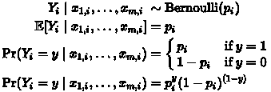*

*将伯努利结果的对数几率与线性预测值相关联的*链接函数*是 [logit 函数](https://en.wikipedia.org/wiki/Logit):*

*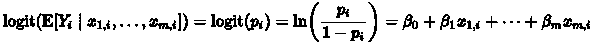*

*如果我们对上述等式的两边取幂，并做一些重新排列，在右边(RHS ),我们得到熟悉的逻辑函数:*

*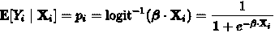*

*获取多项逻辑回归的广义逻辑或 softmax 函数的一种方法是，首先为每个类 *K* 提供一个与逻辑相关的线性预测值，再加上一些归一化因子，以确保所有类的概率总和等于 1。这个由 K 个 T21 方程组成的系统是一个对数线性概率模型系统:*

*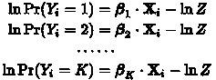*

*上述方程组中的 ln( *Z* ) 项为归一化因子的(对数) *Z* 称为[配分函数](https://en.wikipedia.org/wiki/Partition_function_(mathematics))。当我们在处理多项式回归时，这个方程组给出了明确分布的概率:***yᵢ|*x*ᵢ****~*明确( *p* ***ᵢ*** )。*

*两边取幂并施加约束:*

*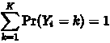*

*给*

*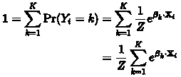*

*上式的 RHS 称为[吉布斯测度](https://en.wikipedia.org/wiki/Gibbs_measure)，将 softmax 函数与统计力学联系起来。接下来，求解 *Z* 得到:*

*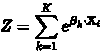*

*最终方程组变成了:*

*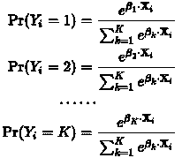*

*每个等式的 RHS 上的比率是 softmax 函数。一般来说，softmax 函数定义为:*

*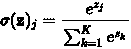*

*对于*j =*1……*K*。我们可以看到 softmax 函数将一个任意实值的 *K* 维向量 **z** 归一化为一个分量总和为 1 的 *K* 维向量 *σ* ( **z** )(换句话说，一个概率向量)， 此外，它还提供了每个 *zⱼ* 相对于 *zⱼ* 总量的加权平均值，如果 *zⱼ* 在比例上非常不同，它会夸大差异(返回接近 0 或 1 的值)，但如果 *zⱼ* 相对而言比例相同*，它会返回一个适中的值。* 分类器模型需要学习给出前一条件而不是后一条件的参数(即决定性与非决定性)。*

*最后，正如 logit 函数是简单逻辑回归的连接函数，逻辑函数是 logit 函数的反函数一样，多项式逻辑函数是多项式逻辑回归的连接函数，softmax 可以视为多项式逻辑函数的反函数。典型地，在多项逻辑回归中，[最大 a-后验(MAP)估计](https://en.wikipedia.org/wiki/Maximum_a_posteriori_estimation)用于为每个类别 *k* 找到参数*。**

# ****交叉熵和集成神经网络分类器****

**现在我们已经看到了 softmax 函数的来源，是时候在我们的神经网络分类器模型中使用它们了。在配备 softmax 输出层的神经网络上最小化的损失函数是[交叉熵损失](https://en.wikipedia.org/wiki/Cross_entropy):**

**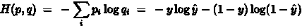**

**Assuming p and q are discrete distributions**

**其中 *y* 是某些迭代 *i* 的真实标签，而 *ŷ* 是迭代 *i* 时的神经网络输出。这个损失函数实际上与用于简单和多项逻辑回归的损失函数相同。交叉熵函数的一般定义是:**

**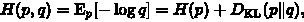**

***p* 和 *q* 之间的交叉熵被定义为分布 *p，*的信息熵之和，其中 *p* 是一些潜在的真实分布(在这种情况下将是真实类别标签的分类分布)和分布 *q* 的[kull back-lei bler 散度](https://en.wikipedia.org/wiki/Kullback%E2%80%93Leibler_divergence)其中*T13 是我们试图逼近的 *p* 和 *p** 对该函数进行优化可以最小化 *p* 的信息熵(在 *p* 中给出更多确定的结果)，同时最小化 *p* 和 *q* 之间的“距离”。**

*在 [Bridle 的文章](https://link.springer.com/chapter/10.1007/978-3-642-76153-9_28)中给出了使用神经网络中的 softmax 作为输出层激活的理论处理。该文章的主旨是使用 softmax 输出层和神经网络隐藏层输出作为每个用交叉熵损失训练的*、*zⱼ，给出了类别标签上的后验分布(分类分布)。一般来说，深度神经网络可以大大优于简单和多项式逻辑回归，代价是不能[提供特征/参数](http://www.r-tutor.com/elementary-statistics/logistic-regression/significance-test-logistic-regression)的统计显著性，这是推断或找出哪些特征影响分类结果的一个非常重要的方面。使用选择的鲁棒优化器来优化整个神经网络；RMSprop 通常是一个好的开始。*

*因此，现在我们将使用 [Keras functional API](https://keras.io/getting-started/functional-api-guide/) 构建一个深度前馈神经网络分类器，并对葡萄酒进行分类。我们将使用几个神经网络的集成模型来给我们一个鲁棒的分类(在实践中这是你应该做的，由于随机初始化和随机梯度训练导致的单个神经网络预测的方差必须被平均以获得好的结果)。集成模型的输出应该给出某个测试示例将属于每个类别的概率向量，即类别标签上的分类分布。*

*聚集每个单独神经网络模型的结果的一种方法是在集合输出处使用 softmax 来给出最终概率。为了自动确定最终 softmax 平均的最佳权重，我们将在另一层上“粘合”集合中每个单独神经网络的输出。下面是该架构的示意图。*

*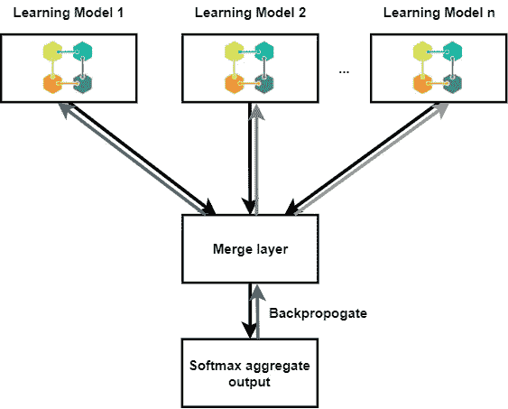*

*Everyone loves block diagrams.*

*每个学习模型都可以从最终的 softmax 聚合输出向后区分。我们可以使用[Keras concatenate-merge layer](https://keras.io/layers/merge/)**将每个子网合并在一起。**连接层连接来自每个子网络的输出张量，并允许优化器对合并的模型进行优化。为了简化我们的训练，每个学习模型都将在同一个数据集上进行训练。可以使用自举子集，但是这使得训练变得更加复杂，因为我们将不得不在它自己的输入和目标对上单独训练每个子网络，同时冻结其余学习模型上的训练更新。*

*从训练结果可以看出，高档葡萄酒不是我们的集成分类器的对手。同样，特征选择对我们的模型来说并不是非常重要，因为它使用所有特征很好地学习数据集。在 200 个历元之后，训练和验证损失变小，分别达到 10^-5 和 10^-3 的量级，这表明我们的集成神经网络模型在拟合数据和预测测试集方面做得很好。正确类的输出概率接近 100%,其他类的输出概率为 0%。*

# ***结论:***

*在本文中，我们推导了多项式逻辑回归的 softmax 激活，并看到了如何将其应用于神经网络分类器。重要的是要记住，在解释神经网络输出是概率时要小心。然后，我们使用 Keras functional API 构建了一个集成神经网络分类器。无论如何，运行代码有乐趣，一如既往，请不要犹豫问我任何事情。*