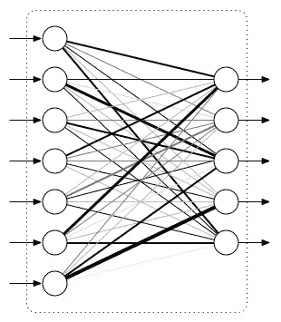
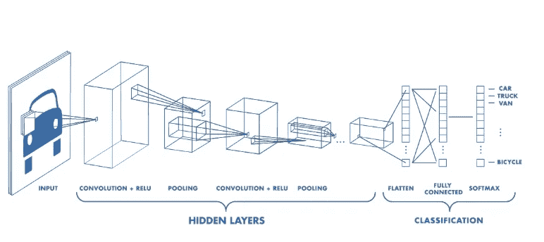
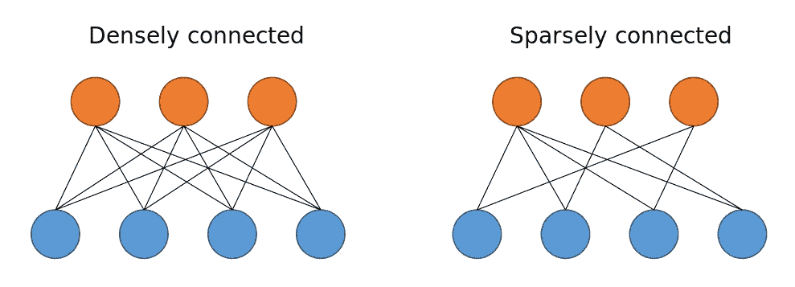
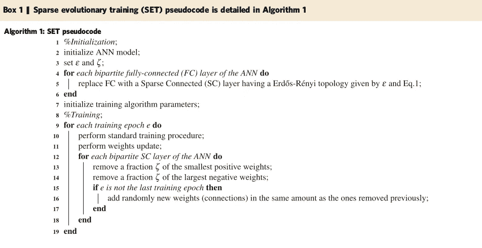
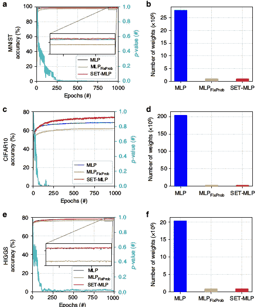
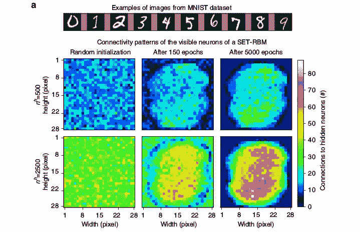

# 深度学习的稀疏未来

> 原文：<https://towardsdatascience.com/the-sparse-future-of-deep-learning-bce05e8e094a?source=collection_archive---------5----------------------->

## 这可能是人工智能研究的下一次飞跃吗？

一种新的深度学习算法有可能成为游戏规则的改变者。

2018 年 6 月，一组研究人员(Mocanu 等人)发表了“[受网络科学](https://arxiv.org/abs/1707.04780)启发的具有自适应稀疏连接的人工神经网络的可扩展训练”他们表明，他们训练神经网络的新方法与最先进的方法相比具有竞争力，而且**需要的计算资源要少得多**；也就是说，理论上。这应该允许未来的项目将项目扩大到前所未有的规模。

Think big.

到目前为止，这篇论文似乎在机器学习社区中没有得到多少关注，可能是因为它发表在自然科学杂志《自然通讯》上。机器学习社区倾向于关注一些特定的期刊。Nature Communications 在自然科学领域发表了许多关于机器学习应用的有趣论文，但我担心许多 ML 研究人员忽略了这篇重要的论文，因为它不是一篇发现重要的新颖深度学习算法的典型期刊。

《华尔街日报》的名字是我能想到的这篇论文受到最少关注的唯一原因。纵观他们的结果，似乎该研究为深度神经网络模型的学习能力的二次增长打开了大门。

这有什么大不了的？

# 完全连接的层

要理解这篇论文，首先必须理解与现代深度神经网络相关的可扩展性问题。

深度神经网络使用全连接层(fcl)。这些使用密集矩阵将输入向量转换到输出空间。FCL 通常用这样的图表来表示:

Fully-connected layer diagram, taken from [Jessica Yung’s blog](http://www.jessicayung.com/explaining-tensorflow-code-for-a-convolutional-neural-network/). Each input node connects with each output node.

这已被证明是一种非常有效的方法。问题是每个 FCL 中的连接数与输入中的节点数*和输出中的节点数*成二次方增长。

具有 16 个输入和 32 个输出的 FCL 具有 16×32 = 512 个连接；具有 32 个输入和 64 个输出的 FCL 具有 32×64 = 2048 个连接。这为 FCL 可以拥有的输入和输出数量设定了一个实际上限。

当我们处理非常高维的数据时，这是一个问题；简单地用 FCLs 将数据插入神经网络在计算上是困难的。

Datasets in the biology domain, including genetics research, are an important example of high-dimensional data.

图像是非常高维数据的一个例子；例如，256 x 256 像素的 RBG 图像包含 380，208 个值。如果我们希望在这里应用一个 FCL，我们将会在一个图层中拥有数千万甚至上亿个参数。

[卷积层](https://ujjwalkarn.me/2016/08/11/intuitive-explanation-convnets/)提供了一种绕过二次 FCL 问题的方法，并导致 2010 年图像处理模型的突破。基本上，我们可以使用卷积来充分降低输入数据的维度，以便在产生一些有用的输出之前将它们传输到 fcl。

在卷积的情况下，我们利用了**相邻像素共享重要信息**的事实。图像数据中的像素具有固有的结构，赋予整个图像以意义。卷积使用我们对这种结构的先验知识在图像处理问题中产生极好的结果，同时限制训练这些模型的计算成本。

Example of convolution layers feeding image data into a fully-connected layer. — Source: [https://www.mathworks.com/videos/introduction-to-deep-learning-what-are-convolutional-neural-networks--1489512765771.html](https://www.mathworks.com/videos/introduction-to-deep-learning-what-are-convolutional-neural-networks--1489512765771.html)

但是如果我们的数据不是以这种方式构建的呢？例如，如果我们正在用数万或数十万个 DNA 标记作为输入特征对遗传数据进行建模，会怎么样？这里没有可利用的内在结构，在这种情况下**卷积层无法拯救我们**。

# 稀疏连接的层

一层中的每个节点都必须与下一层中的每个节点相连吗？答案是“不”

我们可以很容易地想象一个不完全连接每个节点的层。在研究中，这种层通常被称为稀疏连接层(SCL)。

Diagram comparing FCL to SCL. Taken from [Amir Alavi’s blog](https://amiralavi.net/blog/2018/07/29/vnn-implementation).

这很容易想象。事实上，自然界中的许多网络表现得更像这样。例如，回到人工神经网络(大脑)的最初灵感，神经元(类似于节点)只与少数其他神经元相连。

SCL 已经在[各种项目和出版物](https://amiralavi.net/blog/2018/07/29/vnn-implementation#citation_1)中得到应用和研究。在对[神经网络修剪](https://medium.com/comet-app/deep-learning-model-compression-for-image-analysis-methods-and-architectures-398f82b0c06f)的研究中，这是一个深入探讨的课题。

## 我们应该使用哪些连接？

在[某些情况下](https://www.nature.com/articles/nmeth.4627)，研究人员使用在数据源中发现的观察网络(如[蛋白质相互作用网络](https://www.nature.com/subjects/protein-protein-interaction-networks))来构建稀疏连接的层架构。但是如果我们没有任何这样的先验知识呢？

找到学习连接节点的方法仍然是一个突出的问题。现在看来这个问题已经解决了。

# 了解稀疏连接的层拓扑

寻找连接节点的智能方式是自适应稀疏连接论文的主题。该算法被称为稀疏进化训练(SET)过程，实际上非常简单。

The SET algorithm, taken from the [original publication](https://www.nature.com/articles/s41467-018-04316-3.pdf).

基本上，我们在我们的网络中随机初始化 SCL，并使用反向传播和其他标准问题深度学习优化技术开始训练。在每个时期结束时，我们移除具有最小权重的连接(“最弱”连接)，并用随机初始化的新连接替换它们。冲洗并重复。

SET 变得异常健壮和稳定。令人鼓舞的是，作者能够用包含更少参数的 SET 模型显示出与 FCL 模型非常相似的结果(有时超过了它们的性能)。

SET-MLP is competitive with a fully-connected multilayer perceptron model, while using quadratically fewer parameters (taken from the [original publication](https://www.nature.com/articles/s41467-018-04316-3.pdf)).

这些结果给我留下了深刻的印象，但显然更大的 ML 社区并没有变得非常兴奋。

ML researchers reading SET paper.

## 在学习的连接中编码特定于域的信息

SET 网络不仅学习被监督的目标；它们还**在每层中形成的连接中编码输入特征重要性**。

这方面的一个简单例子是从 MNIST 上训练的一组模型中观察输入连接。

Input connections from SET-trained SCL on MNIST. Digits are centered and scaled to be consistently located throughout the dataset; it stands to reason that a well-learned connection map will place more connections on these center pixels (taken from the [original publication](https://www.nature.com/articles/s41467-018-04316-3.pdf)).

当我们观察 MNIST 问题中输入连接分布的演变时，我们可以看到该模型通过它保持的连接隐式地了解输入数据中预测信息的分布。在我们还不知道这种分布的领域中，这些信息可以帮助我们“发现”非结构化输入数据中有趣的特征和关系。

# 我要我的电视机

I was told there would be scalability.

我读了这篇论文，非常兴奋。它有望为以前难以解决的 ML 问题提供一条新的途径。问题是，我们还没准备好。研究人员自己可能说得最好:

> 目前，所有最先进的深度学习实现都基于图形处理单元(GPU)上非常优化的密集矩阵乘法，而稀疏矩阵乘法在性能上极其有限。

事实上，研究人员利用这些优化的结构来进行他们的概念验证实验。他们只是**使用 FCL 和遮罩层来模拟他们的算法**，让读者对通过 SET 学习的稀疏连接层的美好未来充满希望。

> 如果这些软件工程的挑战被解决了，SET 可能被证明是更大的人工神经网络的基础，也许是十亿节点规模的，在超级计算机上运行。

我不是计算机科学家，但我想开始行动。这就是我决定在 PyTorch 中实现 SET 的原因。我构建算法是为了使用稀疏数据结构，但它不是最优的。老实说，相当慢。但是我想把这个东西放到野外，这样人们就可以开始用它做实验，开始研究它。也许很快我们就会有一个更快的实现。

现在，任何阅读这篇文章的人都可以通过使用[我的自定义 PyTorch 层](https://github.com/AlliedToasters/synapses)来体验 SET。我把这个项目叫做“ [Synapses](https://github.com/AlliedToasters/synapses) ”，因为这是一个很酷、很合适的名字，幸运的是 PyPi 库没有采用这个名字。要使用它，只需安装 pip:

pip 安装 synapses

❤ pypi

唯一的依赖就是火炬！

它很慢，但至少它是真正稀疏的 T4。这里不涉及密集层和掩盖诡计。

看一看一些示例代码，并尝试使用它一点！我已经找到了[一种通过改变进化策略可以显著加快优化速度的方法](https://github.com/AlliedToasters/synapses/blob/master/MNIST_demo.ipynb):我的 SET 风格不是在每个时期结束时进化连接，而是在每次向前传递数据时以非常小的概率进化连接。这似乎会导致更快的收敛，尽管我需要做更多的实验来支持这个观点。

这项研究的结论是，该算法是稳健和简单的，留下了很大的改进空间，在未来的工作。我希望 Synapses 将有助于这一点！