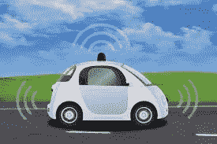
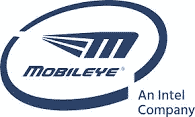
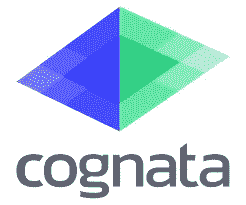

# 自动驾驶汽车的春天。

> 原文：<https://towardsdatascience.com/the-spring-of-self-driving-cars-e37f76c11586?source=collection_archive---------2----------------------->

*三家很酷的公司和他们加速自动驾驶汽车革命的不同方法。*

It’s spring for self -driving cars.

## **时间在流逝，汽车仍在碰撞。**

无人驾驶汽车将最终使世界摆脱每年因车祸造成的超过 130 万人死亡的[。](http://asirt.org/initiatives/informing-road-users/road-safety-facts/road-crash-statistics)

对于我们何时才能看到完全自动驾驶汽车的大规模部署，有各种各样的观点。

预测范围从 2020 年到 30 年。这一过程极其复杂，将在开始时部署在预先确定的区域。

有很多公司致力于自动驾驶汽车。在本文中，我将展示三家公司以三种截然不同的方式应对挑战的样本。

**三家公司三种方法。**

# Mobileye

 [## Mobileye |自动驾驶和 ADAS(高级驾驶辅助系统)

### Mobileye 是先进驾驶辅助系统(ADAS)和……

www.mobileye.com](https://www.mobileye.com/) 

# **众包制图和驾驶策略。**

英特尔公司 Mobileye 是 ADAS 和自动驾驶汽车行业的先驱公司之一。

Mobileye 以其先进的驾驶辅助系统(ADAS)系统而闻名，正在努力寻求全自动驾驶汽车。

EyeQ 芯片系列是 Mobileye 开发的一系列专用于 ADAS 和最终自动驾驶的 SoC。该系列中的每一个芯片都是一个惊人的工程辉煌壮举，推动了最先进技术的极限。EyeQ4 和 EyeQ5 采用了针对传感器融合和深度学习进行优化的专有架构，以处理来自多个摄像头以及雷达和激光雷达传感器的传感器数据。

自动驾驶的三大支柱 Mobileye 方式如下:

1.  **传感**:传感器融合，融合来自摄像机、雷达和激光雷达的传感器数据，用于目标检测和路径规划。
2.  **地图:**在所有条件下，用于精确车辆定位的高清地图。与 GPS 相比，提供了更高的精确度，适用于 GPS 信号不可用的情况。
3.  **驾驶策略:**驾驶策略是通过使用强化学习从感知状态(对我们周围世界的描述)到驾驶命令的映射，驾驶策略将提供分析多变量情况和与人类驾驶员协商所需的类似人类的直觉和行为。

全球有超过 5000 万辆汽车配备了 Mobileye EyeQ 技术，可以感知周围环境，防止无数事故发生。传感器数据的持续流可用于不断更新和扩展其周围的高清地图，同时提供强化学习算法，从而创建特定地理的驾驶策略。

# **干邑**

 [## 科涅塔通往自动驾驶的快车道

### 通往自动驾驶的快车道为自动驾驶汽车行业提供了驾驶验证平台。

www.cognata.com](http://www.cognata.com/) 

# 模拟城市进行高速验证

Cognata 加快自动驾驶汽车发展的方法是为自动驾驶汽车的验证提供一个平台。

Cognata 估计，一辆自动驾驶汽车需要行驶 110 亿英里才能完全训练好——如果没有模拟，这是不可能的。

Cognata 使用三个步骤模拟整个城市。

1.  模拟城市的固定资产，包括建筑物、道路、车道标线、交通标志，甚至树木和灌木丛。
2.  模拟其他车辆和行人的真实交通模型的动态层。添加了当地历史天气条件和照明来对系统进行压力测试。
3.  结合固定层和动态层来模拟传感器与车辆周围环境的交互，以从每个驾驶员接收最全面的自动驾驶模拟反馈回路。

虽然 Waymo 也在[使用模拟器](https://medium.com/waymo/simulation-how-one-flashing-yellow-light-turns-into-thousands-of-hours-of-experience-a7a1cb475565)来训练和测试他们的自动驾驶汽车，但 Cognata 正在大规模地这样做。此外，Cognata 正在使用计算机视觉和 GANs 等深度学习算法来重建真实事物的现实表示，为大约 160 个传感器提供必要的交互。这为任何给定的自动驾驶汽车公司提供了一个平台，以有效地验证他们的系统。

科涅塔在 10 月于 GTC 举行的 [NVIDIA 盗梦空间奖](https://blogs.nvidia.com/blog/2017/10/18/inception-awards-gtc-israel/)中获得第一名。

# **Nexar**

 [## Nexar | AI 云连接 dashcam

### Nexar 是一款免费的 AI 云连接 dashcam。它能立即探测到道路上的危险，并提供救生警告…

www.getnexar.com](https://www.getnexar.com/) 

# 计算机视觉和事故预防 V2V。

Nexar 正在采取一种完全不同的方法。他们不再关注未来，而是接受当下的挑战。改善道路安全，关注人类驾驶员。

通过将无处不在的智能手机用作智能联网仪表盘摄像头，Nexar 利用智能手机的传感器和摄像头来提高道路使用安全性

Nexar 利用先进的计算机视觉和传感器融合算法与驾驶员的智能手机来了解汽车的周围环境，并预测和防止碰撞。

所有这些手机都变成了 AI dash-cam connect，形成了世界上第一个车对车(V2V)网络。

然后对这些数据进行危险驾驶模式分析，并向所有驾驶员提供前方危险的实时警告。

此外，还为汽车、保险和拼车行业提供互联车队安全解决方案以及一系列数据产品和服务。

Nexar 的哲学是，为什么要等 5 年、10 年或 30 年，让机器人来拯救我们。人类司机不擅长驾驶，但通过正确的技术和众包的力量，我们可以共同努力改善现有的系统。

自动驾驶汽车行业也将受益于 Nexar 快速增长的数据集。谷歌的 Waymo 和其他反病毒公司正在少数特定地理位置进行训练和收集数据。Nexar 正在迅速扩展到全球范围。

Nexar 的联合创始人兼首席技术官 Bruno Fernandez-Ruiz 在一篇精心撰写的媒体文章中，解释了持续学习和端到端学习的优点。

 [## 边缘持续深度学习的案例

### 边缘设备和非常大的真实世界驾驶数据集有望实现自动驾驶

blog.getnexar.com](https://blog.getnexar.com/the-case-for-continuously-learning-from-the-edge-7e5f980288f6) 

> “我们认为，端到端学习需要数量呈指数增长的极限情况数据，你无法在云中构建所有模型。Nexar 的人工智能大脑变得越来越智能，越来越有弹性，因为我们的用户每周驾驶数百万英里，每天都面临新的未知场景的挑战。”

Nexar 还通过发布[数据集](https://www.prnewswire.com/news-releases/berkeley-deepdrive-releases-36000-nexar-videos-to-research-community-652714283.html)和[挑战赛](https://www.getnexar.com/challenges)为自动驾驶汽车研究社区做出了贡献。

请在评论中写下你认为正在加速转向自动驾驶汽车的其他公司。