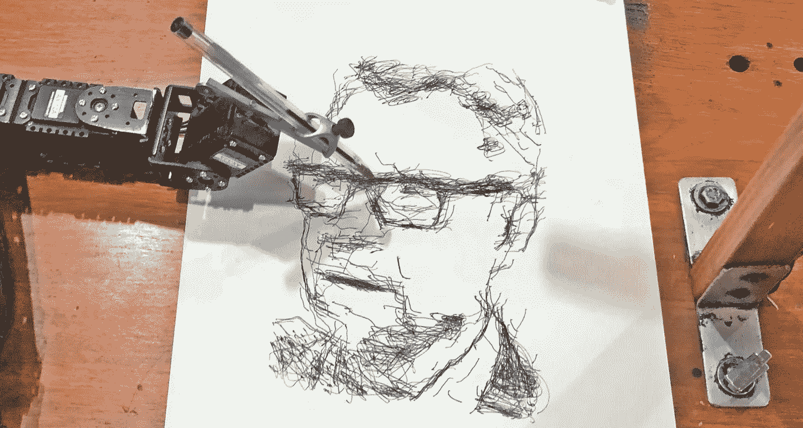

# 人工智能的现状

> 原文：<https://towardsdatascience.com/the-state-of-ai-25899c7b5341?source=collection_archive---------14----------------------->

## - **我在 Google Next 18 学到的东西**

**人工智能被预测为第三个计算时代，它正悄悄进入我们越来越多的日常生活。现在它也变得基于云，这意味着即使是最复杂的技术也可以为每个人所用。所以是时候开始了。**

Can an AI algorithm draw artistic portraits? Today they can.

**作者蒂姆·弗兰克·安德森，** [**首席数字官查理·探戈**](http://www.charlietango.dk)

几周前，我在伦敦参加了 Google Next 一个有 16000 人参加的会议，涵盖了大多数即将影响我们世界的新技术领域。

在这里，我与来自柏林的 Dixit Algorizmi 画廊的老板就艺术的未来进行了一次非常鼓舞人心的对话，而两个人工智能控制的机器人手臂分别为我画了他们自己不同的肖像。这让我想到，我们在基于机器的智能发展方面已经走了多远。

人工智能(AI)是一个涵盖一系列不同计算技术的术语，从机器学习、深度学习、神经网络到强化学习，所有这些都是在计算机中模拟智能行为。

人工智能研究领域可以追溯到 50 年代。甚至在大约 30 年前我学习成为一名工程师时，我就被教导如何制作自然语言处理算法和编写神经网络代码。

但是从那以后发生了很多事情。看起来我们正处于人工智能的临界点——如果我们还没有越过它的话。

当它开始工作时，我们不再称它为人工智能。许多日常事务已经受到某种人工智能的影响。

每次你打开你的新 iPhone，FaceID 使用人工智能扫描你的脸并识别你，以便解锁你的手机。

每天离开地面的每架飞机都将部分由自动驾驶系统驾驶。

我们用地图甚至 TomTom 导航系统导航的日子已经一去不复返了。现在，一切都在我们的智能手机上，智能地改变我们的路线，让我们在最短的时间内到达目的地。

试着回想一下你的邮箱被垃圾邮件塞满的时候？我向你保证，垃圾邮件仍在发送。但谷歌或微软的智能算法设法删除了 99%的内容，所以这对我们来说不再是个大问题。

想看一部关于网飞的新连续剧吗？嗯，由于模式识别和协同过滤技术，网飞的推荐算法不仅知道你最有可能喜欢哪个系列，还知道哪个独特的展示图像会让你停留最长时间。

如果你碰巧使用谷歌照片，你知道你现在可以用你自己的母语在你的 20，000 多张照片中搜索海龟或绿色汽车，甚至朋友的名字。该应用程序会自动向您显示所需的结果，而无需您为每张照片添加标签——这一切都由基于人工智能的图像识别来处理。

如此缓慢但稳步地，人工智能正在融入我们的日常生活，让我们的生活更智能、更简单、更有效，而我们却不会察觉。因为当它起作用的时候，我们只是称之为导航、搜索或推荐，而没有考虑到其背后的技术。

**需要大数据** 上述所有例子都严重依赖于对庞大数据集的访问。因为这就是你训练算法的方式。这往往有利于拥有最多客户的公司。

因此，难怪谷歌被认为是世界上领先的人工智能公司。谷歌有 7 个应用程序，每个都有超过 10 亿的月活跃用户(搜索、Gmail、Chrome、Android、地图、YouTube、谷歌 Play 商店)，很快还会有更多的应用程序(Google Drive 和 Google Assistant)。

庞大的数据集是让机器学习发挥作用所需的原材料。谷歌有很多。

以他们的自动驾驶汽车项目 Waymo 为例。自 2009 年以来，他们已经在实体道路上自驾超过 1600 万公里。但与模拟驾驶的 110 亿公里相比，这就相形见绌了。所有这些数据结合起来，使他们现在获准在亚利桑那州和加利福尼亚州推出商业无人驾驶汽车服务。这将在 2018 年底实现。

小公司如何与之竞争？幸运的是，谷歌对此有一个答案。谷歌已经拥有**ka ggle**——世界上最大的数据科学家和机器学习者社区，以及超过 11000 个公开可用数据集的数据库。现在，他们推出了一个名为**谷歌云公共数据集项目**的开放数据市场。该计划是让每个人都可以使用大数据集，以及必要的工具集，以便以基于云的分散方式开始与人工智能合作。

有什么新消息？这就是我们将要向前迈出一大步的原因之一。对于大多数公司来说，基于庞大数据集的商业人工智能过于复杂和昂贵，无法在内部运行。

因此，这些服务和机会成为基于云的“随用随付”解决方案至关重要。这正是谷歌推出的云人工智能平台。背后的愿景是使人工智能的使用民主化，并使其易于使用，即使是小公司或个人也可以轻松入门。您会发现一个预先训练好的模型列表，所有的工具和 API 都准备好开始使用了。

我们即将见证一次巨大飞跃的另一个突破性原因是为人工智能专门设计的硬件的使用。谷歌现在已经推出了为人工智能任务设计和优化的第三代计算机芯片。它们被称为 TPU(张量处理单元)，它们将显著加快大多数人工智能工作的速度。它们现在也可以通过相同的云解决方案提供给每个人使用。

这不是出于利他的原因。当然，这背后是有商业模式的。它是基于服务的——您可以免费获得第一次修复，之后，您可以按使用量付费。但这仍然是一种比在现场建立自己的数据中心和人工智能设施更民主化的模式。

**基于集中和边缘，同时** 谷歌不是唯一一家开发人工智能专用硬件的公司。苹果最新一代的智能手机使用人工智能进行人脸检测和人像摄影，拥有 A12 芯片，内置的神经引擎每秒可以处理 5 万亿次运算！

世界领先的半导体公司 ARM 推出了 [project Trillium](http://www.arm.com/products/silicon-ip-cpu/machine-learning/project-trillium) ，开启了超高效机器学习的新时代，大部分计算将在设备中就地完成，因此您不必向云发送大量实时数据，只需消化解释即可。

这意味着我们看到了基于巨大数据中心和非常先进的工具的更加集中的基于云的人工智能服务平台和生态系统的双向发展。并且同时向边缘移动，这允许本地和实时数据处理。如果我们想在商业环境中释放人工智能的全部潜力，这两项发展都是必要的。

**目的是什么？如果你对技术感兴趣，这一切可能会很有趣，但这就是技术。那么，背后的目的是什么呢？公司希望通过使用人工智能获得什么样的商业价值？**

在伦敦举行的 Google Next 大会上，来自空客、ING、Metro AG、汇丰银行和 E.ON 等大公司的首席执行官纷纷登台，解释人工智能如何帮助他们实现预测性维护、欺诈预防、犯罪调查、销售预测和更好的客户服务等目标。

在微软最近发布的报告中:[“欧洲的人工智能”](http://aka.ms/aidk)，广泛的商业目的被分为五类:

*   预测
*   自动化
*   产生洞察力
*   个性化
*   开处方

预测(92%)和自动化(88%)是丹麦最常见的两种方法。

该报告还显示，丹麦公司(25 家受访公司)是欧洲最先进的公司之一，96%的公司表示他们处于人工智能的“试点”阶段或更高阶段。

因此，如果你还没有尝试如何通过使用不同的人工智能技术来获得商业利益，现在可能是时候开始了。

**硬币的另一面** 有很多问题需要担心。

这是一个仍未成熟监管的领域。数据收集和数据处理存在风险，更不用说信息过载和错误信号的风险。由算法做出的决策远没有人类做出的决策透明，当一家公司需要解释他们基于算法指导采取的行动时，这也带来了巨大的挑战。此外，人工智能和自动化的推广将对就业市场产生巨大影响。

我们真的希望大型国际公司托管我们的数据并运行我们的情报吗？

最后，我甚至还没有提到一个事实，即中国和亚洲其他地区的人工智能发展正以闪电般的速度发生，几乎不为人知。中国是一个拥有 8 亿互联网用户、严密监控、没有数据监管和单点决策的国家，在他们的“中国制造 2025”计划中表示，他们的目标是到 2030 年成为人工智能的世界领导者。他们正在进行中:2017 年，全球人工智能初创企业总股权融资的 48%来自中国。

换句话说，就在我们说话的时候，一场全球性的战争正在发生。它将影响我们所有人，并在未来 5-10 年内改变国家和行业之间的力量平衡。

因此，我强烈建议关注这一领域，开始收集相关的 GDPR 合规客户数据，并开始尝试不同的人工智能技术，无论你从事什么行业。