# 数据科学和机器学习的现状，第 1 部分:教育、职称和技能

> 原文：<https://towardsdatascience.com/the-state-of-data-science-and-machine-learning-part-1-education-job-titles-and-skills-10034e4cf9a?source=collection_archive---------6----------------------->

去年年底， [Kaggle](https://www.kaggle.com/) 对 16，000 多名数据科学家进行了一项大规模调查，深入调查了他们的教育水平、本科专业、职称、工资等问题。

该调查提出了近 300 个问题，并提供了关于当今工作数据科学家的角色和背景类型的大量见解，尽管数据集包含大量空值。

在挖掘数据的过程中，我将精力集中在与刚刚开始或期待开始数据科学和机器学习职业生涯的人相关的见解上。

在基于这些数据的两篇文章的第一篇中，让我们深入了解初学者可以从这项调查中获得的见解，特别是关于教育水平、职称和收入。

让我们从做一些基本的探索性数据分析开始。

我们将通过分析受访者被问到的各种问题来探究这些数据。下图显示了加载科学工具(如 numpy、pandas、matplotlib 和 seaborn)以及加载数据集的初始阶段。

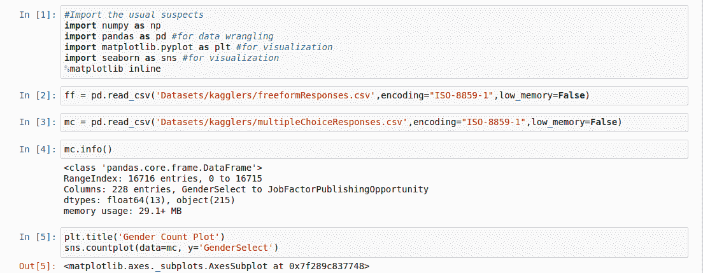

让我们看看回答调查的人的年龄分布。

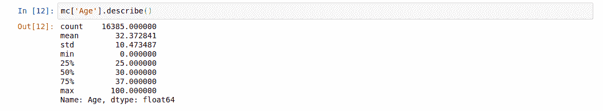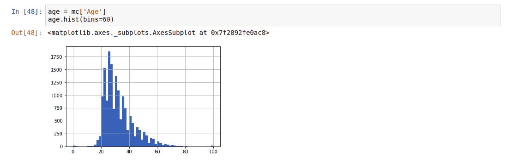

我们看到受访者的平均年龄为 32 岁，大多数受访者的年龄在 25-35 岁之间。

**性别认同、地区和就业状况**

绘制参与调查的人的性别计数图向我们表明，调查是由男性主导的，男性的回答是女性的三倍多。这反映了该领域的总体趋势。

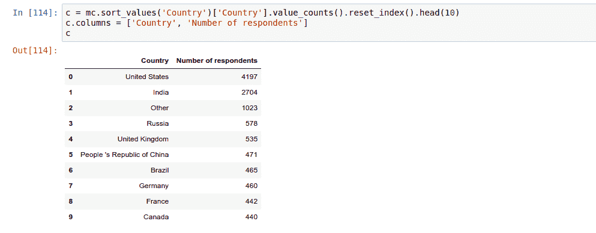

很明显，大多数回答者来自美国和印度。

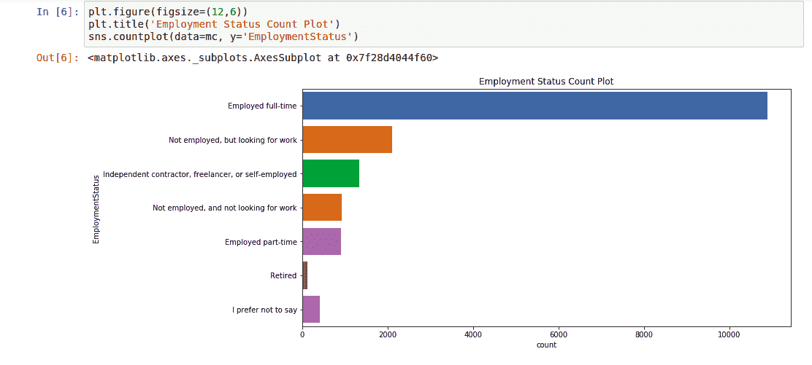

由此可见，大部分受访者都是全职工作。

那些没有被雇用的人被问及他们是否在任何学位提供机构注册。下图显示了他们的反应。大多数回答这个问题的人都被某个机构录取了。

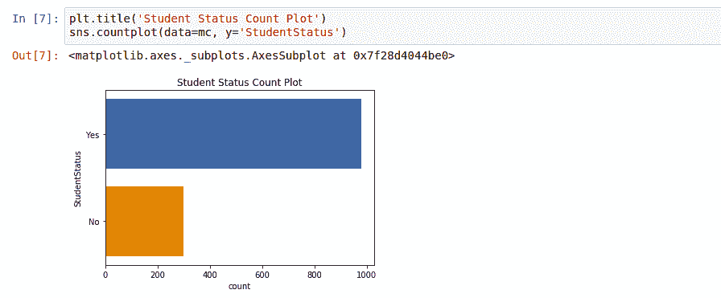

**职称、学历、专业和教育的实用性**

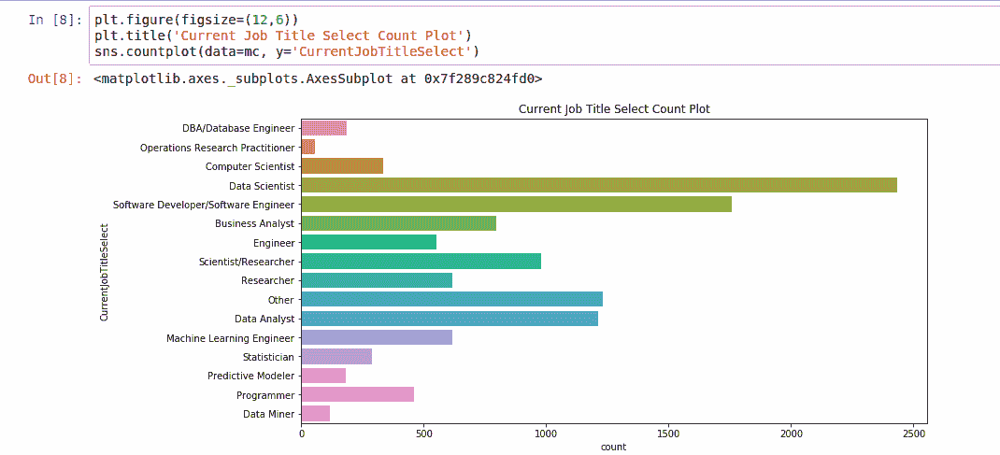

大多数受访者目前的职位是**数据科学家**，其次是**软件** **开发人员/软件工程师**。

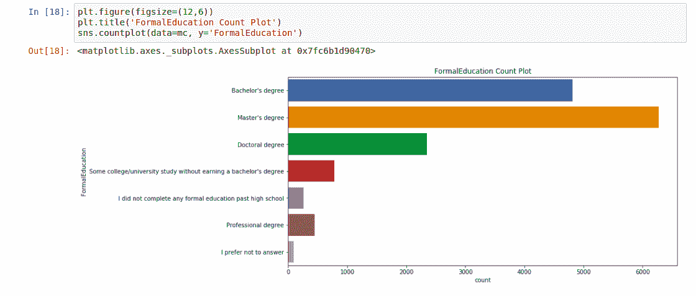

这表明大多数受访者拥有**硕士学位、**和至少**学士学位**。很大一部分受访者自诩拥有博士学位，但很少有人没有或很少受过正规培训。

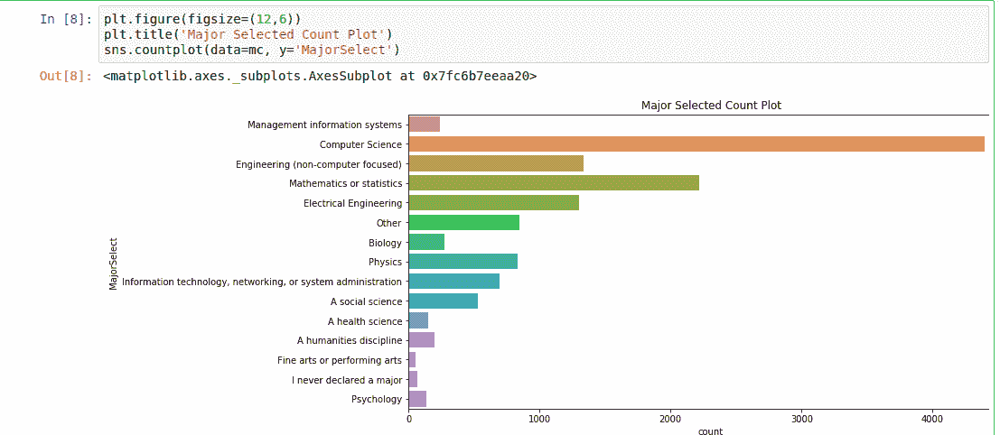

显然，在这些领域工作的大多数人都主修数学、统计学或计算机科学(T21)。

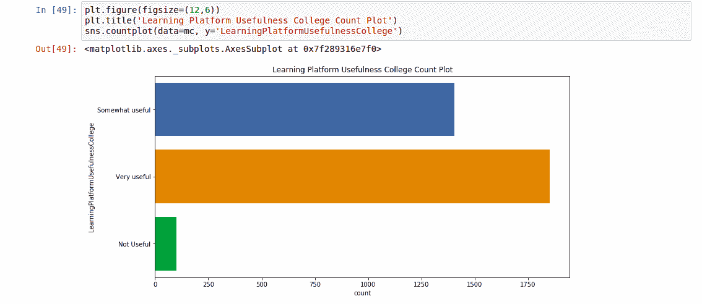

大多数被调查的人说大学教育很有帮助；他们中的大多数人都有学士和硕士学位，这并不奇怪。

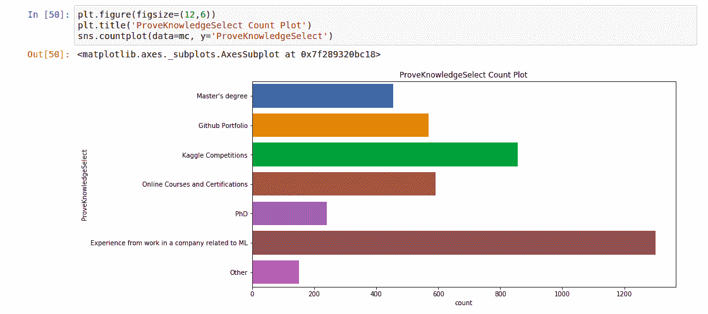

虽然受访者认为他们的教育水平有助于反映他们的技能，但绝大多数人指出，实际工作经验、他们的投资组合以及在线课程和认证在展示他们的技术实力方面更加重要。

**调查结果总结**

受访者的平均年龄:32 岁

平均年龄:25-35 岁

性别分布:75%为男性，25%为女性

地点:美国(4197)、印度(2704)、其他(1023)

就业状况:全职(70%)

教育水平:硕士或学士学位

最受欢迎的本科专业:数学、统计学或计算机科学

你怎样才能最好地展示你的技能:实际工作经验、作品集、在线课程和认证

在这篇[文章](/what-programming-language-should-aspiring-data-scientists-learn-875017ad27e0)的下一部分，我们将深入以下内容——敬请期待！

1.  你最初是如何开始你的机器学习/数据科学培训的？
2.  你会推荐一个新的数据科学家先学什么编程语言？
3.  在接下来的一年里，你最想学习的工具或技术是什么？
4.  在接下来的一年里，你最期待学习哪种 ML/DS 方法？
5.  你写代码分析数据有多久了？
6.  我应该去哪里找工作？
7.  美国数据科学家的平均工资

 [## Python 中的数据科学训练营

### 学习 Python 的数据科学，NumPy，Pandas，Matplotlib，Seaborn，Scikit-learn，Dask，LightGBM，XGBoost，CatBoost 等等…

www.udemy.com](https://www.udemy.com/course/data-science-bootcamp-in-python/?referralCode=9F6DFBC3F92C44E8C7F4)