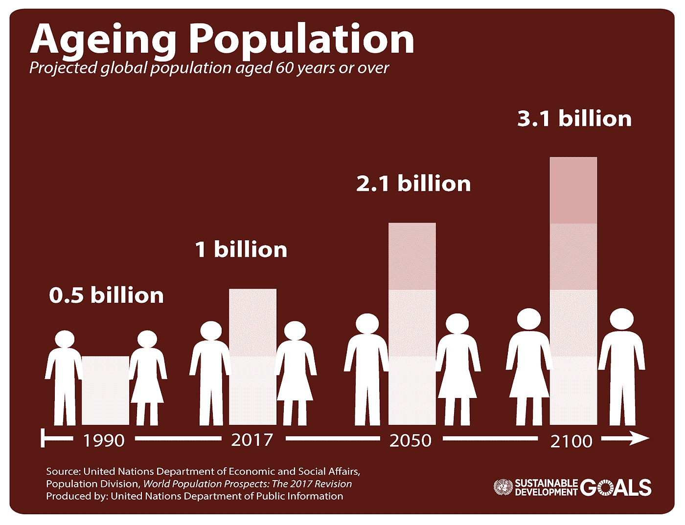
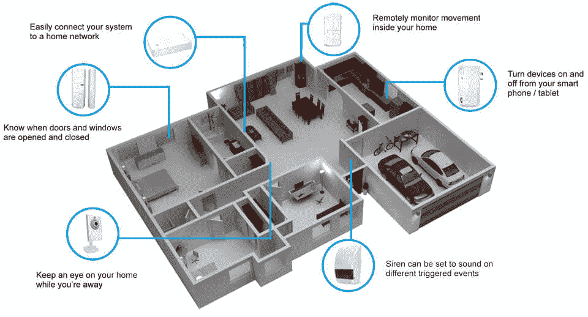
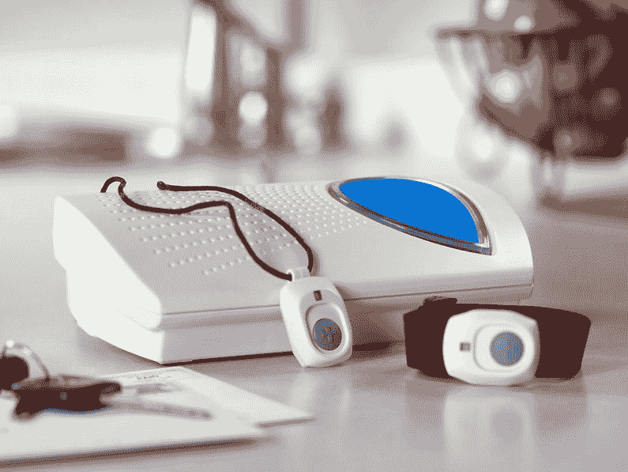
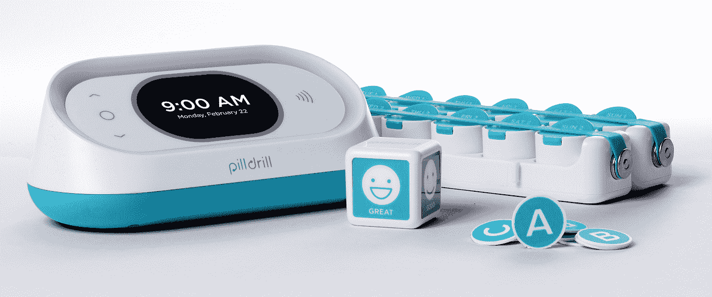
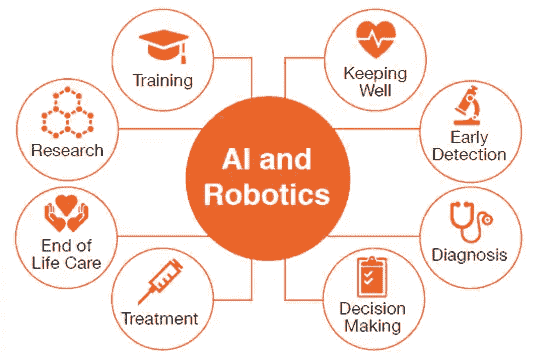

# 老年人护理产品的现状以及人工智能如何彻底改变老龄化

> 原文：<https://towardsdatascience.com/the-state-of-elderly-care-products-and-how-ai-can-revolutionize-aging-d4b098a1dacd?source=collection_archive---------12----------------------->

**最酷的老年护理工具以及人工智能如何彻底改变老龄人口的生活**

离开父母生活会很艰难，当他们变老而你又无法照顾他们的时候会更加艰难。感谢这个世纪给我们带来的永无止境的变化，变老不再是过去的样子。

从全球来看，预计到 2050 年，60 岁或以上的人口将翻一番，从 2015 年的 10 亿增加到 2050 年的 21 亿。到 2100 年，预计将增加到 31 亿，接近 2017 年的 3 倍。看到全球老龄化人口的增长前景，辅助生活行业正在快速吸引创新，使护理人员的健康监测变得轻而易举，这就不足为奇了。随着世界各国在未来几十年应对老年人口激增，这些创新正变得越来越重要。他们可能会面临财政和政治压力，以改革医疗保健监控、养老金和为日益增长的老年人口提供社会保护的公共体系。

与任何市场一样，越来越多的产品很难跟踪，为了让混乱的老年人监控市场易于理解，我们提出了一系列有趣的解决方案，在各自的类别中脱颖而出！

**无线家庭监控**

Gartner 的一份研究报告称，四年后，一个典型的家庭可能会包含多达 500 台智能设备。但是我们为什么在这里谈论他们呢？这些技术有可能让老年人的生活变得更加轻松，尤其是那些行动不便的老年人。

无线传感器网络(WSN)正日益成为辅助生活技术领域的一个热门话题。简而言之，这些产品使用电池供电的无线传感器(而不是实际的可穿戴设备)来测量环境参数，如温度、湿度和光强以及微观事件，从而可以推断日常活动，如移动、坐着、睡觉、使用电器和上厕所。离散的无线传感器被放置在房子的周围来监控活动。护理人员只需登录该产品的门户网站(或查看短信、电子邮件或迷你应用程序)，就能知道他们所爱的人在做什么。这些产品中的大多数具有个人紧急响应系统(PERS ),该系统在检测到与个人的普通活动模式的显著偏离和/或突然跌倒时，发出自动警报，该警报可以转发给授权人员。

例如，TruSense 使用一个智能家庭连接设备网络来帮助老年人。它集成了像 [Echo Dot](https://www.care.com/c/stories/12827/amazon-alexa-will-you-be-my-moms-senior-caregiver/) 这样的技术，包括一个运动传感器、接触传感器、智能插座和集线器，它们一起工作，提供实时数据。

[飞利浦 Hue](http://nymag.com/selectall/article/how-smart-home-lightbulbs-can-help-you-wake-up-easier-sleep-better-habits.html) 智能照明系统可以自动调暗和照亮房屋，帮助老年人入睡和轻轻地醒来。个人可以通过智能手机应用程序进行进一步调整。

缺点是什么？

*   当老年人不在家时不能用来监视他们。
*   值得思考的是，传感器是否能捕捉到每一个不寻常的活动，以及重大偏差实际上意味着什么
*   这样的产品可以同时监控多个人吗？如果你要照顾年迈的父母，这些传感器会监控他们的活动吗？

这一领域的一些著名品牌有 Lively、Canary Care、TruSense、Alarm.com、GrandCare Systems、 [Sen.se Mother 和 Motion Cookies](https://www.wired.com/2014/10/sense-mother/) 、[三星](https://www.smartthings.com/products/smartthings-motion-sensor)的 Smarthings 运动传感器和[prevention ce](http://www.preventice.com/)的 Bodyguardian Heart。它们的价格在 150-250 美元之间，每月订阅费为 20-30 美元，在美国和欧洲的特定地区提供。

[***对聊养老和 AI 感兴趣？和我一起进行 30 分钟的免费咨询(5 美元的报名费将在通话后退还)。通过日历***](https://calendly.com/cdossman/cdossmnan-consultation) 安排与我的时间

**带个人应急响应系统的可穿戴设备(PERS)**

高级可穿戴设备可以让穿戴者和护理者的生活更加轻松，这已经不是什么新闻了。然而，值得注意的是，这些先进的医疗保健技术模型如今不仅仅是跟踪脚步——它们可以监控日常活动，发送警报，甚至防止跌倒。智能可穿戴技术有多种形式:吊坠、手表和鞋底。

与市场上的许多高级护理产品相反， [CarePredict Tempo](https://www.carepredict.com/) 监测佩戴者，而不是周围的环境。作为腕带佩戴，它可以监控运动、睡眠、位置、个人护理和日常活动。在了解了高级佩戴者的日常生活模式后，Tempo 可以在任何偏离正常模式的时候提醒家人。它无需电线即可充电，并配有一个呼叫按钮，可作为个人紧急响应系统。(PERS)

新的[苹果手表](https://www.apple.com/in/watch/)应用程序旨在保护老年家庭成员的安全。这款应用程序简称为“Alert”，类似于一个紧急按钮，允许老年人或其他需要帮助的人通过触摸按钮联系护理人员寻求帮助。就当是那些“我摔倒了，爬不起来了！”过去电视购物中的设备。由于 watchOS 2 操作系统的[变化，该应用程序还可以关注生理信号，并建议老年人在问题实际成为问题之前请求帮助。对于那些患有限制运动或言语的疾病的人来说，这款应用程序尤其方便。](https://www.lifewire.com/watch-os-4149589)

GreatCall 的圆滑[活泼](https://www.greatcall.com/devices/lively-wearable-senior-activity-tracker)，兼做手表和吊坠，大概是市面上最好看的高级可穿戴设备了。这款设备类似于 Apple Watch，防水且易于使用，长效电池可连续使用长达 6 个月。这款手机也有一个 PERS 按钮，可以将用户直接连接到代理，代理可以根据情况采取适当的行动——无论是联系紧急医疗队还是给家人打电话。

[GPS SmartSole](http://gpssmartsole.com/gpssmartsole/) 是总部位于加利福尼亚州的 GTX 公司销售的一款产品，是一款可修剪的鞋垫，它结合了 GPS、蜂窝、蓝牙和 Wi-Fi 技术来捕捉数据，记录穿着者的位置，并将数据无线传输到云端，护理人员可以通过门户网站或应用程序访问这些数据。相关的应用程序还允许位置共享，让你随时随地关注你爱的人。

可穿戴设备的缺点:

*   极易受到外部损坏和盗窃
*   不支持摄像头监控；需要一个额外的设置
*   要求用户戴上设备并保持开机状态

其他产品包括飞利浦医疗保健的 GoSafe、 [MobileHelp](http://www.mobilehelpnow.com/) 、 [Alert1](https://www.alert-1.com/) 、 [Connect America](https://connectamerica.com/) 、 [Life Alert](http://www.lifealert.com/) 、 [Freeus](http://www.freeus.com) 和[prevenice](http://www.preventice.com/)的 Holter 和 BodyGuardian Verite 是高级智能可穿戴领域其他值得一试的标志性产品。其中大多数一次性费用为 150-200 美元，每月订阅费用为 30-50 美元。

**药物管理系统**

你上次忘记吃药是什么时候？虽然这看起来没什么大不了的，但随着年龄的增长，这种灾难会变得越来越严重。根据《风险管理和医疗保健政策》2014 年[的一份报告](https://www.ncbi.nlm.nih.gov/pmc/articles/PMC3934668/)，医疗保健系统每年因药物不合规而损失 1000 亿至 3000 亿美元。不遵从的原因很常见——忘记按时补充药物或忘记按时服药，或者因为否认疾病或避免副作用而拒绝遵从。

就像所有这些创新还不够一样，我们现在有了支持传感器的包装，可以跟踪容器中剩余的药丸数量，并在需要服用更多或重新订购处方时通过智能手机应用程序发送警报！

[MedMinder](http://www.medminder.com/) 药丸分配器通过一系列可选的视觉和/或听觉警报提醒用户服药。首先，隔间会闪烁，然后药丸分配器会发出哔哔声，然后用户会收到电话提醒。如果用户仍未服药，那么将通过电话、电子邮件和/或短信通知所有护理人员。同样的技术可以用于防止脱水:传感器可以跟踪容器中剩余的液体量，并在该再喝一杯的时候提醒老年人。

单个药丸也可以嵌入可摄取的传感器。一旦药丸到达胃部，它就会向外部设备发送信号，如佩戴在身体上的贴片，以确保正确的剂量和用法。贴片记录数据，并将其传递给患者和医疗保健专业人员。患者还可以通过智能手机应用程序访问这些信息，这样他们就可以了解自己的情况，并努力改善自己的习惯。

[提醒 Rosie](http://www.reminder-rosie.com/) 是另一款使用声控技术的产品。使用 Rosie，您每天可以录制多达 25 个提醒，并通过简单的语音命令查看当天的提醒，以便您保持控制。

[Tricella](http://www.tricella.com/) 在药物跟踪领域也做了一些出色的工作，并将其产品运往美国、加拿大、英国、意大利、西班牙、法国、香港和日本。 [CareZone](http://www.carezone.com/) 是一款你设置的免费应用程序，当该吃药的时候，它会让手机发出嗡嗡声。你们可以分享药物和其他重要信息。最酷的功能:拍摄一张药瓶的照片，上传，它会被转录并添加到药物清单中。虽然该细分市场中的一些产品以每月 50-60 美元的订阅价格出售，但其他产品的一次性费用约为 80 美元。

[***对聊养老和 AI 感兴趣？参加我的 30 分钟免费咨询(5 美元的注册费将在电话后退还)。通过日历***](https://calendly.com/cdossman/cdossmnan-consultation) 安排与我的时间

# 人工智能老年护理:老年护理的下一步

世界瞬息万变。人工智能技术不仅占据了空间和生产，还占据了我们的人类互动。最后，它开始为人类的日常必需品服务，特别是我们的老年人。

医院的 AI 可以帮助临床医生识别医疗风险；预测何时提供有针对性的拯救生命的干预措施；对罕见病患者形成治疗方案；并提供精准医疗。

例如，让老年人了解他们附近的社会活动可能会鼓励他们走出家门，与他人互动，减少社会孤立。分享带有健康促进信息的故事可以娱乐和潜意识地提供健康生活的教育。AI 建议选择更健康的食物，并鼓励他们积极运动，这有助于养成更健康的习惯。人工智能还可以从社交媒体网站上更新老年人关于他们孩子的信息，让他们更多地参与到家庭中来。

**未来医疗保健领域的人工智能可能会围绕社交机器人、聊天机器人和语音助手的结合展开。**

**辅助社交机器人**，一种特殊类型的辅助机器人，设计用于与人类进行社交互动，可以在老年人的健康和心理健康方面发挥重要作用。这种机器人被开发为老年人与数字技术的接口，并分别通过提供陪伴来帮助提高老年人的生活质量。索尼的艾博、ISRI 和 AIST 的 Paro、飞利浦的 iCat 和卡耐基梅隆大学的 nurse bot Pearl 已经在以实际的老年人为对象进行测试。

**聊天机器人**也越来越受欢迎，但它们相对较新，大部分仍在开发中。聊天机器人提供经医疗专业人员授权的信息，如果问题严重，还可以预约，或者通过对健康相关问题给出具体答案来缓解压力。

大量研究表明，老年人开始与人工智能聊天机器人建立某种形式的关系。社交机器人也可以调整他们的参与度，开始推动*自我关心的行为。*

越来越多需要定期保健的人正在购买语音辅助和识别设备。语音支持技术的数量正在不断增加，越来越多经验丰富的患者更倾向于使用这些工具。市场上有一个应用程序，可以帮助患者通过不同的服务预订他们往返医疗机构的旅程。在搜索医疗信息时，语音搜索对许多老年人非常有益。

人工智能在健康方面的力量似乎在于应用的结合，在未来我们可以看到所有这些应用的融合。临床应用将继续投入，并将变得越来越强大，以维持人们的生命。基于同理心的人工智能应用程序支持护理的软性方面，可以帮助我们让人们完全不需要临床治疗。人工智能在连续护理领域的商业案例可能确实非常强大，对健康结果的影响可能确实具有变革性。

[***对聊养老和 AI 感兴趣？和我一起进行 30 分钟的免费咨询(5 美元的报名费将在通话后退还)。通过日历***](https://calendly.com/cdossman/cdossmnan-consultation) 安排与我的时间

# 享受信息？尽可能多的点击下面的按钮！

*咱们也连线上* [*推特*](https://twitter.com/cdossman) *或者* [*LinkedIn*](https://www.linkedin.com/in/christopherdossman/)