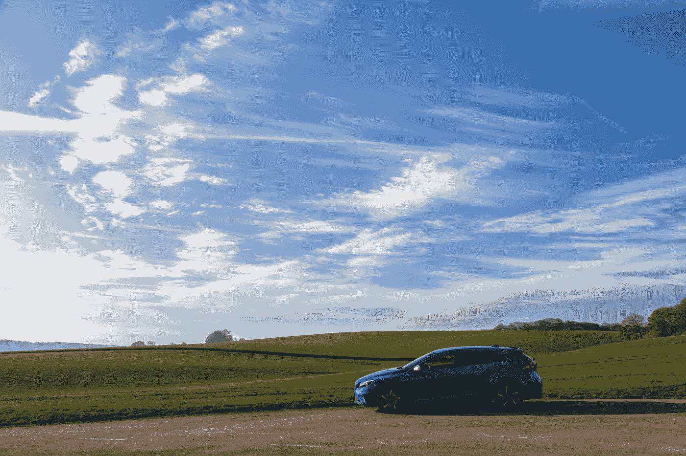
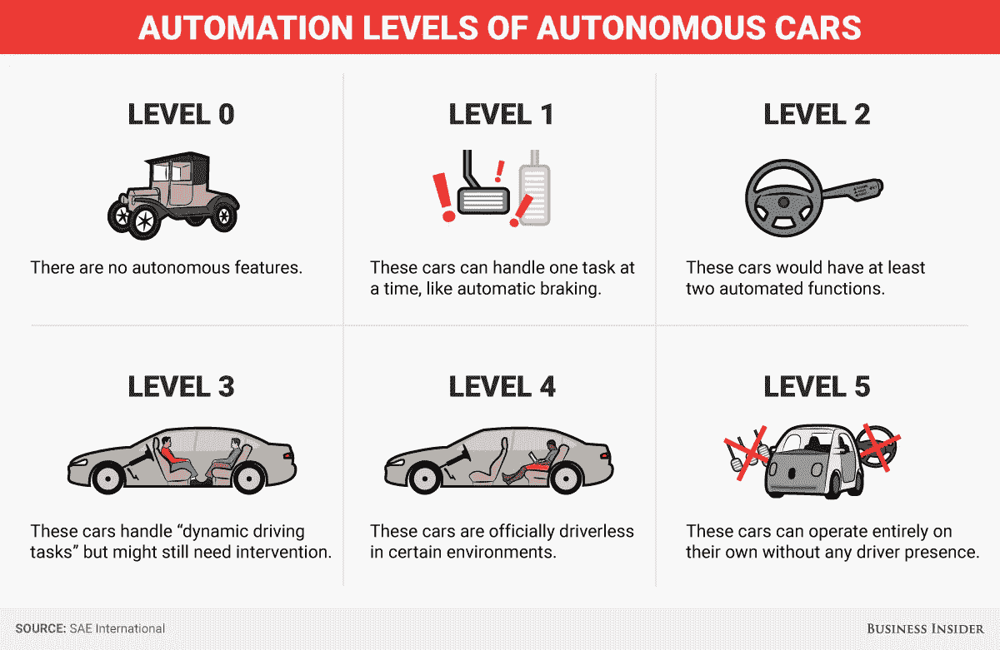
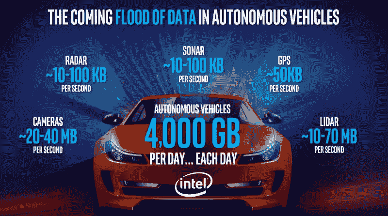
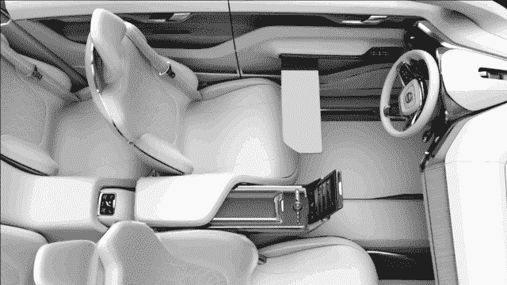
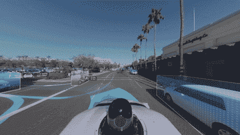
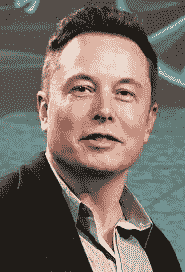
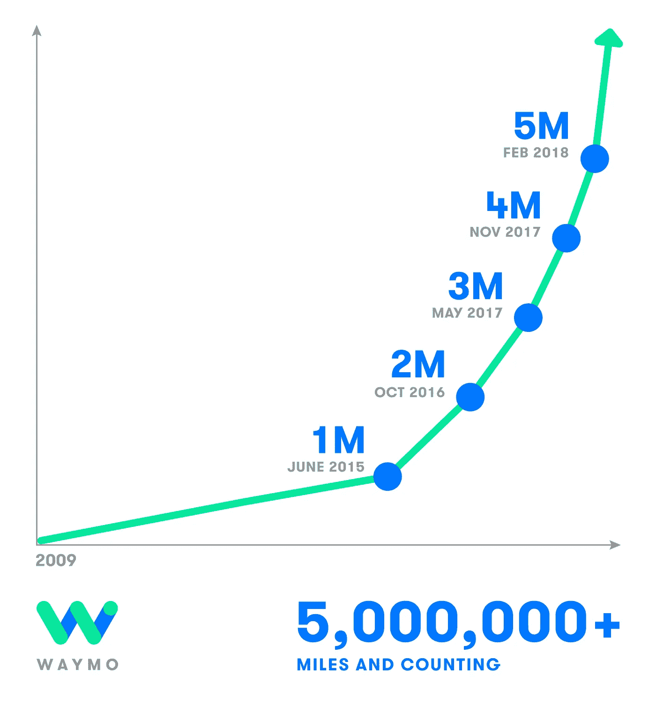
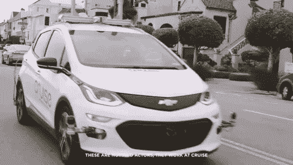
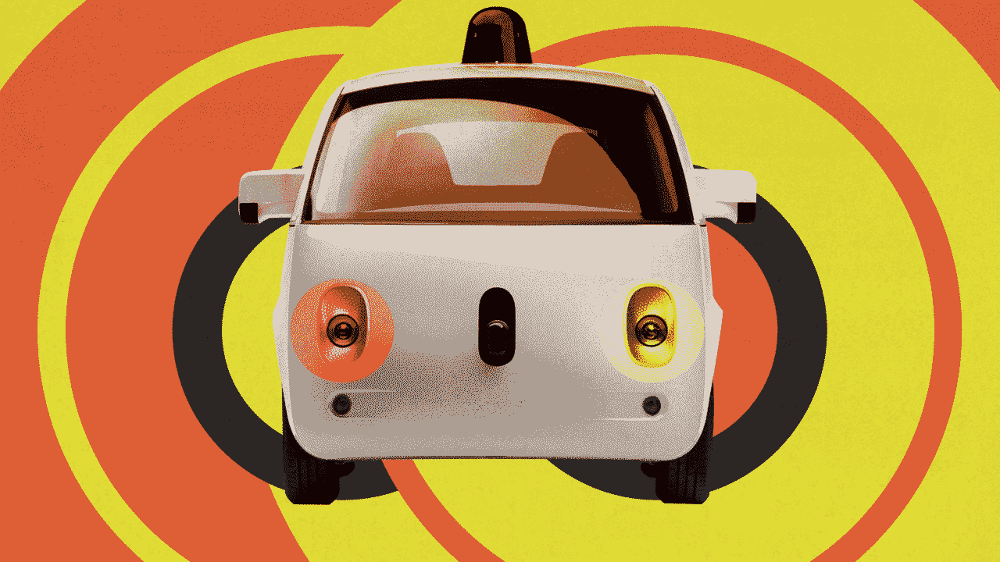
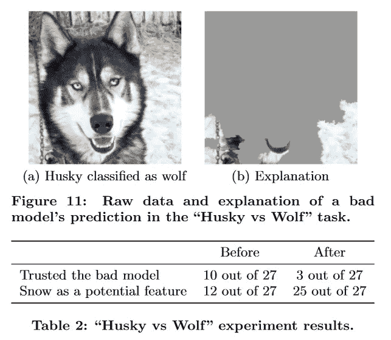

# 无人驾驶汽车的现状🚶🚘

> 原文：<https://towardsdatascience.com/the-state-of-self-driving-cars-for-everybody-29446c1c2e2c?source=collection_archive---------4----------------------->

## [汽车中的人工智能](https://towardsdatascience.com/tagged/ai-in-automotive)

## 随着自动驾驶技术的快速发展，为什么我们今天没有使用自动驾驶汽车？

Photo by [Rowan Heuvel](https://unsplash.com/photos/mjnO4ipSBy0?utm_source=unsplash&utm_medium=referral&utm_content=creditCopyText) on [Unsplash](https://unsplash.com/?utm_source=unsplash&utm_medium=referral&utm_content=creditCopyText)

如今，开车本身似乎是微不足道的。硬件、软件和算法可以说已经足够复杂，可以让汽车在街道上自主导航。为了证明这一点，请参考下面展示 Waymo 当前自动驾驶汽车能力的视频。

Video published by Waymo here: [https://www.youtube.com/watch?v=aaOB-ErYq6Y#action=share](https://www.youtube.com/watch?v=aaOB-ErYq6Y#action=share)

[大众](https://www.nytimes.com/2018/05/23/technology/apple-bmw-mercedes-volkswagen-driverless-cars.html)与苹果合作开发无人驾驶巴士，并展示他们的无人驾驶汽车 [SEDRIC](https://www.discover-sedric.com/en/) 。 [Waymo](https://medium.com/waymo/with-waymo-in-the-drivers-seat-fully-self-driving-vehicles-can-transform-the-way-we-get-around-75e9622e829a) 在内华达州凤凰城的封闭测试版中测试他们的自动驾驶车队。[特斯拉](https://www.tesla.com/autopilot?redirect=no)号称所有车型都有自动驾驶功能。 [Drive.ai](https://medium.com/@andrewng/self-driving-cars-are-here-aea1752b1ad0) 在德克萨斯州的弗里斯科宣布了他们第一辆公开发售的自动驾驶巴士。很难找到一家汽车制造商不展示自动驾驶汽车的工作。

自动驾驶汽车有机会降低全球事故率，拯救数百万人的生命。它们有可能把司机从乏味的驾驶任务中解放出来。它们将改善行人和骑自行车者的安全。

> 如果汽车可以做到这一点，并提供这么多好处，为什么我们现在不在自动驾驶汽车上阅读这篇文章呢？

Photo by [Matthew Szlichta](https://unsplash.com/photos/utIhBw00Jxs?utm_source=unsplash&utm_medium=referral&utm_content=creditCopyText) on [Unsplash](https://unsplash.com/?utm_source=unsplash&utm_medium=referral&utm_content=creditCopyText)

大规模生产自动驾驶汽车(SDC)面临着明显的挑战。解决这些挑战对世界各地的汽车制造商来说非常重要。这篇文章探讨并解释了使 SDC 为每个人所用的六个基础设施挑战。

根据标准化协会 [SAE International](https://saemobilus.sae.org/content/j3016_201609) 的定义，开发 SDCs 分为六类。0 级定义为完全没有自主权，而 5 级为乘客提供绝对自主权。下图解释了每个自动化级别的功能。今天，大多数现代汽车提供 2 级和 3 级之间的功能。

Source: [https://goo.gl/RWvo2N](https://goo.gl/RWvo2N)

要达到 5 级自主并在驱动器上享受个人自由，需要克服以下障碍。

我们开门见山吧。🚗 🚙 🚘 🚖 🚍

# 1.数据存储

无人驾驶汽车会产生大量数据。据英特尔称，自动驾驶汽车将在一天内创建 4TB 的原始数据。让 2500 辆汽车上路，你每天很快就会产生 1pb 的数据。还有，你有没有试过在数十亿字节的数据中搜索？一点都不好玩。收集的数据规模庞大，需要精心设计的数据存储架构。

Source: [https://intel.ly/2fueVli](https://intel.ly/2fueVli)

一些数据位也需要存储在车辆中。定义存储哪些数据是一部分。视频是产生的绝大部分数据的来源。压缩或压缩相机图像并非对所有使用情况都可行。

一辆面向大众市场的汽车的运营利润率大约为 2 万美元的汽车的 5%。这为每辆车带来了大约 300 美元[的利润。说服产品所有者为每辆车花 100 美元购买一个大容量的硬盘来存储数据是很难的。](https://www.quora.com/On-average-how-much-profit-should-a-car-manufacturer-get-by-selling-one-car)

# 2.数据传输

一旦生成了万亿字节的数据，就需要从汽车中提取出来。大多数汽车还没有享受永久的 5G 互联网连接，因此通过空中传输所有数据具有挑战性。

如果你有一个 50 兆比特/秒的互联网连接，理论上你可以在 24 小时内上传大约 4TB 的数据。如果你有很多车，你需要线性增加带宽。如果生成的数据量增加，互联网连接的带宽也需要增加。SDC 可以轻松测试世界许多地方现有互联网基础设施的物理极限。

# 3.传感器费用

What a Waymo car “sees”. Source: [https://bit.ly/2rsK25r](https://bit.ly/2rsK25r)

SDC 通常通过相机图像和雷达技术激光雷达感知其环境。虽然相机很便宜，但激光雷达非常昂贵。一个来自威力登的新激光雷达传感器的价格大约为[75，000](https://www.businessinsider.de/google-hiring-lidar-expert-for-self-driving-cars-2015-12?_ga=2.182267876.270294898.1527680976-1628295529.1527680975&r=US&IR=T)美元，这已经超过了我们愿意为整辆汽车支付的价格。汽车制造商可以考虑以低于生产成本的价格出售 SDC。然后他们可以通过车载娱乐等数字服务把钱拿回来，但这是一个冒险的赌注。Waymo [声称](https://www.businessinsider.de/googles-waymo-reduces-lidar-cost-90-in-effort-to-scale-self-driving-cars-2017-1?r=US&IR=T)已经在内部开发了自己的激光雷达传感器，并随后将其成本降低了 90%。这可能是在大规模生产的车辆中使用激光雷达的一种方式。

有人试图仅基于相机图像来驾驶自动驾驶汽车，就像这篇[论文](https://arxiv.org/pdf/1604.07316.pdf)中介绍的那样。特斯拉主要依靠相机图像来驾驶汽车，以避免激光雷达的高成本。但只要激光雷达对于大多数环境感知功能来说是必要的，它将仍然是汽车制造商开发第 5 级自动驾驶汽车的昂贵“拐杖”。

> “在我看来，(激光雷达)是一根拐杖，它将把企业推向它们将很难摆脱的局部最大化。也许我错了，我会看起来像个傻瓜。但我很确定我不是。”— [特斯拉首席执行官埃隆·马斯克](https://techcrunch.com/2018/02/07/elon-musks-self-driving-strategy-still-doesnt-include-lidar/)

# 4.训练数据采集

据目前估计，SDCs 必须行驶约 1 亿英里才能收集到足够的数据来安全自主导航。Waymo 于 2018 年 2 月完成了第 500 万英里的驾驶。尽管速度稳步增加，但鉴于目前的速度，Waymo 将需要很长时间才能行驶完剩余的里程。公司也每天驾驶数百万虚拟英里数。但是在现实世界中收集结果是非常耗时的。

Source: [https://waymo.com/ontheroad/](https://waymo.com/ontheroad/)

注意 Waymo 获取数据的节奏。虽然该公司花了 6 年时间驾驶第一个一百万英里，但它在 [3 个月](https://medium.com/waymo/waymo-reaches-5-million-self-driven-miles-61fba590fafe)内驾驶了最近的一百万英里。令人印象深刻，但前面的路还很长。

# 5.拐角情况数据的采集

在特斯拉(Tesla)和优步(Tesla)的自动驾驶汽车发生悲剧性事故后，对拐角案例训练数据的需求变得越来越重要。拐角情况是很少发生的情况，例如行人意外踩在街道上或在街道中间放置混凝土块。有在高速公路上驾驶的数据固然很好，但更多的价值在于极限情况下的训练数据。Waymo 显然是通过随机[跳到自动驾驶汽车前面](https://www.washingtonpost.com/gdpr-consent/?destination=%2flocal%2ftrafficandcommuting%2fwaymos-ceo-on-fatal-autonomous-uber-crash-our-car-would-have-been-able-to-handle-it%2f2018%2f03%2f25%2f4cc97550-3046-11e8-8abc-22a366b72f2d_story.html%3f&utm_term=.bb1ea10bb2e6)并检查它是否停下来来测试它的自动驾驶汽车。目前的研究领域包括从模拟环境中创建极限情况数据或通过[文本到视频转换系统](http://www.sciencemag.org/news/2018/02/new-algorithm-can-create-movies-just-few-snippets-text)创建人工数据。

# 6.验证深度神经网络

理解为什么或为什么没有 SDC 识别另一辆汽车是至关重要的，以说服监管机构这些汽车对于公共使用来说是足够安全的。SDC 依赖于深度学习算法，这些算法因没有解释它们为什么以这种或那种方式做出决定而臭名昭著。

在一个著名的[项目](https://arxiv.org/pdf/1602.04938.pdf)中，研究人员训练了一个神经网络来区分狼和狗。这个模型达到了惊人的精确度。然而，研究人员最终发现，神经网络学会了检测图像上的雪，因为大多数狼的训练图像都在背景中包含雪。这不是网络应该得出的结论。

[https://arxiv.org/pdf/1602.04938.pdf](https://arxiv.org/pdf/1602.04938.pdf)

在监管机构允许汽车在公共道路上自动驾驶之前，他们需要验证车辆是安全的。

这份清单涵盖了为大众生产无人驾驶汽车的基础设施问题。这个列表可能不全面，但它提供了一个概述。你已经看到了无人驾驶汽车给每个人带来的问题。有什么解决方案建议？

如您所见，在验证算法和扩展 SDCs 的数据训练和存储能力方面，仍有许多工作要做。如果你认为变通的 SDCs 很重要也很有趣，可以随意查看美国旧金山湾区的[电子研究实验室](http://www.vwerl.com/careers/)，慕尼黑的[自动智能驾驶有限公司](http://aid-driving.eu/home/jobs/)，或者柏林的 [Carmeq](http://www.carmeq.de/en/jobs.html) 的招聘信息。

如果你喜欢这篇文章，请不要忘记展示你的💛穿过👏 👏 👏并在 [Medium](https://medium.com/@janzawadzki) 或 [LinkedIn](https://www.linkedin.com/in/jan-zawadzki/) 上关注我。你也可能[喜欢](/top-5-business-related-books-every-data-scientist-should-read-6e252a3f2713) [这些](/convolutional-neural-networks-for-all-part-i-cdd282ee7947) [帖子](/the-deep-learning-ai-dictionary-ade421df39e4)。如果你认为有什么需要补充的，请评论。干杯！☮️