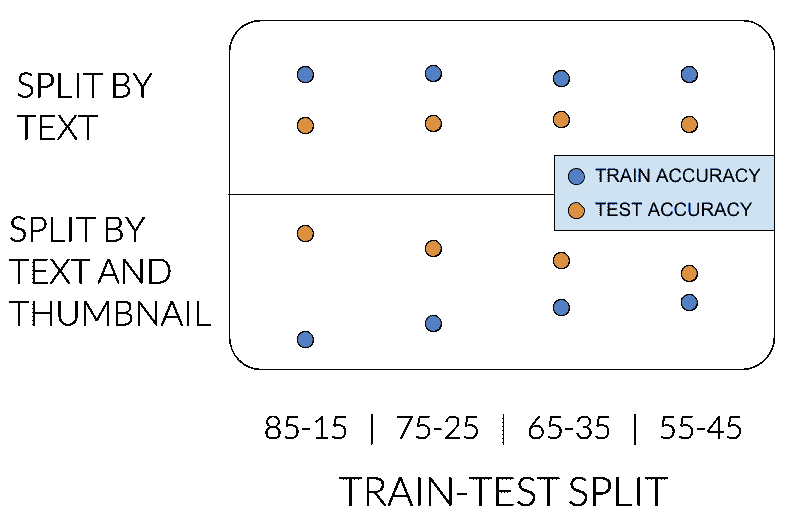
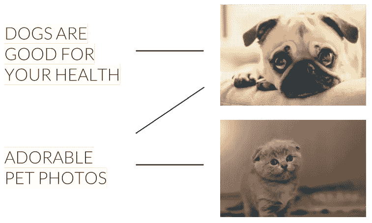
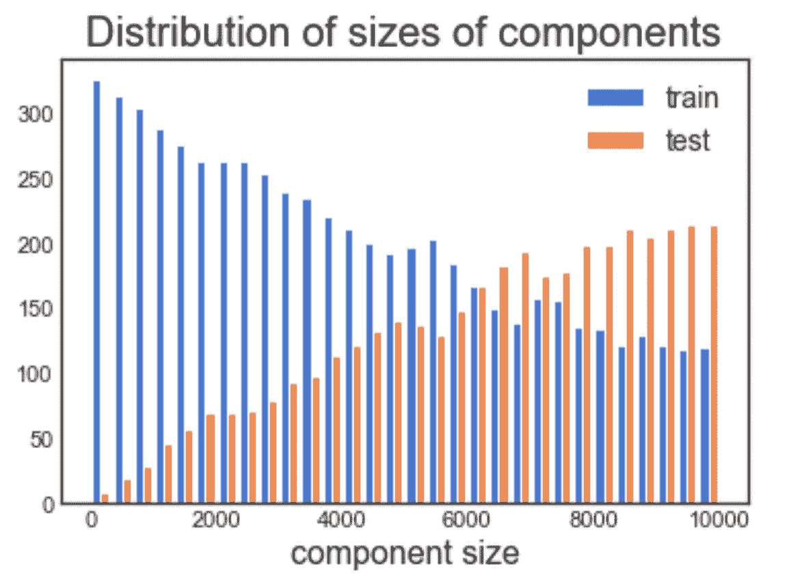

# 一个糟糕的火车测试分裂的故事

> 原文：<https://towardsdatascience.com/the-story-of-a-bad-train-test-split-3343fcc33d2c?source=collection_archive---------16----------------------->

## 将数据集拆分为训练测试集有时可能比预期的更复杂


大约一年前，我们在一个模型中加入了一种新的功能，用于向用户推荐内容。我说的是内容项的缩略图:


到目前为止，我们一直使用项目的标题和元数据功能。与缩略图相比，标题更容易使用——机器学习方式。

我们的模型已经成熟，是时候给聚会添加缩略图了。这个决定是我们在列车测试分割程序中引入可怕偏见的第一步。让我来展开这个故事…

# 设置场景

根据我们的经验，很难将多种类型的功能整合到一个统一的模型中。所以我们决定一步一步来，将缩略图添加到只使用一个功能的模型中——标题。

在使用这两个特性时，有一件事需要考虑，那就是数据泄漏。当只处理标题时，您可以天真地将数据集随机分成训练测试——在移除具有相同标题的项目之后。但是，当您同时处理标题和缩略图时，您不能应用随机拆分。这是因为许多项目共享相同的缩略图或标题。库存照片是跨不同项目共享缩略图的一个很好的例子。因此，记忆它在训练集中遇到的标题/缩略图的模型可能在测试集中具有良好的性能，而在泛化方面做得不好。

解决办法？我们应该分割数据集，使每个缩略图要么出现在训练中，要么出现在测试中，但不能同时出现在两者中。标题也是如此。

# 第一次尝试

嗯，听起来很简单。让我们从最简单的实现开始。我们将数据集中的所有行标记为“train”。然后，我们将迭代地将行转换成“test ”,直到我们得到期望的分割，比如说 80%-20%。转换是如何完成的？在循环的每一步，我们将选择一个随机的“train”行，并标记它进行转换。在转换之前，我们将检查具有相同标题/缩略图的所有行，并对它们进行标记。我们将继续这样做，直到没有更多的行，我们可以标记。最后，我们将标记的组转换为“测试”。

# 然后事情升级了

乍一看，这个天真的解决方案似乎没什么问题。每个缩略图/标题出现在训练或测试中。那么问题是什么呢？

首先我会给你看问题的症状。为了能够比较只有标题的模型和使用缩略图的模型，我们对只有标题的模型也使用了新的分割。它应该不会对它的性能产生影响，对吗？但是后来我们得到了以下结果:



在最上面一行，我们看到了我们已经知道的:只有标题的模型在训练集上具有更高的准确性，并且准确性不受分割比率的显著影响。

问题出现在最下面一行，在这里我们应用了新的分割方法。我们期望看到类似的结果，但是只有标题的模型在测试中更好。什么？….不应该是那样的。此外，性能受比率的影响很大。有些可疑…


# 那么问题潜伏在哪里呢？

你可以把我们的数据集想象成一个二分图，一边是缩略图，另一边是标题。如果存在具有缩略图和标题的项目，则缩略图和标题之间存在边缘。



我们在新的分割中有效地做的是确保每个连接的组件完整地驻留在训练集或测试集中。

事实证明，分裂是有偏差的。它倾向于为测试集选择大的组件。假设测试集应该包含 15%的行。你以为它含有 15%的成分，但我们得到的是 4%。


# 第二次尝试

我们所做的有什么问题？当您随机对一行进行采样时，从特定组件获得一行的概率与组件的大小成比例。因此，测试集以少量大组件结束。这可能违反直觉，但这里有一个代码片段，您可以尝试亲自体验一下:

```
import numpy as np
import matplotlib.pyplot as plt def train_test_split(component_sizes, test_size):
  train = component_sizes
  test = []
  while sum(test) < test_size:
    convert = np.random.choice(range(len(train)),
                               p=train.astype('float') / sum(train))
    test.append(train[convert])
    train = np.delete(train, convert)
  return train, test component_sizes = np.array(range(1, 10000))
test_size = int(sum(component_sizes) * 0.5)train, test = train_test_split(component_sizes, test_size)
plt.hist([train, test], label=['train', 'test'], bins=30)
plt.title('Distribution of sizes of components', fontsize=20)
plt.xlabel('component size', fontsize=16)
plt.legend(fontsize=14)
```



训练集和测试集之间的组件大小分布是不同的。

现在，我们通过二分图更好地形式化了我们正在做的事情，我们可以通过随机抽样连接的组件来实现拆分，而不是随机抽样行。这样，每个组件都有相同的概率被选入测试集。

# 关键外卖

将数据集分成训练测试的方式对于项目的研究阶段至关重要。在研究过程中，您花费了大量的时间来观察测试集的性能。构建测试集以代表推理时发生的事情并不总是简单明了的。

以向用户推荐一个项目为例:您可以推荐一个全新的项目，也可以推荐一个过去已经向其他用户展示过的项目。两者都很重要。

为了了解模型在研究阶段的离线情况，您必须构建一个测试集，其中包含全新的项目和出现在训练集中的项目。合适的比例是多少？很难说…我想这可以成为改天另一篇文章的主题🙂

*原文由我在*[](https://engineering.taboola.com/story-of-bad-train-test-split)**发表。**