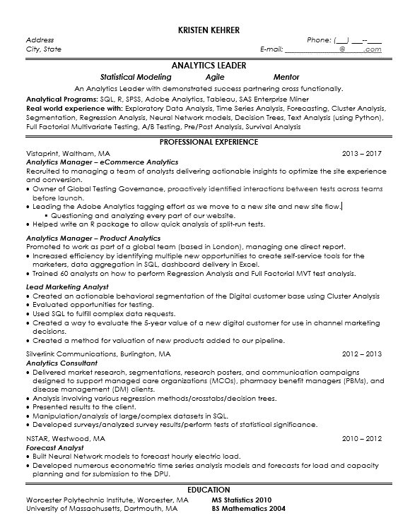
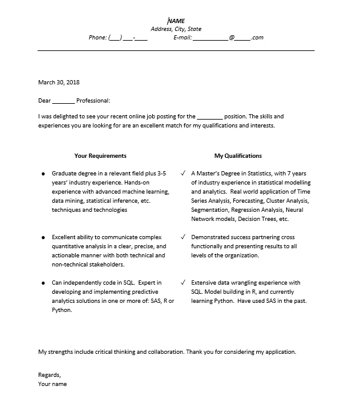

# 成功的数据科学求职

> 原文：<https://towardsdatascience.com/the-successful-data-science-job-hunt-6131bf80dd75?source=collection_archive---------2----------------------->

本文的重点是从头到尾向您展示成功的数据科学求职是什么样的。系好安全带，朋友们。我要把你从被解雇的第一天带到我接受工作机会的那一天。说真的，那是紧张的两个月。

我拥有统计学硕士学位，自 2010 年以来一直从事高级分析工作。如果您是该领域的新手，您的体验可能会有所不同，但希望您能够利用大量的此类内容。

我们将讲述我如何利用 LinkedIn，跟踪所有的申请，在搜索时继续提高你的技能，当你收到邀请时该做什么，以及如何谈判。

# 第一天被解雇

Vistaprint 决定裁员 2000 万美元，我是其中一员。我意识到目前市场很热，所以我从第一天起就很乐观。我收到了遣散费，这是一个让我认真思考下一步该怎么走的机会。

我第一次染了亮粉色的头发后 4 天就被解雇了，这太糟糕了。

4 days after I was laid-off, sporting my pink hair. That’s my little man, Harry. He was almost 3 months when I was laid-off.

实际上，我带着我的粉红色头发去参加了一次工作面试，他们很喜欢。然而，我决定在接下来的搜索中让我的头发恢复自然的颜色。

# 我做的第一件事:

招聘人员经常在 LinkedIn 上找我。我总是回复。

虽然如果你刚刚进入这个领域，你可能不会在你的 LinkedIn 邮件中有招聘人员过去的信息，但我提到这一点，以便你可以在你的剩余职业生涯中开始这样做。

现在我正在寻找，我的第一个行动是浏览这个列表，给每个人发信息说:

“你好(招聘人员)，我正在寻找一个新的机会。如果有你想填补的合适的职位，我愿意和你聊聊。”

有很多人回复说他们有一个角色，但是和他们谈过之后，现在这个角色似乎不太适合我。

除了联系那些联系过我的招聘人员，我还在谷歌上搜索(和 LinkedIn 搜索)来寻找分析领域的招聘人员。我也向他们伸出手，让他们知道我正在寻找。你永远不知道谁会知道一些还没有出现在求职公告板上，但很快就会出现的事情。

# 第一次见到职业蔻驰

作为裁员的一部分，Vistaprint 给我安排了一个职业教练。她教给我的信息非常有价值，我将在我的职业生涯中使用她的建议。我见过转型解决方案的琼·布莱克。在我们第一次见面时，我带着我的简历，我们讨论了我对下一个角色的期望。

因为我的简历和 LinkedIn 在过去取得了成功，她没有改变我简历上的太多内容，但我们确实**把我的技能和经验放到了最上面，把我的学历放在了最下面。**

他们还将其格式化以适合一页。它开始变长了，但是我相信一页简历。

This is my resume. While it may not be the most beautiful resume ever, it got the job done and I’m happy with it.

我还确保在我的申请中附上一封求职信。这给了我一个机会，可以明确地说我的资格与他们的工作描述非常匹配。这比必须通读我的简历寻找流行语要清楚得多。

我保存了一份我申请的所有公司的电子表格。在这个电子表格中，我会输入一些信息，比如公司名称、完成申请的日期、是否有回音、最后更新时间、是否发了感谢信、招聘经理的姓名等等。

这有助于我记录飞行中所有不同的事情，以及我是否能做些什么来保持这个过程。

# 每个应用程序:

对于我申请的每一份工作，我都会在 LinkedIn 上进行小小的搜索。我会看看我的关系网中是否有人目前在这家公司工作。如果是这样，他们可能想知道我在申请，因为很多公司都提供推荐奖金。我会给那个人发信息，说些类似这样的话:

*嘿米歇尔，*

*我在申请 __________ 的数据科学家职位。你愿意推荐我吗？*

如果我的网络中没有为该公司工作的人，我就会试着找到该职位的招聘经理。很可能是“数据科学和分析总监(或副总裁)”之类的头衔，或者其他类似的称呼，你要找的是决策者。

这需要 LinkedIn Premium，因为我要发送一封电子邮件。我给招聘经理/决策者的信息应该是这样的:

*嗨肖恩，*

我对远程数据科学职位很感兴趣，我希望我能把我的简历交到合适的人手里。我有统计学硕士学位，加上 7 年的实际建模经验。我擅长 SQL，用 R 建模，对 Python 也有一些了解。

*我很高兴有机会与合适的人谈论空缺职位，并分享我如何通过使用统计方法为公司提供见解和附加值。*

*谢谢克里斯汀*

大多数人都做出了回应，当我告诉琼(职业教练)我在 LinkedIn 上的成功时，她很惊讶。

# 我开始申请工作，并开始拥有“手机屏幕”

手机屏幕基本上都一样。有些人比其他人更激烈，时间更长，但他们都在半小时左右，他们通常是和人力资源部门的人在一起。因为是人力资源部门，你不想太深入地了解技术方面的东西，你只是希望能够通过这个阶段，然后写一封短信感谢他们的时间，并尝试在你能够与招聘经理交谈时坚定立场:)

**介绍一下你自己:**

人们只想听到你能说出你是谁，你在做什么。我的是某种变体:

*我是一名数据科学家，拥有 7 年使用统计方法和分析解决各行业业务问题的经验。我擅长 SQL，R 建模，目前正在学习 Python。*

**你想做什么？**

我会确保我想做的事情与职位描述直接相关。说到底，这是“*的一些变种，我希望不断学习新的工具、技术和技巧。我想致力于增加商业价值的有趣问题"*。然后我会谈论工作描述中的一个项目听起来有多有趣。

你希望的薪水是多少？

如果你能避免这个问题，你会被问到，但是试着转向不同的方向。你可以回答“我过去一直得到公平的报酬，我相信为[插入公司名称]工作也会得到公平的报酬。你知道这个职位的工资范围吗？

他们会知道这个职位的范围，但他们可能会告诉你他们不知道。大多数情况下，我会最终让步，给他们我的薪水，这并不意味着当你收到一份工作邀请时，你就不能讨价还价了。

# 与此同时，我还在学习，我可以在采访中这样说:

如果我要告诉每个人我非常喜欢学习技术，那么我最好是“言行一致”。虽然我在不断学习，因为这是我的天性。确保如果你说你在学习新的东西，你真的在学习它。我选的课程是:

*   [Python 为大家带来的](https://click.linksynergy.com/deeplink?id=qBzelsuolGo&mid=40328&murl=https%3A%2F%2Fwww.coursera.org%2Fspecializations%2Fpython)

免责声明:这是一个附属链接，意思是说，如果你最终报名参加这个课程，我将免费为你赚取佣金。

本课程将介绍基本的列表，数组，元组，定义函数..但是它也介绍了如何访问和解析 web 数据。我一直想知道如何访问 Twitter 数据以供未来分析，所以这非常酷。专业化(这是 Coursera 上一系列课程的名称)也给出了如何构建数据库的简要概述。这对我来说是一个额外的收获，因为如果我想操作一个模型，我会想知道如何从 Python 写一个数据库表。总的来说，我发现这门课很好地利用了我的时间，而且我学完这门课后能够聪明地与事物交流，这是我在学这门课之前无法做到的。

# 亲自面试:

一篇关于当面采访的深度文章来了。一旦它建立起来，我会把它链接到这里！数据科学面试肯定有一个非常标准的流程。

或者你可以随时加入我的邮件列表，确保你不会错过它！[这里](https://visitor.r20.constantcontact.com/d.jsp?llr=u87kgk7ab&p=oi&m=1129918591860&sit=ahj5pbfmb&f=5ed033f5-5740-4951-9beb-a17a4bb51fdc)

# 你被告知你将会收到一份工作邀请:

太好了！你会得到一份工作。在这一点上，你想打电话给你会考虑录用的所有其他公司，并说“我被告知我正在等待一份录用通知，你能做些什么来加快你的过程吗？”

我向两家公司提到了这一点。其中一个确实加快了他们的进程，并导致了额外的报价。

# 谈判:

电话响了，你接了。就这样，你得到了第一份工作。是时候谈判了。只有相对较小比例的人谈判过他们的薪水，当我们谈到女性时，这个比例就更小了。

女士们！谈判！我在这里支持你，你能行的。

过渡解决方案的琼曾在这方面指导过我。她说“不要试图为他们解决问题”。

当他们打电话给你时，让他们知道他们打电话给你你有多兴奋，你有兴趣听听他们的提议。

一旦你听说了薪水、休假时间，以及他们会把福利信息发给你，你就可以这样说:

*非常感谢你的邀请，我真的很感激。你知道，我希望你能在薪水上做得更多。*

然后等待回应，再次保持乐观。他们很可能会说，他们需要将这些信息反馈给招聘经理。

*谢谢你。我会花些时间看看福利待遇。我想在 ____ 再次发言。我很有信心我们可以结束这一切。*

然后你就可以离开谈话，确定下一次和他们谈话的具体时间，让他们知道你很高兴收到他们的来信，所有这些都是积极的！

我成功地谈妥了我的提议，一周后开始工作。我对我现在的位置和我正在做的工作非常满意。我花了很多时间去申请，也花了很多时间去和那些不是“最佳人选”的公司交流，但这是值得的。

总结一下我的求职。我了解到，有针对性的求职信和直接在公司网站上申请会大大提高你的申请回复率。我了解到，你可以有效地利用 LinkedIn 找到一个职位的决策者，如果你非常适合，他们会帮助你推进这个过程。我也对自己表达技能的能力有了极大的信心，这来自于实践。

我祝你在狩猎中取得巨大成功，我希望这篇文章中有一些你能够使用的技巧:)

如果你想把我的文章直接发到你的邮箱，你可以注册:[这里](https://visitor.r20.constantcontact.com/d.jsp?llr=u87kgk7ab&p=oi&m=1129918591860&sit=ahj5pbfmb&f=5ed033f5-5740-4951-9beb-a17a4bb51fdc)