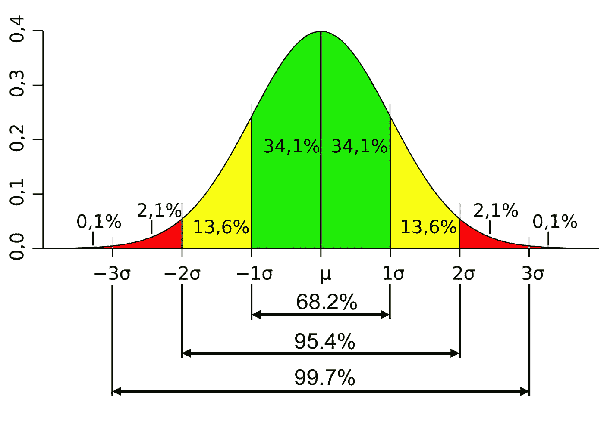
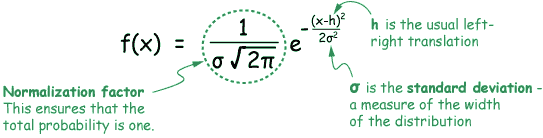
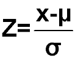
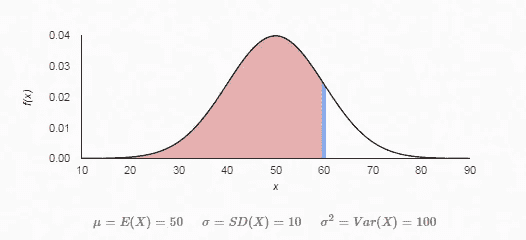
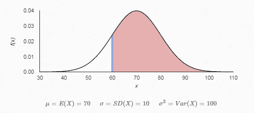
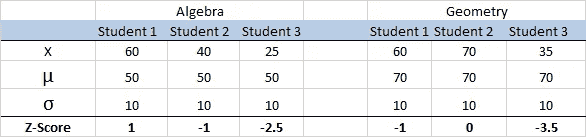
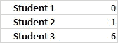

# Z 分数惊人的长寿

> 原文：<https://towardsdatascience.com/the-surprising-longevity-of-the-z-score-a8d4f65f64a0?source=collection_archive---------1----------------------->

Europe in 1730

1730 年 6 月 6 日星期二的深夜，亚伯拉罕·德莫佛跌跌撞撞地从考文特花园的一家咖啡馆里走了出来，由于喝了太多的杜松子酒，又上了几个小时的课，还在赌博，他还有点晕头转向。

他可能会停下来，凝视着星星，思考这个世界会如何记住他。作为一个以教数学为生的贫穷法国移民，他不会想到他的理论会在近 300 年后对人工智能产生影响。

亚伯拉罕·德莫佛以他的著作《*》奠定了概率论的基础(1718 年第一版)。*

*具体来说，在他的书的后期版本中，德·莫维尔记录了第一个已知的关于二项分布近似的陈述，现在通常称为 [*正态分布*](https://en.wikipedia.org/wiki/Normal_distribution) *。此外，他还证明了[中心极限定理](https://en.wikipedia.org/wiki/Central_limit_theorem)的一个特例。这些原理的发现对于统计分析的重要性，就像有花边的皮球的发现对于足球的重要性一样。**

**

*正态分布可以通过均值(μ)和标准差(σ)来描述。在正态分布中，我们可以观察到大约 68%的观察值在平均值的一个标准偏差内，大约 99%的观察值在平均值的三个标准偏差内。标准差(σ)是对平均值支出的度量。*

*通过高斯函数描述的完善的正态分布为数值观测值创建了一般的测量可比性规则，并返回其概率。*

**

*Gaussian Function source:[http://www.drcruzan.com/Images/ProbStat/Distributions/GaussianFunctionWithExplanation.png](http://www.drcruzan.com/Images/ProbStat/Distributions/GaussianFunctionWithExplanation.png)*

*这种标准化正是 z-score 变得非常方便的地方。*

**

*z-score function*

## *标准化以便更好地比较*

*比方说，德莫维尔先生想比较他的学生在代数方面是否和他们在几何方面一样好。显然，他会绘制两个数据系列的分布图。*

*代数的平均分是 50，我们计算出标准差是 10。我们可以将 z 得分计算为(得分均值)/标准差= (X-50)/10*

*几何的平均分是 70，我们计算出标准差是 10。我们可以将 z 得分计算为(得分均值)/标准差= (X-70)/10*

*如果 know de Moivre 最喜欢的学生在两次考试中都得了 60 分，那么她在代数考试中就会比平均水平高出 1 个标准差。*

**

*然而，对于几何测试，她将比平均值低 1 个标准差。*

**

*或者换句话说，在代数方面，84%的其他学生(低于平均值 50 %+半标准差 34%)会更差；在几何方面，84%会更好。*

*现在我们有两个均值不同的数据序列。有没有可能通过这两次考试的表现来预测学生未来的总体表现？当然是了。*

*在许多统计应用中，通常将观察值标准化为*标准正态分布；*均值(μ) =0，标准差(σ) = 1 的正态分布。*

*我们简单地计算所有观察值的 z 分数，瞧，我们有了标准尺度上的所有观察值。*

**

*标准分数对于评估学生的表现有几个好处。如果你简单地计算样本的平均等级，你肯定会得到学生所处位置的意见，但是接近平均值的等级差异与其说是能力差异，不如说是分布的极端差异。或者换句话说，在 100 名学生的小组中，排名第一和第五的人之间的差异通常大于排名第五十一和第五十五的人之间的差异。*

## *离群点检测*

*在将这些衡量标准转换成*z*-分数后，你再将它们相加，你就有了每个员工的公平评分。评级假设所有三项指标同等重要。*

**

*我们可以看到，学生 3 的表现比其他两个学生差得多。因此，学生 3 可以被看作是一个需要特殊支持的局外人。用于异常值检测的常用阈值通常是 z 分数 3 或-3，即偏离平均值超过 3 个标准偏差。如果你需要决定支持谁，显然是学生 3。但是离群点检测不仅对数据探索有用。对于金融服务中的欺诈检测，异常值检测是机器学习的一种常用应用，可改善借贷操作。*

## *特征缩放*

*事实上，机器学习中的大多数聚类算法工作得更好，甚至需要使用 z 得分或最小-最大归一化来进行数据归一化。在 ML 中，这个步骤也称为特征缩放。例如，利用观测值之间的欧几里德距离度量，利用 k-最近邻来应用特征缩放。*

*甚至像谷歌 [Tensorflow](https://www.tensorflow.org/) 这样的尖端 ML 库也严重依赖于一项近 300 年前的技术。然而，亚伯拉罕·德莫佛从未看到他的研究如何对这个世界产生影响。尽管他是尊贵的皇家学会的会员，他死时还是一个穷人。*

*来源:*

* [## 杜松子酒热潮-维基百科

### 杜松子酒热是 18 世纪上半叶的一个时期，当时杜松子酒的消费量在很大程度上迅速增加

en.wikipedia.org](https://en.wikipedia.org/wiki/Gin_Craze)  [## 标准分数-维基百科

### 在统计学中，标准分数是标准偏差的有符号数，通过它，观察值或…

en.wikipedia.org](https://en.wikipedia.org/wiki/Standard_score) 

*本文由* [*tenqyu*](http://tenqyu.com) *为您带来，这是一家利用大数据、机器学习和大量创意让城市生活变得更加有趣、健康、包容和繁荣的初创公司。**