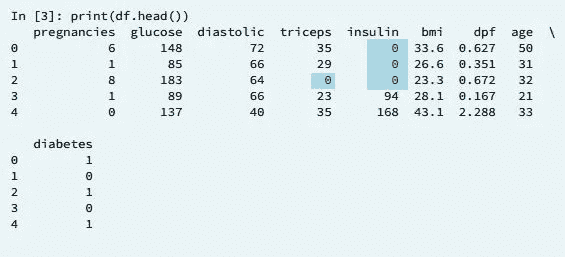
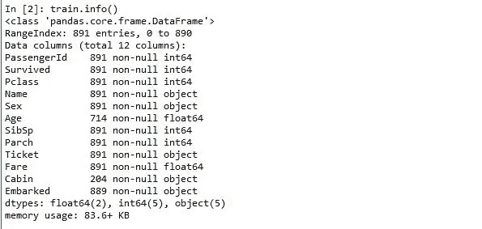
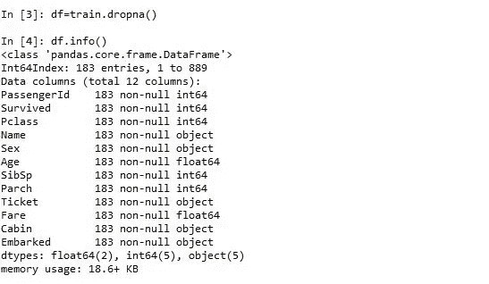

# Python 中缺失值的故事

> 原文：<https://towardsdatascience.com/the-tale-of-missing-values-in-python-c96beb0e8a9d?source=collection_archive---------1----------------------->


想象一下，买一个装有 60 个巧克力样品的巧克力盒，里面有 15 种不同的独特形状的巧克力。不幸的是，打开巧克力盒子，你会发现两块空巧克力。你能准确地找到处理丢失的巧克力块的方法吗？我们应该假装丢失的巧克力并没有丢失。？应该把巧克力盒子还给卖家吗？是否应该去买另外两块巧克力来填补缺失的部分。或者，人们可以根据以前盒子中巧克力的排列和形状的经验来预测丢失的巧克力的形状，然后购买这种预测形状的巧克力。


[http://www.alphabetastats.com](http://www.alphabetastats.com)

为了正确处理丢失的数据，数据科学家需要回答上面和其他一些令人头疼的问题。因此，这篇文章旨在阐明在我们的数据探索之旅中处理缺失值的几种方法。

现实世界中的数据很少是干净的和同质的。数据可能在数据提取或收集过程中丢失。缺少的值需要被处理，因为它们降低了我们的任何性能指标的质量。它还会导致错误的预测或分类，并且还会对所使用的任何给定模型造成高偏差。

根据数据源的不同，丢失的数据会有不同的标识。熊猫总是把缺失的值识别为 NaN。但是，除非数据经过一定程度的预处理，否则分析师会遇到 NaN 这样的缺失值。缺失值可以显示为问号(？)或零(0)或负一(-1)或空白。因此，在编写任何机器学习算法之前，数据科学家总是首先执行探索性数据分析(EDA)是非常重要的。EDA 只是理解和了解我们的数据行为的试金石。

> 探索性的数据分析永远不可能是故事的全部，但其他任何东西都不能作为基石。约翰·图基

例如，如果我们有一个数据集，该数据集应该用来根据多年的经验预测平均工资，而在我们的经验年数列中，不加选择地发现值为-1，那么我们可以将该值标记为缺失值。否则，可能我们有一个身高/体重/年龄的连续变量特征(观察变量或独立变量),我们的 EDA 显示我们某个观察值为 0 或-1 或小于 1 的值；那么人们可以断定这样的值是丢失的值。缺失值也可能为空。当被调查者或用于获取此类数据的仪器没有对此类特征进行测量时，通常会出现这种情况。



Source: DataCamp Supervised Learning Course

## **我们如何处理丢失的值**

有几种处理缺失值的方法，每种方法都有自己的优点和 CONS。然而，应该做什么的选择在很大程度上取决于我们的数据和缺失值的性质。下面是我们处理缺失值的几个选项的概要。

1.  删除缺少的值
2.  用测试统计填充缺失值
3.  用机器学习算法预测缺失值

下面是一些用 EDA 检测缺失值的命令列表。

```
data_name.info() 
```

这将告诉我们存在的非空观察的总数，包括条目的总数。一旦条目的数量不等于非空观察值的数量，我们就可以开始怀疑丢失的值。

```
data_name.describe()
```

这将显示所有观察到的要素和标签的汇总统计数据。这里最需要注意的是最小值。一旦我们在年龄/身高/体重这样的观察中看到-1/0，那么我们就能够检测出缺失的值。

```
data_name.head(x)
```

这将输出我们数据的前 x 行。看到这个会让你对 NaN/-1/0/blank/？除其他外。

```
data_name.isnull().sum()
```

这将告诉我们在 or 数据中 NaN 的总数。

如果缺少的值没有被标识为 NaN，那么我们必须首先用 NaN 转换或替换这样的非 NaN 条目。

```
data_name[‘column_name’].replace(0, np.nan, inplace= True)
```

这将在我们的 data_name 的名为 column_name 的列中用 NaN 替换零值。

## **1)删除空值或缺失值**

这是处理缺失值的最快和最容易的步骤。不过一般不建议。这种方法降低了我们模型的质量，因为它减少了样本量，因为它通过删除任何变量缺失的所有其他观察值来工作。该过程可以通过以下方式完成:

```
data_name.dropna()
```

代码片段显示了丢失值的危险。



将观察到，仅通过丢弃 NaN 值，891 个条目中的将减少到 183 个。！！！只有在缺失值很少的情况下(比如我们数据的 0.01–0.5%)，才建议使用丢弃法。百分比只是一个经验法则。

## **2)填充缺失值**

这是处理缺失值的最常见方法。在此过程中，缺失值将被测试统计数据(如缺失值所属的特定特征的平均值、中值或众数)替换。还可以指定向前填充或向后填充，以向后传播下一个值或向前传播前一个值。

*用测试统计填充缺失值*

```
#Age is a column name for our train datamean_value=train['Age'].mean()
train['Age']=train['Age'].fillna(mean_value)#this will replace all NaN values with the mean of the non null values#For Medianmeadian_value=train['Age'].median()
train['Age']=train['Age'].fillna(median_value)
```

*用测试统计填充缺失值的另一种方法是使用 sklearn.preprocessing 中的估算方法。*

```
In [1]: from sklearn.preprocessing import Imputer
In [2]: imp = Imputer(missing_values='NaN', strategy='mean', axis=0)
In [3]: imp.fit(train)
In [4]: train= imp.transform(train)
#This will look for all columns where we have NaN value and replace the NaN value with specified test statistic.#for mode we specify strategy='most_frequent'
```

*对于回填或前填，分别传播下一个或前一个值:*

```
#for back fill train.fillna(method='bfill')
#for forward-filltrain.fillna(method=''ffill)#one can also specify an axis to propagate (1 is for rows and 0 is for columns)train.fillna(method='bfill', axis=1) 
```

请注意，如果上一个或下一个值不可用，或者如果它也是一个 NaN 值，则即使在回填或前填后，NaN 仍然存在。

此外，使用平均值的缺点是平均值会受到数据中异常值的很大影响。因此，如果异常值出现在我们的数据中，那么中位数将是最好的现成工具。

## 在管道中输入测试统计数据

数据管道允许通过一系列步骤将数据从一种表示转换为另一种表示。管道允许对我们的数据应用和链接转换的中间步骤。例如，可以填充缺失值，将输出传递给交叉验证和网格搜索，然后通过一系列链接在一起的步骤来拟合模型，其中一个步骤的输出是另一个步骤的输入。

你可以在这里了解更多关于管道的信息。

这是一个管道示例，它用每一列中最常见的值来估算数据，然后拟合到逻辑回归中。

```
from sklearn.pipeline import Pipeline
from sklearn.preprocessing import Imputer
imp = Imputer(missing_values='NaN', strategy='mean', axis=0)
logreg = LogisticRegression()
steps = [('imputation', imp),('logistic_regression', logreg)]
pipeline = Pipeline(steps)
X_train, X_test, y_train, y_test = train_test_split(X, y,
                                 test_size=0.3, random_state=42)
pipeline.fit(X_train, y_train)
y_pred = pipeline.predict(X_test)
pipeline.score(X_test, y_test)
```

## 3)处理缺失数据的预测模型

这是迄今为止处理缺失数据的最好和最有效的方法之一。根据缺失数据的类别，可以使用回归模型或分类来预测缺失数据。其工作原理是将缺失的要素转换为标签本身，现在使用没有缺失值的列来预测有缺失值的列

过程是这样的:

*将缺少值的变量称为 y。*

*将数据分成有缺失值和无缺失值的集合，将缺失集合命名为 X_text，将无缺失值的集合命名为 X_train，将 y(有缺失值的变量或特征)从第二个集合中去掉，命名为 y_train。*

*使用其中一种分类方法预测 y_pred。*

*添加到 X_test 作为你的 y_test 列。然后将集合组合在一起。*

对于机器学习的初学者或新手来说，这种方法似乎更困难。这种方法的唯一缺点是，如果缺失数据的属性与数据集中的其他属性之间没有相关性，那么模型在预测缺失值时会有偏差。

## 用断言结束

除了如上所述使用 isnull()检查缺失值之外，还可以使用 assert 以编程方式检查是否存在缺失或意外的“0”值。这让人确信代码运行正常。

可以在 assert 上执行以下和其他一些布尔运算。如果 Assert 语句为真，assert 将返回 nothing，如果语句为假，将返回 AssertionError。

```
#fill null values with 0df=train.fillna(value=0)#assert that there are no missing valuesassert pd.notnull(df).all().all()#or for a particular column in dfassert df.column_name.notall().all()#assert all values are greater than 0assert (df >=0).all().all()#assert no entry in a column is equal to 0assert (df['column_name']!=0).all().all()
```

总之，处理缺失值的方法在很大程度上取决于此类数据的性质。因此，您处理的不同类型的数据越多，您对不同数据类的不同解决方案的体验就越好。

感谢您的阅读，请留下您的评论，不要忘记分享。

页（page 的缩写）请关注我的下一篇文章，讨论处理分类变量的各种选择

*   *所有图片均来自网络**