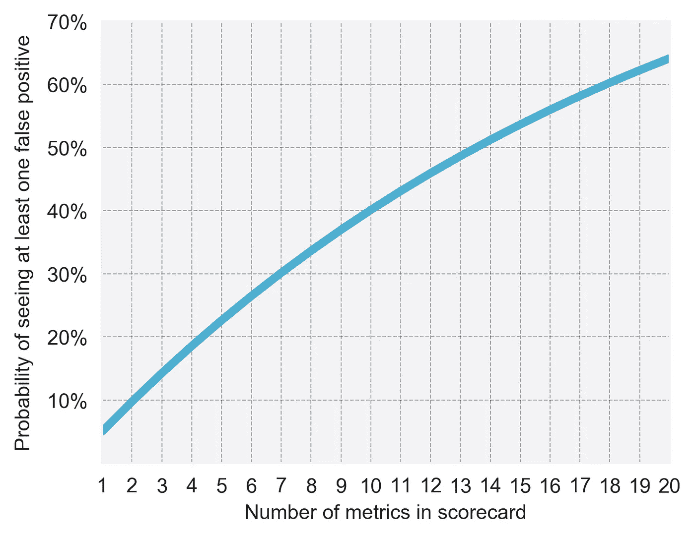

# 实验的第三个幽灵:多重比较

> 原文：<https://towardsdatascience.com/the-third-ghost-of-experimentation-multiple-comparisons-65af360169a1?source=collection_archive---------10----------------------->

利齐·艾德利，汤姆·奥利弗和科林·麦克法兰

👻这篇文章是探索实验从业者中导致[追逐统计幽灵](https://medium.com/@SkyscannerCodevoyagers/chasing-statistical-ghosts-in-experimentation-3f393323a1c1)的常见误解系列文章的一部分。

当进行一项实验时，我们通常希望尽可能多的学习，所以看许多不同的东西来获得最大的洞察力是很有诱惑力的。不幸的是，这是有代价的——你做的比较越多，发现假阳性的几率就越高。

在 Skyscanner，我们使用实验记分卡，该记分卡显示每个实验的一组默认业务水平指标的结果。我们发现使用记分卡有很多好处，例如:

*   确保不遗漏任何重要影响
*   作为一个组织，认同我们的优化目标，并关注重要的指标
*   大规模交付值得信赖的结果和标准化分析

然而，在没有意识到多重比较问题的情况下使用这种记分卡可能会让我们陷入追逐统计幽灵的危险之中。

我们永远无法完全确定一个结果，因为在任何实验中都有随机和噪音的因素——总有一些机会，一个结果会*显得*有意义，即使现实是不存在真正的影响。这种情况发生的频率称为“假阳性率”。

在 Skyscanner，我们在实验中使用相当符合行业标准的 95%置信水平，因此我们预计单一指标的误报率为 5%*。然而，一旦您查看一个以上的指标，您就增加了看到假阳性的机会。简单来说，你做的每一次比较都有可能出现假阳性，所以**更多的比较意味着更多的假阳性**。*

左边的图表显示，对于没有实际影响的实验(如 AA 测试),尽管如此,*看起来*对至少一个指标有显著影响的概率，作为记分卡中有多少指标的函数。在 Skyscanner，我们的实验记分卡中有 14 个指标，因此我们在任何一个实验中出现一个或多个假阳性的可能性略高于 50%。

如果您的实验正在测试多种不同的处理方法(也称为多变量或 ABn 测试),或者如果您查看细分为多个部分的单个指标的结果，您也会受到这种夸大的假阳性率的影响。例如，如果你要观察一项实验如何改变 20 个不同国家中每一个国家的一个指标，你会发现至少有一个国家在 60%的时间里受到显著影响，即使你的实验没有任何实际效果。如果你没有意识到可能性的变化，并且没有对幽灵进行补偿，这可能是相当危险的。

# 多重比较校正

幸运的是，有许多统计方法可以用来缓解多重测试问题，避免追逐统计幽灵。这些通常涉及到调整显著性阈值，以便将一个效应归类为显著性所需的 p 值取决于您的测试正在进行的比较次数(还记得本系列的第一个幽灵讨论了如何解释 p 值)。

最常用的方法之一是 Bonferroni 校正，这是一种简单的显著性阈值，α，乘以被测试的假设数 n，即

α → α / n。

例如，如果您希望在运行 AB 测试并查看 5 个不同的指标时保持 95%的置信水平，您可以将 p 值阈值从α=0.05 调整到

α → α / 5 = 0.05/5 = 0.01 .

当用 5 种不同的处理方法运行多元测试并且只查看一个指标时，您可以使用类似的方法，因为两种情况都涉及 5 个比较。

Bonferroni 校正控制家族误差率(FWER ),即一个或多个指标在实际上没有真正影响时显得重要的概率。在上面查看一个 AB 测试的 5 个指标的例子中，5%的 FWER 意味着，在没有实际变化的情况下，您将看到 5 个指标中的一个(或多个)在最多 5%的时间里是重要的。如果没有 Bonferroni 校正，这个数字将接近 25%。

Bonferroni 通常被认为是一种保守的修正，因为它确保 FWER 最多为*α，但是，如果测试统计数据之间存在任何相关性或依赖性，那么应用 Bonferroni 可能会过于严格，导致实际 FWER 远小于预期值。虽然低于预期的错误率听起来像是一件好事，但缺点是这意味着实验的功效被降低了超过必要的程度，并且没有达到假阳性和假 T4 阴性之间的预期平衡。*

# 我们如何在 Skyscanner 解决这个问题

## 应用更正

在 Skyscanner，我们记分卡中的许多指标应该是高度相关的。例如，预订的旅行者的比例将与离开航空公司的旅行者的比例相关联，这本身将与进行搜索的旅行者的比例相关联。为此，我们主要使用一种不同的、不太严格的校正方法，称为 Benjamini-Hochberg 法，而不是上面讨论的 Bonferroni 校正法。

Benjamini-Hochberg 与 Bonferroni 的不同之处在于，它限制了错误发现率(FDR ),而不是 FWER。如果我们把每一个被认为具有统计学意义的测量看作一个发现，那么 FDR 就是这些发现中错误的那一部分(只是噪声，而不是真正的影响)。FWER 和 FDR 之间的细微差别在于，FWER 控制有一个或多个错误发现的实验的比例，而 FDR 控制所有错误发现的比例。

Benjamini-Hochberg 在 Skyscanner 为我们工作，作为一种限制大量假阳性的方法，而不会像 Bonferroni 校正那样遭受巨大的功率降低。然而，“最佳”解决方案是相当主观的，并且将取决于假阳性(不够严格的校正)和假阴性(由于功率损失)的相对成本。

因此，如果您像我们一样，希望测量对许多不同指标的影响，那么 p 值校正可能是一种有用的方法，可以避免虚高的假阳性率，同时仍然可以从各种指标中学习。

## 预先注册感兴趣的主要指标

我们认为，一项实验应该基于一个明确且可测试的假设，应该主要针对一个特定的指标，并且应该通过在开始实验之前做出决定来“预先注册”。

因此，我们要求实验者预先说明他们感兴趣的主要度量——这个度量将被区别对待，其重要性不取决于上面提到的 Benjamini-Hochberg 校正。但是，如果实验是多变量(ABn)测试，那么我们会使用校正来调整感兴趣指标的 p 值阈值。在这种情况下，Bonferroni 比 Benjamini Hochberg 具有优势，因为它允许简单的功率分析。

知道非主要指标是否受到影响仍然很重要，但我们认为这更多的是对非预期后果的一种支持，或者是对启发未来迭代和新假设的学习的一种支持。如果您确实看到意外指标的影响，那么..

## 用更新的假设重新运行实验

我们鼓励实验者根据他们预先注册的感兴趣的指标来总结和评估实验——如果实验显示某个指标发生了重大变化，而该指标并未构成原始假设的一部分，那么最安全的做法是调用 ghost 并重新运行，这一次将意外的变化作为目标指标。如果您发现某个特定的用户子集或部分用户受到显著影响，这一点同样适用。在你确信这些影响确实存在之前，不要试图去推理你会如何造成这些影响。

👻更:[追统计鬼](https://medium.com/@SkyscannerCodevoyagers/chasing-statistical-ghosts-in-experimentation-3f393323a1c1)。

T[ake a look at our Product and Engineering jobs.](http://9nl.es/ghost1_prodengjobs)