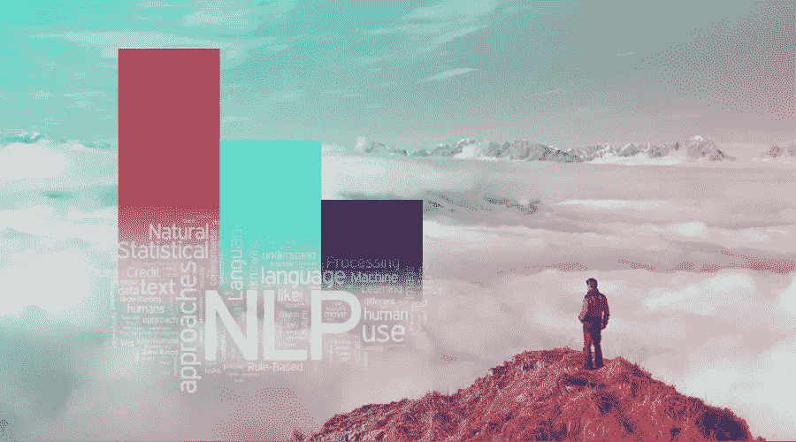

# 自然语言处理的三个层次

> 原文：<https://towardsdatascience.com/the-three-levels-of-natural-language-processing-for-your-business-6d91ba62f11a?source=collection_archive---------15----------------------->

*作者:迦娜·利彭科娃*

在过去的几年里，技术世界已经见证了自然语言处理(NLP)应用在各个领域的激增，包括广告技术、出版、客户服务和市场情报。根据 Gartner 的炒作周期，NLP 在 2018 年已经达到了膨胀预期的顶峰。许多企业将其视为从 80%的非结构化形式的业务相关数据中创造价值的“首选”解决方案。简而言之，NLP 被广泛采用，并取得了巨大的成功。

在这篇文章中，我分享了一些将 NLP 顺利集成到您的技术堆栈中的实用建议。这个建议总结了我在 NLP 的旅程中积累的经验——通过学术界、许多行业项目和我自己的公司，该公司为国际市场情报开发 NLP 驱动的应用程序。这篇文章没有提供技术细节，但重点放在组织因素，包括招聘，沟通和期望管理。

在开始学习 NLP 之前，您应该思考两个问题:

# 1.独特的 NLP 组件对我们公司的核心业务是否至关重要？

*举例:假设你是一家托管公司。您希望通过使用 NLP 分析收到的客户请求来优化您的客户服务。最有可能的是，这种增强不会成为你的关键路径活动的一部分。相比之下，定向广告业务应该努力确保自己不会落后于 NLP——这可能会大大削弱其竞争地位。*

# 2.我们内部有能力开发与知识产权相关的自然语言处理技术吗？

*例如:你雇佣了一名计算语言学博士，并成功地将他与设计新解决方案的自由结合起来。她可能会被激励去丰富你公司的知识产权组合。然而，如果你雇佣的是中级数据科学家，他们没有明确的语言重点，需要在数据科学和工程任务之间分配时间，就不要指望有独特的知识产权贡献。最有可能的是，由于缺乏时间和对底层细节的掌握，他们将依靠现成的算法。*

提示 1 :如果你的答案是“是”和“不是”，你就有麻烦了！你最好确定与你的核心竞争力相匹配的技术优势。

提示 2:如果你的答案是“是”和“是”——停止阅读，开始工作。您的 NLP 路线图应该已经由您的专家定义，以实现特定于业务的目标。

如果你还在那里，不要担心——剩下的很快就会到位。您可以在三个级别“进行 NLP”:

1.  **黑带水平**，深入数学和语言的微妙之处
2.  **培训&调优级别**，主要是插入现有的 NLP/ML 库
3.  **黑盒级**，靠“买”第三方 NLP

# 黑带级别

来细说一下:第一个，基础层面就是我们的“黑带”。这个层次接近于计算语言学，NLP 的学术对应物。这里的人们经常分成两个阵营——数学家和语言学家。这两个阵营可能会友好相处，但心态和做事方式仍会不同。

数学界的人并不害怕矩阵计算之类的东西，他们会致力于最新的优化和评估方法的细节。冒着遗漏语言细节的风险，他们通常会带头提高算法的召回率。语言学家要么是在高度复杂的生成语法或基于限制的语法形式主义中长大的，要么是在认知语法等替代框架中长大的。这些给了想象更多的空间，但也允许形式上的模糊。他们将倾向于编写句法和语义规则，并编译词典，通常需要自己的沙箱，并负责精确的部分。取决于你如何处理两个阵营之间的沟通和整合，他们的合作要么阻碍生产力，要么开启令人兴奋的机会。

总的来说，如果你能在学术完美主义中注入一剂实用主义，你就能创造出独特的竞争优势。如果你能在你的团队中有效地结合数学家和语言学家——那就更好了！但是要意识到，你必须以诚实的眼光去推销它们——然后，坚持到底。对你的团队来说，做艰苦的基础工作而看不到它对业务的影响将会是令人沮丧和没有动力的经历。

# 培训和调整级别

第二个层次涉及使用现有算法训练和调整模型。在实践中，大部分时间将用于数据准备、训练数据创建和特征工程。核心任务——培训和调优——不需要太多努力。在这一级别，您的员工将是推动 nltk、scikit-learn、spacy 和 tensorflow 等开源包边界的数据科学家，用于 NLP 和/或机器学习。他们将发明新的、并不总是在学术上合理的方法来扩展训练数据、工程特性，并将他们的直觉应用于表面调整。目标是训练充分理解的算法，如 NER、分类和情感分析，为您公司的特定数据定制。

这里好的一面是有很多优秀的开源包。它们中的大多数仍然会给你留下足够的灵活性来优化它们以适合你的特定用例。风险在人力资源一方——许多道路通向数据科学。数据科学家通常是自学的，并且具有相当跨学科的背景。因此，他们并不总是具有一级科学家天生的学术严谨性。随着最后期限或预算的收紧，您的团队可能会在培训和评估方法上放松，从而积累了大量的技术债务。

# 黑盒水平

第三层是一个“黑盒”,你可以在那里购买 NLP。您的开发人员将主要使用付费的 API，这些 API 提供现成的标准算法输出，如 Rosette、Semantria 和 Bitext(参见[本帖](https://medium.com/@boab.dale/text-analytics-apis-part-1-the-bigger-players-3ce8a93577bd)对现有 API 的广泛回顾)。理想情况下，您的数据科学家将与业务分析师或主题专家一起工作。例如，如果你在做竞争情报，你的商业分析师将会设计一个包含你的竞争对手，他们的技术和产品的模型。

在黑盒级别，确保您只从黑带购买 NLP！有了这个保证，外包 NLP 的一个明显的优势就是你避免了稀释你的技术焦点的风险。风险在于缺乏灵活性——随着时间的推移，您的需求会越来越具体。您的集成策略越好，您的 API 停止满足您的需求的风险就越高。投资于手工质量保证以确保 API 输出交付高质量也是明智的。

# 最后的想法

那么，你从哪里开始呢？当然，这取决于——一些实用的建议:

*   和你的技术人员谈谈你的商业目标。让他们研究和制作原型，从第 2 级或第 3 级开始。
*   确保你的团队不会过早地陷入 1 级的低级细节。这可能会导致时间和预算上的重大失误，因为需要大量的知识和培训。
*   不要犹豫——你总是可以考虑在 2 和 3 之间的过渡(顺便说一下，这在任何方向都有效)。这种转换可以有效地与通常不可避免的系统重构相结合。
*   如果你设法用 NLP 建立一个令人信服的商业案例——欢迎加入俱乐部，你可以用它来吸引一流的专家，并通过在第 1 级工作来增加你的独特性！

*关于作者:迦娜·利彭科娃拥有计算语言学博士学位，是国际市场情报技术解决方案提供商*[*【Anacode】*](http://www.anacode.de/)*的首席执行官。点击* *了解更多我们的解决方案* [*。*](http://anacode.de/products/)

*原载于 2018 年 11 月 15 日*[*anacode . de*](http://anacode.de/three-levels-of-natural-language-processing-for-your-business/)*。*