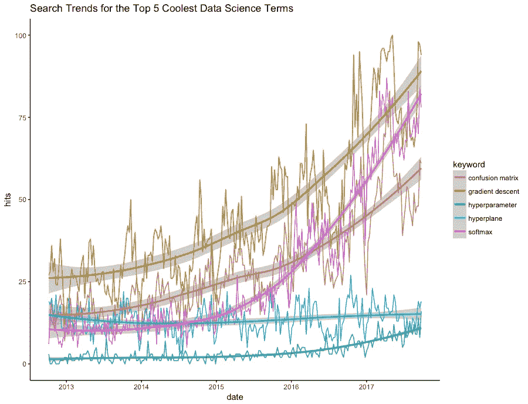

# 前 25 个最酷的数据科学术语

> 原文：<https://towardsdatascience.com/the-top-25-coolest-data-science-terms-1b458f1aafc8?source=collection_archive---------3----------------------->

Source: Library of Congress

## 机器学习。

## 神经网络。

## 分层聚类。

有人知道这些术语的真正含义吗？当然，少数书呆子知道。像大概 [5 万排名的 Kaggle 成员](https://www.kaggle.com/rankings)。

但是这些深奥的术语仅仅触及了世界上的数据科学家们想出的描述、促进并最终混淆他们日常工作的表面。

我们认为有必要对数据科学中一些最好的、但不太为人所知的术语进行分类，并根据它们听起来有多酷进行排序。

**1。** [**超平面**](http://buff.ly/2vVDgGO)

**2。** [**超参数**](http://buff.ly/2fI2Vw0)

**3。** [**渐变下降**](http://buff.ly/2vUHwpZ)

**4。** [**混乱矩阵**](http://buff.ly/2vVdnqw)

**5。** [**Softmax**](https://t.co/1uvVvxhGXF)

**6。** [**蒙特卡洛模拟**](https://buff.ly/2wOr2Pr)

**7。** [**多臂土匪**](https://buff.ly/2xC2i0t)

**8。****维度的诅咒**

****9。** [**朴素贝叶斯**](https://buff.ly/2xsfJko)**

****10。** [**最大汇集**](https://buff.ly/2wRPLCK)**

****11。** [**交叉熵损失**](http://buff.ly/2u46N3s)**

****12。** [**质心**](https://buff.ly/2vscE1y)**

****13。** [**轴突**](http://buff.ly/2vZCA5t)**

****14。** [**层次聚类**](https://buff.ly/2xBSHGW)**

**15。 [**警帽**](http://buff.ly/2eZ0kQJ)**

****16。** [**树形图**](http://buff.ly/2uKt1X1)**

****17。** [**纪元**](https://buff.ly/2xBBQE0)**

**18。 [**K 折交叉验证**](http://buff.ly/2vwjth6)**

**19。 [**内核绝招**](http://buff.ly/2udRh1Z)**

**20。 [**隐藏图层**](https://buff.ly/2hkq4oj)**

****21。** [**整流功能**](http://buff.ly/2hksHX8)**

****22。** [**人工神经元**](http://buff.ly/2tTFBo6)**

****23。****

******24。** [**自举**](http://buff.ly/2fohb0a)****

******25。** [**拉索**](http://buff.ly/2iOfutP)****

****想要更多吗？我们不能说所有这些术语听起来都很酷，但是 KDNuggets 已经收集了一个相当确定的 277 个数据科学术语的词汇表，并附有参考资料和偶尔出现的图片。****

****我们试图在[演绎 Twitter feed](https://twitter.com/DeduciveLogic) 中发布一个酷炫术语的运行列表。****

# ****关于方法论的一点注记****

****我们的排名是基于一个非常不科学的过程，包括观点、争论和幻想。然而，可以肯定地说，这些术语中有许多正迅速流行起来。****

****我们用下面的 gtrendsR 包绘制了谷歌搜索趋势的前五名。****

********

*****最初发表于*[*【www.deducive.com】*](https://www.deducive.com/blog/2017/9/26/the-top-25-coolest-data-science-terms)*。*****