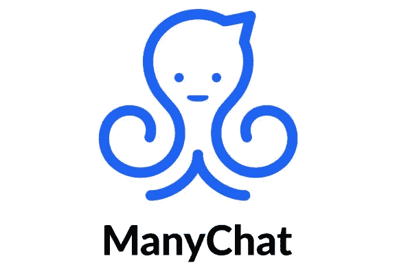
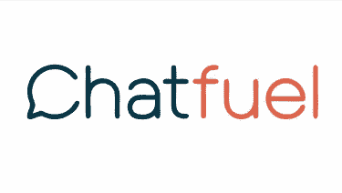
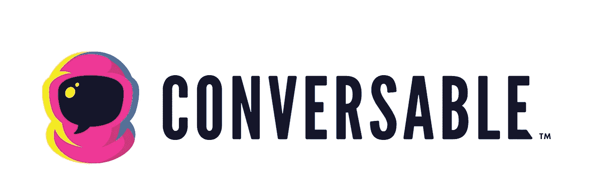
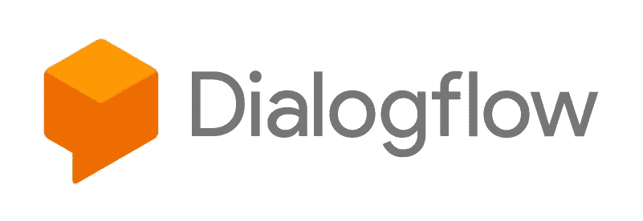
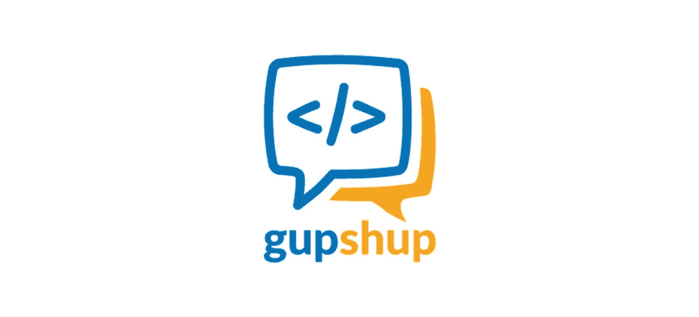

# 五大最佳聊天机器人和自然语言处理工具，为您的企业构建人工智能

> 原文：<https://towardsdatascience.com/the-top-5-best-chatbot-and-natural-language-processing-to-build-ai-for-your-business-3efea313d8db?source=collection_archive---------1----------------------->

credit: pexels.com

人工智能社区仍然非常年轻，但已经有大量优秀的机器人平台。似乎每天都有新的人工智能功能由人工智能开发者或机器人平台本身推出。

对于许多企业主来说，选择哪个平台最适合他们的业务可能是一件非常困难的事情。

我创建了一个列表，列出了过去几个月我一直在使用的我个人最喜欢的 5 大聊天机器人和自然语言处理(NLP)工具。

每个平台都有其独特的功能，每个平台都有特定的定位，所以本文不对平台本身进行判断。

这只是我个人的观点，哪个平台最适合不同类型的企业(小，中，大)和不同的编码技能(新手，基础知识，高级知识)。

credit: manychat.com

# [ManyChat](https://manychat.com/)

几个月前，ManyChat 似乎将成为 2016 年初推出的十几个机器人平台之间的人工智能竞赛的赢家。许多聊天用户友好的工具加上为用户设计的伟大的用户界面 UX 确实吸引了许多机器人企业家。

[ManyChat](https://manychat.com/) 对于没有任何编码技能的人来说是一个很好的平台。It 主要市场是没有编码技能或编码技能有限的数字营销专家。

然而，如果你的企业想要灵活的人工智能应用，这不是一条路要走。

优点:用户友好，免费计划，伟大的营销工具

缺点:缺乏定制编码的灵活性，缺乏社区资源

网址: [ManyChat](https://manychat.com/)

评分:⭐⭐⭐

credit: chatfuel.com

# [聊天燃料](https://chatfuel.com/)

我第一次对人工智能应用感兴趣是通过观看[Andre Demeter](https://www.udemy.com/user/andrew-demeter/)Udemy chat fuel class。我记得那时候 [Chatfuel 社区](http://Chatfuel Community)在 2017 年 8 月还没有创建。安德鲁的 Chatfuel 类是当时最有价值的人工智能类，可以用来学习用 Chatfuel 开始编写机器人代码。

Chatfuel 现在是聊天机器人平台的头号领导者，他们理应获得这一荣誉，因为他们工作非常努力，他们有出色的版主回答所有 [Chatfuel 社区](https://www.facebook.com/groups/chatfuel/)脸书小组的问题。

然而， [Chatfuel](https://chatfuel.com/) 最大的优势是它在用户友好的解决方案和高级定制编码之间的平衡，而高级定制编码是最缺乏的。

如果你正在犹豫是使用 ManyChat 还是 Chatfuel，问自己以下问题:

未来我的商业 Ai 解决方案需要定制吗？如果答案是肯定的，使用[聊天燃料](https://chatfuel.com/)，如果答案是否定的，选择[多人聊天](https://manychat.com/)。

优点:用户友好，自定义编码的灵活性，来自社区的支持，对第三方插件开放，不需要编码经验

缺点:与对话渠道的整合有限，缺乏营销工具

网址:[聊天燃料](https://chatfuel.com/)

评分:⭐⭐⭐⭐

# [可交谈的](http://conversable.com/)

credit: conversable.com

凭借百威啤酒、漫威、必胜客和 TGI 星期五等客户，Conversable 肯定是人工智能领域的领跑者。如 Conversable 网站所述:

“Conversable 是企业级软件即服务(SaaS)平台，用于跨多个平台设计、构建和分发人工智能增强的消息和语音体验，包括 Facebook Messenger、Twitter、SMS、Amazon Echo、Google Home 和许多其他平台。''

这无疑是对这种对话即服务(CaaS)能够提供的内容的令人印象深刻的描述。然而，如果你是一家中小型公司的老板，这并不适合你，因为这家位于德克萨斯州奥斯汀的初创公司主要为财富 500 强公司发展。

不过，如果你在其中一家公司工作，知道已经有一家初创公司在企业市场取得了巨大成功是件好事。

优点:整合对话渠道，大公司的最佳平台

缺点:对用户不友好，没有适合中小型企业的解决方案

网址:[可交谈的](http://conversable.com/)

评分:⭐⭐⭐⭐

# [Dialogflow(谷歌助手)](https://dialogflow.com/)

credit: dialogflow.com

没有人会对我和 [Dialogflow](https://dialogflow.com/) 的个人爱情故事感到惊讶。也就是说，我将在我的 opinion[dialog flow](https://dialogflow.com/)中向你解释为什么它现在是世界上所有类型企业的头号人工智能和自然语言处理平台。

通过将语音和文本人工智能应用集成到谷歌助手、亚马逊 Alexa 和微软 Cortana，你可以为你的客户构建几乎任何类型的人工智能应用，这些应用将能够与他们的手机或谷歌 Home 或亚马逊 Alexa 物联网(IoT)生态系统进行交互。

Dialogflow 不仅集成了所有这些支持语音识别的出色平台，还集成了 Facebook Messenger、Twitter、Slack、Telegram、Twilio(文本消息)和 Skype 等文本功能。

这意味着 [Dialogflow](https://dialogflow.com/) 对您的业务需求非常灵活，因此您的人工智能代理将能够随着您的业务需求以及未来几年将推出的人工智能应用升级而发展。

优点:最先进的 NLP，与对话渠道的整合，免费计划，可输出代理

缺点:可用语言的数量

网址:[对话流](https://dialogflow.com/)

评分:⭐⭐⭐⭐⭐

# [GupShup](https://www.gupshup.io/developer/home)

老实说，我没有花太多时间探索 [GupShup](https://www.gupshup.io/developer/home) ，但它似乎真的很有前途，它有类似的集成，这意味着它的生态系统将能够随着人工智能和机器学习的升级而发展。

GupShup 还有一个令人印象深刻的 SMS、语音、文本、NLP APIs 库

优点:与对话渠道的集成，免费计划，API 库

缺点:用户不友好，仪表板用户界面/UX 设计

网址: [GupShup](https://www.gupshup.io/developer/home)

评分:⭐⭐⭐⭐

正如我在本文开始时提到的，所有这些人工智能开发平台都有它们的利基、优点和缺点。

我希望这篇文章能帮助您选择合适的平台，满足您的业务需求。如果你仍然不确定你想选择哪一个，你可以随时来和我谈论脸书，我会回答你的问题。

## 相关文章:[发现为什么语音 Ai 在 2018 年称霸](https://medium.com/@carldombrowski/5-reasons-why-voice-ai-will-dominate-in-2018-47f2249c252a)

如果你喜欢这篇文章，请给几个掌声，媒体作者“喜欢”的主要来源被称为掌声，你可以给 1，2，3 到 50 个掌声！👏👏👏👏👏在介质上。