# 最受关注的前 50 名 Instagrammers，可视化

> 原文：<https://towardsdatascience.com/the-top-50-most-followed-instagrammers-visualized-134ca4788938?source=collection_archive---------7----------------------->

我是 Greg Rafferty，湾区的数据科学家和摄影爱好者。你可以在我的 [Tableau 公共档案](https://public.tableau.com/profile/greg4084#!/)上查看这个项目的完整 Tableau 仪表盘。还有看看我的 insta gram[@ greggrafferty](https://www.instagram.com/gregrafferty/)！如有任何问题或反馈，请随时联系我！

2017 年夏天，我为 [Tableau](https://www.tableau.com/) 编写了一个 [Web 数据连接器](https://tableau.github.io/webdataconnector/)，它连接到 Instagram 的公共内容 API，允许我从任何公开发布的帖子中下载数据。很自然的，我先建了一个 Tableau 仪表盘来分析我自己的 Instagram 账号(去关注我[@ greggrafferty](https://www.instagram.com/gregrafferty/)！)然后转而查看其他几个我认为可能有趣的账户，并从他们的数据中构建了迷人的 Tableau 仪表盘。为 [@natgeo](https://www.instagram.com/natgeo/?hl=en) 查看[这个](https://public.tableau.com/profile/greg4084#!/vizhome/NationalGeographiconInstagram/Storyboard)(这似乎表明 2016 年 8 月期间有猫腻！)，或者[这个](https://public.tableau.com/profile/greg4084#!/vizhome/realdonaldtrump/Storyboard)代表 [@realdonaldtrump](https://www.instagram.com/realdonaldtrump/?hl=en) ，或者[这个](https://public.tableau.com/profile/greg4084#!/vizhome/SolarEclipse_3/Eclipse2017)代表标签#eclipse2017，它清楚地显示了 2017 年 8 月 30 日日食穿越美国的路径:

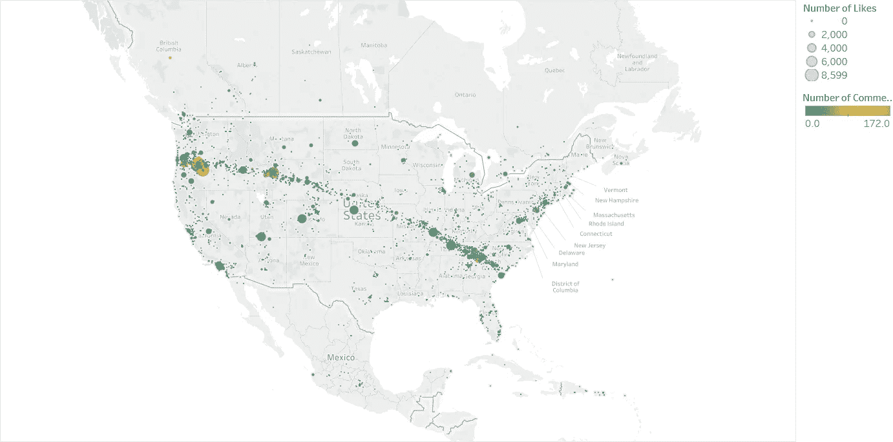

Cool map, huh? Each point represents a single Instagram post with the hashtag #eclipse2017, posted during the 30 days followed the August 30th event.

不幸的是，Instagram 最近大幅降低了这一 API 的呼叫率限制，并将很快完全取消这一 API，因此我将退出我的 Web 数据连接器，并想分享一些我通过查看 Instagram 前 50 名最受关注用户的合并帖子(所有数据截至 2017 年 9 月)发现的见解。

单击下面打开交互式仪表板。

 [## Tableau 公共

### 格雷格·拉弗蒂在 Instagram 上关注最多的前 50 名用户

public.tableau.com](https://public.tableau.com/profile/greg4084#!/vizhome/50MostFollowedInstagramUsers/Whoarethe50MostFollowedInstagrammers) 

首先，这些 Instagrammers 是什么人？以下是他们，按关注人数排序:

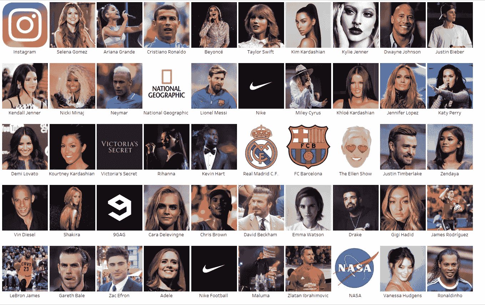

关于数据集的一些基本统计数据:

*   他们所有追随者的总和高达 3，070，353，066 个用户。然而，这个数字大得令人误解，因为如果我同时关注 [@instagram](https://www.instagram.com/instagram/) 和[@碧昂斯](https://www.instagram.com/beyonce/)，我会被计算两次。尽管如此，这仍然是一个很大的数字。
*   该数据集中的职位总数为 157，944 个。
*   总赞数 65669459900，总评论数 1345709525！
*   大多数用户没有在他们的照片上标记地理位置，即使有，他们也没有始终如一地这样做；总共标记了 2903 个独特的位置。

那么这些用户各有多少关注者呢？

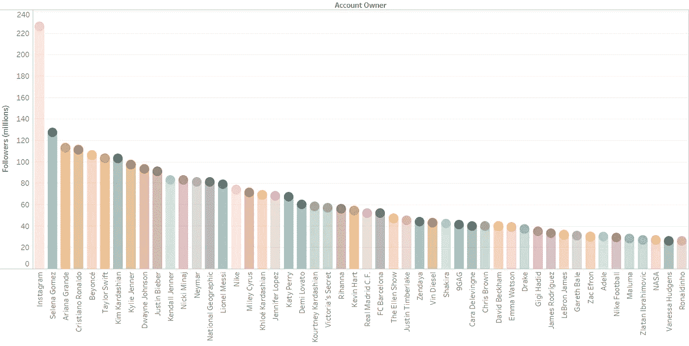

Number of followers per user

Instagram 自己的账户是目前的领导者，这是意料之中的，因为它总是任何新用户注册的第一个建议关注的对象。

任何在社交网络上呆过一段时间的人都知道，一些用户把所有的时间都放在了网上，而另一些人则不那么频繁。在这前 50 名 Instagrammers 中，谁发的帖子最多？

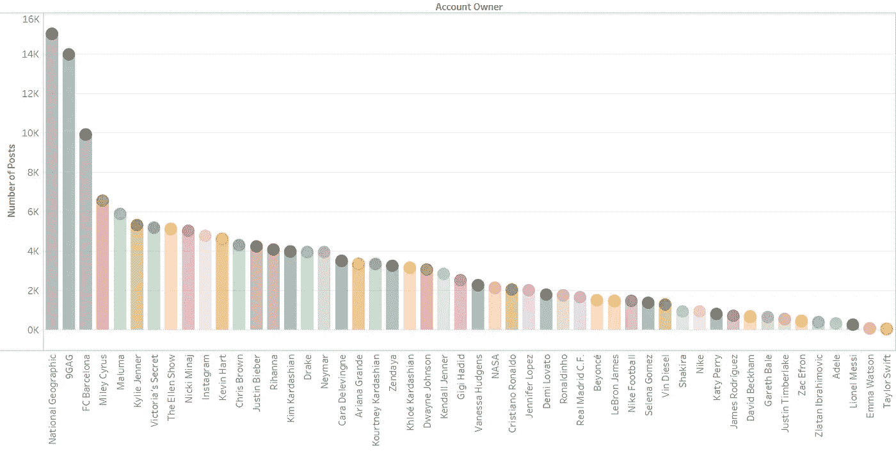

Total number of posts per user

国家地理一天贴几次，9GAG 也是。最极端的是泰勒·斯威夫特和艾玛·沃森。

让我们看看所有这些账户的年龄，因为帖子的总数并不能说明全部情况。

卡拉·迪瓦伊是最长的，紧随其后的是“维多利亚的秘密”。他们中的一些人确实是 Instagram 的相对新人，因此理所当然地只有几篇帖子；然而泰勒·斯威夫特一直存在，对吗？原来，2017 年 8 月，她[删除了她所有的 Instagram 内容](https://www.harpersbazaar.com/celebrity/latest/a12030908/taylor-swift-deletes-instagram-photos/)，本质上是重新开始，作为公关噱头的一部分，以[宣布她的名誉专辑](https://www.billboard.com/articles/columns/pop/7941019/taylor-swift-reputation-new-album)。你可以在底部看到泰勒·斯威夫特，从八月份开始，她重新开始了她的账户。阿黛尔拥有下一个最年轻的帐户，其次是大卫贝克汉姆和艾玛沃森。

这些用户是谁？他们是做什么的？

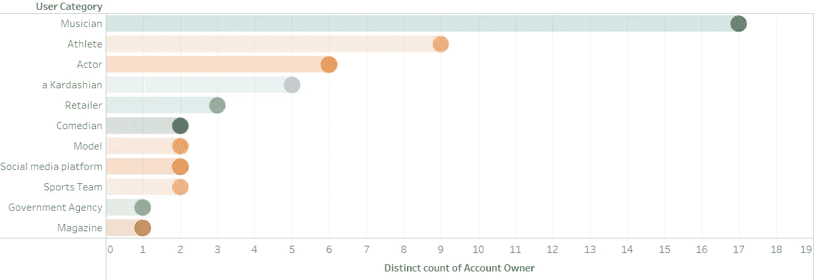

事实证明，他们大多数是音乐家。运动员排第二。前 50 名中的 5 个，或者总数的 10%(whaaat？！？！)，是卡戴珊/詹纳名人家族的成员(金，肯德尔，凯莉，考特尼和 Khloe，对于那些真正关心的人)。

好吧，但是哪些群体最受欢迎呢？

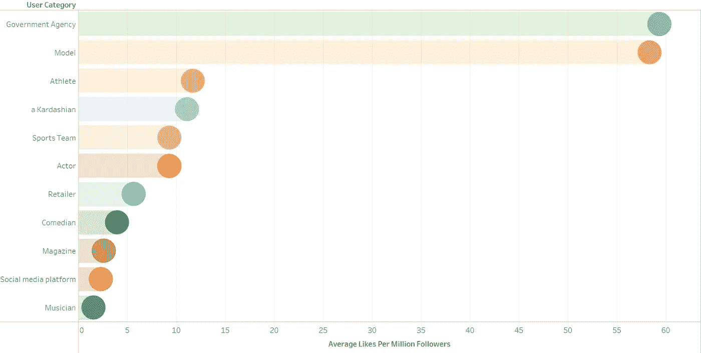

也许不出所料，非常漂亮的年轻模特的照片平均每个粉丝都有很多赞。但是有一个团体得到了更多，而这个团体只有一个用户……NASA！科学万岁！

如果我们看一下个人账户，现在谁得到了每个关注者最多的喜欢呢？

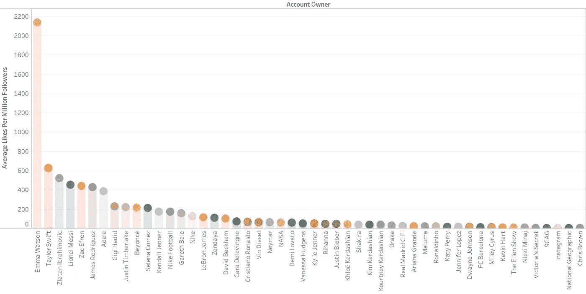

可怜的克瑞丝·布朗在那边。似乎很多人只是讨厌关注他，但从不喜欢他的帖子。艾玛·沃特森，真是个明星。作为第二高的用户，她平均每个关注者的点赞数是第三高的 4 倍！虽然她的叙述有些独特，因为它相对年轻，与其他相比照片很少，所以我们可以考虑把它作为一个离群值扔掉。你会注意到泰勒·斯威夫特是亚军，她获得了数百万的追随者，然后删除了所有旧的(大概是不太喜欢的)照片，这有效地提高了她的平均得分。

不过，还有最后一个问题需要回答。如果你是一个名人，你想获得尽可能多的赞，你应该什么时候发帖？

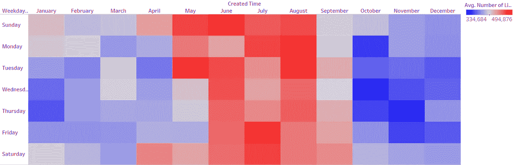

Average number of likes by day and month

似乎夏季是最好的！本周早些时候往往会做得好一点。绝对不要在初冬的周中宣布重大消息；那时没有人喜欢任何东西。

这些名人是从哪里发帖的？似乎全世界都是如此(很大程度上要感谢国家地理杂志，它的帖子是紫色的点)。

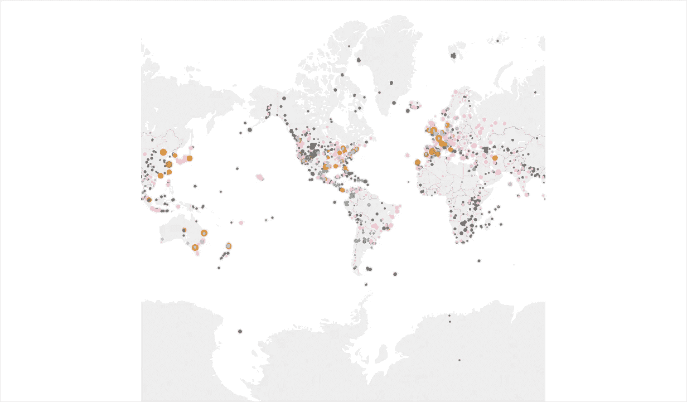

Each individual geo-tagged post

最后，这里有一个看起来很酷的图表。如果你想更深入地了解和探索这一点，我鼓励你查看一下[交互式仪表盘](https://public.tableau.com/profile/greg4084#!/vizhome/50MostFollowedInstagramUsers/Whoarethe50MostFollowedInstagrammers)。它显示了这些年来每个用户对每篇帖子的点赞增长情况。点代表每个帖子，线代表点赞数的移动平均值。这些颜色代表每个用户。

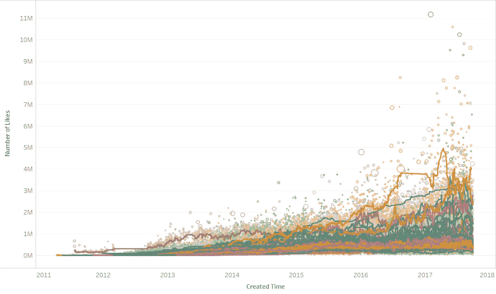

Number of likes per post, per user, by date posted

我注意到的一个有趣的现象是，当赛琳娜·戈麦斯和贾斯汀比伯在[公开分手](https://www.vogue.com/article/justin-bieber-selena-gomez-relationship-timeline)时，他们都发布了一些关于对方的非常肮脏的事情。但当他们复合时，作为真爱的象征，我敢肯定，他们检查了他们的 Instagram 账户，删除了所有从 2016 年底到 2017 年初的那些讨厌的帖子。多浪漫啊！看看岗位差距。

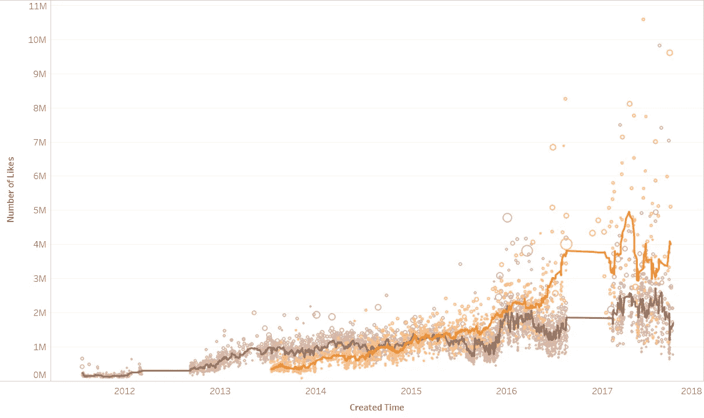

Purple for Bieber, Orange for Gomez

最后，以下是数据集中一些比较重要的帖子:

最早的帖子来自最受关注的前 50 名用户之一，作者是卡拉·迪瓦伊:

First post, by Cara Delevingne

这是该平台有史以来最受欢迎的帖子(至少截至 2017 年 9 月)，作者是碧昂斯:

Most liked post ever, by Beyonce

下面是第二个最受欢迎的帖子，也是碧昂斯发的:

Second Most Liked Post Ever, by Beyonce

有史以来第三受欢迎的帖子，作者是赛琳娜·戈麦斯:

Third most liked post ever, by Selena Gomez

第四个最受欢迎的帖子是克里斯蒂亚诺·罗纳尔多写的:

Fourth most liked post ever, by Cristiano Ronaldo

最受欢迎的帖子被上面的三个语法所控制；下一个上榜的用户是爱莉安娜·格兰德，以下是她最受欢迎的帖子:

Most liked post by Ariana Grande

以下是艾玛·沃森最喜欢的帖子:

Most liked post by Emma Watson

还有莱昂内尔·梅西的:

Most liked post by Leo Messi

以下是 Instagram 上最受欢迎的帖子(多么可爱):

Most liked post by Instagram

有趣的是，国家地理杂志和美国宇航局最受欢迎的帖子都以 2017 年 8 月的日食为主题！以下是 Nat Geo 的:

Most liked post by National Geographic

这是美国宇航局的:

Most liked post by NASA

下面是我自己最喜欢的帖子，也是关于日食的:

from @gregrafferty, not a Top 50 Instagrammer

以下是维多利亚的秘密最受欢迎的帖子:

Most liked post by Victoria’s Secret

我只列出了维多利亚的秘密中最受欢迎的帖子，作为对 Instagrammers 中最受欢迎的 50 个帖子中最不受欢迎的帖子的一种安慰。它在这里，有相对惨淡的 311 个赞，只有 4 条评论(相比之下，碧昂斯最受欢迎的帖子有超过 1100 万个赞和 50 万条评论！):

Least liked post, by Victoria’s Secret

如果你想探索这些图片是从哪个完整的 Tableau 仪表盘中提取的，请点击[这个链接](https://public.tableau.com/profile/greg4084#!/vizhome/50MostFollowedInstagramUsers/Whoarethe50MostFollowedInstagrammers)！