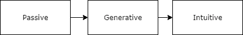
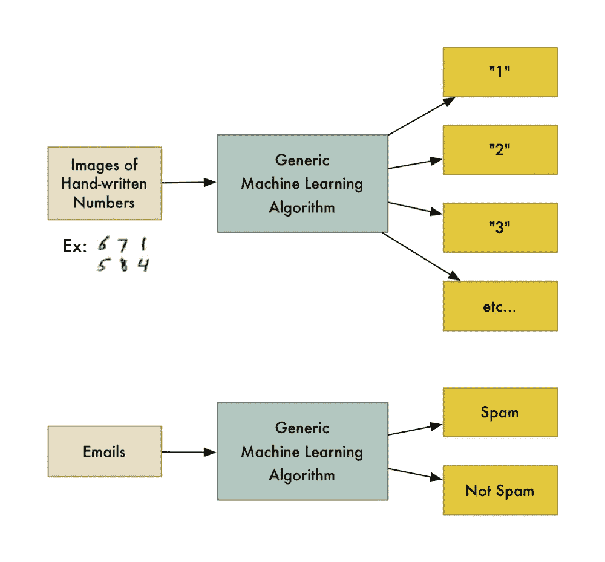
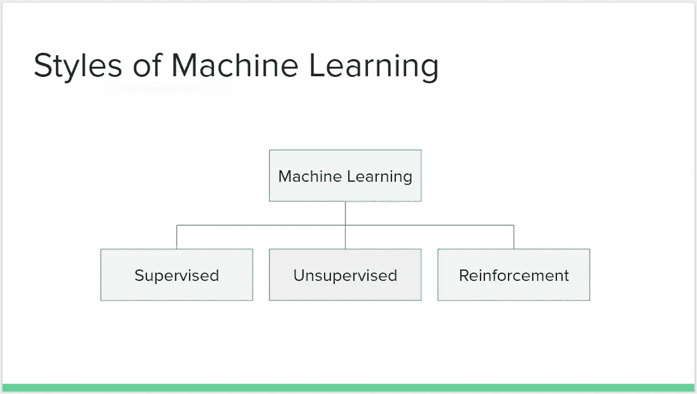
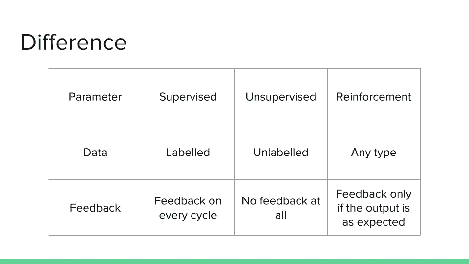
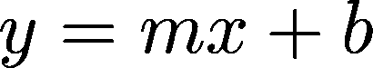
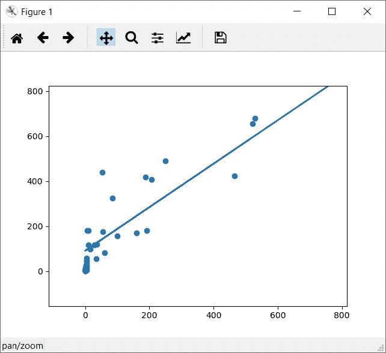

# 机器学习的触觉

> 原文：<https://towardsdatascience.com/the-touch-of-machine-learning-47fe42fd9eeb?source=collection_archive---------6----------------------->

长期以来，机器学习一直是人们感兴趣的话题。但即使在今天，我们中的许多人仍然认为人工智能是一个好得难以置信的想法。但在现实中，我们实际上已经接近了人工智能真实存在的时代，并且完全有能力以人类不可能想象的方式完成任务。自从计算机诞生以来，它已经走过了漫长的道路。

迄今为止，我们创造的大多数工具都是被动的，也就是说，它们只能做我们让它们做的事情，仅此而已。他们只能以有限的方式执行有限的任务，而没有能力思考其他方式。计算工具有三个阶段。



*   **被动**:不会思考工作方式的工具。
*   **生成**:生成工具相当智能。大多数使用机器学习的工具本质上是生成性的，也就是说，它们可以思考解决某个问题的方法。考虑一个生成工具的例子。空客最近使用机器学习在他们的飞机上设计了一种新型的隔墙。新的结构比人类设计的要坚固得多，而且轻了 50%。目前，阿姆斯特丹正在建设一座完全自主的桥梁。点击这里了解更多信息。基本上，他们正在使用生成工具，以便计算机可以自己设计一座桥，并用不锈钢 3D 打印出来。
*   **直观**:这是人工智能的终极目标。这是计算机利用直觉决定下一步行动的地方。最近，谷歌 DeepMind 创建了一个神经网络，它击败了世界上最好的围棋选手，这被认为是迄今为止最具战略性的游戏。在比赛过程中，在某些时候，甚至连设计 AlphaGo 的工程师都无法理解 AlphaGo 为什么会做出某一步棋！

# 什么是机器学习？

简而言之，机器学习是这样一种想法，即有一些通用算法可以告诉你关于一组数据的一些有趣的事情，而你不必针对该问题编写任何自定义代码。您不必编写代码，只需向通用算法提供数据，它就会根据数据构建自己的逻辑。

例如，一种算法是分类算法。它可以把数据分成不同的组。用于识别手写数字的相同分类算法也可以用于将电子邮件分类为垃圾邮件和非垃圾邮件，而无需更改一行代码。这是相同的算法，但它输入了不同的训练数据，因此它会产生不同的分类逻辑。



# 机器学习的风格

机器学习有三种风格。但是，监督和非监督学习风格是最常见和最流行的风格。



*   受监督的(Supervised):我们有一个适当标记的数据集，我们在每个周期都会收到反馈。因此，即使预测是错误的，我们也会收到反馈。这种类型的学习更容易实现，因为在这种情况下，我们有一个正确标记的数据集。
*   **无监督**:这里有一个无序的数据集，可能没有被标记。在这种学习风格中，根本没有反馈，也就是说，我们不会在任何类型的预测(正确或错误)中得到反馈。这比监督实现起来要困难一些。
*   **强化**:在这里，我们可以拥有任何类型的数据集。这种学习方式的主要区别在于反馈。只有当预测正确时，我们才能得到反馈。例如，如果你设置了一个会下棋的机器人，我们更喜欢强化学习，也就是说，机器人只有赢了比赛才会学习步骤！

总而言之，



# 让我们把它编码出来！

所以现在我们知道了机器学习的风格，但是不知道怎么实现。假设我们想预测房价。那么，你如何编写一个程序，仅仅通过知道一个动物大脑的重量来估算它的体重呢？

在传统的编程方法中，我们基本上会编写一个带有许多 if-else 的程序，将大脑的重量与某些参数进行比较，并得出一个结果。在这种情况下，将会有无限量的假设，因为动物物种的数量太多了，而且，将会有大量的数据必须手动输入系统才能工作。

我们的传统方法大概是这样的:

```
def calculate_weight_of_body(brain_weight, animal_name):
    if animal_name == animal_one:
        if weight < certain_value: 
            return weight_certain_value 
    elif animal_name == animal_two: 
        if weight < certain_value: 
            return some_value ...and so on.
```

所以我们采用**机器学习方法**来解决这个问题。让我们假设我们有一个类似这样的数据集:

大脑重量身体重量 3.385 44.50 0.480 15.50 1.04 5.50

..诸如此类。此外，请记住，由于我们的数据是有标签的，我们正在遵循监督学习风格。

> *(实际数据集包含在代码库中。检查代码部分的链接)。*

现在让我们进入代码。这次，我们将使用 scikit_learn 库来执行**线性回归**。如果你现在不明白它是什么，不要担心，因为我会在接下来的帖子里解释更多！我们有三个主要的依赖关系:

*   Pandas:我们将使用这个库从数据集文件中快速加载数据。
*   Scikit 学习:用于执行线性回归
*   Matplotlib:用于可视化我们的预测

所以让我们开始吧

```
# Import all the dependencies
import pandas as pd 
from sklearn import linear_model 
import matplotlib.pyplot as plot # Read data data = pd.read_fwf('brain_body.txt') 
x_values = data[['Brain']] 
y_values = data[['Body']] # Train model using Linear Regression 
body_prediction = linear_model.LinearRegression() body_prediction.fit(x_values, y_values) # Visualize results 
plot.scatter(x_values, y_values) 
plot.plot(x_values, body_prediction.predict(x_values)) 
plot.show()
```

你在这里！你刚刚迈出了机器学习的第一步。但是现在，你很好奇它到底是怎么工作的？

# 这是如何工作的？

我们使用线性回归来描绘一条简单的直线，这条直线最适合我们所有的数据点。把 x 轴当做大脑的重量，y 轴当做身体的重量。现在，我们在笛卡尔平面上绘制数据集的所有点。

线性回归通过追踪与我们的数据最匹配的直线来帮助我们找到点之间的关系。我们这条线的方程式是



其中 b 是 y 轴截距，m 是直线的斜率。通过使用这条线，我们可以建立大脑重量和体重之间的关系！

我们的点和追踪线的图形看起来像这样:



# 这是魔法吗？

不，这不是魔法！一旦你开始看到机器学习技术可以多么容易地应用于看起来非常困难的问题(如手写识别)，你就会开始觉得只要你有足够的数据，你就可以使用机器学习来解决任何问题并获得答案。

# 总结一下

总而言之，我们现在知道了三件基本的事情:

*   **机器学习**:让计算机根据我们提供给它的数据，自己计算出步骤。
*   **三种不同风格**:监督式、非监督式、强化式
*   **线性回归**:它允许我们通过一条最佳拟合线对独立值和从属值之间的关系进行建模。

# 密码

这篇帖子的代码已经上传到我的 Github 个人资料上了！

在这里找到源代码:[https://github.com/C-Aniruddh/linear_regression](https://github.com/C-Aniruddh/linear_regression)

*原载于 2017 年 7 月 2 日 achandratre.azurewebsites.net*[](https://achandratre.azurewebsites.net/the-touch-of-machine-learning/)**。**