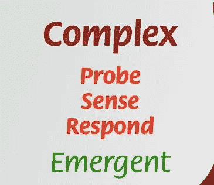

# 我们 EMS 系统的悲剧

> 原文：<https://towardsdatascience.com/the-tragedy-of-our-ems-system-4182f20b02bf?source=collection_archive---------5----------------------->

个人被鼓励使用最昂贵的医疗保健来解决小问题；以美元为代价节省便士。

备选领域提供了方便的框架，以更好地阐明消防服务中的问题。被称为“公地悲剧”的经济理论可能会将我们当前面临的环境管理挑战概括为一个简洁的隐喻。
公地悲剧是这样一种情况:个人通过开发一种共享资源，使其耗尽，从而使个人收益最大化，给社会带来灾难性的代价。结构不良的激励会产生“道德风险”，这是一种被称为“荷兰病”的经济现象，最后，被称为“临界点”的枯竭点通常会导致悲剧性的崩溃。

## Commons — *每个人都可以使用的公共资源*

想象你是一个牧场主，有一小群奶牛被你的私人牧场所限制。当地政府允许牧场主在紧急情况下，如野地火灾或大规模干旱时，使用最好的公共土地进行临时放牧。你会注意到其他当地牧场主开始扩大“紧急情况”的定义，并经常使用公共土地放牧。

## 道德风险——被激励去做错误的事情

了解到每个人都可以定义什么是紧急情况后，当地牧场主通过增加他们私有土地以外的畜群规模来实现利润最大化。最终，所有的牧场主都必须使用公共土地来保持竞争力。

## 荷兰病——新资源侵蚀旧的稳定资源

牧场主将他们的大部分畜群转移到免费的公共土地上，通过停止给他们的私有土地浇水，让草枯死，将他们的成本降到最低。现在，牧场主完全依靠公共土地放牧。

## 引爆点——灾难性的崩溃

最终，公共土地上的草因过度放牧而死亡，留给牧场主的畜群超过了他们被忽视的私有土地所能养活的数量。突然，牧场主的私有土地也因过度放牧而坍塌，导致所有的牧群挨饿。

## 公地的悲剧

由于滥用和过度使用，用于紧急情况的公共资源系统已经崩溃，使整个社区处于绝望的境地。

# 来自过去的警告

经济学家威廉·福雷斯特·劳埃德在 1833 年讲述了“公地悲剧”的故事，作为对后代的警告。该警告指出，超出其承载能力的公共资源面临着失败的风险，给社区带来了指数级的成本。
换句话说，公地的悲剧在于决策者无法认识到公共物品何时达到承载能力，从而导致影响整个社区的灾难性崩溃。

# 我们 EMS 系统的悲剧

我们目前的 EMS 系统，在越来越多的使用下，开始看起来像 19 世纪劳埃德的“公共财产”,通过拨打 911 为小问题奖励病人，而不需要他们付出实际代价。随着呼叫量的增加，系统的压力促使社区以牺牲其他项目为代价大规模扩展 EMS 资源。

非危重病人占急诊总量的 90%，我们能在急诊系统达到临界点之前进行干预吗？

## 公地

根据联邦法律，每个人都可以使用 EMS，并且必须“接受、评估和稳定所有接受护理的人，无论他们的支付能力如何。”因此，许多没有传统医疗保险的人正在使用 EMS 进行常规医疗护理。消防部门的额外负担减少了为其他紧急情况提供的服务，实际上耗尽了应对模式的所有复原力；一个重大事故就可能使当地的 EMS 系统彻底瘫痪。

## 道德风险——对用户和消防部门而言

道德风险是“一种倾向于承担过度风险的情况，因为承担风险的一方不承担成本。”许多 EMS 使用者几乎不面临不良后果的风险，例如因小病使用 EMS 的巨额救护车费用。

**使用没有直接成本的最昂贵的医疗方案**

一些病人被鼓励使用 EMS 系统，因为他们没有直接的花费。最终，社区承担了额外的费用，而用户却突然享受到了丰富的方便和先进的医疗服务。

**你打电话，我们拖运，如此而已**

与病人一样，消防部门也在与自身的道德风险作斗争。许多消防部门进入救护车运输业务，以保护社区，雇用额外的消防队员，并投资于大量的资本资产。来自救护车账单的收入通常用于支付员工和设备的成本，使得医疗运输业务成为必需的业务。但是许多消防部门面临着一个事务性问题，他们的人员和资产成本在增加，而每次运输的平均收集量在下降。

突然间，消防部门陷入了专注于收入而非社区健康的困境。就像病人一样，消防部门发现自己处于道德风险中，不管医疗需求如何，运送尽可能多的病人，希望缩小成本上升和收入下降之间的差距。

荷兰病——EMS 侵蚀了其他形式的医疗保健

1977 年,《经济学人》上的一篇文章创造了“荷兰病”一词来描述一种突然致富的形式，这种形式重塑了经济，侵蚀了一些部门，并将其他部门推到了崩溃的边缘。“荷兰病”可能有助于描述我们医疗保健系统的演变，因为人们突然因以低成本获得先进的 EMS 系统而富裕起来，同时侵蚀了家庭医生等更传统的医疗保健手段。

## 解决方案是有的，但可能需要一点点的尝试和错误

我们的 EMS 系统由消防部门、救护车公司、医院、保险提供商、诉讼律师和政府法规组成，它创造了一个[复杂的适应性系统](https://en.wikipedia.org/wiki/Complex_system)，或 [CAS](https://en.wikipedia.org/wiki/Complex_adaptive_system) 。CAS 非常难以分析、管理或预测，一旦超过其承载能力，就会突然崩溃，就像劳埃德寓言中的普通牧场一样。

[大卫·斯诺登](https://en.wikipedia.org/wiki/Dave_Snowden)， [Cynefin 框架](https://hbr.org/2007/11/a-leaders-framework-for-decision-making)的创建者和[复杂性理论](http://www.complexityforum.com/members/Grobman%202005%20Complexity%20theory.pdf)的领军人物，建议当面对塑造一个 CAS 时，一个人通过在系统中使用一组安全到失败的实验来采用一个“探测、感知和响应”的过程。在新项目实施后，管理员根据结果抑制或放大活动。换句话说，尝试新事物，多做有用的事，少做没用的事。

The complex environment of the Cynefin framework

在处理 CAS 时，传统的官僚计划和结构化实施很少能产生预期的结果，反而会使问题变得更糟。我们的 EMS 问题的解决方案将在本地找到，在一个小实验中产生积极的结果，由关心他们社区的勇敢的领导者实施。

Australia tries a public education campaign

由于道德风险和一种荷兰病的混合，我们的 EMS 系统正面临巨大压力。我们建立了一个激励用户为小问题寻求紧急服务的系统，高额费用由社区而不是用户承担。急救服务的主导地位侵蚀了传统形式的医疗保健，如果 EMS 崩溃，可能会使社区没有医疗保健的选择。我们的紧急医疗系统的复杂性创造了一个复杂的适应系统，在小危机演变成大灾难之前，需要一点尝试和错误来克服无知和冷漠的古老问题。消防部门没有制造问题，但我们应该成为解决方案的一部分；为了市民，我们发誓要保护。

 [## 消防部门是响应模型，而不是生产模型

### 你不应该最大化效率；你应该有弹性。效率导致脆弱；弹性…

medium.com](https://medium.com/elitecommandtraining/fire-departments-are-response-models-not-production-models-f7943d5c623d)