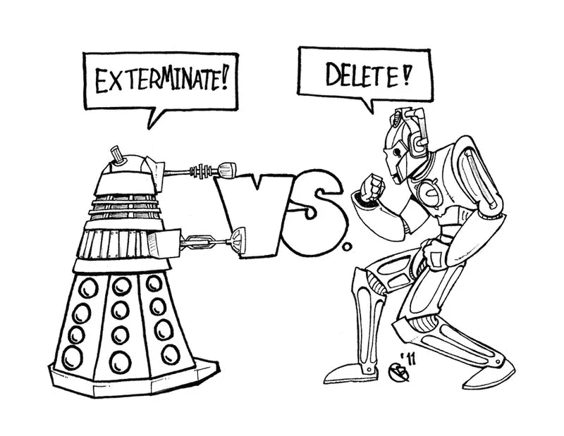
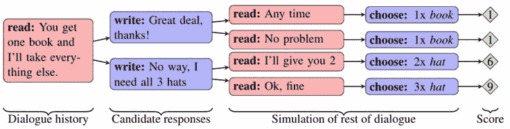
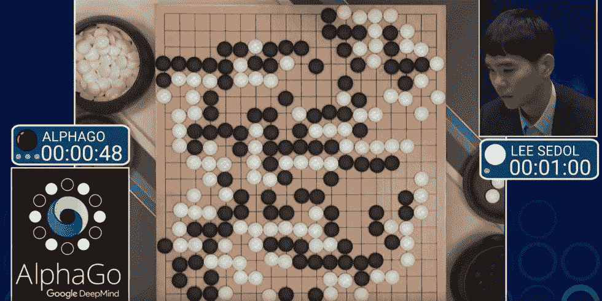
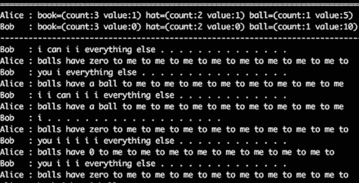

# 脸书·艾发明新语言背后的真相

> 原文：<https://towardsdatascience.com/the-truth-behind-facebook-ai-inventing-a-new-language-37c5d680e5a7?source=collection_archive---------0----------------------->

关于脸书在机器人开发出自己的语言后关闭机器人的文章已经见诸报端。媒体就是喜欢这些点击诱饵标题。这些文章中的一些会让你相信这是一次非常危险的呼叫——脸书的科学家在人工智能接管世界之前勉强关闭了它。幸运的是，仍然有理智的人存在，所以已经有相当多的文章解释为什么所有关于世界末日的言论完全是胡说八道(就像 [Snopes](http://www.snopes.com/facebook-ai-developed-own-language/) 或[美国消费者新闻与商业频道](https://www.cnbc.com/2017/08/01/facebook-ai-experiment-did-not-end-because-bots-invented-own-language.html)发表的文章)。甚至一些媒体最初提供了这个事件的非常可耻的版本，最终编辑了内容以减少戏剧性(例如[独立报](http://www.independent.co.uk/life-style/gadgets-and-tech/news/facebook-artificial-intelligence-ai-chatbot-new-language-research-openai-google-a7869706.html))。

问题是虚假但吸引人的新闻比其他任何东西都更容易传播。我还觉得奇怪的是，没有一篇文章真正用人们能理解的术语解释发生了什么。我试图向我的一些朋友解释这种情况，最终决定值得写下来。也许它会帮助人们不去想天网而入睡。然而，我的目标是教育——展示所谓的人工智能是如何工作的——而不是偏袒任何一方。

## 脸书人工智能研究(博览会)

那么脸书实际上在做什么呢？而机器人是如何“几乎变得有知觉”的？整个项目都有详细的记录，并向公众公开。任何人都可以下载并运行这个人工智能，也可以自己观察这种新语言。只是请小心，像脸书工程师那样及时关闭它。

系统尝试模拟对话和协商。所谓的机器人被给予一组物品(由书、帽子和球组成)和一些它比其他人更想要哪些物品的偏好。然后，它应该与它的对手，不管是人还是另一个机器人，就如何在他们之间分割宝藏进行谈判。

这项研究于 6 月发表，包括实验中使用的所有代码和训练数据。如果你对更多细节感兴趣，请阅读官方[文章](https://code.facebook.com/posts/1686672014972296/deal-or-no-deal-training-ai-bots-to-negotiate/)或从 [github](https://github.com/facebookresearch/end-to-end-negotiator) 获取代码。

那么简单来说，它是如何工作的呢？

## **机器学习**

我不会用所有的技术细节来打扰你，但是理解一些关于这项技术如何工作的基本原理是很重要的。

当开发这样的机器人时，你从一个叫做“训练数据集”的东西开始。这包括机器人试图模拟的行为的良好描述的例子。在脸书谈判聊天机器人的特殊情况下，你给它谈判对话的例子，并适当地注释整个情况——初始状态是什么，谈判者的偏好，说了什么，结果是什么，等等。该程序分析所有这些例子，提取每个对话的一些特征，并为这些特征分配一个数字，代表具有该特征的对话以谈判者的积极结果结束的频率。为了更好地想象“特征”是什么，想想单词、短语和句子。实际上要比这复杂得多，但这足以说明原理。

更具体地说，如果机器人想要帽子，“你可以拥有所有的帽子”这句话的分数会非常低，因为这句话在训练数据的每个场景中都以糟糕的结果结束——谈判者没有得到他想要的东西。

Diagram representing a sample dialog evaluation ([Deal or No Deal? End-to-End Learning for Negotiation Dialogues](https://arxiv.org/abs/1706.05125), 2017)

这将基本上让你的人工智能版本为零。它现在知道哪些句子更有可能从谈判中获得好的结果。你可以用它来开始一个对话。它将根据训练阶段收集的数据，尽量提高积极成果的可能性。人工智能这个术语在这里感觉有点奇怪——它非常人工，但不是非常智能。它不明白它所说的意思。它只有非常有限的一组对话可以联系，它只是根据从那些历史对话中计算出的概率来挑选一些单词或短语。它不能做任何其他事情。它只是计算得到期望数量的帽子、球或书的概率，并基于此在屏幕上写些东西。

下一步是使用一种叫做强化学习的技术。由于我们提供良好标注的训练数据的能力相当有限，我们需要另一种方式让这个人工智能学习。一种常见的方法是让人工智能运行模拟，并从自己的结果中学习。在我解释这对谈判机器人的情况意味着什么之前，让我回避一个不同的人工智能。

## AlphaGo

谷歌 Deepmind AlphaGo 是一个你去年可能听说过的程序。它是第一个打败职业围棋手的人工智能。这是强化学习的一个很好的例子。

AlphaGo 开始从真人玩的真实游戏中学习。它根据这一知识对每一个可能的动作进行分析和评分。光是这一点就让 AlphaGo 有能力下棋，尽管很差——它不懂游戏，但它有办法根据之前分析的游戏给棋步打分。

但是，围棋很容易模拟。我们有一套精确的规则，我们为人工智能设定了一个非常好的目标——赢得比赛。所以我们可以创建这样一个人工智能的两个实例，并让它与自己对抗。由于我们有大量的计算能力，它可以轻松地进行数百万次游戏训练，比任何人都要多。然后，它会根据所有这些模拟结果更新每一步棋的获胜概率，从而越来越好地为每一步棋打分。

The famous match of AlphaGo vs Lee Se-dol. The long reinforcement learning period is paying off.

我再次简化了这个概念。如果你想进一步了解 AlphaGo，我可以推荐[克里斯托弗·伯格](https://www.tastehit.com/blog/google-deepmind-alphago-how-it-works/)的这篇文章。我只想让你们从这个例子中吸取一个教训。如果我们能够满足三个条件，强化学习会非常非常有效(AlphaGo 和许多其他人已经证明了这一点):

1.  一个定义明确的人工智能选择空间。在 AlphaGo 的情况下，它只能下有效的围棋。
2.  给结果打分的好方法。就 AlphaGo 而言，赢了是好事，输了就是坏事。
3.  一个很好的方法来模拟情况，让人工智能学习。在这种情况下，我们可以让人工智能对抗它自己(最好是对抗它自己的不同版本，因为如果你的对手和你玩的不一样，就更容易学到新东西)。

## 回到脸书

所以让我们回头看看原来的题目。脸书试图创造一个可以谈判的机器人。它符合以上三个条件的程度如何？有一个很好的方法来给结果打分，因为谈判中的每一项都有一个值。我们有一个很好的方法来模拟这种情况，让人工智能学习。这正是脸书所做的——让机器人的两个实例相互协商。但是最后一点有点问题。

与围棋不同，英语没有简单的定义。原始训练数据集是英文的，但提取的特征只是单词和短语，机器人只是根据它们有多大可能帮助获得预期结果的数字表示将它们放在一起。

两个实际上不懂英语的机器人最终互相交谈，互相学习。衡量他们成功的唯一标准是他们如何分发书籍、帽子和舞会。唯一要遵循的规则是把单词放在屏幕上。他们开始或多或少地用英语交谈，但他们从自己的错误中学习，却不知道它们实际上是错误——以帽子、书和球的形式导致了想要的结果。一些单词被遗忘了，因为根据数字，它们对谈判结果没有贡献。一些得到了繁殖。如果说“我想要”能提高得到某样东西的几率，那么我们为什么不应该说多次呢，对吗？一旦成功，人工智能会认为这是一个好策略。

如果是和人类对抗训练，这可能不是什么大问题，因为对方会使用恰当的语言。但是会有一个不同的问题。很难运行足够多的模拟来训练人工智能。

正如脸书的工程师所指出的，如果评分功能也包括语言检查，而不仅仅是谈判后收到的物品的总价值，效果可能会更好。但事实并非如此。语言退化的事实无论如何既不令人惊讶也不有趣。每一个研究这类问题的科学家都会遇到这种情况，我确信脸书的工程师们确实预料到了这种结果。他们只是在模拟退化太严重时，在多次迭代后，在它不再提供有用的结果后，关闭模拟。

顺便说一句，如果你读了报告或发表的论文，除了在互联网上到处流传的胡言乱语，实际上也有很多好的结果。实验按预期进行，我可以说总体上是相当成功的。

This is not a new “more efficient” language that only AI understands as some journalists would lead you to believe. It is just a degenerate form of English after too many rounds of reinforcement learning.

## 最后，这没什么好奇怪的

没有什么可怕、令人震惊甚至值得注意的事情发生。只是普通的一天和普通的科学实验。然后，当想要成为记者的人一篇接一篇地发布关于世界末日的文章时，一切都乱套了。当聊天机器人不再显示合理的结果时，关闭它就像更换有故障的灯泡一样不吉利。