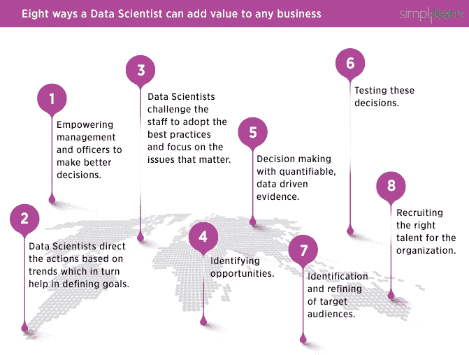

# 获得数据科学家工作的两个方面

> 原文：<https://towardsdatascience.com/the-two-sides-of-getting-a-job-as-a-data-scientist-a4571acc58bc?source=collection_archive---------3----------------------->

## 你是找工作的数据科学家吗？你是在找数据科学家的招聘人员吗？如果你对这个问题的回答是或否，你需要阅读这个。

Edit: So happy that the post got so much attention, both here and KDNuggets :).

你好！这是一篇我等了很久才写的博客。主要是因为我需要做研究，听听其他人对此的看法。

我认为自己是一名数据科学家，而不是招聘人员，但由于我与 Amanda Voss 和更多数据科学和 IT 领域的招聘人员进行了一次令人惊叹的对话，我现在对故事的双方都有了一个想法:DS 在找工作，招聘人员在为一个职位寻找最好的 DS。

在开始之前，如果你想了解更多关于我寻找数据科学家工作的个人经历，请阅读我的博客:“如何获得数据科学家的工作？”

 [## 如何获得一份数据科学家的工作？

### 大家好。这篇博客文章来自我最近在 LinkedIn 发表的三篇文章。这是第一部分、第二部分和第三部分。

towardsdatascience.com](/how-to-get-a-job-as-a-data-scientist-f417078fe13e) 

# 数据科学家方面

所以你是一名数据科学家，或者你认为你离数据科学家越来越近了，你开始在这个领域找工作。我的第一个建议:**耐心点！这不是一件容易的事，也许你会申请上百份工作才能得到一份。**

当然，这可能是一个非常简单快速的过程，但根据我的经验，这至少需要(大约)100 份申请和几个月的时间。

从每一次申请，每一次拒绝中学习。当我开始申请工作时，我不得不面对许多拒绝。一些我实际上没准备好的事情。我想没有人让你做好被拒绝的准备，但是如果你从这件事中得到了什么，那也没关系！很正常，不针对个人！

每一次拒绝都是你走向成功的一步。适应雇主可能想要的每一个特征，或者有合适的经历，或者仅仅是文化适应，都不容易。

如果你足够幸运的话，你将会得到一个令人惊讶的招聘人员，他会让你知道发生了什么，以及如何在未来的面试或过程中改进。认识到自己的缺陷和弱点是变得更好的开始。你现在感受到的挫败感，或者你可能每次都用它来提高和变得更好。

## 关于该流程，需要记住三个要点

*   有些人不知道什么是数据科学。所以**研究你申请的公司**，看看他们的员工在做什么，寻找他们的交流方式，他们的脸书、LinkedIn、Twitter、会谈和网络研讨会。看看他们是否在做你感兴趣的事情。
*   招聘人员是你面试时最好的朋友，他们想帮你进入面试。所以**信任他们**，让他们帮助你**提问**！
*   比起你的技术知识，人们通常更感兴趣的是你如何解决问题和你如何处理一些特殊情况。当然，写出高质量的代码并充分理解你正在做的事情是很重要的，但是还有更多。

## 获得数据科学家工作的一些建议

*   **要有耐心。在找到一份工作之前，你可能会申请数百份工作(但愿不会)。**
*   **准备**。很多。不仅要学习重要的概念、编程和回答商业问题，还要记住你将是组织中的重要一员，你将与不同的人和情况打交道，准备好回答关于你在不同工作情况下如何表现的问题。
*   **有作品集**。如果你正在寻找一份严肃的数据科学的有偿工作，做一些有真实数据的项目。如果你能把它们发布在 GitHub 上。除了 Kaggle 比赛，找一些你喜欢的事情或者你想解决的问题，用你的知识去做。
*   **招聘人员是你的朋友**。面试你的人也是。他们希望你进入公司，这是我每天都记得的一个强有力的建议。
*   **询问人们做什么**。我建议您关注 Matthew Mayo 关于“数据科学家的一天”的帖子，以便更好地了解我们的工作。
*   如果你想要一份实习工作，就要准备好你的学术技能。

## 创建简历和生活(什么？)得到那份工作

马克·梅龙的建议:

> 如果你有什么想让读者或听众(采访者)知道的，你最好把它放在你的信息的前面。对于简历来说，这意味着你要用你最强的方面来引导。也许这就是你的教育。可能是你的工作经历吧。不要觉得你必须遵循你下载的简历模板中的顺序。
> 
> 当面试官问“说说你自己吧”，你不需要给他们按时间顺序讲述你的生活故事。首先告诉他们你最大的优势是什么。

马克的更多信息:

> 你想表达你对这个领域的热情吗？做一些个人项目。贡献开源。开个博客。见鬼，在 LinkedIn 上活跃[……]。
> 
> 文字廉价；行动才是最重要的。
> 
> 在我们这个竞争激烈的领域，你希望避免做任何会导致人们不把你当回事的事情。

来自[凯尔·麦基乌](https://www.linkedin.com/in/kylemckiou/)的建议:

> 把简历上的每一个要点都变成一个小故事。你可能已经有了一整页的文本，而且可能充斥着“我做了这个”或“我们做了那个”的一句话去吧，删掉一半。
> 
> 现在你已经腾出了一些空间，开始扩展剩余的成就。
> 
> 使用[星形](https://en.wikipedia.org/wiki/Situation,_task,_action,_result)格式给出每个要点的上下文，并将其转化为一个有分辨率的详细迷你故事。
> 
> 在简历上写一些突出的故事和成就比写一大堆“东西”要好

凯尔的更多信息:

> [与招聘人员沟通时]将你的沟通总结为 3-5 句话，解释:
> 
> -你为什么对这份工作和公司感兴趣
> 
> -为什么你的技能和背景使你非常适合。
> 
> 还有，**要兴奋，要有激情。**
> 
> 战胜竞争对手。

来自[埃里克·韦伯](https://www.linkedin.com/in/eric-weber-060397b7)的建议:

> 想作为数据科学家有所作为吗？不要只看正在做什么，也要看没有做什么。写下你能为公司做的最重要的 5 件事。然后提出你的想法。
> 
> 为什么？
> 
> 1.自我批评是很难的。检查没有做的事情很难，但可以让你走出“让事情保持原样”的舒适区。
> 
> 2.**业务发展迅速**。当事情似乎着火时，很难摆脱“把事情做完”的心态。但是远离这种心态提供了一个真正创新的机会。
> 
> 3.**你对数据真的很了解**。很少有人知道。理解数据的潜力是一项数据科学工作，并不总是管理层能够做到的事情。
> 
> 4.写一份清单迫使你随着时间的推移追踪你的想法。你把它写在纸上，它会一直跟着你。相比之下，只是思考一些事情并不总是能让它坚持下来。
> 
> 5.你必须推销你的想法。简单地写下它们是可以的，但是如果你不把你的想法传达给管理层，它们就不会成功。选择你最喜欢的一个，并开始确定它对公司的影响和投资回报率。
> 
> 思考、写作和销售。定期督促自己这样做，你会发现各种各样的新想法可以分享。

博沃克的建议:

> 在过去的十年里，我在 LinkedIn 上申请了 **898** 份工作。我知道这一点，因为 LinkedIn 一直在跟踪。(感谢 LinkedIn 的提醒！)
> 
> 这个数字还不包括我在其他平台或直接在雇主网站上申请的职位。这还不包括我收到的大量招聘邮件、电子邮件和电话。
> 
> 想知道这些活动让我**实际上**获得了多少份工作吗？
> 
> **零。一无所获。塞罗。нуль.是真的。**
> 
> 我是 0–898 找 LinkedIn 的工作！我从来没有真正接受过通过求职板或招聘人员找到的工作。
> 
> 我被问了很多关于如何找工作的问题。我和那些对申请过程感到沮丧的人谈了很多。
> 
> 我的建议？考虑其他找工作的方法。10 年来，我接的每一份工作都是来自于人脉。最好的工作往往如此。

来自 [Vin Vashinta](https://www.linkedin.com/in/vineetvashishta) 的建议:

> [……]当你处于回答问题的模式时，很难开始问问题。当你想给人留下深刻印象时，很难期待同样的回报。记住，招聘是双向的。
> 
> 带着更多的期望离开面试，但也要带着同样的期望离开面试。你印象深刻吗？他们做了什么让你觉得受欢迎？你努力工作才取得现在的成就。被那些提升你的事业所吸引，而不是削弱你已经取得的成就。
> 
> 伟大的公司会努力让每一个应聘者都大吃一惊，即使是那些他们没有聘用的人。亚马逊是一个很好的例子，它的招聘流程给我留下了深刻的印象。我和他们的招聘人员有过多次接触；始终专业，反应迅速，并带来适合我能力的角色。

来自[JT·科斯特曼博士](https://medium.com/u/54d903454265?source=post_page-----a4571acc58bc--------------------------------)的建议:

> 这个问题很可能与你如何看待自己的简历有关。
> 
> 问:简历的作用是什么？
> 
> 答:错了。它不是给你一份工作，甚至不是一次面试，也不是给招聘经理。简历的工作就是让它通过碎纸机。句号。句号。

> 大多数收到你简历的人根本不知道我们到底是做什么的；他们只是有一个清单要检查。他们在寻找关键词，而不是概念。他们中的大多数人不会为淘金而烦恼。他们会给出不到一分钟的时间(字面上的意思),然后继续处理他们的下一个问题。
> 
> 实话实说:你的简历简单到连人力资源/招聘部门的一些笨蛋都能看出你是一个近乎完美的人选吗？是关于你的吗？或者你是否清楚地展示了(而不是告诉)你将如何让招聘经理和公司受益——包括确保她每天可以少吃点药？你是在为 HR 把点连起来，给他们画地图吗？
> 
> 大概不会。

阅读所有建议，并寻找更多建议。他们很棒。有些有点难以理解，但它们是真实的。

那么，我要告诉你什么来改善你作为 DS 的生活和你的简历呢？以下是我的清单:

1.  要诚实。不要在简历中低估或高估自己。
2.  **联系并活跃在数据科学社区。**创建博客，分享您的知识，参与开源项目。
3.  **说清楚。阅读你的简历，问自己:这是我希望看到的样子吗？，确保你把你认为对你和你申请的公司最重要的东西放在了开头。**
4.  不要给每家公司都投相同的简历。这非常接近最后一点，是一项艰苦的工作。但是相信我，你会很快看到结果。分析公司，为那个职位准备一份简历。
5.  保持简短。他们每天都会收到数千份简历，所以他们只会花 30-60 秒阅读你的简历。所以一定要确保你把他们想看的东西放在那里。不要放与公司无关的东西。
6.  **保持一致**。这意味着在任何地方都使用相同的字体和风格。
7.  **说出你的故事。**你在简历里看到的那些子弹就是你。所以，用你和他们都会喜欢的方式讲述你的生活故事。如果你更擅长学术技能，一定要把它放在经验部分之前，反之亦然。
8.  在发送简历之前，征求招聘人员的意见。

更多建议:

 [## 创建一份优秀的数据科学简历

### 我从许多有抱负的数据科学家那里听到一个熟悉的故事:“我已经向 25 家公司发出了简历，我…

will-stanton.com](http://will-stanton.com/creating-a-great-data-science-resume/)  [## Creddle

### Creddle 帮助你制作漂亮、现代、纸质友好的网络简历。

creddle.io](http://creddle.io)  [## GitHub 是你现在的简历

### 如果你是一名程序员，当你申请工作时发送简历的日子很快就要结束了，如果他们还没有…

anti-pattern.com](https://anti-pattern.com/github-is-your-resume-now) 

## **一般面试技巧**

在为面试提供一些建议之前，这里列出了申请数据科学职位的“常见”流程:

1.  他们会打电话询问你和你的经历。这是第一个手机屏幕。
2.  如果一切顺利，你会接到第二个电话，这次可能是公司的某个数据科学家打来的。这是第二次电话筛选。他们会问你更多关于你的情况、你的经历以及一些技术问题。这个更有可能看你简历里说的东西是不是真的。
3.  (可选)数据科学任务。他们会给你发一个数据集，问你几个问题，看看你作为数据科学家的能力。这里要说清楚。编写高质量的代码。

来自 [Kyle Mckiou](https://www.linkedin.com/in/kylemckiou/) 的建议:作为一名数据科学家，要写出高质量的代码:

> 编写高质量的代码对于数据科学家来说至关重要，尤其是在 2018 年及以后。
> 
> 随着数据科学实践的成熟，更多的公司将要求数据科学项目的自动化、可再现性、可伸缩性、可移植性和可扩展性。为了实现这一点，你最好准备好编写高质量的代码。
> 
> 以下是让你开始成为数据科学家的 10 个技巧:
> 
> 1.积极重构。当你应该重构的时候，不要在脚本末尾添加新代码
> 
> 2.遵循样式标准，例如 Python 的 PEP-8
> 
> 3.防御性地编写代码——始终考虑可能出错的地方！
> 
> 4.避免全局变量并最小化变量的范围
> 
> 5.把这些脚本转化成程序——创建有组织的系统
> 
> 6.总是单元和集成测试
> 
> 7.自动化您的测试
> 
> 8.创建严格的审核流程
> 
> 9.遵循严格的审核流程，即使你不愿意！
> 
> 10.作为评审者提供诚实的、批判性的反馈，当你的代码被评审时，对反馈持开放态度

4.白板编程。这可能是任何过程中最艰难、最令人生畏的部分。在空白空间编程。只有你和一张纸。多练习这个。你不需要在这里完美地写代码，他们想看到你思考并进入解决方案。谈论和描述你的思考过程，不要太过投入。

5.(可选)公司中编码的日期。这是最后一项任务，并不常见，但它邀请他们的公司在那里呆一整天，看看他们在做什么，并解决一些编程任务。

面试建议？以下是我能找到的，它们很棒:

布兰登·罗尔:【https://brohrer.github.io/how_to_interview.html】T2[(读这个！！！)](https://brohrer.github.io/how_to_interview.html)

 [## 通过分析数百次数据科学访谈，我们了解到

### 世界各地的顶级数据科学团队正在对一些最有趣的数据集进行令人难以置信的研究…

www.springboard.com](https://www.springboard.com/blog/data-science-interviews-lessons/)  [## 30 分钟指南让你在下一次编码面试中摇摆不定

### 我是如何在编码面试中提高的，以及如何收到大型科技公司的邀请。

medium.freecodecamp.org](https://medium.freecodecamp.org/coding-interviews-for-dummies-5e048933b82b)  [## 如何赢得数据科学面试:SQL

### 数据科学面试可能很难驾驭。事实上，这是一个多学科领域意味着…

towardsdatascience.com](/how-to-ace-data-science-interviews-sql-b71de212e433)  [## 准备数据科学家的面试

### 《福布斯》撰稿人发表的观点仅代表其个人观点。我该如何准备数据科学家面试？原来…

www.forbes.com](https://www.forbes.com/sites/quora/2017/04/05/preparing-for-a-job-interview-as-a-data-scientist/#443263b81ff8)  [## 编程面试问题+帮助获得工作机会|面试蛋糕

### 自由练习编程面试问题。面试蛋糕帮助你准备面试，获得公司的录用通知…

www.interviewcake.com](https://www.interviewcake.com)  [## 解决教程代码挑战

### 加入 200 多万开发人员的行列，在 HackerRank 上解决代码挑战，这是为…

www.hackerrank.com](https://www.hackerrank.com/domains/tutorials/cracking-the-coding-interview) 

# 招聘方

如果你是数据科学岗位的招聘人员，先看看谁是数据科学家。这不是一个简单的问题，但我有一个简短的回答:

> 数据科学家是负责**分析业务问题**并给出**结构化解决方案**的人，首先由**将**这个**问题**转化为**有效**和**完整问题**，然后使用**编程**和**计算工具**开发**代码**使**清理、准备和分析**数据**然后**

数据科学不是什么:

We are much more than this.

## 数据科学为什么重要？

> 数据科学和分析之所以存在，是因为数据中隐藏着等待发掘的宝藏。

**数据科学家为企业增加价值的方式:**

这是阿凡提卡·蒙纳帕的一篇精彩文章的摘录

 [## 数据科学为什么重要，它如何推动商业价值？

### 如果没有将尖端技术转化为可操作见解的专业知识，大数据就什么都不是…

www.simplilearn.com](https://www.simplilearn.com/why-and-how-data-science-matters-to-business-article) 

From simplilearn.

1.授权管理层和官员做出更好的决策

2.根据趋势指导行动，这反过来有助于确定目标

3.激励员工采用最佳实践并关注重要问题。

4.发现机会

5.利用可量化的数据驱动的证据进行决策。

6.测试这些决定

7.目标受众的识别和提炼

8.为组织招募合适的人才

## 你总是需要一个数据科学家吗？

实际上没有。我建议你阅读这些相关的文章，

 [## 你的公司需要数据科学家吗？

### 比拉尔马哈茂德，螺栓。数据科学正在发展。它被称为“21 世纪最性感的工作”，并且…

www.kdnuggets.com](https://www.kdnuggets.com/2016/04/your-company-need-data-scientist.html)  [## 炒作之外:你真的需要一个数据科学家吗？-的确是博客

### 2012 年，《哈佛商业评论》将数据科学家评为“21 世纪最性感的工作”，理由很充分…

blog.indeed.com](http://blog.indeed.com/2016/08/16/do-you-need-a-data-scientist/) 

从这些话中，我可以引用一句重要的话:

> …适当利用数据科学团队需要一定的数据成熟度和基础架构。数据科学团队需要一些基本的事件量和历史数据来提供对未来有意义的见解。理想情况下，您的业务运行在信号延迟低、信噪比高的模式上。
> 
> 没有这些元素，你将拥有一辆没有燃料的跑车。问问自己，像数据分析师和商业智能这样的传统角色是否足够。

记住这句话:一个糟糕的数据科学家比根本没有数据科学家更糟糕。

有很多人想要一份数据科学方面的工作，他们中的大多数都是非常聪明的人，希望在这一领域提供帮助并有所作为，但在雇佣之前要小心。我建议您在最好的公司中搜索数据科学描述，了解他们的流程，并向他们学习。

同样，他们不需要博士学位就能成为最好的数据科学家。他们需要处理数据和使用数据科学解决业务问题的经验。在申请博士学位之前，询问知识，他们参与过的项目，他们建立或合作的开源项目，他们创建的 Kaggle 内核，相关的工作经验，他们如何解决一个特定的问题。

数据科学不仅仅是一个 IT 领域，是 IT+业务，你需要确保你雇佣的数据科学家能够适应公司，了解业务，与利益相关者开会，并以创造性和简单的方式展示他们的发现。

阅读这篇博文了解更多信息:

 [## 招募数据科学家的实地指南

### 每天，人类共同创造了相当于 530，000，000 亿首数字歌曲或 250，000 个图书馆…

blog.entelo.com](https://blog.entelo.com/a-field-guide-to-recruiting-data-scientists) 

并由此得出一些招募数据科学家的重要技巧:

1.  招聘人员与招聘经理紧密合作，构建出**准确的职位描述。**
2.  消除细微差别，以**区分**哪些**类型的数据科学家**将是最适合企业需求的**。专注于你正在寻找的数据科学家类型的技能和经验。**
3.  **想长远**。了解组织计划如何在产品路线图中利用这一角色。
4.  **为可用的候选人才库设定现实的期望**。角色比候选人多，要相应招聘。
5.  建立一份理想候选人名单，并与招聘经理一起校准，以**衡量是否符合人才市场的现实。**

Vin Vashinta 在招聘过程中的一句名言:

> 有抱负的数据科学家想从没有雇佣他们的公司那里得到一样东西:一个解释。在许多情况下，他们唯一的反应是沉默。如果公司不告诉他们，一个有抱负的数据科学家怎么知道该做什么？
> 
> 有抱负的数据科学家不是灵媒，但他们很努力&愿意学习。如果公司开始告诉他们酒吧在哪里，他们就会接受挑战。
> 
> 剥开大多数公司的招聘流程&你会发现他们无法客观地回答这个问题:“你为什么不面试或聘用这个人？”我告诉客户，通过像审视他们雇佣的人一样仔细地审视他们拒绝的候选人，他们能学到多少东西。
> 
> 这个问题的答案对应聘者和雇主都有价值。公司有机会改善他们的招聘流程。候选人有机会为下一次申请公司做更好的准备。
> 
> 除了价值，对于花时间申请的人来说，这是一件体面的事情。招聘就是要建立联系。沉默表明公司不够关心如何正确对待员工。这是候选人需要记住的。

希望这篇帖子能帮助到数据科学界的每一个人。让我们携起手来，互相帮助，把世界变得更加美好。记住要开心，生活中除了工作还有很多，我喜欢我的工作，但是要花时间和你的家人和朋友在一起，开心点，善待他人。

如需了解更多信息或有任何疑问，请添加我，我们将在此聊天:

 [## Favio Vázquez -数据科学家/工具经理 MX - BBVA 数据&分析| LinkedIn

### 查看 Favio Vázquez 在世界上最大的职业社区 LinkedIn 上的个人资料。Favio 有 13 个工作列在他们的…

www.linkedin.com](https://www.linkedin.com/in/faviovazquez/)