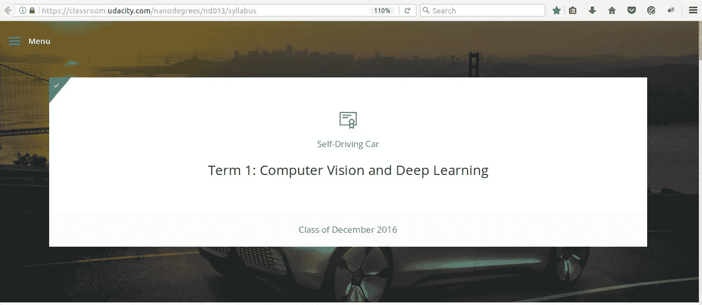
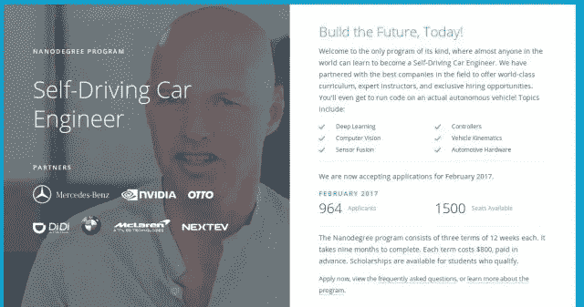
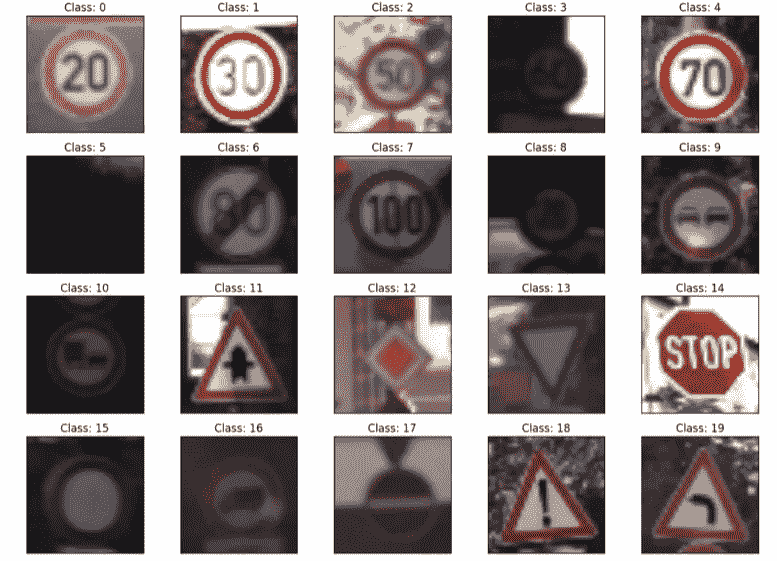
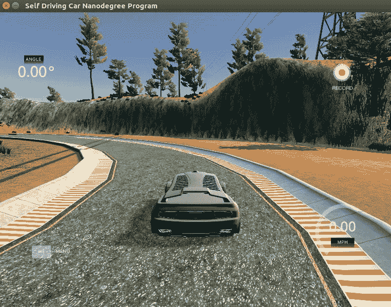
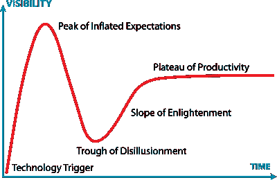

# Udacity 无人驾驶汽车 Nanodegree —术语 1

> 原文：<https://towardsdatascience.com/the-udacity-self-driving-car-nanodegree-term-1-384b75dcb987?source=collection_archive---------1----------------------->

我做到了！我完成了 Udacity 自动驾驶汽车 nano degree(www . uda city . com/drive)的第一学期。这是我对第一学期的回顾和路线图。

After finishing the projects of Term 1, I received this “certificate”

# 三个术语

首先要注意的是，这门课分为三个学期。每个学期花费 800 美元，为期三个月。

*   学期 1:计算机视觉和深度学习
*   术语 2:传感器融合、定位和控制
*   学期 3:路径规划、浓度和系统

我完成了第一学期。第二学期这几天才开始(2017 年 3 月)。而 term 3 还不可用。

[www.udacity.com/drive](http://www.udacity.com/drive)

第一学期是关于计算机视觉和深度神经网络。自动驾驶汽车必须看到环境中的关键元素(车道、其他车辆)。汽车必须根据这些信息行驶。

# 每学期 800 美元？

这个课程很贵。在我看来，这是一件好事，因为课程成为一门好课程是有成本的(课程视频、IT 基础设施、软件、讲师、评审员)。

这门课程并不容易。在注册之前，请证明您拥有该技能。 [Udacity 第一学期课程](https://medium.com/self-driving-cars/term-1-in-depth-on-udacitys-self-driving-car-curriculum-ffcf46af0c08#.fc80elonr)。

事后看来，鉴于我所能学到的东西，我会很乐意为**支付双倍的费用**。

# 课程和练习

这些课程基于自动驾驶汽车领域的重要主题:车道线识别、深度学习、计算机视觉。毫无疑问，这些地区的选择是基于巴斯蒂安·特龙(Udacity 联合创始人、谷歌自动驾驶汽车和 Stanley， [Darpa 大挑战](https://chatbotslife.com/the-grand-prix-of-nevada-of-autonomous-vehicles-5e7fbd9fa721#.3s9tmlxz8)的获胜者)以及梅赛德斯-奔驰、英伟达、优步等合作伙伴的奇妙经历。

它有一个非常实际的重点:理论足以理解核心概念，然后，实际应用。这就是为什么它需要很多背景知识的原因。这不是一门关于基本 python 或基本神经网络的课程，而是如何在实际案例中应用它。

我们可以随意访问在线课程和练习、论坛(在乌达城、斯莱克和脸书)，一个通过聊天来帮助我们的“伙伴”。

# 工作时间

我花了大约 20 小时/周或更多的时间来做这个课程。在课程开始时，Udacity 估计每周 10 小时。但是这个估计是非常错误的，不仅对我，而且对大多数在论坛上发表评论的人。

有一点要说的是，第一批也是豚鼠。不仅我们在学习，而且 Udacity 也在校准课程和班级。

例如，项目 3 只有很少的说明。最好的教学指南是由第一批学生 Paul Heraty 编写的，他在这门课程最困难的项目上花费了大量的时间。最好的建议也来自论坛上的学生。

因为这不是一个真实的课堂，我们使用了论坛，用媒体写的漂亮的报告(像[https://chatbotslife.com/@vivek.yadav](https://chatbotslife.com/@vivek.yadav)、[https://medium.com/@jeremyeshannon](https://medium.com/@jeremyeshannon))和 Github。

不好的一面是沟通不如面对面。好的一面是，我们和世界上一些最聪明的人有联系。

# 这些项目

归根结底，重要的是项目。共有 5 个项目。

*   寻找车道线
*   交通标志分类
*   行为克隆
*   高级车道线
*   车辆检测

有趣的是，今天的焦点在**电子**和**计算机科学。没有一节力学课。这是有意义的，因为机制已经掌握了。我们想取代方向盘后面的人类！**

# 项目 1 —寻找车道线:

在本课程的第一周，有一个小挑战:使用基本的计算机视觉在视频中找到车道线。

**难**:容易

**技能** : Python、计算机视觉(opencv)、numpy、Jupyter 笔记本

这是第一个项目的视频。我没有在媒体上写报告。

我在巴西圣保罗制作的一个视频中应用了同样的方法。

# 项目 2——交通标志分类:

这里的挑战是训练一个深度神经网络(LeNet 架构)来识别和分类交通标志。

**难度**:中等难度

**技能** : Python、张量流、基础微积分、numpy、Jupyter 笔记本

详细报道[此处](https://medium.com/@arnaldogunzi/machine-versus-human-learning-in-traffic-sign-classification-2819e49e5e9#.yf4kw77uv)。

# 项目 3:行为克隆

这里的目标是在模拟器中教会自动驾驶汽车预测转向角度和速度。

**难**:异常难，非常非常难。

**技能** : Python，张量流，Keras，OpenCV，基础微积分，numpy，GPU，运气。

正如我之前所说，Udacity 正在基于这些第一批人改进课程——增加课程，纠正问题。也许在下一批中，这个项目会更容易。我花了 5 到 6 周的时间在晚上和周末做这个。在尝试之前，值得读一读我的报告，其中有许多大大小小的错误。

详细报道[此处](https://chatbotslife.com/teaching-a-car-to-drive-himself-e9a2966571c5#.1jicmdy24)。

当你花了无数个夜晚来修理这辆车，而你却不知道哪里出了问题，却发现它偏离了道路，这是非常令人沮丧的:

The car fell in water: a self-driving submarine?

但是，当我最终能够通过这个挑战时，我感到非常满意。

Finally, the car drives!

# 项目 4:高级车道线

在项目 1 中，我们仅使用直线来投影车道线。在这个项目中，我们校正镜头的失真，做一个鸟瞰图，并使用二阶多项式。

**难**:中硬。

**技能** : Python，OpenCV，numpy

在 P3 之后，我学到了很多关于 python 和 numpy 的知识，其他项目也变得简单了。

详细报道[这里](https://chatbotslife.com/advanced-lane-line-project-7635ddca1960#.usmuyf1s8)。

# 项目 5——车辆检测和跟踪

这个挑战是使用计算机视觉和支持向量分类器来检测视频中的车辆。一个问题是视频的误报。

**难**:中硬。

**技能** : Python、OpenCV、Sci-kit learn、numpy

[详细报道在此](https://chatbotslife.com/vehicle-detection-and-tracking-using-computer-vision-baea4df65906#.bldcyfgc5)。

# 操作系统

我在 Linux Ubuntu 16.04 运行了所有的东西。我以前没有用过 Linux，但我认为 TensorFlow 和其他东西在 Linux 中运行得更好。现在我是 Ubuntu 的粉丝。今天我只在工作中运行 Windows。

# 我错过了什么

nanodegree，如描述所说，是关于自动驾驶汽车的**工程**。这不是关于历史、管理或自动驾驶汽车的一般概述。

然后，它没有显示谁是自动驾驶汽车公司，他们正在使用哪种技术，等等。我相信这是不可能的，因为这些技术大部分都是工业机密。

# 承运人服务

Udacity 为合作伙伴公司提供一些建议和链接。

我在这里的重点只是学习，尽我所能去学习。我不是在找新工作。然后我连这些服务都没关注，所以写不出来。

# 结论

在每一个热门领域，开始都是一片繁荣:无人驾驶汽车将主宰世界，没有工作。一段时间后，热情达到顶峰后，幻灭:它不会取代每一份工作，它有很多问题，有人投资数十亿美元却没有成功，等等。

整合:它将有一些非常非常好的利基应用，新类型的工作将被创造，新的想法将改变我们现在的每一个概念。

其他模式。在一个刚起步的行业，十几家公司试图赢得这场竞赛。不同的想法，技术，方法。一两个会赢。

100 年前，电力公司也是如此。只有通用电气和威斯汀豪斯幸存下来，他们赢得了比赛。后来，电气公司开始在利基市场行动，但最大的是这两个。

在个人电脑时代的开始，有数百家公司和无数的技术。我们只知道赢家:苹果、微软、IBM。

谁会赢得自动驾驶汽车比赛？没人知道。让我们看看接下来的章节。

我要感谢 Udacity 提供了这么棒的课程。我做了我甚至无法想象的事情。

我学到了很多，但我觉得还不够。一句古老的中国谚语说:

> “伟大的旅程始于第一步”。

还有那么多知识要掌握。**让我们挑战术语 2！**

**第一学期项目:**

*   [高级寻道](https://chatbotslife.com/advanced-lane-line-project-7635ddca1960)
*   [教会汽车自动驾驶](https://chatbotslife.com/teaching-a-car-to-drive-himself-e9a2966571c5)
*   [车辆检测与跟踪](https://chatbotslife.com/vehicle-detection-and-tracking-using-computer-vision-baea4df65906#.9hsuqtv9c)
*   [交通标志分类器](https://medium.com/@arnaldogunzi/machine-versus-human-learning-in-traffic-sign-classification-2819e49e5e9#.5ekgw81ln)
*   [复习 Udacity 第一期](https://medium.com/@arnaldogunzi/the-udacity-self-driving-car-nanodegree-term-1-384b75dcb987#.pckv4ce3e)

其他著作:[https://medium.com/@arnaldogunzi](https://medium.com/@arnaldogunzi)

主要博客:[https://ideiasesquecidas.com/](https://ideiasesquecidas.com/)

# 链接:

[Udacity 第一学期课程](https://medium.com/self-driving-cars/term-1-in-depth-on-udacitys-self-driving-car-curriculum-ffcf46af0c08#.fc80elonr)

[Udacity 第二学期课程](https://medium.com/udacity/term-2-in-depth-on-udacitys-self-driving-car-curriculum-775130aae502#.ypr0uegc8)

[来自](https://www.facebook.com/groups/1892696574296664/) Oliver Cameron 的 transmission—脸书集团

[Udacity 公开挑战赛:这些不是课程，而是任何人都可以参加的挑战赛](https://challenge.udacity.com/)

[项目问答播放列表，来自 Udacity 讲师](https://www.youtube.com/playlist?list=PLAwxTw4SYaPkz3HerxrHlu1Seq8ZA7-5P&utm_medium=email&utm_campaign=2017-03-14_carnd_endofterm_december&utm_source=blueshift&utm_content=2017-03-14_carnd_endofterm_december&bsft_eid=547304da-249b-4b0e-bbdf-efaba8dff326&bsft_clkid=942eb522-d862-4be1-be54-af8881cef900&bsft_uid=e7d67962-b7fb-4cb5-ad6b-f09dd9faee4b&bsft_mid=8f6fc045-a8ef-4d8b-ae0f-8f43bff14d1d)