# Tableau 图表的终极备忘单

> 原文：<https://towardsdatascience.com/the-ultimate-cheat-sheet-on-tableau-charts-642bca94dde5?source=collection_archive---------2----------------------->

Tableau Desktop 是一款非常棒的数据分析和数据可视化工具。它允许您立即看到您的数据(通过几次拖放)。“演示”功能非常有用，尤其是对于那些刚刚开始使用 Tableau 的人。拖动或双击分析中所需的维度和度量后，您可以使用演示功能查看可用的图表，只需单击图表类型即可创建这些图表。

你会注意到的一件事是，一些图表会被突出显示，而一些会显得更加暗淡。突出显示的图表可供您使用。这是由度量、维度、箱等的数量决定的。你把它放在你的视野里。每个图表都有最小指定数量的维度、度量、箱或构建该图表所需的其他项目。当您将鼠标悬停在每种视图类型上时，底部的描述会显示最低要求。

**图表类型**

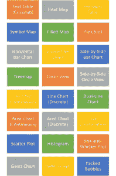

Tableau 的“演示”功能中有 24 个可用图表。让我们讨论一下何时应该使用这些图表，以及在度量和维度方面的最低要求是什么——继续向下滚动:)

**文本表格(Crosstab)**

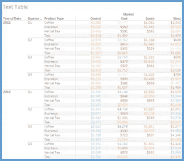

*   何时使用:类似于 Excel 表格，[文本表格](https://www.youtube.com/watch?v=4TjGtm8qvME)允许你查看行和列中的数据。这不是一个很好的视觉图表，但是，有时它有助于看到你在拉什么数据。您可以通过使用颜色来修饰文本表格。如果您希望在没有任何额外视觉提示的情况下以行和列的形式查看数据，请使用此选项。
*   最低要求:1 个或多个维度，1 个或多个度量

**热图**

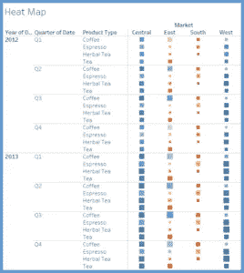

*   何时使用:类似于文本表格，但使用大小和颜色作为描述数据的视觉提示。让我们可以轻松地讲述一个关于数据的故事。使用颜色和大小来比较类别是一种有效的方法。
*   最低要求:1 或多个维度，1 或 2 个度量

**高亮显示表**

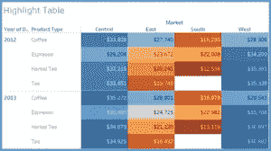

*   何时使用:用颜色[突出数据](https://www.youtube.com/watch?v=4xbxHOFPAo8)讲故事。也类似于 Excel 表格，但单元格是彩色的(类似于 Excel 中的条件格式)。可用于跨行和列比较值。如果需要，您可以更改配色方案(不同的颜色)并反转连续的颜色。
*   最低要求:1 个或更多维度，1 个度量

**符号图**

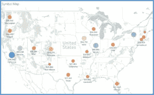

*   何时使用:使用酷炫的地图视图讲述包含地理数据的故事。可以突出你在哪里有最多的销售，或者确定一个位置的客户集中程度。使用尺寸和颜色使视觉流行。此外，您可以将标记更改为不同的形状，甚至使用[自定义形状](https://www.youtube.com/watch?v=0nn5E7bG8-8)。您还可以使用地图图层来创建其他视觉效果(移除海岸线等)。需要确保您有地理维度(如州)。您可以做的另一件事是使用地图作为其他类型的图表、图形和表格的过滤器。将地图与其他相关数据结合起来，然后将其用作过滤器，以深入分析您的数据。
*   最低要求:1 个地理维度，0 个或更多维度，0 到 2 个度量

**填充地图**

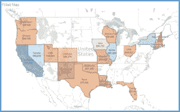

*   何时使用:与上面讨论的符号地图类似，但是，为了讲述故事，您使用颜色来填充地理区域，而不是符号。你可以用颜色透明度和边框来增强视觉效果。同样，地理维度是必需的。当你在处理地理数据时，一个[填充的地图](https://www.youtube.com/watch?v=Q1dK4cHUH44)是一个很好的视觉效果。
*   最低要求:1 个地理维度，0 个或更多维度，0 到 2 个度量

**饼状图**

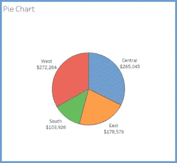

*   什么时候用:不要用[饼状图](https://www.youtube.com/watch?v=BUZTbMkPenI)！开个玩笑，如果你真的需要，你可以使用它们，但是要注意，它们在描述数据时并不总是非常准确。例如，如果在上面的饼图中没有实际的数据点，我们就无法判断西部和中部哪个地区的销售额更高；因为馅饼的大小非常相似。它们最适合显示比例或百分比关系。如果使用得当，饼图可以快速显示度量中其他数据点的相对值。Tableau 建议用户将饼图扇区限制为六个。如果你有六个以上的比例需要沟通，可以考虑条形图。当楔形区的数量过多时，很难有意义地解释饼图。
*   最低要求:1 个或多个维度，1 或 2 个度量

**水平条形图**

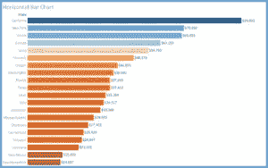

*   何时使用:这可能是最常用的图表，并且有充分的理由。它让数据变得很容易理解，并讲述了一个好故事。我们可以很容易地看到哪些类别比其他类别有更高的数字。在 Tableau 中，您可以使用颜色、标签和排序来讲述一个故事。一个[水平条形图](https://www.youtube.com/watch?v=VBB99NBOBLI)是一种简单而有效的交流特定类型数据的方式，这也是它们如此受欢迎的原因。
*   最低要求:0 或更多维，1 或更多度量

**堆积条形图**

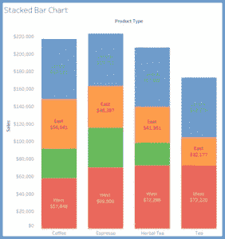

*   何时使用:类似于上面讨论的水平条形图，您可以使用[堆积条形图](https://www.youtube.com/watch?v=jOMtOrUhajc)来显示类别中的数据，这些类别也分为子类别。在上面的示例中，我们有按产品类型划分的销售总额，并进一步划分为区域。它能让我们看到比常规条形图更多的细节。
*   最低要求:1 个或多个维度，1 个或多个度量

**并排条形图**

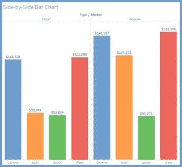

*   何时使用:类似于条形图，您可以使用此图表显示并排的数据比较。在本例中，我们将查看产品的地区和类型(无咖啡因与普通)。颜色的使用使我们更容易比较每个地区不同产品类型的销售总额。并排条形图类似于堆叠条形图，只是我们取消了条形图的堆叠，将条形图并排放置在水平轴上。
*   最低要求:1 个或多个维度，1 个或多个度量

**树形图**

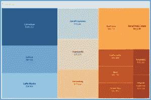

*   何时使用:您可以使用树形图来显示分层(树形结构)数据和部分到整体的关系。Treemapping 非常适合在一个可视化界面中同时显示大量项目。该视图非常类似于热图，但是框是按照层次结构中接近的项目分组的。
*   最低要求:1 个或多个维度，1 个或 2 个度量

**圆形视图**

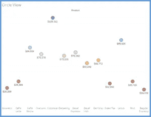

*   何时使用:圆视图可用于对比分析。您可以通过将形状更改为三角形、圆形、正方形等来自定义您的视图。您还可以更改所选标记的颜色和大小。它显示了所描述的类别中的不同值。
*   最低要求:1 个或多个维度，1 个或多个度量

**并排圆形视图**

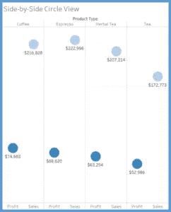

*   何时使用:类似于圆形视图。在这里，我们可以在特定类别中使用圆形(或其他形状)来比较利润和销售额等指标。
*   最低要求:1 个或多个维度、1 个或多个度量(至少需要 3 个字段)

**折线图(连续)**

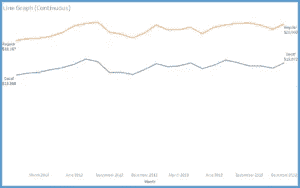

*   何时使用:要使用[折线图，](https://www.youtube.com/watch?v=LYEbq2_q2UY)必须有日期(年、季度、月、日等)。当你试图讲述一段时间内事情是如何变化的时候，这是非常有用的。您可以在视图中使用多行来显示连续的数据流。
*   最低要求:1 个日期、0 个或多个维度、1 个或多个度量

**折线图(离散)**

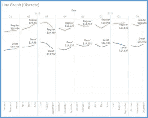

*   何时使用:类似于连续折线图，您必须有一个日期字段才能使用此图表。这两者的区别在于你所显示的数据类型，是离散的还是连续的。正如您在两个示例图表图片中所看到的，连续图在所选的时间段内平滑流动。与每个季度(3 个月)后中断的离散图表相反。这允许您对图形进行切片和切块，以便进一步分析。
*   最低要求:1 个日期、0 个或多个维度、1 个或多个度量

**双线图**

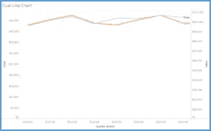

*   何时使用:在一段时间内比较两个度量时使用。此视图产生不同步的轴，但是您可以右键单击轴并选择同步轴(如果它对数据有意义)。双线图(也称为双轴图)是折线图的扩展，但有一个明显的例外:它允许用两个不同的轴范围来表示多个度量。这是通过给垂直轴的右侧和左侧分配不同的度量来实现的。这样，你就可以比较两种不同的度量。
*   最低要求:1 个日期、0 个或更多维、2 个度量

**面积图(连续)**

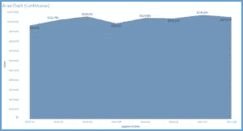

*   何时使用:[面积图](https://www.youtube.com/watch?v=BGAK-FFAZwE)是折线图和堆积条形图的组合。它显示总数的相对比例或百分比关系。如果使用多个维度，图表会将体积堆叠在线条下方，图表会显示字段的总数以及它们彼此之间的相对大小。与折线图类似，您必须有一个数据字段才能创建一个随时间变化的视图。此图表用于连续日期。
*   最低要求:1 个日期、0 个或多个维度、1 个或多个度量

**面积图(离散)**

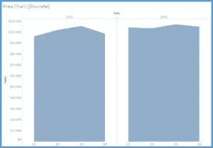

*   何时使用:另一个面积图，显示与连续面积图相同的数据，但这个处理离散值。它允许您了解数据切片的情况(按您选择的时间段，例如季度、年等)。日期字段在这里是一个明确的要求。
*   最低要求:1 个日期、0 个或多个维度、1 个或多个度量

**双重组合**

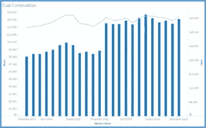

*   何时使用:允许您创建一个视图，在一个图表中显示两个不同的度量(例如利润和销售额)。如果对数据集有意义，可以同步轴。
*   最低要求:1 个日期、0 个或更多维、2 个度量

**散点图**

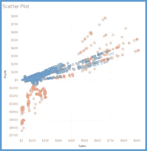

*   何时使用:[散点图](https://www.youtube.com/watch?v=Pn5MzA0fVwI)对于比较两种不同的度量和识别模式非常有用。与圆形视图和并排圆形图一样，散点图也使用符号来可视化数据(您可以将符号自定义为各种形状)。在散点图中，图表中的两个轴都是度量而不是维度(一个度量在列架上，另一个度量在行架上)。您可以在散点图中添加趋势线；这将清楚地定义您的数据之间的相关性。此外，考虑添加一些有用的过滤器，允许用户与数据交互并识别数据中的各种趋势/模式。
*   最低要求:0 或更多维，2–4 个度量

**直方图**

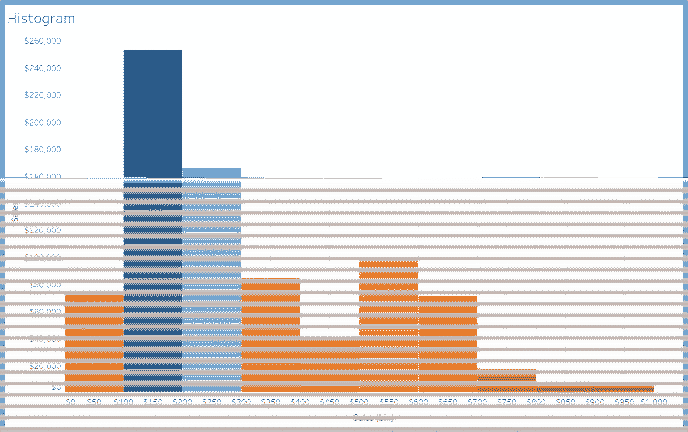

*   何时使用:直方图是数据分布的直观表示。Tableau 将您的测量划分为离散的间隔或箱。当您想要分析数据是如何分布的时，这非常有用。
*   最低要求:1 个度量(bin 字段)

**盒须图**

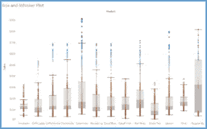

*   何时使用:这是 Tableau 提供的一个更复杂的图表。它还处理数据的分布。如果你观察视觉效果，它看起来是一个两端都有胡须伸出的盒子。方框表示第一个和第三个四分位数之间的值，触须表示最低值到第一个四分位数和第四个四分位数到最高值之间的距离。首先确定数据集的中位数。这是盒子从灰色变成浅灰色的地方。然后，确定上下四分位数。这些只是上半部分数据的中位数和下半部分数据的中位数。这就形成了“盒子”数据集的最大值是上限，而数据集的最小值是下限。这就形成了情节的“脉络”。
*   最低要求:0 或更多维，1 或更多度量

**甘特图**

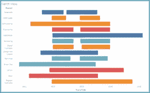

*   何时使用:这是项目管理中常用的，用来查看各种任务是否按计划进行。甘特图是一个很好的可视化工具，可以用来描述与时间相关的信息，无论是用于计划还是其他需要。
*   最低要求:1 个日期、1 个或多个维度、0–2 个度量值

**子弹图**

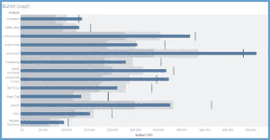

*   何时使用:使用此图表比较目标数据和实际数据。例如，查看实际销货成本(COGS)与预算 COGS。它显示你在哪里达到了目标，错过了目标，或者超过了目标。与目标销售额相比，这对于分析实际销售额非常有用。你可以在这张图表上玩玩大小和颜色来帮助讲述一个故事。
*   最低要求:0 或更多维，2 个度量

**包装好的气泡**

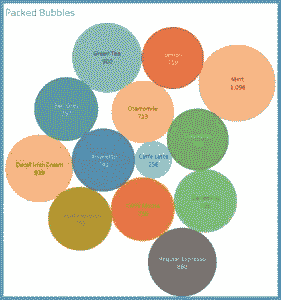

*   何时使用:这是一个有趣的视觉创造和观看！它说明了与轴无关的关系值。气泡被尽可能紧密地包装起来，以有效地利用空间。你可以改变泡泡的大小。正如我在地图视图中提到的，我还建议使用这个气泡图视图作为过滤器来深入查看其他数据。
*   最低要求:1 个或多个维度，1 个或 2 个度量

**资源链接:**

[http://www . tableau . com/sites/default/files/media/which _ chart _ V6 _ final _ 0 . pdf](http://www.tableau.com/sites/default/files/media/which_chart_v6_final_0.pdf)

[https://www . interworks . com/blog/ccapitula/2014/08/04/tableau-essentials-chart-types-text-table](https://www.interworks.com/blog/ccapitula/2014/08/04/tableau-essentials-chart-types-text-table)