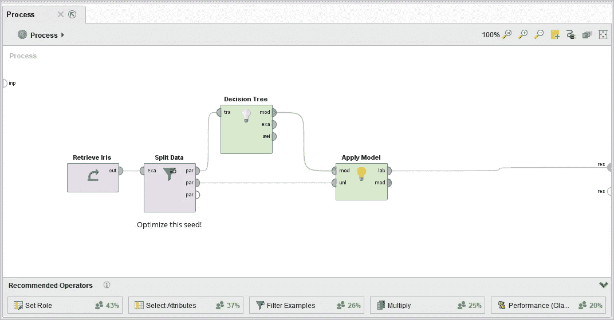
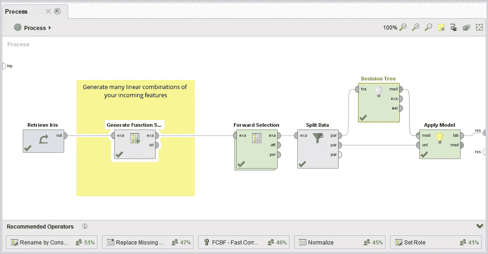

# 提高模型性能的终极指南

> 原文：<https://towardsdatascience.com/the-ultimate-guide-to-better-model-performance-c6bcc832aeb7?source=collection_archive---------7----------------------->

Picture by RawPixel [via Pixabay](https://pixabay.com/en/board-business-company-creative-2449726/) — CC0

你有没有遇到过这样的情况:你需要一个更好的 ML 模型，但是它不起作用？这是提高性能的终极指南。

# 1.避免验证

获得更好性能的最简单方法可能是避免所有这些疯狂的验证。引用我一个好朋友的话:

> 验证只会让结果变得更糟

因此，让我们将我们的模型应用于它被训练的数据，并报告性能。如果真的有人声称这是不正确的，那就开始谈正规化。当然，你的辍学，L1 和 L2 的正规化等等。处理过度拟合！

**专家提示**:如果你不能这样做，使用 K-最近邻分类器并减少 K！

# 2.使用分割验证并努力尝试

比方说，有人强迫你验证你的模型。在这种情况下，第一个方法应该是分割验证。如果有人认为 k-fold 可能是一个更好的主意:只要把计算时间俱乐部从你的衣柜里拿出来！谁会为了*又一次*验证而牺牲 10 倍的 CPU 能力呢？

Split Validation set up in [RapidMiner](https://rapidminer.com/). You can get very good results if you optimize the seed of your split.

为了得到好的结果，你应该首先选择一个合理的测试规模。我建议 95%用于培训，5%用于测试。这增加了你获得更好结果的可能性。

诀窍是优化分裂的随机种子。相信我，足够努力，你会得到更好的结果！

一些人可能会认为随机种子往往会给出更好的结果是不合理的:他们显然不理解简单的统计学。如果你想避免这些讨厌的讨论，就优化那些完全无用的选项。这也有同样的效果。

# 3.只验证你分析的一部分

如果这个技巧没有足够的帮助，显然是时候进行更复杂的分析了。数据科学家的最佳工具之一是特征生成和特征选择。所以让我们开始创造一些新的功能吧！初学者的错误在于将特征生成和选择视为建模步骤的一部分。谁会这样想呢？即使是一个 excel-jerk 也可以自己生成新功能。因此，您现在应该不顾一切地停止将特性选择和生成放到您的验证中。

Another quick way for better performance. Just select the “right features” before your validation starts! Picture of a process in [RapidMiner](https://rapidminer.com/)

当然，你现在应该生成许多新的特性:越多越好！之后，你可以用复杂的特征选择技术来选择“正确的”。

专业提示:将这两件事完全分成两个独立的脚本总是一个好主意。不要让任何人产生这样的想法，即特征选择是模型拟合过程的一部分！

# 4.手动特征生成

一个好的实践当然不仅仅是使用通用特性，而是使用领域知识来生成正确的特性。一个非常成功的方法是整合领域知识。实现这一点的一个好方法是查看测试集中错误分类的例子。你当然可以建立定制的特征，让你的算法更好地分类这些东西，对不对？

专业提示:如果你碰巧不知道你的数据是关于什么的——谁还需要商业理解呢？—让企业参与进来！有大量的文章围绕如何让这些愚蠢的白痴！只需在他们的 BI 解决方案中公开您的测试集的结果！让他们向你推荐新的规则，说明为什么事情是错的，并把这些纳入其中。这样你可以一石二鸟:更好的模型和接受！

# 5.保持时调整超参数

可能会发生这样的情况，一些讨厌的评论家强迫你使用一个单独的维持集。去他的！他对正规化的理解肯定比训练错误的家伙还要少。

拒绝可能非常棘手，会妨碍你获得良好的业绩。一个显而易见的解决方案是再次选择*右*参数。读数:适用于*所有*数据集的参数。谁会报告不工作的东西呢？

这种方法在学术论文中非常有效，因为您可以访问完整的数据集。不要让自己在这里止步于道德暗示！每个人都在四处移动一些棋子。

**专业提示:**你当然可以将这种方法与第四种方法结合起来，为坚持创造正确的特征。

# 6.改变问题

这可能是最先进的技术。如果上面的招数都不行，你还可以*重新解读*问题。这是计算机科学家的老把戏，专注于你能解决的事情。

稍微调整一下天平就能提高你的准确度。对不确定的预测稍加忽略可以提高你的精确度。你想预测客户流失？只在下周做，而不是下个季度。你的 AUC 当然会提高！

这方面的专家不仅改变了这个问题，还改变了如何定义成功的方式。在开始一个项目之前，不要把自己放在一个位置上，定义成功。只需将您的绩效评估与可能的情况保持一致。

**专业提示**:避免使用可以理解的绩效衡量标准。这会让用户对你评头论足！永远保持你的自信。好的衡量标准当然是 AUC、AUPRC、LogLoss 和 RMSE。

# 结论

不遵循本指南是成为更好的数据科学家的第一步。