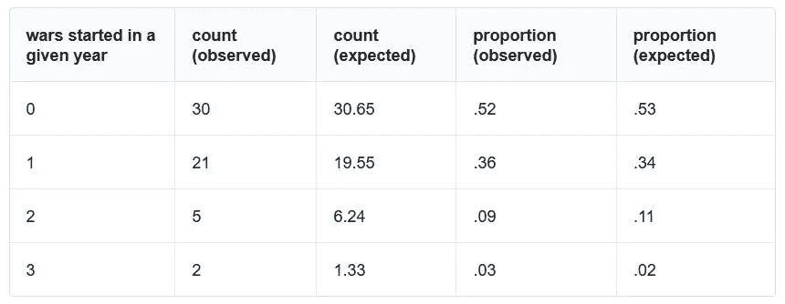

# 致命争吵的(不变的)统计数字

> 原文：<https://towardsdatascience.com/the-unchanging-statistics-of-deadly-quarrels-31cd8ab49a17?source=collection_archive---------4----------------------->

致命争吵的统计数据由刘易斯·弗莱·理查森撰写，于 1960 年出版。这本书因其发现和作为应用于国际关系领域的定量方法的第一个例子而闻名。作为一名职业气象学家，理查森将他革命性的、现在广泛使用的天气预报方法用于州际冲突的爆发，希望通过分析 1809 年至 1950 年间的数据来找到预测变量。虽然理查森在这方面失败了，但他有一个相对令人震惊的发现:战争的爆发反映了流星撞击和地震等罕见事件的发生率，或被称为“不可抗力”的事件类别。

这些事件和其他事件的发生，如基因突变和客户到达，可以用泊松分布进行统计建模。泊松分布的基本要求是事件的发生相互独立，并且发生率在所研究的时间段内是固定的。战争的爆发将遵循符合这些假设的分布，这提出了有待解决的有趣的数学和哲学问题，同时也肯定和否定了这一领域内预测尝试的价值。

An illustration of Richardson’s vision of human computers performing calculations within a forecast factory. [NOAA / *L. Bengtsson*](https://celebrating200years.noaa.gov/foundations/numerical_wx_pred/theater.html)*.*

我第一次知道 Richardson 的工作是在飞机上阅读六月版的*哈珀杂志*时。这篇文章的作者加里·格林伯格(Gary Greenberg)继续描述理查森是一个幻想家，他想象着装满“计算机”(在这里是人)的大房间，这些计算机将对输入的数据进行实时计算。作为理查森远见卓识的恰当证明，我碰巧在去华盛顿的途中*，在那里我将作为一名定量地缘政治分析师实习一个夏天。大数据时代已经到来，2000 亿美元的产业现在反映了一种信念的普及，即任何问题都可以通过足够的观察和计算能力来回答。*

出于好奇，我决定从理查森停止的地方开始，对至今的州际冲突进行同样的分析。具体来说，我想比较每年发生的 *n* 次的频率与泊松分布中的预期频率。谢天谢地，今天的任务比 50 年前容易多了。对我来说，不再有单调的翻阅百科全书或冗长的手工计算。在相对简单的谷歌搜索之后，我能够从 UCDP/PRIO 武装冲突数据集获得我需要的数据，这为我提供了从 1946 年到 2009 年的良好编码的观察。(为了避免重叠和由此产生的偏见，我只研究了 1952 年以后的年份。)和 60 行代码之后，结果如下:

总的来说，有 30 年没有爆发新的冲突，21 年爆发了一场冲突，5 年爆发了两场冲突，两年爆发了三场冲突。通过比较预期列和观察列的值可以看出，实际冲突爆发的分布反映了泊松分布。使用 Yate 的校正卡方拟合优度测试在 95%的置信水平下验证了这一点。从结果来看，理查森的发现似乎在我们进入新的千年时仍然具有相关性。

在 [GitHub](https://github.com/zacharykitt/analyses/blob/master/deadly_quarrels.py) 上查看我的代码。

来源:

*   [《空洞的统计》作者约翰·沃斯](http://quixoticfinance.com/tag/lewis-richardson/)
*   *计算科学:致命争吵的统计数据*
*   基本商业统计:概念和应用(第 10 版)作者:大卫·勒文和马克·贝伦森
*   [亚特修正卡方检验](http://imaging.mrc-cbu.cam.ac.uk/statswiki/FAQ/yates)
*   [《数字安全》作者加里·格林伯格](https://harpers.org/archive/2017/06/safety-in-numbers/)