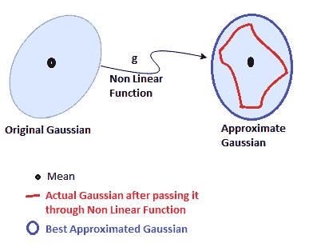
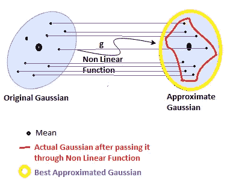
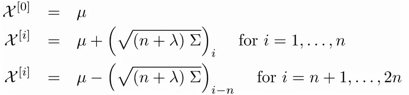
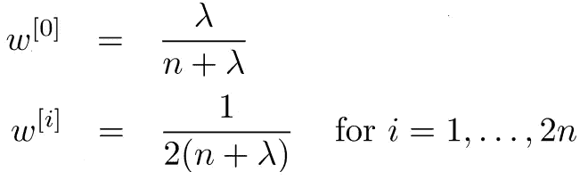
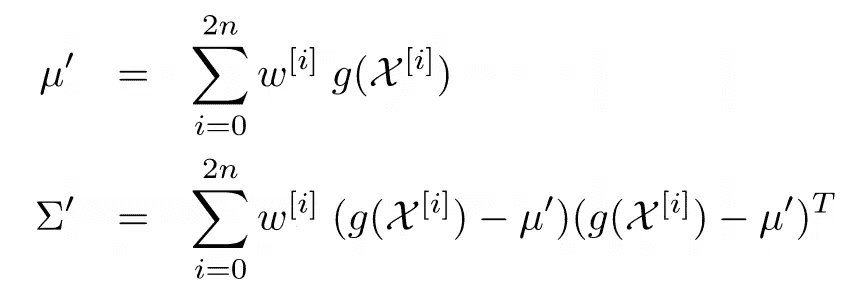
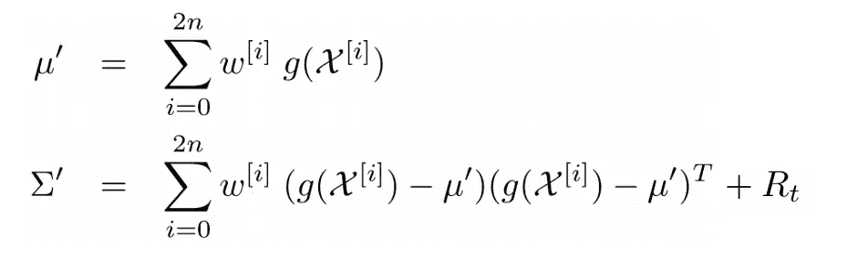
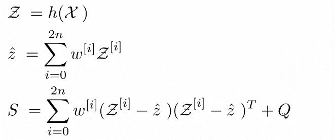
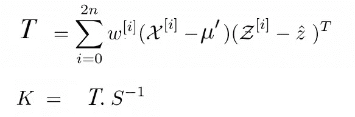
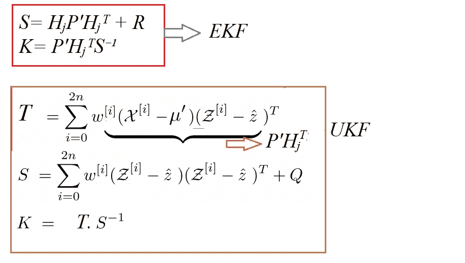
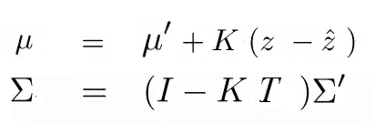

# 无味卡尔曼滤波器:EKF 能做的任何事，我都能做得更好！

> 原文：<https://towardsdatascience.com/the-unscented-kalman-filter-anything-ekf-can-do-i-can-do-it-better-ce7c773cf88d?source=collection_archive---------1----------------------->

我刚刚完成了 Udacity 自动驾驶汽车纳米学位的第二学期。我写过关于[卡尔曼滤波器](/kalman-filter-interview-bdc39f3e6cf3)和[扩展卡尔曼滤波器](/extended-kalman-filter-43e52b16757d)。今天我们将看看卡尔曼滤波器家族的另一个成员:无味卡尔曼滤波器。所以，如果你看了我的前两篇文章，你现在应该已经认识我的同事拉里了。

总结:
**卡尔曼滤波器** : *它是一种在假设我们的数据是高斯分布的形式，并且我们将线性方程应用于那个高斯分布的情况下，使用一堆数学方程来预测值的工具。*

**扩展卡尔曼滤波器** : *在现实世界中，我们有非线性方程，因为我们可能在一个方向进行预测，而我们的传感器在另一个方向进行读取，所以它涉及非线性的角度和正弦余弦函数。因此，EKF 利用泰勒级数(以及进一步的雅可比矩阵)来线性逼近高斯平均值附近的非线性函数，然后预测数值。*

# 无味卡尔曼滤波器

拉里:我知道卡尔曼滤波器和扩展卡尔曼滤波器，现在怎么办？我知道卡尔曼滤波在现实生活中失败的原因和扩展卡尔曼滤波的需要。为什么要用无味卡尔曼滤波器呢？
我:性能。

拉里:性能？怎么会这样我:在 EKF 我们用了多少个点来从非线性函数逼近一个新的线性函数？

拉里:1 点，这是高斯分布的平均值。
我:正确，那么有没有更好的线性化方法？

拉里:你是什么意思？
我来看看下面在 EKF 发生的事情:

Figure 1\. Scenario of Gaussian Approximation in EKF around the mean

我们只有一个点来近似高斯函数。那么，有没有更好的线性化方法呢？

拉里:如果我早知道，我就不会和你说话了。告诉我！
我:你觉得会给我们一个更好的近似？假设我们有两个场景来从源高斯到达近似高斯-:
场景 1:我们有一个点(比如说均值)并且我们在一个点附近近似。
场景 2:我们有一堆点，包括平均值，我们围绕这些多个点进行近似。

拉里:我的直觉告诉我，如果我们像场景 2 那样有多个点，我们会有一个更好的近似值！
我:恭喜！你现在知道了无迹卡尔曼滤波器。

拉里:既然如此，为什么不考虑高斯源中的所有点，然后进行变换和近似呢？
我:那会耗费大量的计算能力和资源，所以可能是最琐碎的解决方案但不是最优的。

## 适马点

拉里:哦！！那么我们如何选择正确的点数呢？
我:所以在无迹卡尔曼滤波中我们有一个**适马点的概念。我们在源高斯上取一些点，将这些点通过一些非线性函数后映射到目标高斯上，然后计算变换后高斯的新均值和方差。**

通过非线性函数来转换整个状态分布可能非常困难，但是转换状态分布的一些单独的点是非常容易的，这些单独的点是 sigma 点。这些西格玛点是整个分布的代表。

## EKF 和 UKF 的基本区别

这里与 EKF 的主要区别在于，在 EKF 我们只取一个点，即平均值和近似值，但在 UKF 我们取一堆称为 sigma 点的点，近似值的事实是，点的数量越多，我们的近似值就越精确！

Figure 2\. Scenario of Gaussian Approximation around the Mean and other sigma points

拉里:太好了！明白了！这很简单。
我:嗯，不是这样的，除了 sigma 点，这些点也是有权重的，所以这些就是**加权 sigma 点**。

## 无味变换

拉里:那么，在这种情况下，我们或多或少会偏向某些点，以使我们的近似更好？我:是的，没错。
当一个高斯函数通过一个非线性函数时，它就不再是一个高斯函数，而是我们从结果图中逼近高斯函数，所以在 UKF，一个叫做**无味变换**的过程帮助我们完成这个任务。下面总结一下 unscented 变换执行的步骤。计算适马点集
2。给每个西格玛点分配权重
3。通过非线性函数
4 变换点。从加权和变换的点计算高斯分布
5。计算新高斯的均值和方差。

## 计算适马点

*拉里:但是我们如何选择适马点呢？我:西格玛点的数量取决于系统的维数。通式为 **2N + 1，**其中 N 表示尺寸。*

Figure 3\. Choosing Sigma Points Equations

> χ(Caligraphic X) ->适马点矩阵
> μ - >高斯均值
> n- >系统维数
> λ- >比例因子
> σ->协方差矩阵

## χ(校准 X)

χ表示适马点矩阵。这里需要注意的一点是，χ的每一列都表示一组 sigma 点。因此，如果我们在二维空间中工作，那么χ矩阵的大小将是 2×5。因为每个维度有 5 个 sigma 点。

## λ

λ是比例因子，它告诉我们应该选择离均值多远的 sigma 点。一项良好的数学研究表明λ的最佳值为 3-n。

显然，其中一个西格玛点是平均值，其余的我们根据上面的等式计算。

拉里:等一下，矩阵的平方根？我从来没听说过！
我:嗯。如果我们有一个满足下列条件的矩阵 S，则定义矩阵的平方:

> σ= S . S 或σ= S . S _ transpose

如果我们能够找到 S，那么我们可以说 S =√√

## 计算适马点的权重

拉里:哦！这是一个需要了解的新事物，那么分配给这些计算出的 sigma 点的权重呢？
我:哦，权数太有方程式了:

Figure 4\. Calculating Weights of the Sigma Points

计算平均值的权重有一个不同于其余 sigma 点的等式。λ是扩展参数，n 是维数。**这里需要注意的一点是，所有权重的总和等于 1。**

## 计算近似高斯的均值和协方差

拉里:哦，天哪！这么多方程式！现在我们有了 sigma 点，权重，那么我们如何在高斯通过非线性函数 g 之后恢复它呢？
我:又一堆方程式:D

Figure 5\. Calculating New Mean and Covariance

> μ′->预测均值
> σ′->预测协方差
> w->sigma 点的权重
> g - >非线性函数
> χ(Caligraphic X) - >适马点矩阵
> n - >维数

这就是关于无味变换及其工作原理的全部内容。

## 预测步骤

拉里:嗯，那么如何在卡尔曼滤波器的一般预测-更新模型中使用无迹变换呢？我:所以预测步骤基本上非常接近我们刚才讨论的，即无迹变换。

1.  **使用图 3 中的等式计算适马点-** 。
2.  **使用图 4 中的等式计算适马点数-** 的权重。
3.  **变换适马点并计算新的均值和协方差-** 它非常接近图 5 中提到的方程。每当我们预测会发生什么？我们的不确定性增加了一些，因为我们变得有点不确定，所以我们必须考虑过程噪声。

Figure 6\. Predicted mean and covariance after accounting in Noise R

## 更新步骤

拉里:现在我们有了预测的均值和协方差。在更新步骤中，假设我们有一个来自传感器的测量值，那么我们如何计算预测的均值和协方差值与实际均值和协方差值之间的差异呢？我:这个过程和卡尔曼滤波器的过程很相似。所以我们在这里做的是，把我们的预测状态带到测量状态。

**现在，我们有一个选项，我们可以再次生成西格玛点，因为预测的均值和方差发生了变化，西格玛点在某种程度上依赖于它们，或者我们只是继续使用之前生成的相同的西格玛点集合。暂时让我们只考虑我们之前生成的 sigma 点。**

我们把我们的状态从我们的状态空间带到测量状态空间。

Figure 7\. Update Step considering the measurement spacce

> Z ->在**测量**空间中转换的西格玛点
> χ(Caligraphic X) - >西格玛点矩阵
> 测量空间中的 ẑ - >均值
> 测量空间中的协方差
> Q- >噪声
> h- >是将我们的西格玛点映射到测量空间的函数

**重要提示:Z 是我们的测量空间，即来自传感器的测量值。所以我们需要一个函数 h，它可以把我们的状态空间转换到测量空间，这样我们就可以用相同的单位把它们等同起来。**

拉里:太好了！我们如何计算卡尔曼增益呢？我看到这里不再有雅可比矩阵了，因为我们没有线性化这个函数！我:这是一个非常重要的概念，我们不再将函数线性化了！关于卡尔曼增益，这里有一点变化。
计算预测中的误差:我们需要计算状态空间中 sigma 点和测量空间中 sigma 点之间的互相关性。

Figure 8\. Calculating Kalman Gain

> T ->状态空间和预测空间之间的交叉相关矩阵
> S- >预测协方差矩阵
> K- >卡尔曼增益

拉里:哦，天哪！方程式改了很多！
我:如果你仔细观察就不是了！请看下面:

Figure 9\. Comparison of Calculating Kalman Gain in EKF and UKF

赖瑞:是的，相似之处是一样的！甚至计算最终状态的方程也是一样的？我:是的，几乎一样。

Figure 10\. Predicting Final State after calculating Kalman Gain

> μ ->均值
> σ->协方差
> μ′->预测均值
> σ′->预测协方差
> K - >卡尔曼增益
> z- >来自传感器的实际测量均值
> ẑ - >均值在测量空间
> T - >与卡尔曼滤波中的 h 和 EKF 中的 Hⱼ 相同。这是交叉关联矩阵

拉里:最后一个问题。为什么叫无迹卡尔曼滤波器？我:嗯，发明 UKF 的人认为 EKF 很糟糕，因为在一个点上线性化一个非线性函数是一个非常糟糕的主意。因此，他们认为，如果他们对数据进行采样并选取一些点，那么将会得到更好的结果。然而，他们的教授是 EKF 的超级粉丝，他不赞成 UKF 的想法。所以那些家伙发表了研究论文，并故意称之为无味的，这样他们就可以告诉世界，EKF 很臭！！

拉里:太好了！感谢您的宝贵时间！

好了，大家都到齐了。我试图用一种非常简单的方式来解释卡尔曼滤波器家族。希望你看完帖子后有所收获。我将在接下来的帖子中尝试提供卡尔曼滤波器家族的代码。

> [卡尔曼滤波器](/kalman-filter-interview-bdc39f3e6cf3)
> 
> [扩展卡尔曼滤波器](/extended-kalman-filter-43e52b16757d)

如果你发现任何错误，你可以联系我@LinkedIn [这里](http://linkedin.com/in/harveenchadha/)。