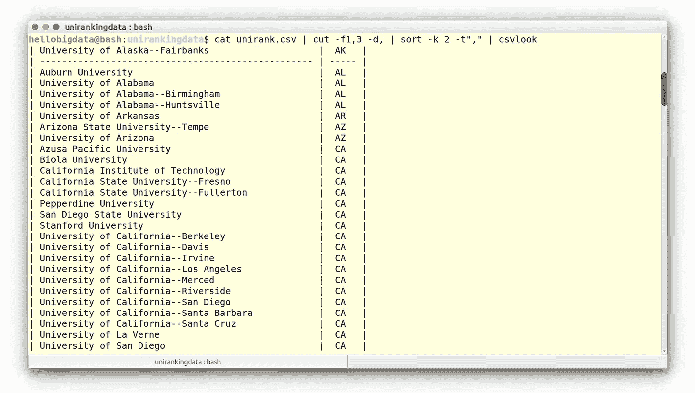
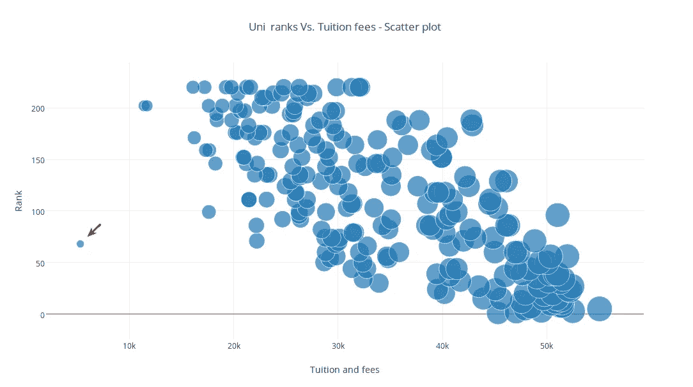

# 在命令行中探索美国大学排名 2017(第三部分——剪切、排序和 uniq)

> 原文：<https://towardsdatascience.com/the-us-university-ranks-2017-at-the-command-line-part-iii-cut-sort-and-uniq-1a81dc0279c2?source=collection_archive---------9----------------------->


Image adopted and modified from the unsplash.com

各位编码员好！欢迎回到我的系列课程**数据科学@ Bash Shell** 。在这一课中，我们要计算美国各州在数据集中有多少机构被排名。

您应该从下面的网页下载数据，因为我们已经稍微简化了数据，让我们将数据保存为:`unirank.csv`

```
wget https://www.scientificprogramming.io/datasets/unirank.csv
```

# 查找每个州的学院数量

让我们从提取每一行中与我们相关的部分开始。在我们的例子中，注意我们对列`#1`和`3`(分别是`university`和`state`的名称)感兴趣。为了提取这些列，我们可以使用名为`cut`的命令，如下所示:

```
$ cat unirank.csv | cut -f1,3 -d,
```

这里，命令行选项`-f`指定从文件中提取哪个字段(列)或`cut`(提取)，选项(`d,`)告诉我们要用逗号(`,`)分隔切割。当您运行该命令时，您应该看到输出只包含诸如 university `names`和`states`这样行。注意，尽管名称如此，`cut`命令并不修改它所作用的原始文件。现在到最后一部分。我们想数一下每个州有多少警察。然而，这是一个复杂的过程，没有一个命令可以做到这一切；我们将不得不使用两个命令。这里我们需要命令`uniq -c`来计算(因此使用`-c`)每个状态有多少个独特的外观。但是，`uniq -c`需要对输入进行排序，所以第一步是`sort`大学和州的列表。我们可以很容易地用一个叫做`sort`的命令来做到这一点:

```
$ cat unirank.csv | cut -f1,3 -d, | sort -k 2 -t”,”
```

`sort`选项:`k 2`告诉排序函数选择列`2`作为键，`t”,”`选项告诉分隔符是逗号(`,`)。



Output: Institutes sorted by states

注意，作为我们的列表被排序的结果，所有具有相同状态的行都紧挨着彼此。现在，正如我们在上面的计划中提到的，我们将使用`uniq -c`来“浓缩”相同的相邻行，在这个过程中，计算每一行有多少被看到:

```
$ cat unirank.csv | cut -f3 -d, | sort | uniq -c
```


Output: Institutes in the CA (California) state.

我们现在有一个列表，列出了每个州有多少大学，很明显，绝大多数排名机构来自加利福尼亚州！

# 找到排名和学费的相关性？

我们已经知道排名和每所大学的学费(在数据中给出)。一个有趣的问题是研究大学排名和学费之间的关系。

为了实现这一点，我们首先将`cat`和`cut`数据中的**学杂费**(列`4`)和排名(列`6`)放入名为`udata.csv`的新数据集中:

```
cat unirank.csv | cut -f4,6 -d, > udata.csv
```

注意重定向符号(`>`)，帮助我们保存输出。现在，可以使用名为`scatter`(安装:`sudo pip install bashplotlib`)的散点图工具简单地绘制这些数据。

```
cat udata.csv| tail -n +2 | scatter
```

注意`tail -n +2`在将输出一直传递到结束`scatter`之前，不包括第一行，即列标题。然而，这个工具的输出没有多大意义，因为它没有显示任何`x,y` - axes 图例。因此，我们将数据(`udata.csv`)上传到一个名为 **plot.ly** 的在线工具上，产生了下面这张漂亮的散点图:



Output: Ranks vs. tuition: a scatterplot via **plot.ly**

从上面的情节不难理解，排名高的大学学费更高！然而，散点图也描述了一所大学(**杨百翰大学-Provo**)排名更高(排名=68)，学费极低( **$5300 美元/年**)。这是数据集中的异常(异常值)吗？我们把这个问题留给你进一步调查！

# 摘要

在这个项目中，我们已经学会使用一些重要的 bash 命令，如`head`、`tail`、`sort`、`uniq`、`cut`等。在上下文中挖掘由美国学术机构排名组成的 csv 格式的玩具数据集。

参见前面几个部分: [**第一部分**](https://medium.com/towards-data-science/how-to-analyze-us-university-ranks-2017-with-bash-part-i-data-preview-e39b8f2ffee9)[**第二部分**](https://medium.com/towards-data-science/finding-the-percent-of-colleges-in-the-us-university-ranks-2017-at-the-command-line-part-ii-grep-5db6d59f76a1) [🚶](https://apps.timwhitlock.info/emoji/tables/unicode#emoji-modal)

[该项目是'[学习在 Bash Shell 和 Linux 中分析数据](https://www.scientificprogramming.io/learn-bash/)课程的一部分。]

# 相关作品

[](https://www.scientificprogramming.io/learn-bash/) [## 学习在 Bash Shell 和 Linux 中分析数据——学习科学编程

### 一个简单的课程演示了 Bash shell 在处理真实数据集时的使用

www . scientific 编程. io](https://www.scientificprogramming.io/learn-bash/)