# 高级回归技术在房屋价值预测中的应用

> 原文：<https://towardsdatascience.com/the-use-of-advanced-regression-techniques-for-home-value-prediction-c6ecb1f8fbfe?source=collection_archive---------2----------------------->

*从竞争激烈的卡格尔比赛中获得的见解*

# **简介**

以下文档重点介绍了用于解决上述问题的各种技术，以及在创建一个机器学习模型时从这些结果中得出的推论，该模型将在六个时间段内准确估计美国近 300 万套住房的价值。换句话说，我们将预测 Zillow(赞助商)的估计哪里会差，哪里会好。我们用两种方法解决了这个问题。一种方法是将这个问题视为时间序列预测，另一种方法是对特定时期进行预测，并假设这种趋势在未来/过去是遵循的。我们还评估了各种实施方案，以选择最佳方案。本文档将讨论所有技术以及从它们得出的结果和结论。

***评价标准:***

评估标准将是平均绝对误差。因此，我们的目标是准确预测误差。预测误差越接近 Zillow 的误差，我们的预测就越准确。

***数据集描述***

*可以在“参考资料”下找到相关链接。*

# **设计**

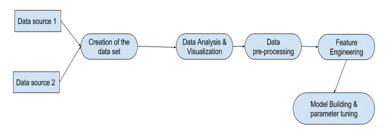

The Overall process execution in a nutshell

# **接近**

正如我们在开始时提到的，我们使用了两种方法来执行这项任务。一种是基于时间序列的预测，另一种是基于趋势延续的预测。

**时间序列预测**

由于我们正在处理的问题有多个要预测的时间段，使用相同的静态特征来预测未来的属性误差只会给我们每个时间段相同的结果，因为不存在有助于实际估计的时变特征。因此，在这种情况下，我们应该有一些时变特征(对时间敏感的特征)，以便对未来数据做出可靠的预测。因此，我们考虑了滑动窗口方法，该方法依赖于根据期望的窗口长度计算的特征。我们数据集中的可变时间窗口大小如下:3 个月、2 个月和 1 个月。之后，我们对目标月之前几个月的时间窗口中的要素进行工程化，以用作目标月数据集中的工程化要素。工程时变特征是，简单移动平均数/均值、标准差、中位数、最小值、最大值和第三个四分位数。只有 4 月、5 月和 6 月的数据包含在我们的最终数据集中。这是这种方法的一个局限性，因为它会导致数据集的显著减少。一种解决方案是考虑具有小宽度的小窗口，但是由于我们不知道哪个窗口给出最佳结果，并且执行交叉验证以确定最佳窗口将是一项繁琐的任务，所以我们选择了具有不同长度和小宽度的窗口，以减少数据集小的不利影响。但是具有更小宽度的窗口的问题在于，如果关于类似资产的销售发生的频率更低，则设计特征的预测能力将更低，因为相同的设计特征在大多数窗口中是多余的。在这种方法中，我们使用了不同的方法来处理类别值，即将一个类别替换为该类别的目标平均值。

**恒定趋势法**

在这种方法中，我们使用 2016 年 1 月至 9 月的数据作为每日可用的数据集来预测 10 月 1 日的误差。假设这种趋势持续到 11 月 1 日和 12 月，因为物业销售很少发生，这也是通过数据集确定的。

# **了解数据**

**properties_2016.csv** 有 58 个列，其中 57 列可用作静态特征，而“*parce lid”*列是每个地块的唯一标识符，因此不会用作特征。 **train_2016.csv** 保存的目标是 2016 年售出的包裹的 *logerrors* 。通过基于 *parcelid* 合并这两个文件，可以将特性和目标合并成一个文件。了解数据集数据的性质为我们提供了一个很好的机会来预先执行必要的预处理操作，以便模型的准确性不会因数据集中的任何偏差效应而受到影响。在本文中，我们将只关注 2016 年 10 月、2016 年 11 月和 2016 年 12 月的预测。

我们正在建模的这个问题是一个回归问题。具体是利用多个变量/特征来确定输出的多元线性回归问题。此外，这个问题利用监督学习方法进行训练。

***数据类型***

合并后的两个文件 **properties_2016.csv** 和 **train_2016.csv** 。在此过程中删除了以下列。帕切里德和*交易日期*因为他们已经没用了。

Data type count

***分类值***

在识别的非数字特征中，两个是分类的，而另外三个是布尔类型的。

***这两个分类列是:***

*地产分区描述*-描述地产允许使用的土地面积(区域)

*propertycountylandusecode*-县(地理区划)土地使用代码

***包含布尔类型值的列有*** :

*hashottuborspa*-酒店是否有热水浴缸或水疗中心

*壁炉标志*——公司是否有壁炉

*taxdelinquecyflag*-该房产的房产税是否到期

***缺失值百分比***

具有以下列名的要素的缺失值占记录总数的 90%以上。有 20 个变量的缺失值百分比超过 90%。

***唯一值计数***

我们这里的目标是消除有大量重复的列(或者换句话说，不太唯一的值)。由于列表非常全面，我们将只添加前三列信息。完整的列表可以在参考文献中找到。

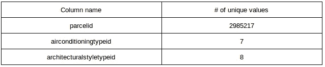

Count of unique values for the first few columns

***统计信息***

获得的每个特征的统计信息如下。为此，我们在熊猫中使用了 describe 方法。缺失的值由虚拟常数 404 填充。第一个特征的结果说明如下，

列名:*空调类型 id*

计数 90275.000000，平均值 275.675262，标准值 187.414780，最小值 1.000000，

Q1 1.000000，Q2 404.000000，Q3 404.000000，最高 404.000000。

**探索数据集**

***频率分布特征***

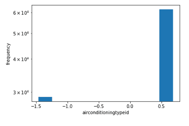

Frequency distribution of a selected feature

因为有大量的特征，所以绘制每个特征是不实际的。因此，为了说明的目的，上面已经示出了其中一个特征。

***目标变量的分布***

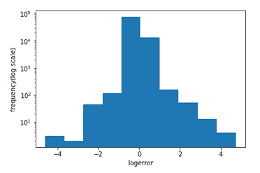

Frequency distribution of target

很明显，目标变量的形状接近正态分布。即使对称形状已经从图的左侧丢失，这可能是由于 Kaggle 为了测试的目的从该区域保留了更多的数据。对数误差大致在-5 到+5 之间变化。此外，y 轴已按对数标度进行了缩放。

***对照目标变化特征***

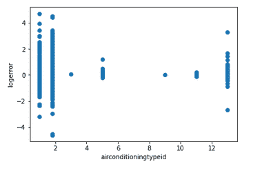

Change in a sample feature against the target

上图显示了所选特性相对于目标的散点图。这显示了特性值相对于目标值的变化。

***聚类结果***

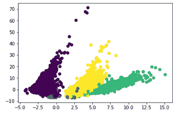

The clustered data point into four clusters

上述结果是在执行聚类数为 4 的 k 均值聚类之后获得的。执行进一步的聚类，将聚类的数量改变为十个和三个。但是最好的分离是通过使用 4 个簇给出的。

***方框图***

这些是用于发现分布异常值的图表类型。每个特征都被构造成一个箱线图。这种箱形图的示例如下:

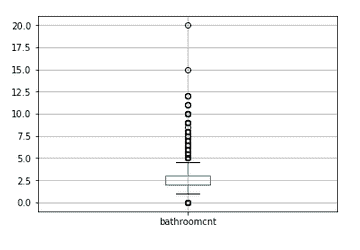

Box plot

***时间序列相关可视化***

其中一些可视化应用于检查特定问题是否可以建模为时间序列问题。

***滞后情节***

用于检查分布是否是随机的。如果分布显示分布中的模式，如季节性、正相关或负相关，则该分布可以建模为时间序列分析。最需要检查的是分布是否随机。因为分布是随机的，所以它不能被建模为时间序列分析问题。在该图中，y 轴显示 t+1 时间戳处的误差，而 x 轴显示 t 时间戳处的误差，该误差相对于 t+1 滞后 1。我们分布的滞后图如下:

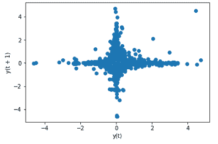

Lag plot

从上面的图中，可以非常清楚地看到，分布在 x 和 y 轴上扩展，而一些点聚集在中心。我仔细观察了一下，如果我们认为分布是十字形的，我们甚至可以发现 4 个异常值。因此这个图表明我们的分布有随机性。但是，我们不应该完全抛弃这种方法，我们应该从不同的角度分析数据，收集证据来验证我们的观点。

***自相关图***

这是检查分布是否随机的另一种方法，通过分析自相关(滞后变量之间的相关性)随滞后数量增加的变化。相关性可以在-1 和+1 之间。如果相关性为-1，则有很强的负相关性。如果相关性是正的，那么就有很强的正相关性。如果相关性为零，就没有相关性。所以为了分析我们的分布是否是随机的，我们应该考虑它是接近零还是正/负。因为分布接近于零，所以分布是随机的。从而支持了我们之前的观点。

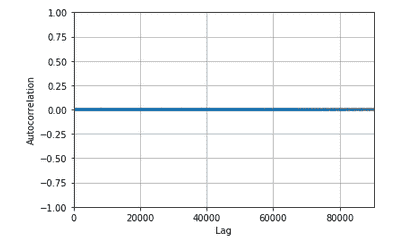

Autocorrelation plot

时间序列数据由 3 个元素组成。这些问题如下

观察到的表示原始曲线。趋势显示曲线的趋势部分，季节显示分布中的季节效应，最后残差显示从原始曲线中移除趋势和季节属性后的剩余部分。

*房产的变化是指通过不同的窗口*

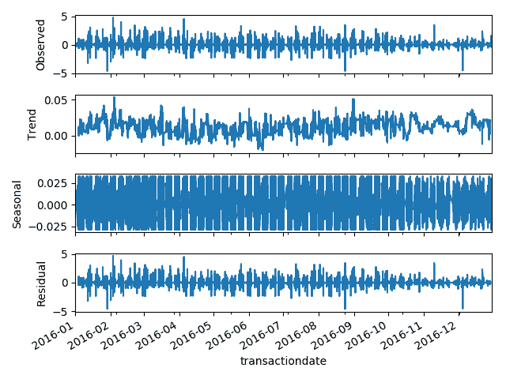

Time-series decomposition

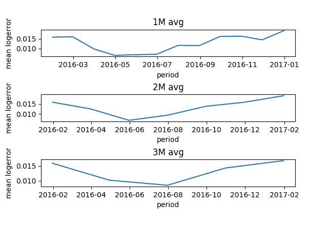

Variation of property means over different time periods

上图描绘了一个月、两个月和三个月时间窗口内属性平均误差的变化。

# **数据预处理**

**缺失值的插补**

为了输入缺失值，我们使用了一些技术，例如用列的平均值、列的中值和列的标准偏差来替换列中的缺失值。

**标准化**

当我们使用神经网络实现时，这种技术是必需的。归一化意味着对数据集进行缩放，使其均值为零，标准差为一。

**处理分类值**

我们有两个分类变量。首先，我们必须应用一个标签编码器将分类值转换成数值，因为所有的转换只能在数值数据上执行。sklearn 包中的 **LabelEncoder** 给出从 0 到 number_of_labels-1 的值给分类值。但是我们在这之后发现，这产生了大量的类，导致在应用诸如一键编码之类的方法时出现资源限制。因此，我们必须找到用最少数量的类来表示类别的方法。所以我们看了下面两种方法，

一种方法是使用分层聚类，在这种情况下，我们将使用一种算法，通过确定要使用的最佳聚类数来执行聚类。为此，我们使用了均值漂移算法，该算法需要密集的计算能力，每次运行只能处理 10，000 个样本，但我们有 80，000 多个样本。一种解决方案是分批进行训练，但是聚类算法将聚类标签随机分配给聚类。因此，我们不能确保在后面的迭代中遵循与初始迭代中相同的分配标准。所以我们决定按照 k-means 的平面聚类算法进行聚类，这需要声明我们需要的聚类数作为算法的参数。因为我们需要检查增加或减少集群数量是否会对评估指标产生影响。我们使用不同的值来表示聚类数，例如 3、5 和 10。但是，在我们执行聚类之后，仍然存在一个问题，我们将聚类标签分配给与该聚类相关的分类变量中的值。然后，我们对每个分配的标签执行一键编码。在一次热编码完成后，编码的二进制值将被分成单独的列，这意味着将聚类的数量增加到一个大的数字，如 10，将导致 20 个新列被添加到当前数据集中。由于每个要素都表示为输入空间中的一个维度，因此增加一个维度会导致时间复杂度呈指数级增长。因此，引入 20 个额外的列将导致非常高的复杂性。

另一种方法涉及基于频率的标记。这里，我们给出现频率低于 50%的类标上 0，给出现频率高于 50%的类标上 1。可以更改阈值来检查它是否对所关注的度量有任何显著的改进。采用这些方法并没有带来任何显著的改善。

**其他预处理**

我们还删除了该列中缺失值超过 90%的列。此外，我们还删除了只包含一个唯一值的列。我们还从目标分布中排除了小于-2 的值和大于+2 的值。

# **特色工程**

在这里，我们设计了一些新特性，并利用了 Kaggle 内核中建议的一些特性。一些工程特征如下。完整的列表可以在我的 GitHub repo 上找到，它的链接在 references 下面。

*   税款多长时间到期
*   每个 zip 中的属性数量
*   每个县的房产数量，
*   每个城市的房产数量
*   属性值多项式

# **建立模型和参数整定**

在本节中，我们将只讨论叠加概念，因为它是最小化平均绝对误差(评估指标)的最有用技术。所有的实现都可以在我的 git hub 账户上找到。

**堆叠**

这是一种特殊的方法，我们首先将数据集分割为训练和测试部分。然后，我们使用训练集来训练多个回归变量(基础学习者),并获得它们在测试集上做出的预测。然后，我们将预测的列垂直堆叠，我们将其视为特征，同时将最后一列中这些样本的实际值作为目标。现在，我们已经创建了一个新的数据集，并将其交给另一个回归变量(元学习者)来识别预测值和实际值之间的模式/关系。

当考虑参数时，有网络参数(超参数)、树参数和其他参数。为简单起见，我将只讨论神经网络方面的参数调整，即使基于树的参数也被调整为最佳结果。

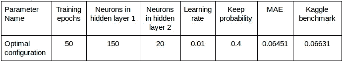

Network parameter tuning

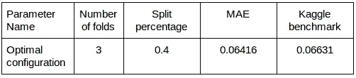

Other parameter tunings

# **结果和讨论**

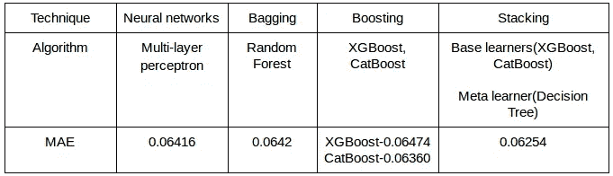

Performance of each implementation

根据我们上面使用的四种技术，很明显，堆叠提供了令人印象深刻的结果。CatBoost 等其他实现也很有前途。另一个有趣的观察是时间序列预测方法无助于改进模型，尽管它也是一个有效的解决方案。时间序列分析帮助最小的原因是，与所有在短时间内售出的房产相比，相似房产的销售发生的频率较低。这导致我们设计的时变特性已经过时，实际上扮演了离群值的角色来抵消任何改进，而不是帮助提高性能。还进行了交叉验证，以确保模型不会过度拟合数据集。

注意:关于竞赛、源代码和可视化的更多信息可以通过参考资料部分下的链接找到。

**参考文献**

 [## EDA.py

### 使用数据绑定中的数据

www.kaggle.com](https://www.kaggle.com/tharindraparanagama/eda-py)  [## TharindraParanagama/使用高级回归技术进行家庭价值预测

### 通过创建一个关于…的账户，为使用高级回归技术进行家庭价值预测的发展做出贡献

github.com](https://github.com/TharindraParanagama/Use-of-advanced-regression-techniques-for-home-value-prediction)  [## 创建附加功能

### 使用 Zillow Prize 的数据:Zillow 的房屋价值预测

www.kaggle.com](https://www.kaggle.com/nikunjm88/creating-additional-features)  [## 通过我的推荐链接加入灵媒

### 作为一个媒体会员，你的会员费的一部分会给你阅读的作家，你可以完全接触到每一个故事…

tharindrapara.medium.com](https://tharindrapara.medium.com/membership)