# 作为双人游戏的可变自动编码器(上)

> 原文：<https://towardsdatascience.com/the-variational-autoencoder-as-a-two-player-game-part-i-4c3737f0987b?source=collection_archive---------3----------------------->

## 爱丽丝和鲍勃在自动编码奥运会上

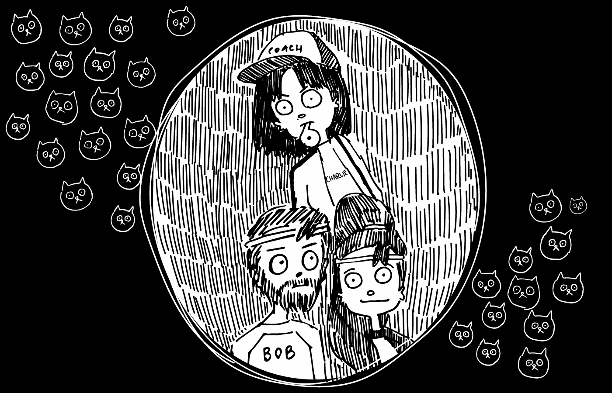

Illustrations by [KITTYZILLA](https://kittyzilla.tokyo)

**【免责声明:**本系列文章的目的是使可变自动编码器和自然语言编码背后的基本思想尽可能容易理解，并鼓励已经熟悉它们的人从新的角度来看待它们。为了做到这一点，为了更好的叙述，我使用了一些艺术自由，有时可能会牺牲一点技术准确性。我奉劝没有任何技术背景的读者，凡事要半信半疑。]

[第二部](/the-variational-autoencoder-as-a-two-player-game-part-ii-b80d48512f46)，[第三部](/the-variational-autoencoder-as-a-two-player-game-part-iii-d8d56c301600)

# **认识一下爱丽丝和鲍勃(还有查理)**

人工智能领域，特别是深度学习的子领域，在过去几年里随着进步一直在爆炸式增长。一种特殊的方法，*【生成模型】对这一进步贡献良多。*

*为什么生成模型在通往真正的人工智能的道路上有用，一个直观的论点是，可以生成现实数据的系统必须至少对现实世界有一些了解。*

*生成模型有多种风格。其中之一是所谓的 [***变分自动编码器(VAE)*** ，由 Diederik Kingma 和 Max Welling 于 2013 年首次推出](https://arxiv.org/abs/1312.6114)。*

*VAEs 有许多实际应用，而且还有更多的应用在不断被发现。*

*它们可以用来压缩数据，或重建噪声或损坏的数据。它们允许我们在真实数据之间进行平滑插值，例如，拍摄一张人脸的照片，然后逐渐将其变形为另一张人脸。它们允许复杂的数据操作，例如逼真地改变人的图像上的头发长度，或者在不改变任何其他声音特征的情况下平滑地将录音从男性变为女性。*

*更微妙的是，但在实践中最令人感兴趣的是，它们可以揭示大量未标记数据中隐藏的概念和关系。这将它们归入无监督学习算法的类别(与需要标记数据的监督算法相反)。*

*还有一组相关模型遵循与 VAE 非常相似的原则。例如，用于谷歌翻译的模型就是其中之一。如果你理解了这一系列的文章，你基本上也准备好理解谷歌翻译是如何工作的。*

*有许多很棒的博客文章用技术细节和代码解释了 VAEs 是如何工作的(例如[这个](http://kvfrans.com/variational-autoencoders-explained/)和[那个](http://blog.fastforwardlabs.com/2016/08/12/introducing-variational-autoencoders-in-prose-and.html))，学术文献充满了对原始想法的无数解释、应用和扩展。*

*我在这里的目标既不是给你实际实现 VAE 的技术理解，也不是评论该领域的任何特定的最新发展。*

*相反，我想提供一种新的方式来观察 VAE 到底在做什么。我希望这种方式足够简单，你可以向你的祖母或小学生解释，同时不要遗漏太多的细节或过于松散。*

*即使你是该领域有经验的从业者或研究人员，我也希望这种略带古怪的解释能够激发一些新的创造性见解。*

*在这个由三部分组成的系列中，我们将首先探索第一部分中自动编码器的基础。在[第二部分](/the-variational-autoencoder-as-a-two-player-game-part-ii-b80d48512f46)中，我们将看看为什么让它们变得有意义(以及这意味着什么)。最后，在第三部分中，我们将发现为什么编码文本特别具有挑战性。第一部分和第二部分实际上只是第三部分的基础。*

*(变化的)自动编码器的基本概念已经有了广泛的报道，从简单的介绍一直到学术论文。然而，对于第三部分中的概念，我到目前为止还没有遇到任何好的非学术讨论。我希望这个系列能够填补这个空白，并且在这个过程中教会你很多其他的东西。*

*我自己的背景是量子信息论。量子物理学家和信息理论家都喜欢通过将复杂的场景浓缩成简单的游戏来理解和解释世界。*

*例如，许多密码问题可以表述为发送者和接收者之间的游戏，其中恶意的玩家充当窃听者。或者看看我的前博士导师特里·鲁道夫的小书《Q 代表量子》，里面有很多简单易懂的量子游戏的例子。*

*在将我自己的研究重点从物理转移到人工智能之后，我花了很多时间思考和研究 VAEs。鉴于我的量子背景，把 VAE 看成一个游戏的想法很自然地产生了。*

*特别是，我把 VAE 看作是一个两人合作的游戏*。**

**不过在进入游戏细节之前，我们先介绍一下玩家。遇见**爱丽丝编码器****

**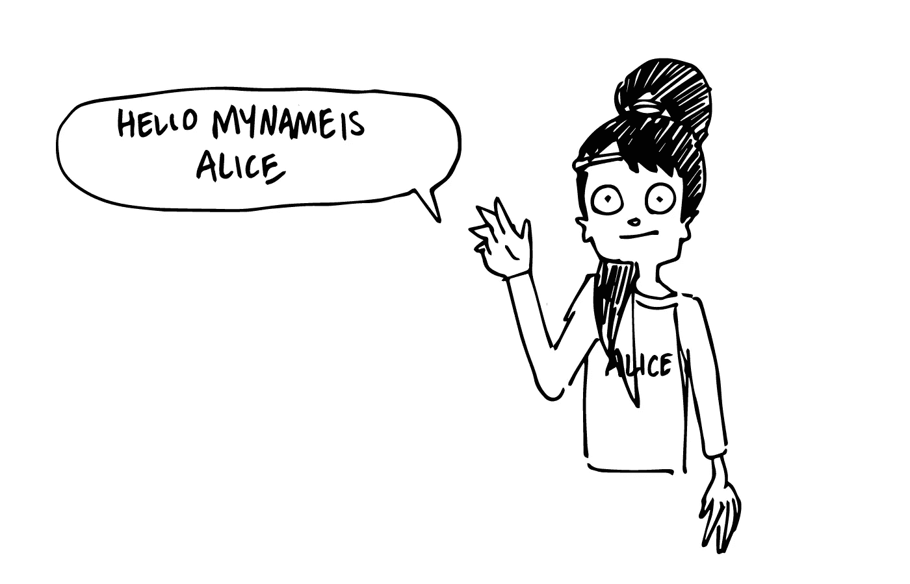**

**还有**解码者鲍勃**(不要和建造者鲍勃混淆)。**

**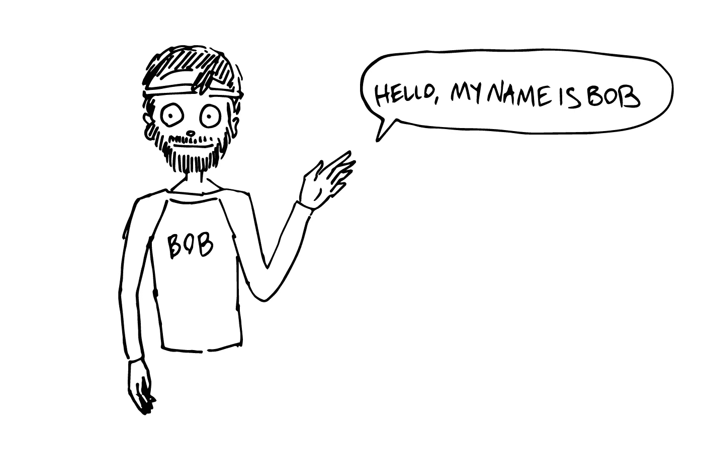**

**爱丽丝和鲍勃非常有抱负。他们的目标是参加新成立的自动编码奥林匹克竞赛，世界上最好的编码器-解码器组合在这里展示他们的技能。**

**为了准备比赛，爱丽丝和鲍勃邀请了他们的朋友**评论家查理**，他将评判我们两位选手的表现，并担任他们的教练。**

**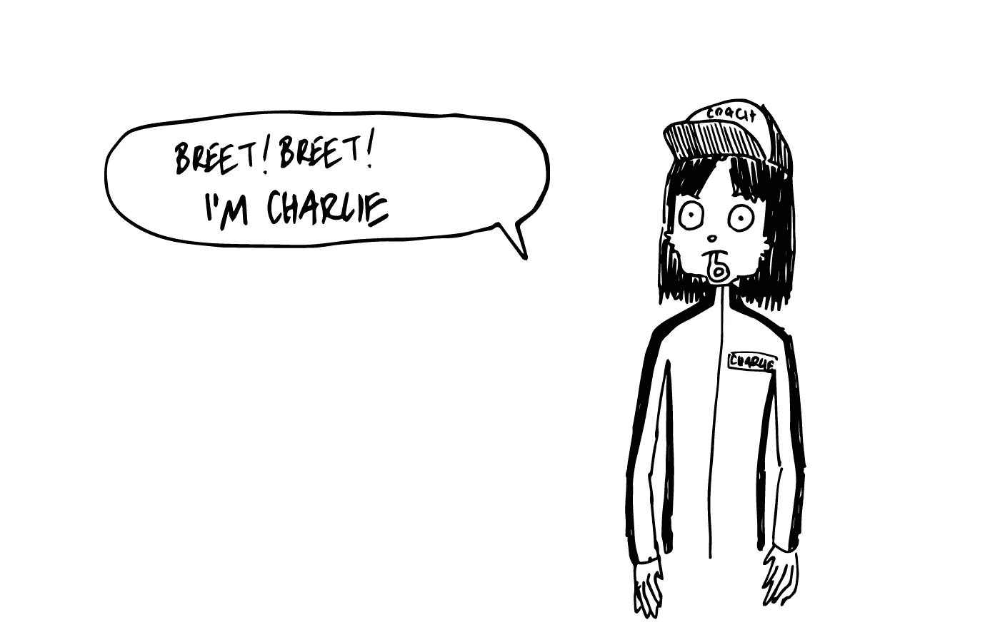**

**现在我们来看看游戏规则。**

# ****自动编码游戏****

**正如我们将看到的，游戏有各种风格和规则，每一种都有自己的规则和目标。**

**我们将首先考虑游戏最简单的版本，所有后来的版本都将建立在这个基础上。在深度学习中，这个简单的版本对应于一个普通的(即非变分的) ***自动编码器*** 。**

**基本思想是这样的:爱丽丝得到某种数据，例如图像、文本、音频剪辑等。然后，她必须将这一点传达给 Bob，Bob 没有看到数据，这样他就可以重建 Alice 看到或听到的内容。**

**Charlie(他确切知道 Alice 看到了什么)然后评估 Bob 的重建有多准确，并根据他的表现给他打分。**

**目标是让 Alice 和 Bob 获得尽可能高的分数，即 Bob 完美再现 Alice 获得的数据。**

**问题是爱丽丝和鲍勃彼此分离，只能通过一套特殊的设备以非常有限的方式进行交流。**

**特别是，爱丽丝不能直接解释她所看到的。她能传递给鲍勃的唯一信息是一串数字，一个*“代码”*。**

****

**爱丽丝需要对数据进行编码。**

**允许她发送多少个号码被称为*“码尺寸”*或*“码尺寸”*。在真实的 VAEs 中，代码维数通常可以达到数百。但是为了简单和易于可视化，让我们假设只有两个。这不仅仅是为了这个游戏而简化，而且在实践中当人们想要可视化代码时也是这样做的。**

**如果代码大小为 2，我们可以直接将代码解释为二维坐标系中的(x，y)坐标。**

**对于这个游戏的初始版本，我们还将假设 Alice 显示的数据是猫和狗的照片。有很多这样的数据，我们称之为训练数据。同样为了简单起见，让我们假设我们有一百万个训练图像。对于真实的数据集来说，这是一个相当低的平均数。**

**一些有代表性的例子可能是**

**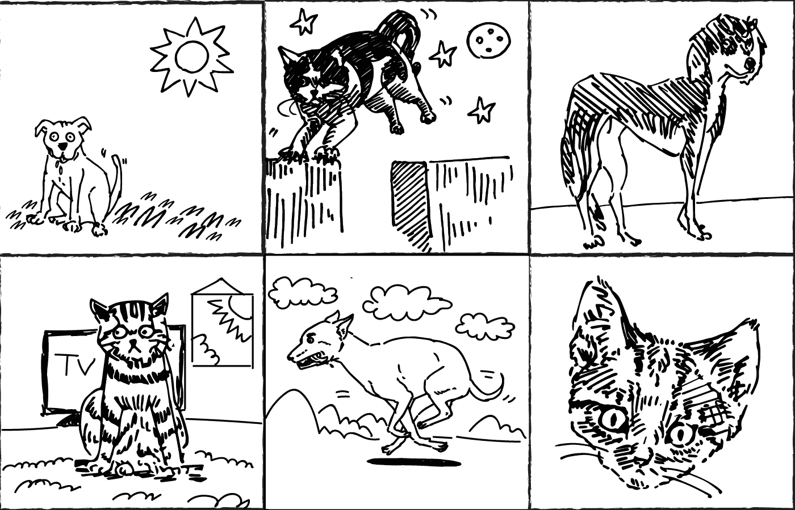**

**因此，给定这些图像中的一个，Alice 必须向她的机器输入两个数字，比如说(2.846，-5.049)，并将这个代码发送给 Bob。**

**鲍勃现在必须试着画出他认为爱丽丝看到的东西，除了这两个数字之外什么都没有。**

**听起来很难？**

**事实是，情况要糟糕得多！**

**我们都有一个概念，狗和猫是什么，它们长什么样，它们的行为如何，我们通常在什么环境中看到它们，等等。但是人工智能必须从零开始，没有对现实世界的先入之见，也没有什么图像是可能的或不可能的。**

**这就好像鲍勃和爱丽丝都是在一个封闭的房间里长大的，他们闭着眼睛，现在通过他们看到的照片第一次看到了真实的世界。他们完全没有“狗”或“猫”的概念，在游戏开始时，一张猫的照片对他们来说就像随机噪音或抽象画一样可能和真实。**

**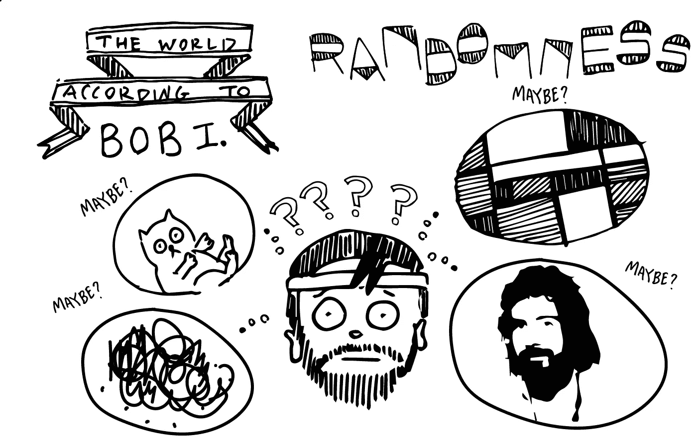**

**他们甚至没有被告知这些照片主要包含了我们称之为“猫”和“狗”的东西。**

**而且困难还不止于此。虽然 Alice 实际上看到了真实的照片，但是 Bob 从来没有看到过真实的照片。他所看到的只是来自爱丽丝的代码。他只能根据这些神秘的数字随机作画。**

**但这正是我们的教练查理的重要性所在。每次 Bob 根据 Alice 的一个代码完成一幅画，Charlie 都会将其与原作进行比较，并为其分配一个分数(这个分数的专业术语是*“损失函数】*)。越准确，分数越高。**

**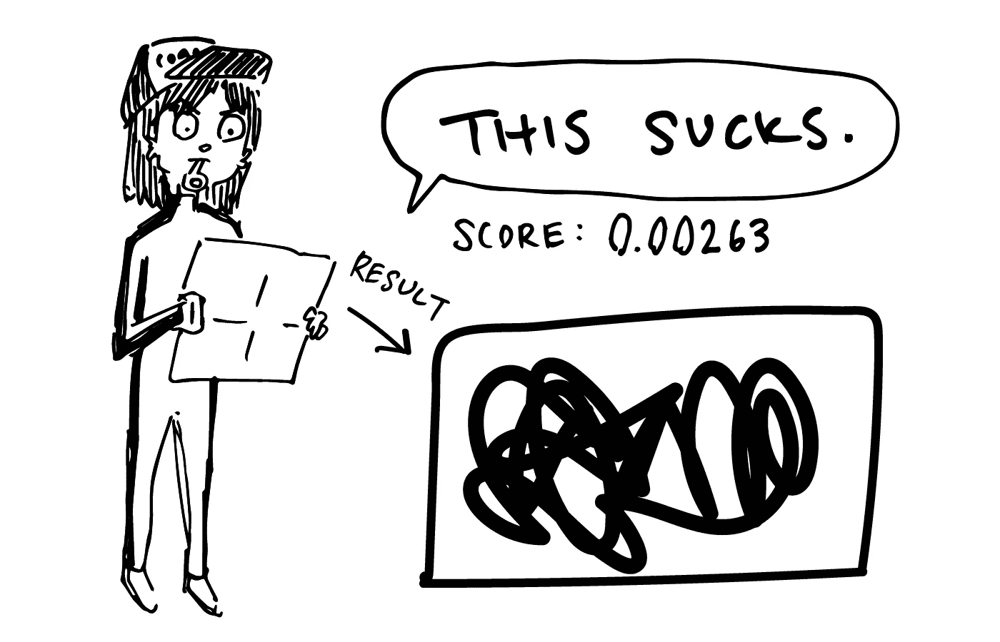**

**Charlie 不仅仅提供一个分数来告诉 Bob 他有多好(或多坏),他还告诉 Bob 他的哪些决定促成了这个分数，以及如何促成的。用专业术语来说，他为鲍勃提供了*【渐变】*。基于这些信息，Bob 可以调整他的过程，以便下次获得更高的分数。**

**因为 Bob 知道 Alice 的代码如何影响他的过程和最终输出，所以他也可以告诉 Alice 如何改进她的编码。在这种特殊情况下，为了得到更高的分数，他希望得到什么样的代码。例如，他可能认为“数字 1 应该小 0.043，数字 2 应该大 4.956”。**

**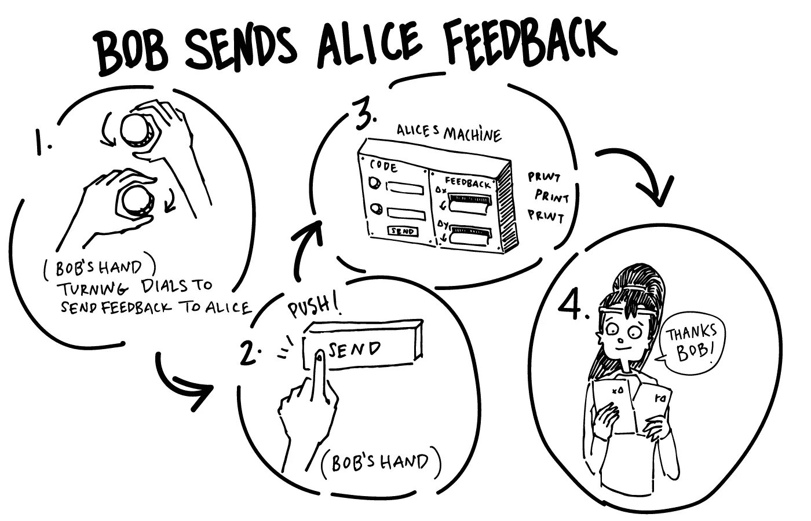**

**这是鲍勃和爱丽丝之间唯一允许的通信。我们称这个过程为*【反向传播】*，因为我们从最终得分开始，然后根据反馈调整导致得分的过程。**

**这种反向传播方法目前形成了训练大多数深度神经网络的基础，而不仅仅是 VAEs 或生成模型。**

**在调整他们的流程时，Alice 和 Bob 需要小心，不要因为一张照片而调整太多。如果他们这样做了，他们只会在之前给他们的图像上变得更好，然后通过过度调整到下一个图像来“覆盖”这一进步。**

**相反，他们需要根据每个反馈对他们的流程进行小的更新，并希望随着时间的推移，这些小的调整将积累成一个独特的流程，使他们在所有图像上获得良好的分数，而不仅仅是当前的图像。**

**他们根据每个单独图像的反馈调整过程的程度取决于所谓的*学习速率*。学习率越高，他们调整过程就越快。但是如果学习率太高，他们就有对每个新图像进行过度补偿的风险。**

**最初，由于 Alice 从未见过真实的照片，也不知道 Bob 想要什么代码，她所能做的就是给 Bob 发送随机数。**

**此外，鲍勃不知道这些数字意味着什么，也不知道他应该画出什么样的画。实际上，任何一幅画对他来说都和其他画一样有可能。从头到尾都是随机的。**

**但是在创作了许多都被查理打了糟糕分数的随机画作后，鲍勃开始注意到一些事情。**

**当他在画的中心使用某些颜色，而在边缘使用其他颜色时，他会得到稍高的分数。特别是当他在中间画一个灰色或棕色的有两个圆形的斑点时，他通常会得到比完全随机画更高的平均分。**

****

**Bob 对“毛皮”或“眼睛”没有概念，他只是发现大多数图片都包含有毛皮的动物，通常有两只眼睛。**

**以后记住这一点。在这里看似巨大的初步进展实际上会在稍后的[第三部](/the-variational-autoencoder-as-a-two-player-game-part-iii-d8d56c301600)中困扰爱丽丝和鲍勃，当他们试图编码文本时。**

**此外，这种完全忽略爱丽丝的输入，只画两个圆圈的棕色斑点的方法只能让他到此为止。他卡住了，不能增加分数。他需要开始尝试使用 Alice 的代码，因为 Alice 没有从 Bob 那里得到任何有用的反馈，所以此时 Alice 的代码仍然是随机的。他需要开始将代码整合到他的创作过程中，并给爱丽丝一些线索，将她的编码引向正确的方向。**

**接下来的过程是爱丽丝和鲍勃的共同努力。Bob 首先学习哪些图像是真实的或可能的，然后 Alice 在 Bob 的反馈的帮助下，可以针对给定的输入将他引导到正确的方向。在 Bob 不了解这个世界的情况下，就像在游戏开始时一样，她将不得不为他指定图像的每一个像素。后来她可以带着少得多的信息(猫还是狗？棕色还是灰色？坐着、站着还是跑着？等等。)**

**作为对数据压缩的简短补充，让我们考虑一个普通版本的游戏。在这个版本中，代码维数与图像的像素数完全相同。**

**如果机器的输入槽与图像的像素一样多，Alice 可以简单地通过机器传输精确的图像。(假设是黑白的。对于一张彩色照片，我们实际上需要三倍的像素数，来编码每个像素的红色、绿色和蓝色值。)**

**Bob 只需要按照 Alice 的指示精确地绘制每个像素，就可以得到一个绝对完美的复制品，100%的几率。**

**一个稍微不那么琐碎的版本是代码大小是像素数的一半。**

**Alice 现在可以学习指定每隔一个像素，这是照片的缩减采样版本。Bob 只需要填充剩余的像素。假设他对真实世界有一个很好的概念，这就变成了一个相当琐碎的任务。这些图像不会 100%准确，但足够接近了。**

**但是爱丽丝和鲍勃不会永远摆脱这种“像素编码”。随着代码变得越来越小，比如在我们最初的游戏中减少到两个，如果他们想有任何成功的希望，他们必须改变他们的策略。**

**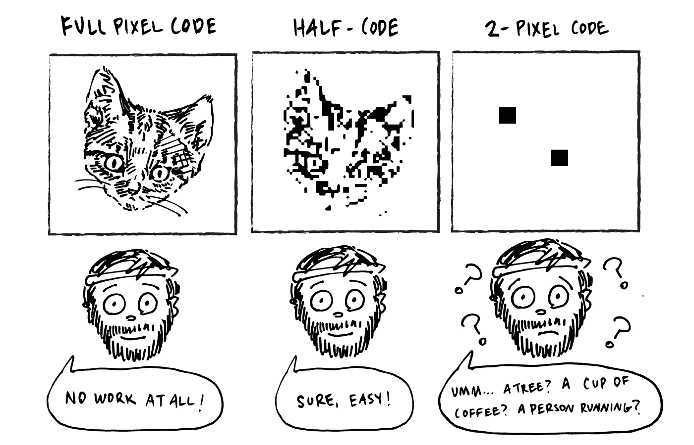**

**他们需要想出一种更智能、更“信息密集”的代码，而不是对像素进行编码。捕捉更抽象概念的代码，比如什么动物，什么姿势，什么拍摄角度，等等。**

**这是数据压缩的基础。我们越想压缩一段数据，我们需要设计的代码就越有效(我们就越有可能无法完全忠实地重建它)。**

**诀窍是将复杂的信息分解成几个尽可能简单和通用的概念，但仍然允许相当忠实的重建。**

**回到我们最初的游戏，Alice 和 Bob 已经玩了一段时间(我真的是指很长一段时间)，并且已经用训练数据集中的每张照片玩了大约十次。鲍勃已经成为一名多产的画家，画了数百万幅画，爱丽丝已经成为一名专家信息编码器，并学会了向鲍勃提供代码，帮助他找出她看到了什么照片。**

**与最初的随机性相比，鲍勃对现实世界的想法有了显著的改善。**

**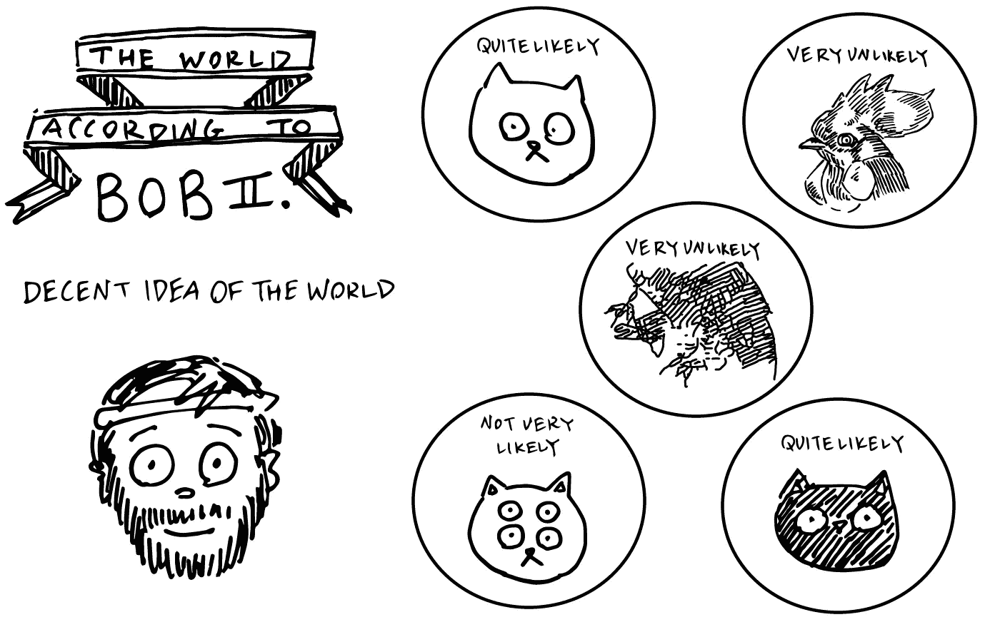**

**但是，请注意，Alice 和 Bob 只知道他们在训练图像中遇到的事情。对他们来说，另一种动物就像随机噪音一样不太可能出现(尽管他们可能会从以猫/狗为中心的世界观中发现眼睛、腿和皮毛等熟悉的概念)。**

**爱丽丝和鲍勃已经变得很擅长这个游戏，并开始获得相当高的分数。**

# ****学习到的代码****

**让我们简单地看一下 Alice 在训练中可能发现的那种代码。**

**由于代码由两个数字组成，我们可以很容易地将它们想象成平面上的 x 坐标和 y 坐标。**

**在一个可能的代码中，Alice 可能决定对猫使用负的 x 值，对狗使用正的 x 值。y 轴可以用于毛发颜色。正值较暗，负值较亮。**

**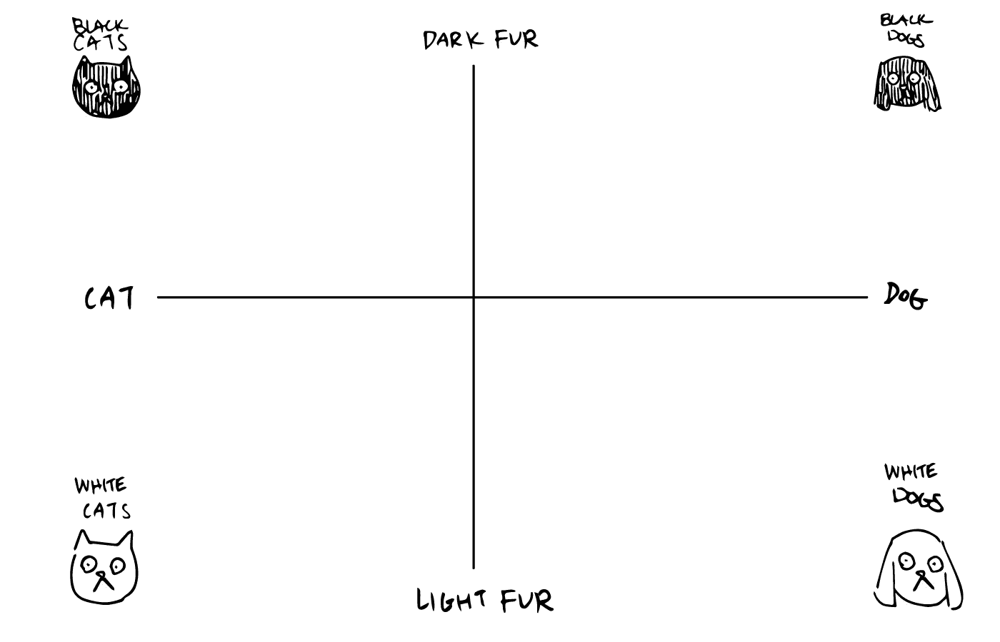**

**有了这个代码，如果 Alice 得到一张极其“狗样”的黑狗的照片，她会给 Bob 发送两个大的正数。如果她看到一只非常“猫”的白猫，她会发送两个大负数。对于一张照片，她几乎不能确定它是一只狗还是一只猫，皮毛颜色是中等黑暗，她发送两个接近零的值。诸如此类。**

**如果鲍勃已经知道这是爱丽丝正在使用的代码，这将允许他对他的画做出更好的猜测。**

**然而，尽管与完全随机的绘画相比，这是一个巨大的进步，但他的新绘画仍然包含许多随机性和猜测。他知道这是一只猫还是一只狗，也知道皮毛有多黑，但这种特殊的编码方式无法传递很多信息。**

**例如，Bob 不知道毛皮长度和图案是什么，动物处于什么姿势以及在图像的哪个部分，背景是什么，场景的照明是什么，...**

**他需要更多的信息来详细说明问题。这就是为什么真正的神经网络通常倾向于学习非常复杂的代码，在大多数情况下，这些代码没有简单的人类解释轴。这样他们就可以在这两个数字里塞进更多的信息。**

**如果你仔细想想，在一个简单的图像中确实有很多信息。如果你被要求寻找猫或狗，你会以一种特殊的方式看待图像，非常二元。猫还是狗？**

**另一方面，如果你被问及猫或狗是在城市还是在自然环境中，你会认为这些图片非常不同。爱丽丝和鲍勃没有被要求寻找任何特定的东西。他们没有这样的人文背景。他们只知道重建整个图像的任务。**

**然而，随着他们的学习，他们可能会自然地理解“狗”和“猫”这样的概念。但也有很大的可能性，人工智能会提出对我们人类完全没有意义的概念。更抽象和“有效”的概念。**

**因此，如果爱丽丝和鲍勃玩的时间够长，他们最终会同意使用这些更复杂的代码来捕捉高度抽象和有效的概念。**

**似乎他们掌握了游戏，对吗？**

# ****如果爱丽丝和鲍勃变得太“聪明”会怎么样****

**嗯，没那么快。他们需要小心。有变成“太优秀”的风险。**

**在查理的帮助下，爱丽丝和鲍勃目前正在为自动编码奥林匹克进行训练。在训练过程中，他们用同一套照片反复练习。**

**但是将在奥运会上使用的照片是一个严格保密的秘密。他们不会看到它们，直到他们在比赛时间真正开始做它们。**

**那时，他们可能会意识到他们有麻烦了。**

**他们没有理解“狗和猫照片的一般世界”，而是学会了完美地记住他们训练集中的所有照片。**

**事实证明，他们实际上没有发现我们在上一节中讨论的任何概念。他们基本上只是想出了一种作弊的方法来在他们的训练图像上获得满分，而实际上没有任何真正的理解。**

**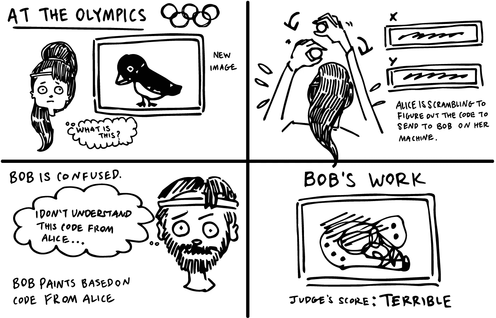**

**这个问题在深度学习中非常普遍，被称为 ***过拟合*** 。**

**就像一个学生偷了一个测试的答案，然后记住这些答案，而不是真正学习这个主题，一旦过度适应，爱丽丝和鲍勃对他们遇到的例子有 100%的信心，但对其他任何事情都没有任何线索。**

**将这一点发挥到极致，如果 Alice 和 Bob 非常“聪明”，有很大的记忆力，并被允许训练很长时间，他们实际上可以学习将他们训练数据集中的任何图像完美地编码成甚至只是一个数字，不管有多少图像。**

**他们怎么能这样做？**

**有无限多的代码允许它们这样做，但让我们考虑一个特别简单的。**

**我们先前假设正好有一百万个训练图像。有了这些知识，他们可以同意从第一个 0.000001 开始编码，第二个 0.000002，以此类推，直到第一百万个 1.000000。对于每张图片，他们只需确定一个唯一的编码。**

**在这段代码中，连续编号的图像在代码上非常接近，但是图像之间没有任何相似之处。图像 156 可以是一只在客厅玩球的黑狗，而图像 157 可以是一只在草丛中追逐老鼠的白猫。**

**每当爱丽丝看到图像 156，她只是发送 0.000156。鲍勃已经确切地知道了他需要画什么才能得到满分。类似地，当他看到 0.000157 在他的机器上闪烁时，他已经知道该画什么了。**

**他们 100%的时候都得了满分。**

**但是如果鲍勃看到 0.0001565 呢？还是-0.000001？还是 1.000001？**

**完全不知道。**

**类似地，如果 Alice 突然看到一个她以前从未遇到过的新图像，她会如何将它放入现有的代码中，以便 Bob 可以立即做出明智的猜测？**

**同样，完全不知道。**

**这不是学习，也不是理解。纯粹是死记硬背。**

**每一个小小的变化，每一个微小的陌生，都会让他们完全不知所措。**

**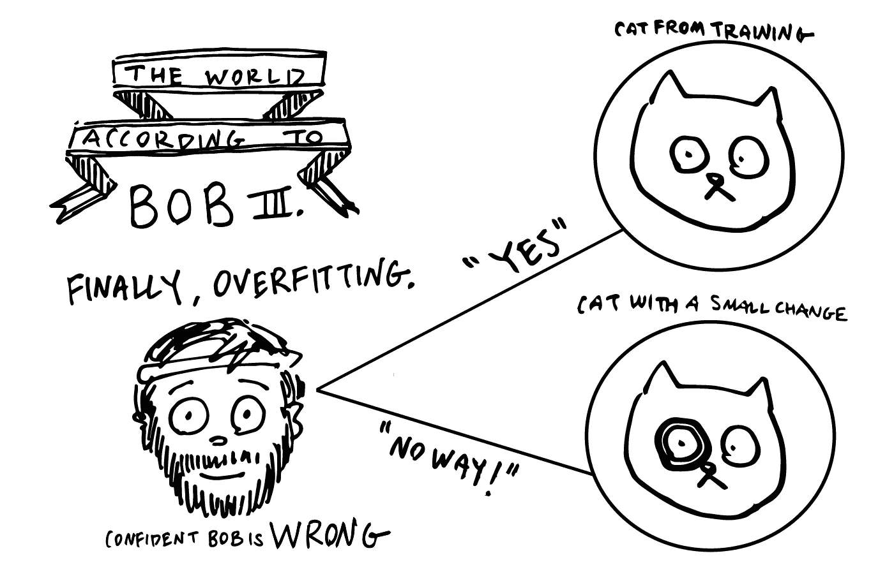**

**我们需要阻止他们达到这个阶段，而不是加强理解。**

**如果做得正确，他们可能在某种程度上仍然记得他们以前遇到的例子，但也学会了一般原则，允许他们对他们以前没有见过的事情进行推理。**

**这被称为 ***泛化*** ，几乎是任何深度学习算法的核心标准之一。**

**防止这个问题的一个方法是，在基本理解让位于记忆之前，尽早停止训练，这是人们长期以来一直采用的方法(并且仍然与更复杂的方法一起使用)。**

**但是在自动编码器的情况下，有一个更好的方法来确保实际的理解和有意义的代码。**

**在第二部分中，我们将看看 Alice 和 Bob 如何应对他们的失败，并看看一种新的训练方法，即使用所谓的变分机器，如何帮助他们提高性能，并提出有意义的代码，以推广到以前从未见过的数据。**