# 作为双人游戏的可变自动编码器(下)

> 原文：<https://towardsdatascience.com/the-variational-autoencoder-as-a-two-player-game-part-ii-b80d48512f46?source=collection_archive---------7----------------------->

## 变奏回归自动编码奥运会

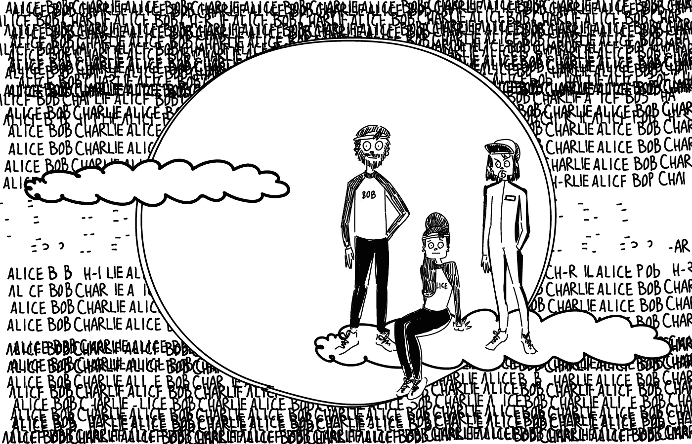

Illustrations by [KITTYZILLA](https://kittyzilla.tokyo)

欢迎阅读这个关于可变自动编码器及其在文本编码中的应用的三部分系列的第二部分。

在第一部分中，我们跟踪了两位选手爱丽丝和鲍勃，他们正在为自动编码奥运会进行训练。我们学习了自动编码器的基础知识，以及一般的深度学习，以及 Alice 和 Bob 可能学习的代码类型。

我们还看到，传统的自动编码器存在记忆的风险，而不是真正的学习。这最终导致爱丽丝和鲍勃在奥运会上遇到了他们从未见过的数据，搞砸了他们的表现。

# 引入变分自动编码器(VAE)

由于在自动编码奥运会上的灾难性表现，Alice 和 Bob 沮丧地回到家中，重新组织起来，思考如何在下一届奥运会上改变他们的方法。

因为他们的经历是如此的灾难性和尴尬，没有得到哪怕是一点点正确的测试图像，他们决定完全从头开始。

因此，爱丽丝和鲍勃扔掉了他们想出的代码，开始了一场史诗般的饮酒狂欢，彻底抹去了他们迄今为止从头脑中所学到的一切。

白板。

他们的头脑又完全空白了。就像我们第一次见到他们时一样。

在从同样史诗般的宿醉中恢复过来后，他们决定将他们的自动编码设备升级到他们最近听说的更新型号。一个 ***变型*** 。

变分模型仅推荐用于专家编码器/解码器对。这只是为了训练。这实际上增加了这个过程的难度。但是爱丽丝和鲍勃毕竟想在他们的游戏中处于领先地位。

没有痛苦就没有收获。

最初的设备实际上只是一对分别用于代码和反馈的发送器和接收器。新设备略有不同。让我们看看它们是如何工作的。

爱丽丝仍然输入她认为最有可能的代码。但是除此之外，她还要进入一个不确定性！

基于这一点，机器不会直接将 Alice 最有可能输入的值转移给 Bob。相反，它根据她输入的*分布*选择一个随机数。

它随机*采样*爱丽丝的代码分布。

所以 Bob 仍然只能得到每个代码维度的一个数字。但是在从爱丽丝的机器转移到鲍勃的机器的过程中，这个数字现在已经获得了一点随机性。

事实上，[原始论文介绍 VAE](https://arxiv.org/abs/1312.6114) 的主要贡献之一是一个技巧(称为*“重新参数化技巧”*)，它允许 Bob 向 Alice 提供有用的反馈，尽管不知道 Alice 选择的确切值，但只知道机器传递给他的随机值。

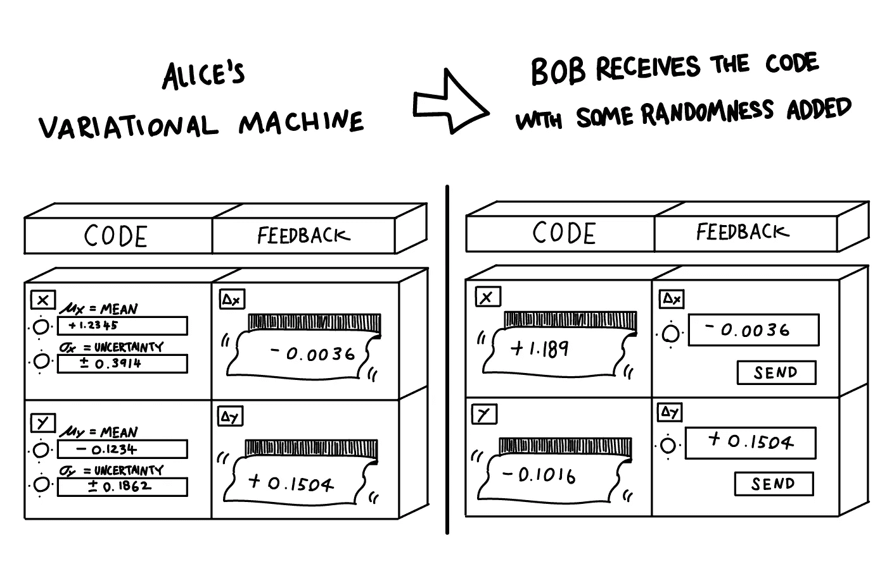

原则上，Alice 仍然可以选择输入非常低的不确定性，这样 Bob 几乎肯定会得到她想要传输的确切值。

但问题是查理变得更严格了。

他现在也从他们的得分中减去了一个点球。爱丽丝选择的不确定性越小，查理施加的惩罚就越大。

如果 Alice 确信，即使一个值与她期望的值很接近，也能传达所有的信息，她可以选择更高的不确定性，牺牲更少的分数。

另一方面，如果代码需要非常精确地将图像传达给 Bob，Alice 需要选择低不确定性。这样，即使 Bob 完美地重建了图像并为他们赢得了满分，他们也会因为不确定性惩罚而失去很多。

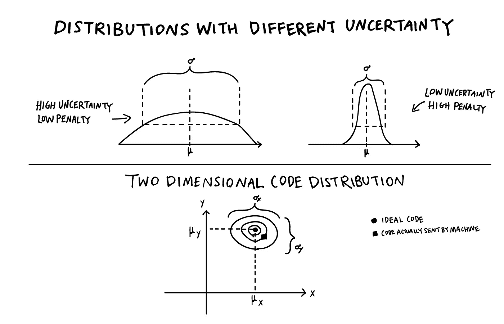

这迫使 Alice 和 Bob 对他们选择的代码更加明智。面对微小的变化，它需要更加*健壮*。即使代码在传输过程中被扭曲了一点，Bob 仍然应该画出一幅相当相似的画。

# 理顺代码

让我们再来看看只用一个数字编码的极端例子。

我们在[第一部分](/the-variational-autoencoder-as-a-two-player-game-part-i-4c3737f0987b)中看到，没有不确定性，Alice 和 Bob 可以学习将唯一的代码编号与他们的每个训练图像相关联，基本上记住了他们的整个训练数据集。

在一个特定的代码中，Alice 可以用 0.000001 分隔的代码对连续编号的图像进行编码。图像 156 对应于代码 0.000156，图像 157 对应于 0.000157，依此类推。不管这些图像实际包含什么。

如果鲍勃得到了准确的数字，他已经通过多次反复试验和错误，准确地了解了他要画的相应图像。

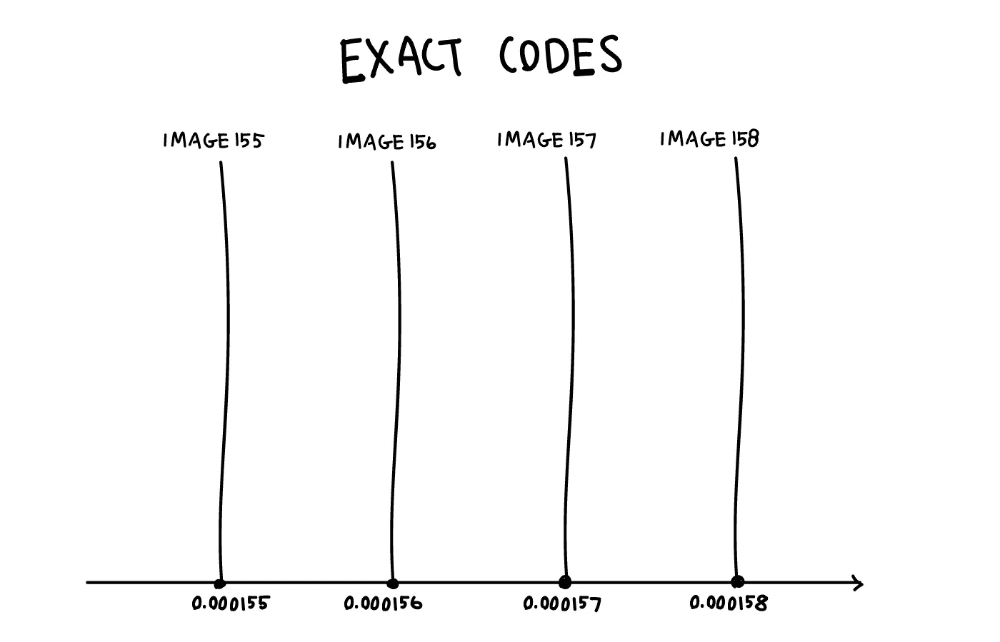

问题是这会在代码中产生“漏洞”。Alice 从不在例如 0.000156 和 0.000157 之间的空间中编码任何东西。因此，这些间隙中的任何数字，比如 0.0001561 或 0.0001568，对鲍勃来说都是毫无意义的。

当然，他可以向上或向下舍入到与图像相关的最接近的数字，但这将意味着他们的代码在 0.0001565 这样的地方有一个急剧的转变。代码中最微小的变化可能意味着鲍勃不得不描绘一个完全不同的形象。

他们的代码并不*流畅*。

如果没有进一步的训练和修改，它也不能用于编码不熟悉的图像。这就是导致他们在第一部中失败的原因。他们的代码没有*通用*。他们*过度适应*训练数据。

然而，随着 Alice 开始使用少量的不确定性，她开始“填补漏洞”，稍微平滑他们的代码。

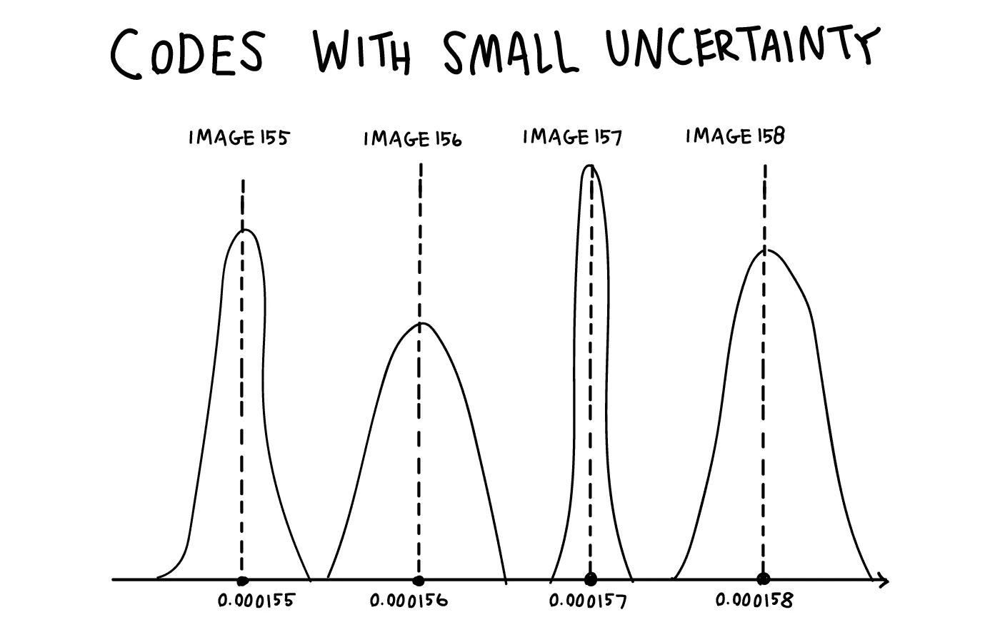

如果她想发送图像 156 并输入 0.000156，有一点不确定性，Bob 将得到一个与之接近的数字，但很可能不完全相同。

当他们用同一个图像玩同一个游戏很多次时，即使 Alice 的代码没有改变，Bob 仍然会看到与每个图像相关的几个略有不同的数字。

这已经帮助他们减少了对精确数字的依赖。

但是如此小的不确定性仍然伴随着高额的罚款！

如果他们真的想成功，并从 Charlie 那里得到一个好的总分，他们需要想出一个对更高的不确定性健壮的代码。

如果 Alice 仍然想以 0.000156 编码图像 156，以 0.000157 编码图像 157，她最好确保这两幅图像几乎相同，除非他们想通过选择微小的不确定性来牺牲大量的分数。

因此，除非这两个图像实际上非常相似，否则这段代码非常浪费，应该避免使用。

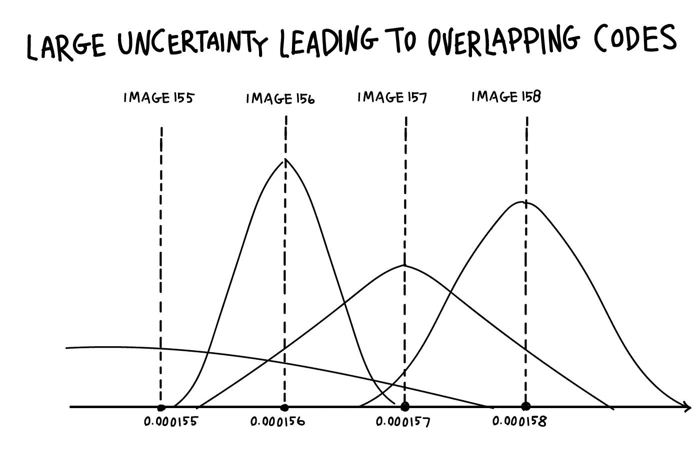

如果不确定性不是明显小于 0.000001，则有相当大的可能性，即使 Alice 想要编码图像 157，机器实际上也将她为图像 156 选择的代码发送给 Bob。或者更不同的东西。

那么，即使鲍勃理解了爱丽丝的理想代码，他仍然会画出错误的图像。如果他们想获得高分，同时保持较低的惩罚，他们必须学会用相似的代码对相似的图像进行编码。

# 走向有意义的代码

回到二维码的完整游戏，我们也可以用稍微不同的方式来思考这个问题。Alice 不再将每张图片编码成二维平面上的一个点，而是将它们编码成小污点。污迹越小，惩罚越高。

你可以在一个很小的空间里塞进无限多的点。

另一方面，污迹将很快开始重叠，所以你最好确保重叠有点意义。

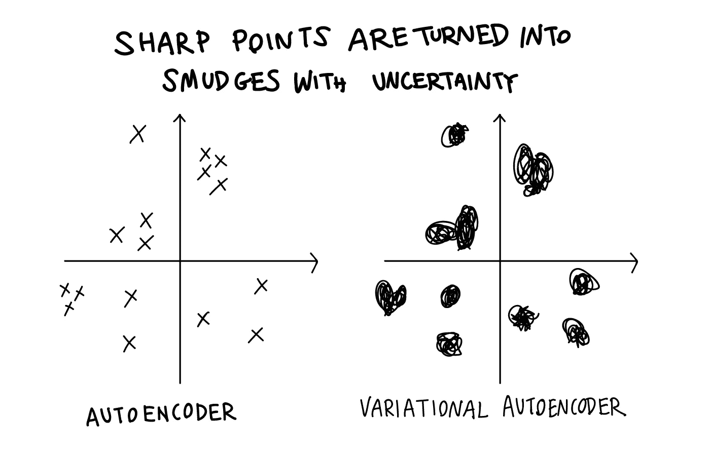

使用这种新机器和查理更严格的评分可以防止他们只是记住训练数据。他们需要给他们的代码赋予实际意义。

这迫使他们想出一个平滑的代码，或者说*连续的*，所以*“代码空间”*(也叫*“潜在空间”* ) 中的相邻区域对*“数据空间”*中非常相似的图像进行编码。这样，他们就不会牺牲太多的分数，因为他们必须非常准确地指定分数，而且不确定性很低。

这自然会导致*在代码空间聚类*。

他们学到的改进代码包含了更多的意义。代码实际上包含了更多抽象的想法，而不是直接编码图像，这既浪费又脆弱，就像我们在[第一部分](/the-variational-autoencoder-as-a-two-player-game-part-i-4c3737f0987b)中讨论的那样。

在一个区域，我们可能会在照片的右下角发现白色吉娃娃的图像，在另一个区域，在照片的中心是所有黑猫玩球的图像，等等。所有过渡都尽可能平滑，以便相邻图像尽可能相似。

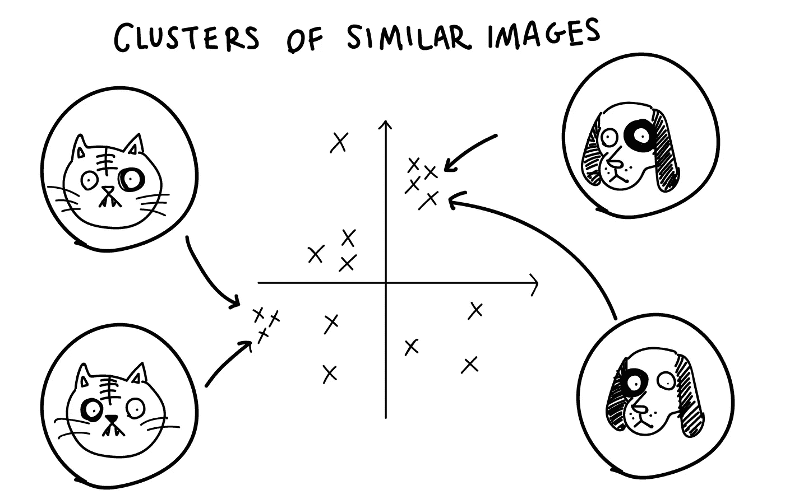

暂时离开爱丽丝和鲍勃的世界，[劳伦斯·范·德·马腾和杰弗里·辛顿为著名的](http://jmlr.org/papers/volume9/vandermaaten08a/vandermaaten08a.pdf) [MNIST 数据集](http://yann.lecun.com/exdb/mnist/)制作了这种聚类的可视化效果(尽管使用了一种非常不同的技术，称为 t-SNE ),该数据集包含许多不同的数字 0 到 9 的图像。

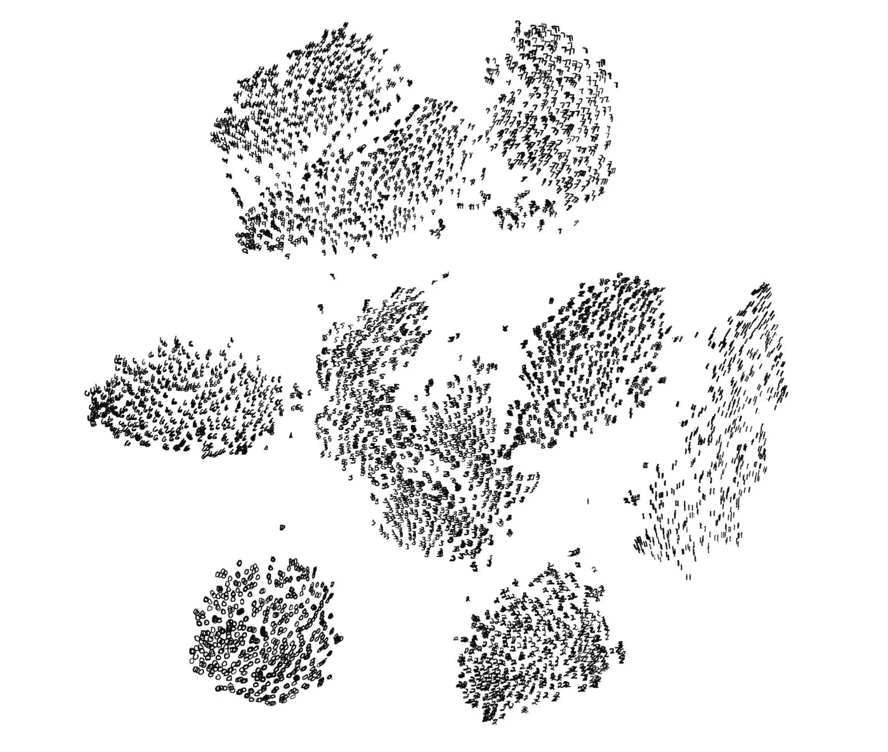

我们看到相似的数字聚集在一起，例如左下方的零。但更重要的是，在每个数字群中，我们看到相似的风格(如倾斜、笔画宽度等)聚集在一起。

回到爱丽丝和鲍勃。

带着从变化训练中获得的新经验，他们回到了下一届自动编码奥运会。在这里，他们简单地回到他们的老策略，Alice 直接传递代码，没有任何不确定性。

但至关重要的是，他们使用通过变分训练学到的新代码。

训练得到了回报！

有了这个代码，他们在训练中从未遇到过的王牌图像，并彻底摧毁他们的竞争对手。

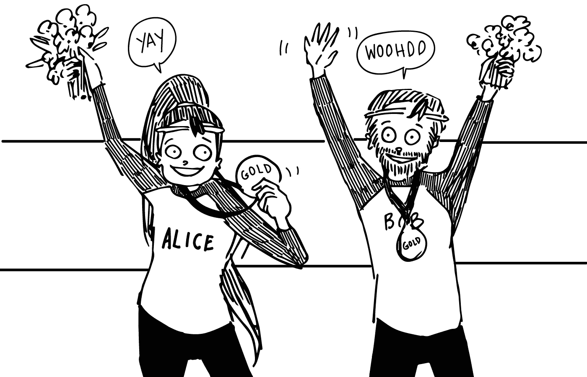

# 游戏时间

为了庆祝他们的胜利，他们把学到的代码玩了一会儿。他们发现了一些现在可以表演的非常有趣的把戏。

第一个允许他们在真实照片之间平滑地插值。

他们可以对两幅真实图像进行编码，分别得到一个代码，然后通过中间代码让 Bob 解码，从一幅图像平稳地转换到另一幅图像。

举个简单的例子，让我们假设他们用人的图像重复训练，然后对他们自己的照片进行编码，一张是爱丽丝的，一张是鲍勃的。为了便于举例，我们假设这些代码恰好是 Alice 的(0.0，3.0)和 Bob 的(6.0，0.0)。

他们现在可以不断地在它们之间转换。

假设他们解码了两幅等距的中间图像。这些中间图像将位于(2.0，2.0)和(4.0，1.0)。

当鲍勃解码它们时，他们看到在(2.0，2.0)处的照片基本上是 66.6%的爱丽丝和 33.3%的鲍勃，而在(4.0，1.0)处的照片具有相反的比例，33.3%的爱丽丝和 66.6%的鲍勃。

但重要的是，它不仅仅是原始照片的叠加，就像你可以在 Photoshop 中轻松完成的那样。这真的是一张“三分之一是爱丽丝，三分之二是鲍勃”的人的照片。

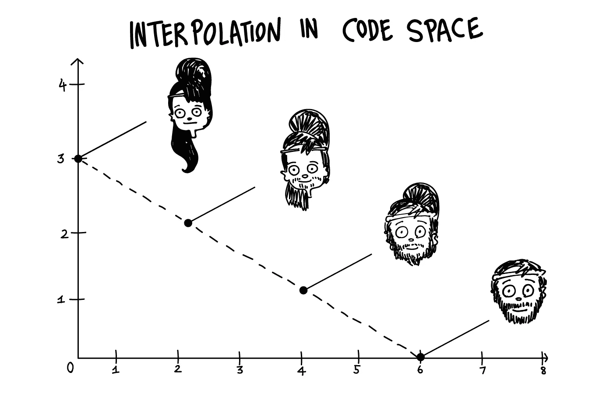

通过这种方式，VAEs 允许创建真实世界中不存在的绝对逼真的数据。例如，我们可以对自己和伴侣的照片进行编码，并在它们之间进行插值，以猜测我们的孩子可能长什么样(假设他们也是某种性别混血儿)。

对于照片插值的真实例子，请查看这个[名人面孔间插值的极度迷幻视频](https://www.youtube.com/watch?v=36lE9tV9vm0)。

而且这不仅限于图像。正如我们将在下一部分看到的，我们也可以对其他类型的数据进行编码。我们可以想象对我们喜欢的两首歌进行编码，然后听听这两首歌之间的各种插值听起来会是什么样子。或者像 [Magenta 团队在他们的 NSynth](https://magenta.tensorflow.org/nsynth) 项目中展示的那样，我们可以在不同的乐器之间进行插值。

所有这些也打开了巨大的艺术机会。对于一些很棒的例子，看看[哈德曼鲁在人造草图](http://blog.otoro.net/2017/05/19/teaching-machines-to-draw/)之间的插值以及他的许多其他作品。他的 Instagram 账户是人工智能生成艺术的一个很好的来源，使用的技术与爱丽丝和鲍勃正在使用的非常相似。

他们发现的另一个有趣的技巧是，通过稍微修改他们的训练过程，他们实际上可以给他们的一个或多个代码维度赋予特定的含义。这类似于我们在[第一部分](/the-variational-autoencoder-as-a-two-player-game-part-i-4c3737f0987b)中讨论的简单的狗/猫和黑/白代码，其中两个维度都有明确的人类可解释的含义。

例如，他们可以用一维编码胡须长度的特殊属性。

让我们假设他们使用第一维度来表示胡子长度，0 表示没有胡子，数字越大，胡子越长。

爱丽丝再次对自己的图像进行编码。自然，爱丽丝不是一个有胡子的女士，这是第一个代码值 0.0。

让我们假设它恰好在这个新代码中以(0.0，4.0)编码。鲍勃现在可以做一些有趣的事情了。他可以画出与(X，4.0)处的代码相关联的图像。X 越大，胡须越长，而保持其他代码维度固定将保持图像的“生动性”。所以他基本上可以现实地预测出爱丽丝留着各种长度的胡子会是什么样子。

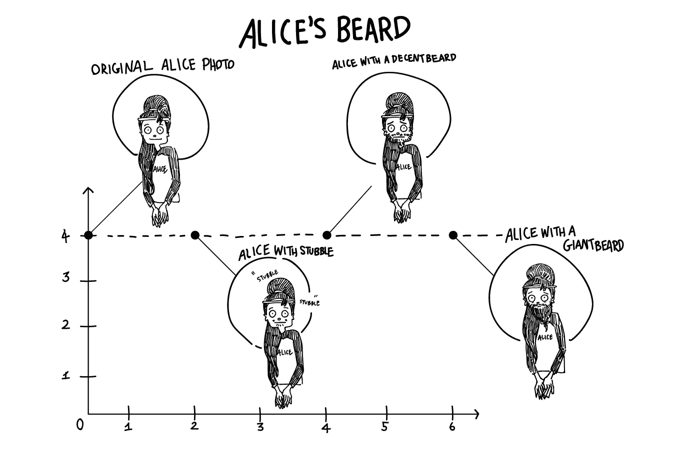

关于这方面的真实例子，看看陈曦和他的合作者提出的 InfoGAN 产生的数据。本文使用不同的生成模型，即所谓的生成对抗网络(GAN ),但基本思想是相同的。艺术水平有了巨大的提高，可以生成的图像变得更加详细和真实，但这是开拓这一想法的早期论文之一。

那很有趣！但是玩够了。爱丽丝和鲍勃需要再次集中注意力。他们心中已经有了新的目标！

在这个系列的[最后部分](/the-variational-autoencoder-as-a-two-player-game-part-iii-d8d56c301600)，我们将跟随他们的旅程回到自动编码奥运会。这次是在一个新的领域:文本编码。