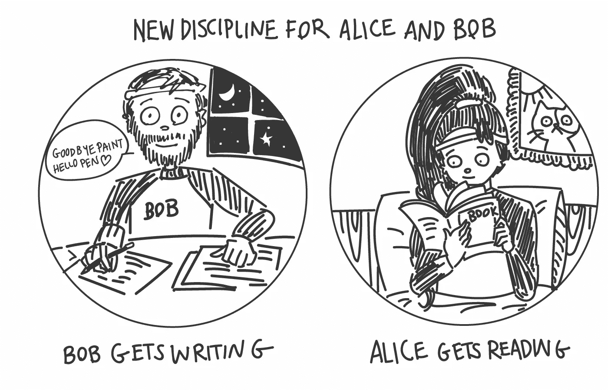
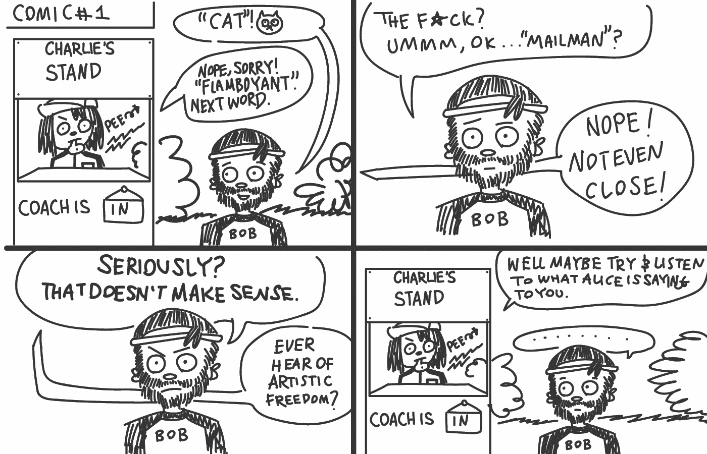
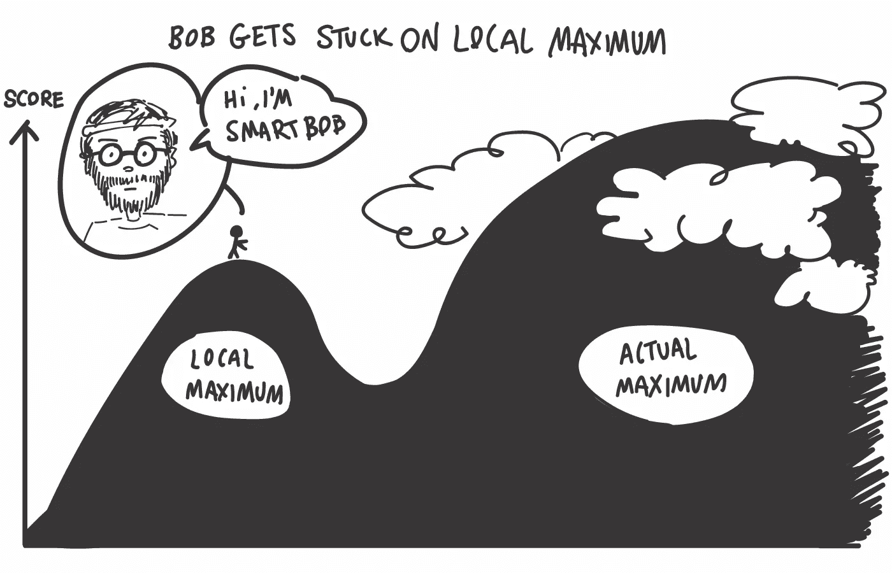
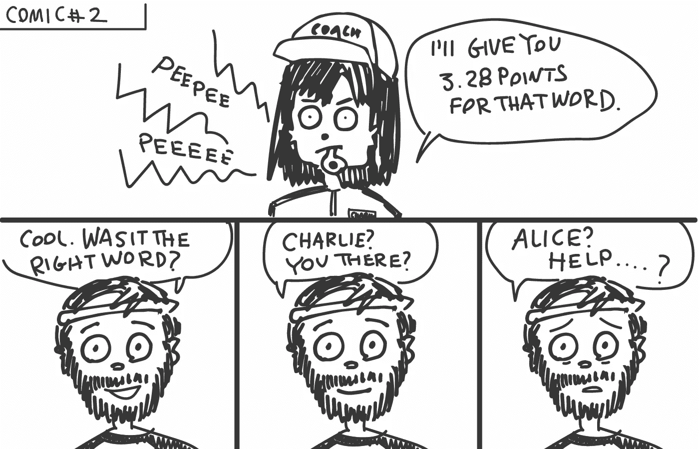
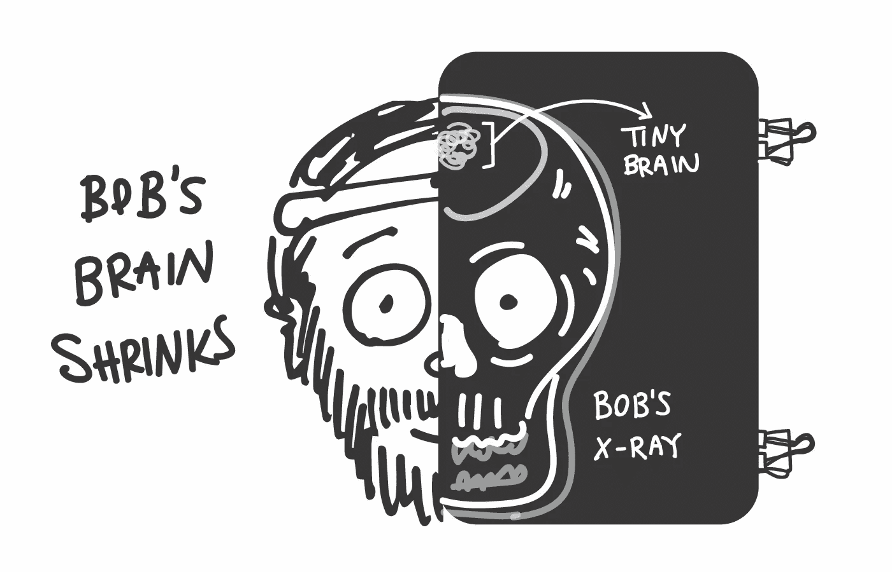
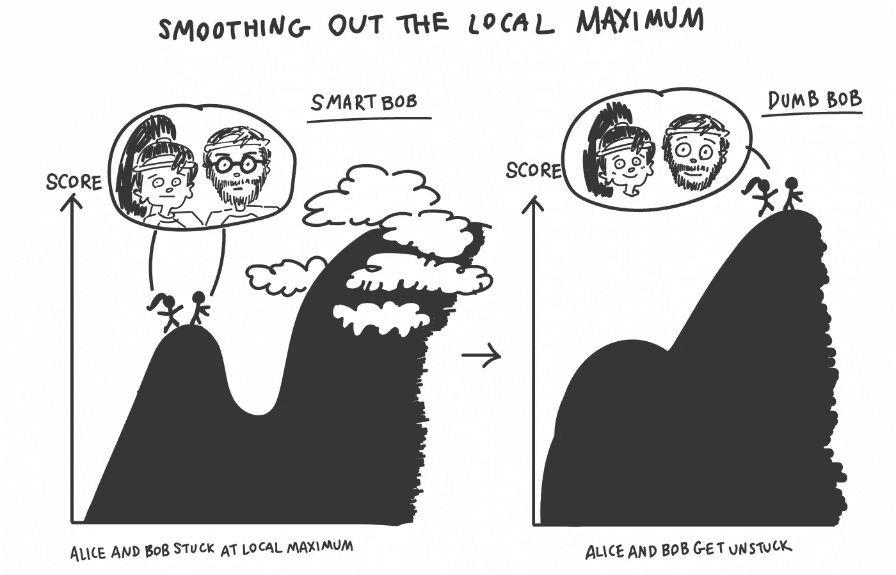
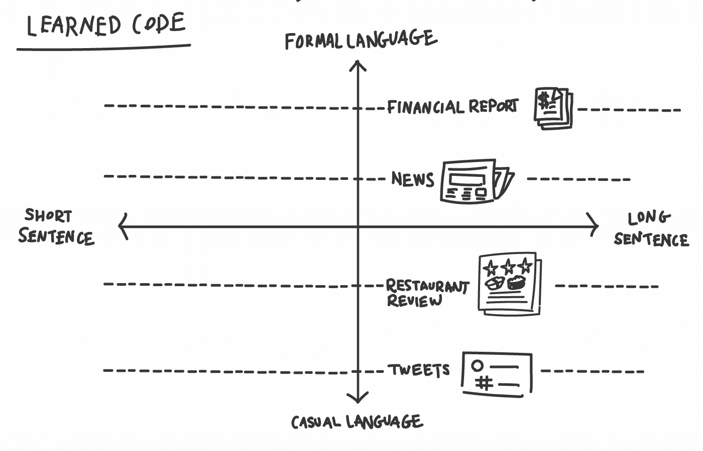
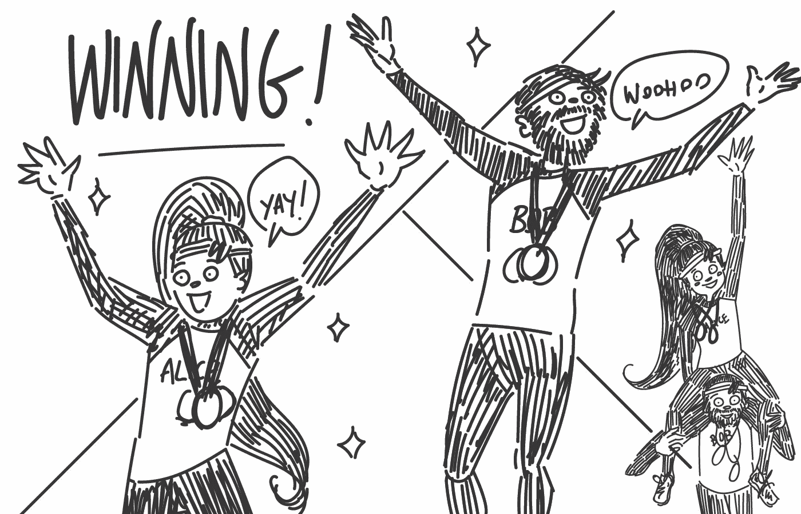

# 作为双人游戏的可变自动编码器——第三部分

> 原文：<https://towardsdatascience.com/the-variational-autoencoder-as-a-two-player-game-part-iii-d8d56c301600?source=collection_archive---------5----------------------->

## 文本编码的困难

Illustrations by [KITTYZILLA](https://kittyzilla.tokyo)

欢迎回到这个关于可变自动编码器(VAEs)及其在文本编码中的应用的三部分系列的最后一部分。

在第一部分中，我们遇到了爱丽丝和鲍勃，他们正在为自动编码奥运会做准备。在跟踪他们的培训过程中，我们了解了自动编码器的概念和深度学习的一些基础知识。

不幸的是，由于我们发现的一些训练问题，我们不得不看着他们在争夺金牌的过程中悲惨地失败。

然而，他们在[第二部](/the-variational-autoencoder-as-a-two-player-game-part-ii-b80d48512f46)中成功挽回了自己。通过遵循一种被称为可变自动编码的特别困难的训练方案，他们设法克服了自己的问题，重返奥运会，在比赛中占据主导地位，并取得了决定性的胜利。

现在让我们在爱丽丝和鲍勃带着他们的金牌回家后重新加入他们。

# 进入一个新领域:文本编码

艾丽斯和鲍勃因他们的胜利而欣喜若狂。但是他们很快开始寻找新的挑战。

他们决定在下届奥运会上设立一个新的项目。这门学科要求他们不是编码图像，而是编码句子。于是鲍勃挂上画笔，抓起一支笔，爱丽丝开始看书。

游戏的基本规则本质上还是一样的。

Alice 必须阅读一个句子，她需要将这个句子编码并发送给 Bob，Bob 然后必须尝试从 Alice 的代码中重建这个句子。

我们必须再次记住，就像《T4》第一部中的图像案例一样，我们的 AI 爱丽丝和鲍勃对语言完全没有先入为主的概念，甚至连单个单词的意思都没有，更不用说复杂的句子了。

最初的那句“一个高个子站在路边。”对他们来说就像“教堂娃娃后悔湖手无寸铁的机器变得像结一样”

他们的基本工具箱是所谓的词汇。他们能玩的一套单词。

问题是他们不知道这些单词的意思，也不知道如何将它们组合成有意义的序列。

这就好像给了他们一本字典，但没有任何解释。只是一长串英语单词。(并不是说这些解释会有所帮助，因为这些解释本身是由对我们的玩家来说还没有意义的相同单词组成的。)

再一次，爱丽丝和鲍勃必须从头开始理解外部世界，通过他们与提供给他们的句子和鲍勃从他们的教练查理那里得到的反馈的互动。

不过，在这个游戏的变体中，查理判断鲍勃预测的方式略有不同。

以前查理等待鲍勃画出整个图像。

另一方面，他不会等鲍勃说完整个句子。相反，他给鲍勃一个分数，并在他预测的每一个单词后给出反馈。

更重要的是，查理告诉鲍勃什么是正确的词。

这极大地简化了 Bob 的任务。他可以一次预测一个单词，而不是只根据爱丽丝的代码来预测整个句子，而是依靠他已经看到的单词来完善他对下一个单词的预测。

# 开发语言模型

我们每个人都有一个内置的(或者说是习得的) ***语言模型。***

考虑句子片段“狗追着…

你认为下一个单词是什么？要确定这一点，您只需调用您自己的语言模型。

鉴于不同的背景和经历，不同的人有不同的语言模型，但在这种情况下，我敢打赌，几乎每个人都会猜到“猫”。

但是，如果我现在告诉你，这句话取自一个关于外星人入侵的古怪科幻故事，会怎么样呢？

你可能仍然认为“猫”是最有可能的，但是你可能不再那么肯定了。或者你甚至可能期待一些不同的东西。你把你的语言模型建立在我给你的额外信息上。

这种条件反射正是 Bob 想要获得高分所需要学习的。特别是，他需要将 Alice 的代码作为他的语言模型的条件。Alice 再次需要想出一个聪明的方法，在允许她发送给 Bob 的两个数字中传达尽可能多的信息。

问题是，由于 Charlie 提供反馈的方式，Bob 实际上可以在游戏中变得相当不错，而无需调节他的语言模型。

就像上面的例句一样，在很多情况下，猜测“猫”是正确的，从而得到一个好的分数。只有在少数异常的句子中，这才是错误的猜测。

但是一个语言模型，如果没有条件，可能会产生误导。

让我们假设 Bob，在 Charlie 的纠正下，到目前为止已经猜出了文本片段“狗追赶…”并看看接下来会发生什么。

我们假设完整的句子是“狗从半人马座阿尔法星追逐艳丽的宇宙飞船”。等到鲍勃猜出最后一个词的时候，他的语言模型可能已经从“华丽的宇宙飞船”的最初震惊中恢复过来，他可能会对“半人马座”做出合理的猜测，即使没有对爱丽丝的代码进行限制。但是整个句子的总分已经很糟糕了。

考虑到允许的有限信息流，诀窍在于 Alice 准确地编码她认为让 Bob 感到惊讶的那种信息，并让他依靠自己的语言模型处理其余的信息，同时也希望他实际上首先使用了她的信息。

这就是信息理论家所说的*高效代码*。

准确编码最令人惊讶的东西，省略其余的。

这也与你可能在各种场合听说过的*熵*的概念密切相关。但是对它的彻底讨论本身就需要很多文章。

在过去，人们曾试图为各种各样的问题手工编写有效的代码。但现在，如果训练正确，像 VAEs 这样的模型实际上可以自动找到非常复杂问题的高效代码。

请注意，在现实中，解码器实际上并不是在每一步都只预测一个单词。它实际上预测了词汇表中每个单词的概率。

因此，虽然在示例中 Bob 可能给了“cat”99.9%的概率，但他也给了他知道的每个其他单词有限的概率，包括正确单词“flamboyant”的 0.0000037%的概率。

这就是为什么我们的评论家查理给鲍勃一个精确的分数。如果他把 100%的概率分配给正确的单词，他就只能得到满分。他给出正确答案的概率越低，他的分数就越差。

听起来不错，不是吗？Bob 只需要根据 Alice 的代码设置他的语言模型，然后它们就都被重新设置了，对吗？

# 爱丽丝的挣扎

嗯，是的。但是……事实证明，在这个新的领域里，爱丽丝相当挣扎。

在猫和狗图像的情况下，我们在[第一部分](/the-variational-autoencoder-as-a-two-player-game-part-i-4c3737f0987b)中看到，Bob 可以在不参考 Alice 的代码的情况下获得一些早期的胜利(用两个更小的圆形斑点作为眼睛来绘制一个灰色/棕色斑点)(由于缺乏 Bob 的反馈，当时仍然是随机的)。

但这并没有让他走得很远。很快他就被卡住了，需要弄清楚如何使用爱丽丝的代码。

然而，在这个新的学科中，Bob 实际上可以在不考虑 Alice 的代码的情况下玩得相当不错(因此没有给 Alice 任何有用的反馈)。

同样，在[第二部分](/the-variational-autoencoder-as-a-two-player-game-part-ii-b80d48512f46)中，我们注意到在可变设置中，代码传输的更高精度是以更高的惩罚为代价的。

现在，由于 Alice 意识到 Bob 无论如何都没有使用她的代码，她认为她还不如增加不确定性，这样他们就不会因为准确发送一个毫无用处的代码而支付额外的罚款。

如上所述，最初 Bob 和 Alice 都没有任何语言模型。文字对他们来说只是一堆乱七八糟的东西。

但是在很早的时候，通过计算单词的出现次数，Bob 可能会意识到“the”或“A”是句子开头最常见的单词，所以他可能会以这些单词开始每个句子。

仅从词频来看，这些是最常见的词。所以一开始 Bob 可能会想出一个策略，一遍又一遍地重复同一个单词(“the the the the the”)，因为他注意到这给了他比随机猜测更高的分数。

但是很快他会注意到“the”后面通常是一个名词。英语中最常见的名词之一是“时间”，所以作为第一个改进，鲍勃可以学习说“时间时间时间…”。

慢慢地找出这些越来越长的常用单词组合，Bob 建立了他的语言模型。

他学习英语的统计学。

或者至少是在他们的训练数据中使用的特定语言。在推特上训练的语言模型和在圣经上训练的语言模型是非常不同的。

当鲍勃被自己卡住，不能再提高分数时，他已经学到了很多，而爱丽丝仍然停留在最开始。

爱丽丝学习起来要困难得多。

Bob 在预测每一个单词后都会得到直接反馈，而 Alice 在理解整个句子时得到的唯一反馈来自 Bob 发给她的两个反馈号码。

如果 Bob 根本不使用她的代码，他也不能给她有用的反馈。

因此，Alice 基本上只是从 Bob 那里获得随机噪声来改进她已经随机的代码。

由于 Bob 甚至没有得到 Alice 的实际理想代码选择，而是一个带有一些额外不确定性的值，所以变化的设置使这变得更加复杂。

已经随机的代码被进一步随机化。

所以现在 Bob 自己已经相当不错了，而 Alice 还没有学到任何东西，我们有陷入所谓的*局部最大值*的风险。

鲍勃得到了一个他自己无法提高的不错的分数，但每次他试图听爱丽丝的话并使用她发给他的代码来影响他的预测，他们的分数就变得更差。

学习过程类似于没有地形图的登山者在浓雾中寻找顶峰。

他们唯一能做的就是沿着最陡的方向向上走。一旦他们到达一个点，任何方向下山，他们认为他们到达了最终的顶峰。但他们不知道，如果他们只是下山一小会儿，他们就可以到达更高的山峰。

因此，鲍勃，就像一个认为自己已经完成攀登的登山者一样，放弃了通过使用爱丽丝的代码来改进的尝试。

他的过程已经非常精炼，以至于它对试图将他的语言模型限制在代码上所引入的变化非常敏感。

他不知道的是，如果他可以牺牲他们的分数一小会儿，并尝试使用代码和给爱丽丝一些反馈，他们可以摆脱困境。

爱丽丝可以学到足够的东西，为鲍勃提供有用的代码，使他能够做出比自己更准确的预测。

但是鲍勃太近视太自信了，不会牺牲他们的分数。

# 恢复平衡

我们如何帮助 Alice 完成说服 Bob 使用她的代码并提供良好反馈的艰巨任务？

这个问题在学术界已经存在一段时间了。自从人们开始在文本上使用 VAEs 并遇到这个问题。

而且还是没有完全解决。但是已经出现了许多想法，使得文本的变分自动编码足够好，可以在实践中使用。

就像在[第二部分](/the-variational-autoencoder-as-a-two-player-game-part-ii-b80d48512f46)中引入变量方面使自动编码变得更难，但提高了性能，所以这里的大多数策略也包括使问题看起来更难，而不是更容易。

特别是，人们试图让 Bob 的任务更具挑战性，这样他就不能在学习方面轻松超过 Alice。

[有一种方法，叫做“单词退出”](http://www.aclweb.org/anthology/K16-1002)，让我们的评论家查理有时保持沉默。

他仍然总是给 Bob 的单词预测评分，但他不时地不透露正确答案，给 Bob 自己的语言模型提供更少的信息。

让我们再来看一下例句“狗追着……”。让我们假设查理对第二个词保持沉默。所以对鲍勃来说，这个句子现在看起来像是“The …追赶 the…”。

我敢肯定，你自己的语言模型在信息不完整的情况下预测这个句子的下一个单词要困难得多。

鲍勃也是如此。他开始从爱丽丝的代码中寻找线索。

在改变查理的行为方面，其他方法甚至更加激进。

[在其中的一个](https://arxiv.org/pdf/1708.04729.pdf)中，查理没有在鲍勃说完每个单词后给他打分，而是等鲍勃说完整个句子后再给他任何反馈。

这类似于 Charlie 在 image 案例中所做的(实际上 Bob 使用的神经网络架构也与 image 案例非常相似，都使用了*卷积神经网络*)。

这样 Bob 基本上不能依靠他自己的语言模型，因为他不知道他对句子的预测一开始是否正确。

这给了他一个很大的激励，让他很早就向 Alice 咨询更多的信息。

实际上，这种方法并不太成功，任务对 Bob 来说变得太难了。

但是它还没有被完全抛弃。它仍然是一个活跃的研究领域。

最成功的方法(例如，从 [*膨胀卷积*](https://arxiv.org/abs/1702.08139) 构建鲍勃的大脑，而不是更常见的*递归神经网络*)实际上并不旨在使任务本身变得更难。相反，他们让鲍勃变得更笨，或者更健忘。

如果我们以正确的方式让鲍勃变得更笨，本质上是让他有轻微的学习障碍，我们基本上给了处于不利地位的爱丽丝一个跟上鲍勃进步的机会。

想象一下，例如鲍勃·格特非常健忘。

可怜的鲍勃现在一次只能记住两个单词。在一句话的中间，他已经不知道它是如何开始的了。

我们的例句现在对他来说就像“…追逐…”。

错过了这个重要的上下文信息，他急切地寻找任何可以帮助他理解下一个单词的信息。他高兴地转向爱丽丝的代码。

这种方法(尽管相当复杂)已经被证明在确保 Alice 和 Bob 同步学习并且不陷入局部最大值方面非常成功。

起初，他们的分数比鲍勃还聪明时上升得更慢。但最重要的是，它一直在上升，没有被卡住。

[还有一种方法(称为 *KL 成本退火* )](http://www.aclweb.org/anthology/K16-1002) 可以与任何其他方法结合使用，它考察了 Charlie 因代码的不确定性而惩罚 Alice 的方式。

正如我们在[第一部分](/the-variational-autoencoder-as-a-two-player-game-part-i-4c3737f0987b)和[第二部分](/the-variational-autoencoder-as-a-two-player-game-part-ii-b80d48512f46)的图像案例中看到的，使用变分机器对于学习训练数据集之外的示例至关重要。但这也增加了爱丽丝向鲍勃传递有用信息的难度。

新方法允许 Charlie 灵活地决定如何惩罚 Alice，因为她使用了一个小的不确定性。

一开始，当他们还没有学到任何东西时，Charlie 非常宽容，允许 Alice 指定她想要的精确代码，而没有任何惩罚。

但是随着训练的进行，查理逐渐加大了惩罚力度。

正如我们所看到的，这可能会导致代码中的“漏洞”，即 Bob 不知道如何解码的代码空间区域。但是后来，随着我们重新引入惩罚，Alice 开始使用更高的不确定性，他们将自然地不得不学习平滑他们的代码并使漏洞消失。

爱丽丝基本上得到了一个适应她学习曲线的惩罚。

特别是，这个任务不再那么困难，以至于她没有学到任何东西。

这一点，再加上降低鲍勃的智商，使得他们能够非常成功地对文本进行编码。

那么他们可能会学习哪种代码呢？

Bob 需要根据 Alice 向他提供的内容来设定他的语言模型。

即使他们只找出一个简单的代码，其中某些代码区域告诉 Bob 该文本是一条 tweet，其他代码区域是一篇新闻文章，还有其他的餐馆评论，也可以极大地帮助 Bob 更好地猜测下一个单词。

由于 Bob 也不知道什么时候真正停止他的预测，Alice 可能也会学习对句子的长度进行编码。

就像第一部分中的图像示例一样，一个轴上是狗/猫，另一个轴上是黑暗/光明，他们可能会学习一个简单的代码，在一个维度上编码句子长度，在另一个维度上编码“正式程度”。

再一次，随着训练的继续和两人的共同学习，他们可能会找到更聪明(也可能不太容易解释)的方式来编码这两个数字中的大量信息。

我们也看到了代码应该是平滑和连续的。

这意味着如果 Alice 想编码一个句子并且不使用太低的不确定性，她需要确保她的代码是健壮的。

例如，她应该对句子“我去了他的家”和“我去了他的公寓”使用非常相似的代码，这样当鲍勃解码时，将一个代码改变为另一个代码的随机性不会产生太大的后果。

然而，句子“学习中的这种有问题的趋势由于 LSTM 解码器对隐藏状态中的细微变化的敏感性而加剧，例如由后验采样过程引入的变化”应该具有非常不同的代码。

不小心发送了“我去了他家”而不是“我去了他家”会导致查理的分数很低。

在改进了他们的训练过程和代码之后，Alice 和 Bob 再次从自动编码奥林匹克中凯旋而归。

接下来呢？

还有很多其他学科，比如音频编码。

也有完全不同的任务，它们不是严格的自动编码，但仍有许多相似之处，例如翻译，Alice 用一种语言编码，Bob 用另一种语言解码。

听起来更棘手，的确如此！

但是在这种情况下，有稍微不同的规则允许 Bob 使用所谓的*【注意】*。

实质上，除了爱丽丝发给他的整个句子的代码，他还可以向她要一个他需要预测的每个新单词的“额外代码”。这种技术基本上是谷歌翻译近年来变得如此优秀的原因。

文本摘要也是一个密切相关的学科。在这里，Alice 对一个长文本进行编码，Bob 必须将其解码为摘要。

还有无数更多的训练方法，包括尚未发现的方法，将帮助他们跟上他们已经掌握的学科中日益激烈的竞争。

但是现在，爱丽丝和鲍勃需要休息。