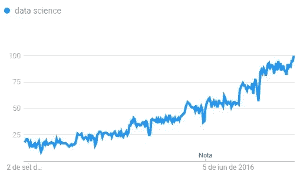
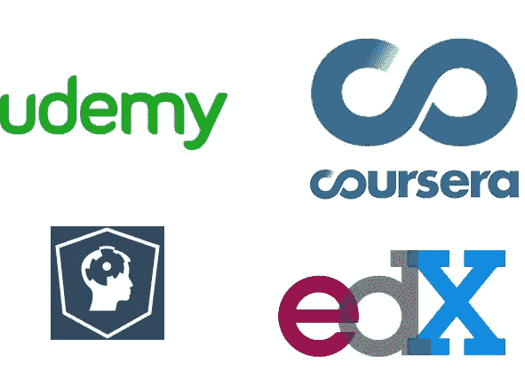

# 我学习数据科学的方式(以及为什么我认为你应该使用它)

> 原文：<https://towardsdatascience.com/the-way-im-learning-data-science-and-why-i-think-you-should-use-it-8c19b64dda9e?source=collection_archive---------3----------------------->

写这篇文章的想法来自于我在 PyData BH #8 的闪电谈话中谈到我学习数据科学的方法。似乎那里的人们喜欢它，所以，为什么不与世界分享我的想法呢？

首先，让我介绍一下我自己和我写这篇文章的原因。我是[艾奎斯](https://www.linkedin.com/in/aiquis/)，我日常工作的一部分是分析数据。到目前为止，我不是一名全职的数据分析师或数据科学家，但我对数据领域有着浓厚的兴趣，因此我一直在阅读、观看视频和研究这方面的主题。

我不是来回答“*如何成为数据科学家”之类的问题的/“我怎样才能在 DS 地区找到工作？”/“网上有哪些最好的 DS 课程？*”。对于这个，你可以去 [Quora](https://www.quora.com/topic/Data-Science) 找一些有用的答案。

Data Science search trend in the last 5 year (via Google Trends)

如今，有一堆 MOOCs 提供了成为成功的数据科学家的黄金路径。你可以在 Coursera、Udemy 或 Datacamp 上花费一生的时间和大量的金钱来购买课程，但很可能他们不会给你一个数据专家最重要的技能:**用他们教的工具解决现实世界的问题**。

So many courses that I can’t decide where to spend my money

对我来说，真正学习 DS 最好的方法就是**通过练习**来学习。这看起来似乎是显而易见的事情，事实也确实如此，但是如果你不知道从哪里开始，你怎么练习呢？我这里的方法是利用问题**你**必须练习你的技能。

你能想出任何问题，无论是个人问题还是专业问题，并且可以用你在学习 Python/R、数据(即统计学或机器学习)时学到的东西来解决吗？为什么不用它们(即使它们已经解决了)来测试你的知识呢？

这里我举个我个人的例子。在过去的几个月里，我一直在走 Datacamp 数据科学家之路(Python)。我很快发现的一件事是，Datacamp 在实践方面非常糟糕。大多数练习就像复制粘贴一样，不会让你真正思考问题的解决方案。那要怎么练呢？找到我遇到的问题，并尝试用我所学的知识来解决它。

在这个案例中，我使用了我的工作时间表，一个我每天进出办公室的时间的电子表格，并试图回答这些问题:

*   我还有多少额外的时间
*   按天/周/月计算的额外小时数是什么意思
*   我加班最多的日子(不包括周末)

项目在这里:

 [## aiquis/研究

### 时间表分析

github.com](https://github.com/aiquis/study/blob/master/timesheet-analysis/Timesheet%20Analysis.ipynb) 

如您所见，这是一个简单的任务，可以使用电子表格轻松完成。相反，我更喜欢用 Python 来做这件事，使用 [pandas](http://pandas.pydata.org/) 并从谷歌电子表格中读取数据，在那里我实际上填写了这些信息(我可以将其复制到本地 CSV 文件中以使其更容易，但我不会练习使用 [gspread](https://github.com/burnash/gspread) (一种谷歌电子表格 Python API)来收集我的数据)。我还没有完成这个项目，但现在我已经学到了非常酷的东西，并设法[解决了只有当你处理真实世界数据时才会出现的问题](https://stackoverflow.com/questions/45824585/converting-pandas-object-to-timedelta-results-in-nat)。

当然，你可以通过解决一些普通问题来练习，如[预测泰坦尼克号上的幸存者](https://www.kaggle.com/c/titanic)或[建立一个垃圾邮件分类器](https://hackernoon.com/how-to-build-a-simple-spam-detecting-machine-learning-classifier-4471fe6b816e)，但是当你从事一个代表真实事物的项目时，你可能会有更多的参与来完成它，并且会觉得你所学的东西真的很有用，可以应用到你的日常问题中。此外，你将建立一个个人投资组合。

*如果你想不出一个个人项目，* [*这个 Quora 回答*](https://www.quora.com/Im-self-taught-in-data-science-via-MOOC-material-equivalent-to-a-data-science-bootcamp-curriculum-What-can-I-do-next-to-get-a-job-in-the-field/answer/Swarathesh-Addanki) *有一些不错的项目可以放在手上，建立一个作品集*

当你解决一个问题时，你将自己置于一个有问题、需要由数据专家解决的雇主的位置，但在这种情况下，你产生问题并解决它，成为整个链条的一部分:有问题、明确问题、制定解决方案、审查、发展并获得对结果的见解。

如果你真的想与数据打交道，作为一名数据科学家或数据分析师，你真的应该把手弄脏，并尝试解决问题。光看讲座不会让你成为**解决问题的人**、**、**这才是作为数据专业人士真正重要的。环顾四周，试着把你的日常工作当作数据科学问题来面对，把你所学的应用到解决方案中(即使这不是最简单的方法)，陷入你没有预测到的问题并解决它(谷歌和 Stackoverflow 是你的朋友)。最后，建立一些让你看到最终结果时感到自豪的东西，这是最棒的部分。

*特别感谢我的朋友* [*卡伊奥·马托斯*](https://medium.com/u/a652c37b7a7a?source=post_page-----8c19b64dda9e--------------------------------) *和拉斐尔，他们审阅了这篇文章并给了我一些反馈。如果您有任何反馈，请在此发表评论或通过*[*Twitter*](https://twitter.com/aiquis)*联系我！*