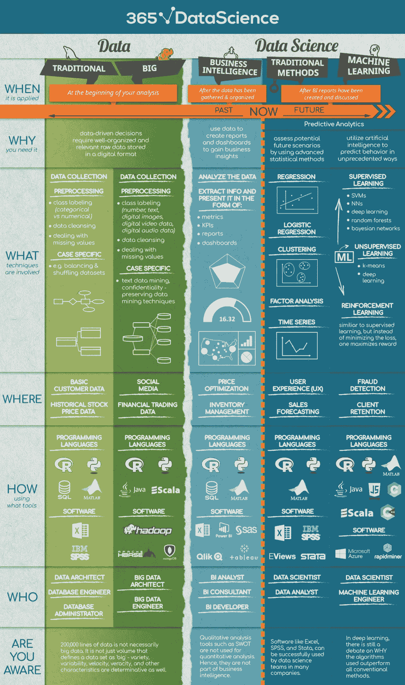
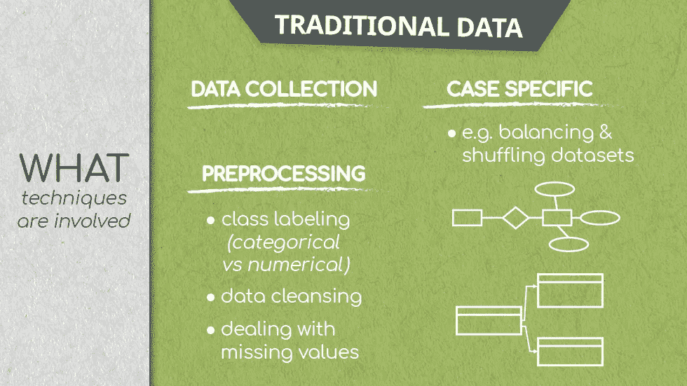
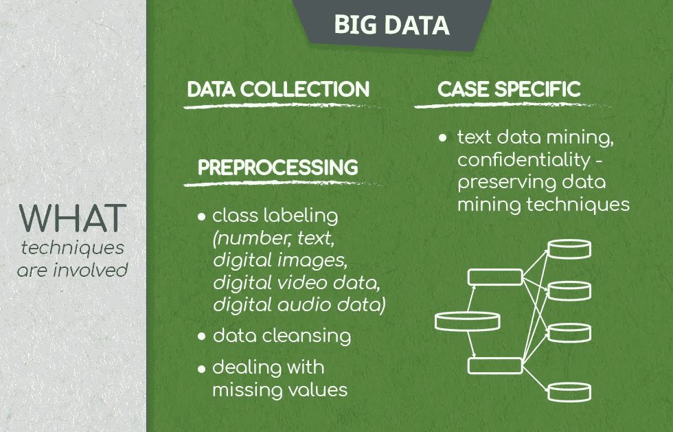
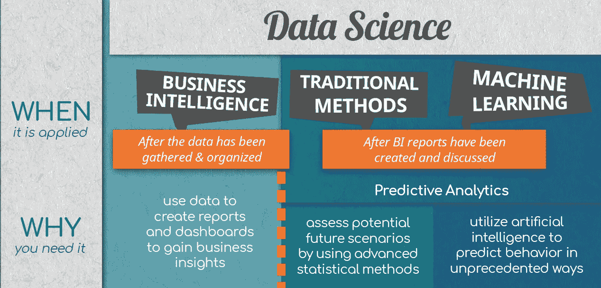
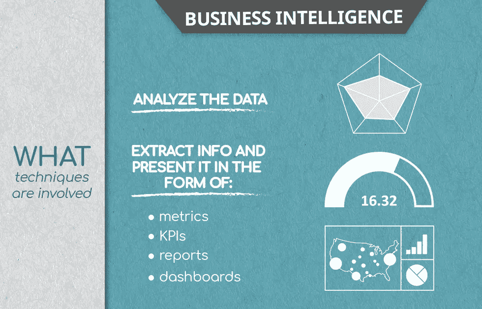
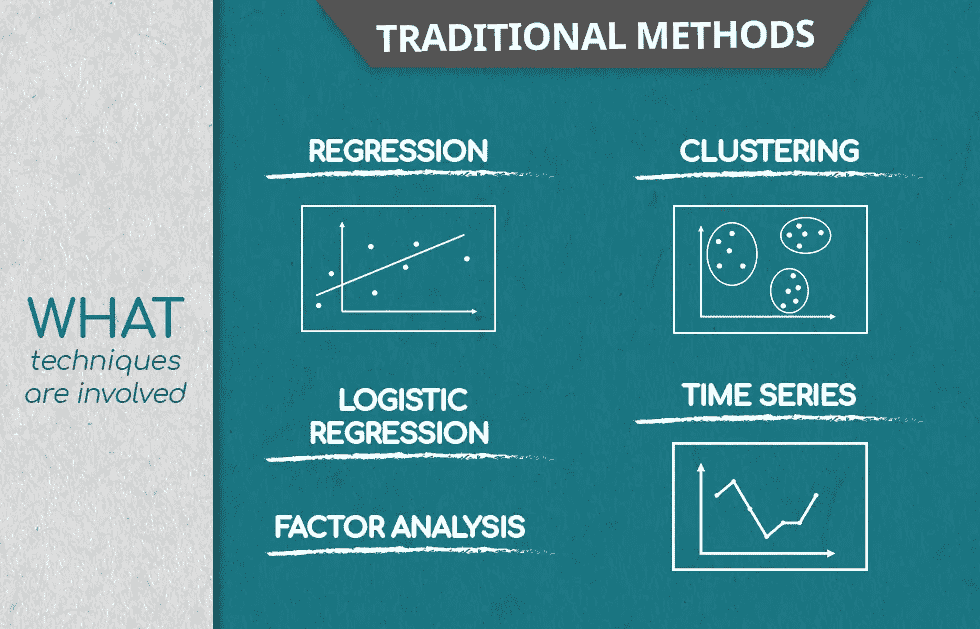
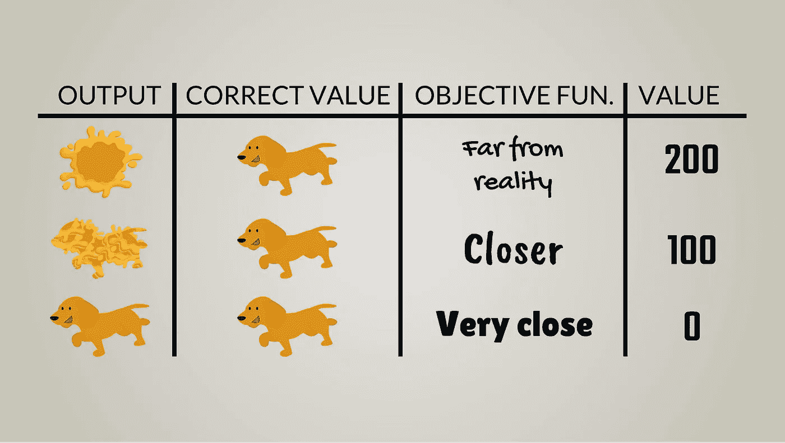
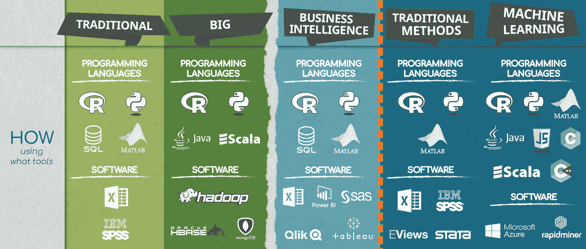

# 数据科学的内容、地点和方式

> 原文：<https://towardsdatascience.com/the-what-where-and-how-of-data-science-6dda1af98671?source=collection_archive---------6----------------------->

***数据科学——一个全球公认的急需传播的术语。***

数据科学是一个逃避任何单一完整定义的术语，这使得它很难使用，特别是如果目标是正确使用它。大多数文章和出版物自由地使用这个术语，并假定它被普遍理解。然而，数据科学——其方法、目标和应用——随着时间和技术的发展而发展。25 年前，数据科学指的是收集和清理数据集，然后将统计方法应用于这些数据。在 2018 年，[数据科学已经发展成为一个包含数据分析、预测分析、数据挖掘、商业智能、机器学习](https://365datascience.com/data-science-vs-ml-vs-data-analytics/)等等的领域。

事实上，因为没有一个定义可以完美地满足这个要求，所以就由那些从事数据科学的人来定义它。

认识到清晰解释数据科学的必要性， [365 数据科学](https://365datascience.com/)团队设计了[什么-哪里-谁信息图](https://365datascience.com/wp-content/uploads/2018/05/365-Data-Science-Infographic.png)。我们定义数据科学中的关键流程并传播该领域。下面是我们对数据科学的解读。

Data and Data Science Infographic by 365 Data Science

当然，这可能看起来像是大量压倒性的信息，但事实并非如此。在本文中，我们将剖析数据科学，并将它重新构建成一个连贯且易于管理的概念。容忍我们！

[数据科学](https://365datascience.com/research-into-1001-data-scientist-profiles/)，‘一分钟之内解释’，看起来是这样的。

你有数据。要使用这些数据为您的决策提供信息，这些数据必须是相关的、组织良好的，最好是数字化的。一旦您的数据一致，您就可以继续分析它，创建仪表板和报告，以更好地了解您的业务绩效。然后，你将目光投向未来，开始生成预测分析。借助预测分析，您可以评估潜在的未来场景，并以创造性的方式预测消费者行为。

但是让我们从头开始。

# 数据科学中的数据

在任何事情之前，总是有数据的。数据是数据科学的基础；这是所有分析所依据的材料。在数据科学背景下，[有两种类型的数据:传统数据和大数据。](https://365datascience.com/techniques-for-processing-traditional-and-big-data/)

传统数据是结构化并存储在数据库中的数据，分析师可以从一台计算机上管理这些数据；它是表格格式，包含数值或文本值。实际上，术语“传统的”是我们为了清晰而引入的。它有助于强调大数据和其他类型数据之间的区别。

另一方面，大数据比传统数据更大，而且不是微不足道的大数据。从多样性(数字、文本，还有图像、音频、移动数据等。)、速度(实时检索和计算)、容量(以万亿字节、千万亿字节、千兆字节衡量)，大数据通常分布在计算机网络中。

也就是说，让我们定义一下数据科学中的“什么”、“哪里”和“谁”各自的特征。

# 你要数据做什么数据科学？

## 数据科学中的传统数据

传统数据存储在关系数据库管理系统中。

Traditional data

也就是说，在准备好进行处理之前，所有数据都要经过预处理。这是一组必要的操作，可以将原始数据转换成更容易理解的格式，从而有助于进一步处理。常见的流程有:

*   收集原始数据并将其存储在服务器上

这是科学家无法直接分析的未接触数据。这些数据可以来自调查，或者通过更流行的自动数据收集模式，如网站上的 cookies。

*   对观察结果进行分类

这包括按类别排列数据或将数据点标记为正确的数据类型。例如，数字的或分类的。

*   数据清理/数据清理

处理不一致的数据，比如拼错的类别和丢失的值。

如果数据是不平衡的，类别包含不相等数量的观察值，因此不具有代表性，应用**数据平衡**方法，例如为每个类别提取相等数量的观察值，并准备进行处理，可以解决这个问题。

重新排列数据点以消除不需要的模式，并进一步提高预测性能。例如，当数据中的前 100 个观察来自使用网站的前 100 个人时，这是适用的；这些数据不是随机的，而是由于抽样而形成的模式。

## 数据科学中的大数据

谈到[大数据和数据科学](https://365datascience.com/techniques-for-processing-traditional-and-big-data/)，传统数据处理中使用的方法有一些重叠，但也有很多不同之处。

首先，大数据存储在许多服务器上，并且无限复杂。

Big data

为了利用大数据进行数据科学研究，预处理甚至更加重要，因为数据的复杂性要大得多。您会注意到，从概念上讲，一些步骤类似于传统的数据预处理，但这是处理*数据*所固有的。

*   收集数据
*   对数据进行分类标注

请记住，大数据非常多样，因此标签不是“数字”与“分类”，而是“文本”、“数字图像数据”、“数字视频数据”、“数字音频数据”等等。

这里的方法也千差万别；例如，您可以验证数字图像观察已准备好进行处理；或者数码视频，或者…

在大规模收集数据时，这旨在确保数据中的任何机密信息保持私密，而不妨碍分析和提取洞察力。这个过程包括用随机和错误的数据隐藏原始数据，允许科学家在不泄露私人细节的情况下进行分析。自然，科学家也可以对传统数据这样做，有时也是如此，但使用大数据，信息可能会更加敏感，这掩盖了更多的紧急情况。

# 数据从哪里来？

传统数据可能来自基本的客户记录，或者历史股票价格信息。

然而，大数据无处不在。越来越多的公司和行业使用并产生大数据。考虑一下在线社区，例如脸书、谷歌和 LinkedIn 或者金融交易数据。不同地理位置的温度测量网格也相当于大数据，以及来自工业设备中传感器的机器数据。当然，还有可穿戴技术。

# 谁处理数据？

处理原始数据和预处理、创建数据库和维护数据库的数据专家可以使用不同的名称。尽管他们的头衔听起来相似，但他们所扮演的角色却有明显的不同。请考虑以下情况。

**数据架构师**和**数据工程师**(分别是大数据架构师和大数据工程师)在数据科学市场中至关重要。前者从头开始创建数据库；他们设计检索、处理和使用数据的方式。因此，数据工程师将数据架构师的工作作为跳板，并处理(预处理)可用的数据。他们是确保数据整洁有序并为分析师接管做好准备的人。

另一方面，数据库管理员是控制数据流入和流出数据库的人。当然，对于大数据，几乎整个流程都是自动化的，因此不需要人工管理员。数据库管理员主要处理传统数据。

也就是说，一旦数据处理完成，数据库整洁有序，真正的数据科学就开始了。

# 数据科学

看待数据也有两种方式:为了解释已经发生的行为，你已经为此收集了数据；或者利用你已有的数据来预测尚未发生的未来行为。

# 数据科学解释过去

## 商业智能

在数据科学进入预测分析之前，它必须观察过去提供的行为模式，分析它们以获得洞察力，并为预测指明道路。商业智能恰恰专注于此:提供数据驱动的问题答案，如:*售出了多少台？哪个地区销售的商品最多？哪种类型的商品在哪里出售？就点击率和产生的收入而言，上个季度电子邮件营销表现如何？这与去年同季度的表现相比如何？*

虽然商业智能的标题中没有“数据科学”，但它是数据科学的一部分，而且不是微不足道的。

# 商业智能是做什么的？

当然，商业智能分析师可以应用数据科学来衡量业务绩效。但是为了让商业智能分析师实现这一点，他们必须采用特定的数据处理技术。

所有数据科学的出发点都是数据。一旦 BI 分析师掌握了相关数据(月收入、客户、销量等)。)，他们必须量化观察结果、计算 KPI 并检查从数据中提取洞察力的方法。

## 数据科学就是讲述一个故事

除了处理严格的数字信息，数据科学，特别是商业智能，是关于可视化的发现，并创建易于消化的图像，只支持最相关的数字。毕竟，所有级别的管理人员都应该能够从数据中了解洞察力，并为他们的决策提供信息。

商业智能分析师创建仪表板和报告，并附有图形、图表、地图和其他类似的可视化内容，以呈现与当前业务目标相关的发现。

# 商业智能用在哪里？

## 价格优化和数据科学

值得注意的是，分析师将数据科学应用于价格优化技术等领域。他们实时提取相关信息，与历史信息进行比较，并采取相应的行动。以酒店管理行为为例:管理层在很多人想去酒店的时候提高房价，而在需求低的时候降低房价以吸引游客。

## 库存管理和数据科学

数据科学和商业智能对于处理供应过剩和供应不足是无价的。对过去销售交易的深入分析可以确定季节性模式和一年中销售额最高的时间，从而实施有效的库存管理技术，以最低的成本满足需求。

# 谁做数据科学的 BI 分支？

BI 分析师主要关注过去历史数据的分析和报告。

商业智能顾问通常只是一个“外部商业智能分析师”。许多公司外包他们的数据科学部门，因为他们不需要或不想维持一个。如果被雇佣，商业智能顾问将成为商业智能分析师，然而，他们的工作更加多样化，因为他们在不同的项目上跳来跳去。他们角色的动态性质为 BI 顾问提供了不同的视角，而 BI 分析师拥有高度专业化的知识(即深度)，BI 顾问则为数据科学的广度做出贡献。

BI 开发人员处理更高级的编程工具，如 Python 和 SQL，以创建专门为公司设计的分析。这是 BI 团队中第三个最常遇到的职位。

# 预测未来的数据科学

数据科学中的预测分析建立在解释性数据分析的基础上，这正是我们到目前为止所讨论的内容。一旦准备好 BI 报告和仪表板，并从中提取见解，这些信息将成为预测未来价值的基础。而这些预测的准确性在于使用的方法。

## 回想一下数据科学中传统数据和大数据的区别。

我们可以对预测分析及其方法进行类似的区分:传统的数据科学方法与机器学习。一个主要处理传统数据，另一个处理大数据。

# 数据科学中的传统预测方法:它们是什么？

传统的预测方法包括用于预测的经典统计方法——线性回归分析、逻辑回归分析、聚类、因子分析和时间序列。其中每一个的输出都被输入到更复杂的机器学习分析中，但让我们首先单独回顾一下它们。

快速的旁注。数据科学行业的一些人也将这些方法称为机器学习，但在本文中，机器学习指的是更新、更智能、更好的方法，如深度学习。

## 线性回归

在数据科学中，线性回归模型用于量化分析中包含的不同变量之间的因果关系。像房价，房子大小，邻里，建成年份的关系。如果你有相关的信息，这个模型可以计算出预测新房子价格的系数。

## 逻辑回归

因为不可能将变量之间的所有关系都表示为线性的，所以数据科学利用像逻辑回归这样的方法来创建非线性模型。逻辑回归用 0 和 1 进行运算。公司在筛选过程中应用逻辑回归算法来筛选求职者。如果算法估计未来候选人在一年内在公司表现良好的概率超过 50%，它将预测 1，或成功申请。否则，它将预测 0。

## 聚类分析

当数据中的观察值根据某些标准形成组时，就应用了这种探索性的数据科学技术。聚类分析考虑到一些观察结果表现出相似性，并有助于发现新的重要预测因子，这些预测因子不是数据原始概念的一部分。

## 要素分析

如果聚类是将*个观察值*组合在一起，那么因子分析就是将*个特征*组合在一起。数据科学求助于使用因素分析来降低问题的维度。例如，如果在一份 100 个项目的问卷中，每 10 个问题涉及一个单一的总体态度，因子分析将识别这 10 个因子，然后可以用于回归，这将提供一个更具解释性的预测。数据科学中的许多技术都是这样集成的。

## 时间序列分析

时间序列是跟踪特定值随时间发展的常用方法。经济学和金融学专家使用它是因为他们的主题是股票价格和销售量——这些变量通常是相对于时间绘制的。

# 传统预测方法在哪里可以应用数据科学？

相应技术的应用极其广泛；数据科学正在越来越多的行业中找到出路。也就是说，两个突出的领域值得讨论。

## 用户体验(UX)和数据科学

当公司推出新产品时，他们通常会设计调查来衡量顾客对该产品的态度。BI 团队生成仪表板后，对结果进行分析，包括将观察结果分组为片段(如区域)，然后分别分析每个片段以提取有意义的预测系数。这些操作的结果通常证实了这样一个结论，即为了最大限度地提高客户满意度，产品需要在每个细分市场进行轻微但显著不同的调整。

## 预测销售量

这就是时间序列发挥作用的分析类型。销售数据一直收集到某个日期，数据科学家想知道在下一个销售周期或一年后可能会发生什么。他们应用数学和统计模型并运行多种模拟；这些模拟为分析师提供了未来的情景。这是数据科学的核心，因为基于这些场景，公司可以做出更好的预测并实施适当的策略。

# 谁使用传统的预测方法？

数据科学家。但请记住，这个头衔也适用于使用机器学习技术进行分析的人。许多工作是从一种方法转移到另一种方法的。

另一方面，数据分析师是准备高级类型的分析的人，这些分析解释已经出现的数据中的模式，而忽略了预测分析的基本部分。

# 机器学习和数据科学

机器学习是数据科学的最新方法。理应如此。

机器学习相对于任何传统数据科学技术的主要优势在于，它的核心是算法。这些是计算机用来寻找尽可能符合数据的模型的方向。机器学习和传统数据科学方法的区别在于，我们不会给计算机如何找到模型的指令；它采用该算法并使用它的指示来自己学习如何找到所述模型。与传统的数据科学不同，机器学习几乎不需要人类的参与。事实上，机器学习，尤其是深度学习算法是如此复杂，以至于人类无法真正理解“内部”正在发生什么。

# 什么是机器学习？

机器学习算法就像一个试错的过程，但它的特殊之处在于，每次连续的尝试至少与前一次一样好。但是请记住，为了更好地学习，机器必须经历成千上万次的反复试验，错误的频率一直在下降。

An illustration of supervised learning

一旦训练完成，机器将能够将它学习到的复杂计算模型应用于新数据，仍然能够产生高度可靠的预测结果。

有三种主要类型的机器学习:监督、非监督和强化学习。

## 监督学习

监督学习依赖于使用标记数据。机器获得与正确答案相关联的数据；如果机器的性能没有得到正确的答案，优化算法会调整计算过程，计算机会再次尝试。请记住，通常情况下，机器会一次处理 1000 个数据点。

支持向量机、神经网络、深度学习、随机森林模型和贝叶斯网络都是监督学习的实例。

## 无监督学习

当数据太大，或者数据科学家承受着太大的资源压力来标记数据，或者他们根本不知道标签是什么，数据科学就求助于使用无监督学习。这包括给机器未标记的数据，并要求它从中提取洞察力。这通常会导致数据根据其属性以某种方式进行划分。换句话说，它是群集的。

无监督学习对于发现数据中的模式非常有效，尤其是那些使用传统分析技术的人会错过的东西。

数据科学通常同时使用监督学习和非监督学习，非监督学习标记数据，监督学习寻找适合数据的最佳模型。这方面的一个例子是半监督学习。

## 强化学习

这是一种机器学习，重点是表现(行走、看、读)，而不是准确性。每当机器的表现比以前更好时，它就会获得奖励，但如果它的表现不佳，优化算法就不会调整计算。想象一只小狗在学习命令。如果它听从命令，它会得到奖励；如果它不听从命令，款待就不会到来。因为食物美味可口，狗会逐渐提高对命令的遵循程度。也就是说，强化学习不是最小化错误，而是最大化回报。

# 机器学习在数据科学和商业领域的应用领域是什么？

## 欺诈检测

通过机器学习，特别是监督学习，银行可以获取过去的数据，将交易标记为合法或欺诈，并训练模型来检测欺诈活动。当这些模型检测到最轻微的盗窃可能性时，它们会标记交易，并实时防止欺诈。

## 客户保持率

通过机器学习算法，企业组织可以知道哪些客户可能会从他们那里购买商品。这意味着商店可以有效地提供折扣和“个性化服务”,最大限度地降低营销成本，实现利润最大化。我想到了几个著名的名字:谷歌和亚马逊。

# 谁在数据科学中使用机器学习？

如上所述，数据科学家深度参与设计机器算法，但这个舞台上还有另一颗明星。

机器学习工程师。这位专家正在寻找方法，将机器学习领域开发的最先进的计算模型应用于解决复杂问题，如商业任务、数据科学任务、计算机视觉、无人驾驶汽车、机器人等等。

# 数据科学中的编程语言和软件

使用数据和数据科学需要两大类工具:编程语言和软件。

Examples of most commonly used programming languages and software

## 数据科学中的编程语言

了解编程语言使数据科学家能够设计出能够执行特定操作的程序。编程语言的最大优势是我们可以重用创建的程序多次执行相同的动作。

r、Python 和 MATLAB 与 SQL 相结合，涵盖了处理传统数据、BI 和传统数据科学时使用的大多数工具。

r 和 Python 是所有数据科学子学科中最流行的两种工具。他们最大的优势是可以操纵数据，并且集成在多个数据和数据科学软件平台内。它们不仅仅适用于数学和统计计算；他们适应性很强。

然而，当使用关系数据库管理系统时，SQL 是王者，因为它是专门为此目的而创建的。SQL 在处理传统的历史数据时最有优势，例如在准备 BI 分析时。

MATLAB 是数据科学中第四个最不可或缺的工具。它非常适合处理数学函数或矩阵运算。

当然，数据科学中的大数据是在 R 和 Python 的帮助下处理的，但从事该领域工作的人通常精通其他语言，如 Java 或 Scala。当组合来自多个来源的数据时，这两个非常有用。

除了上面提到的那些，JavaScript、C 和 C++经常在专家工作的数据科学分支涉及机器学习时使用。它们比 R 和 Python 更快，并提供更大的自由度。

## 数据科学中的软件

在数据科学中，软件或软件解决方案是针对特定业务需求而调整的工具。

Excel 是一种适用于多个类别的工具，包括传统数据、商业智能和数据科学。同样，SPSS 是一个非常著名的处理传统数据和应用统计分析的工具。

另一方面，Apache Hadoop、Apache Hbase 和 Mongo DB 是为处理大数据而设计的软件。

Power BI、SaS、Qlik，尤其是 Tableau 是为商业智能可视化而设计的软件的顶级例子。

在预测分析方面，EViews 主要用于处理计量经济学时间序列模型，而 Stata 用于学术统计和计量经济学研究，其中经常应用回归、聚类和因子分析等技术。

# 这是数据科学

数据科学是一个模糊的术语，涵盖了从处理数据(传统的或大的)到解释模式和预测行为的一切。数据科学是通过回归和聚类分析等传统方法或非正统的机器学习技术来完成的。

这是一个广阔的领域，我们希望你能更进一步理解它是多么包罗万象，与人类生活交织在一起。

如果你喜欢这篇文章，请随意看看我的其他文章。“开始的好处”听起来是个不错的开始！

*原载于 2018 年 5 月 21 日*[*【365datascience.com*](https://365datascience.com/defining-data-science/)*。*