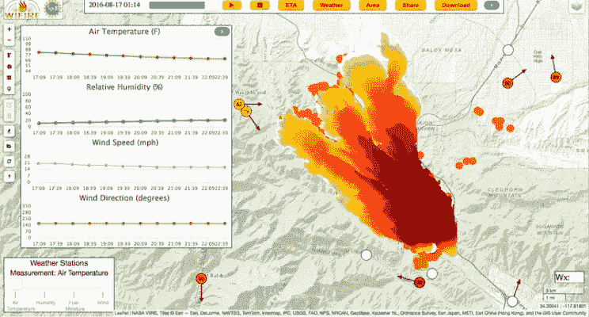

# 数据可视化的世界

> 原文：<https://towardsdatascience.com/the-world-of-data-visualization-d4b621b77e76?source=collection_archive---------4----------------------->

不管你在哪里工作或做什么，你周围的一切都是由指标定义的。波士顿的房子价格是多少？你的汽车行驶了多少英里？星巴克每年卖出多少杯咖啡？更重要的是，你应该产生多大的影响才能在职业生涯中迈出下一大步？

作为人类，我们喜欢我们所有的问题都得到简洁而全面的回答。多年来，数据可视化技术变得越来越复杂。可能是使用最先进的 GIS 系统来表达[野火数据，使用](http://www.sdsc.edu/News%20Items/PR073014_wifire.html) [Tableau、](http://www.tableau.com/) [D3.js](http://d3js.org/) 和 [Bokeh](http://bokeh.pydata.org/en/latest/) 的组合向您的潜在投资者提供市场预测，使用[平行坐标](http://en.wikipedia.org/wiki/Parallel_coordinates)来表达更高维度的数据，甚至是使用 MS Excel 的老式数字处理。数据可视化的最大创新发生在我们自己的大数据领域，我们需要找到一种复杂的方法，以巧妙的可视化指标来查看数百万个数据点。只需谷歌和探索！

有了这些复杂的数据可视化技术，我确信你们中的很多人想从简单的东西开始。虽然 MS Excel 是一个快速而简单的选项，但在如何处理数据、操作绘图手柄的级别以及在各种媒体(如 web 界面、图形用户界面和移动应用程序)上共享绘图手柄方面缺乏灵活性。依我拙见，Matplotlib 是一个极好的开端。

Matplotlib 是一个开源的 Python 库，拥有广泛的开发者社区。几乎任何复杂的可视化问题都可以通过 Matplotlib 丰富的函数数组轻松解决。语法相当类似于 [Matlab](http://www.mathworks.com/) ( [点击这里](http://www.linkedin.com/pulse/python-matlab-users-syed-sadat-nazrul?trk=prof-post)了解详情)和 [Octave](http://www.gnu.org/software/octave/) ，对于那些想要快速转换的人来说。最重要的是，绘图句柄可以与各种基于 Python 的应用程序无缝连接。

至此，下面是我关于 Matplotlib 的基础教程，可以帮助大家踏上数据可视化的伟大旅程: