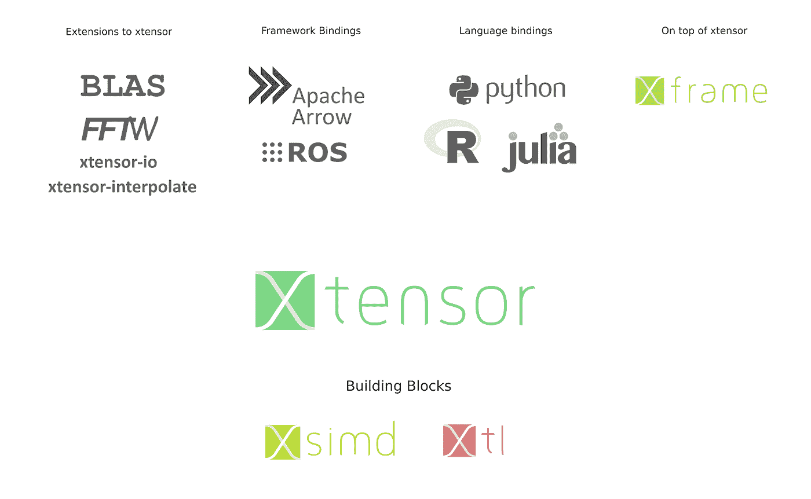

# xtensor 视觉

> 原文：<https://towardsdatascience.com/the-xtensor-vision-552dd978e9ad?source=collection_archive---------11----------------------->

在这里，我们展示了 xtensor 项目的愿景，即 C++语言中的 n 维数组——这使得编写高性能代码并将其绑定到数据科学语言(Python、Julia 和 R)变得很容易。


*Results of running the same C++ implementation from Julia, Python, R, and C++ (from left to right)*

展示一个清晰的愿景是很重要的——尤其是对于开源项目:只有一个共同的目标才能把人们聚集在一起。这就是为什么我们决定最终整理出一份文件，展示我们对 C++如何在数据科学的未来发挥重要作用的愿景，以及为什么。当今数据科学的三种主要语言是 Python、Julia 和 r。

Python 科学计算生态系统中有很多很酷的库是其他语言所没有的，比如 Julia 和 R——反之亦然。例如，scikit-learn 是一个专用的 Python 包。变通办法通常是从 Julia 调用 Python 解释器，但这不是特别快或优雅，而且转换代价很高。这些软件包中包含的数值方法已经很好地建立起来了，并且由于拥有大量的用户群而经过了彻底的测试。不幸的是，选择这三种语言中的一种作为参考实现，而不是一种通用语言，会妨碍其他数据科学语言的采用。不同社区的重复工作损害了生态系统的可持续性和科学成果的可复制性。这不仅适用于成熟的数值方法，也适用于标准协议、文件格式阅读器、数据科学的公共数据结构的实现。

对于这项任务，C++的主要优势是速度和成熟度，以及一个庞大的开发人员社区。虽然有其他有前途的语言，但 C++长期以来一直是科学计算的基石，而且不会消失——尽管它非常缺乏 n 维数组库。相反，现代 C++变得越来越好，语言和标准库比以往任何时候都好。

1.  C++可以非常快。你通常会发现 C++在基准测试中名列前茅。例如在[基准测试游戏](https://benchmarksgame-team.pages.debian.net/benchmarksgame/which-programs-are-fast.html)中，C++与 C 和 Rust 一直位列前三。然而，像 Rust 这样的语言在结果中显示出更多的变化，而 C 和 C++保持稳定。你可以确信*总是有办法*用 C++创建尽可能最快的代码——语言*永远不会*阻止你达到目标。
2.  C++有一个强大的类型系统，可以带来很大的好处，还有一个强大、灵活的模板系统，允许我们让编译器生成极其优化的汇编。
3.  通用意味着可重用:所有代码最好只写一次。这就是为什么一门通用语言需要让它容易被其他语言使用。数据科学中的三大巨头是 Python、R 和 Julia。他们每个人都有优秀的工具与 C++对话:Python 的 [pybind11](https://github.com/pybind/pybind11) ，R 的 [RCpp](http://www.rcpp.org/) ，Julia 的 [CxxWrap](https://github.com/JuliaInterop/CxxWrap.jl) 。当您用 C++编写代码时，您可以确保能够从这些语言中重用它。

## xtensor 如何尝试解决这个问题



The xtensor data science stack

借助 xtensor，我们旨在开发一个适用于整个数据科学生态系统的解决方案。xtensor 是 C++的 n 维数组容器，类似于 Python 的 NumPy。我们严格遵循 NumPy API，但是是纯 C++和强类型的(甚至有一个[备忘单](https://xtensor.readthedocs.io/en/latest/numpy.html)来显示这些 API 是如何匹配的)。此外，我们提供了 Python、R 和 Julia 的官方绑定。这意味着，如果你用 xtensor 用 C++编写一次数值算法，你就可以无缝地使用数据科学的每一种主要语言的例程。xtensor 非常灵活，可以使用动态语言进行内存管理:如果通过 xtensor-julia 分配一个 julia 数组，就会使用 Julia 自己的内存分配器和垃圾收集器。xtensor 还透明地处理任何内存布局，例如 Julia 和 R 的列主布局和 NumPy 的行主布局。近年来，C++在自我现代化方面取得了巨大进步(C++ 14 和 c++ 17 ),这使它成为一种非常高效的语言。

在剩余的博客文章中，我们将研究光线明暗处理高度图算法的实现——它首先来自 R 社区，然后被用来展示 GraalVM 如何加速 R，这是 Julia 和 Pythran 争论的问题。本文的目的是展示我们如何用 xtensor 在 C++中一劳永逸地实现该算法，然后在保持最高速度的同时创建到这些语言的绑定。

## 挑战

我们已经将最初的 [R & Julia](https://nextjournal.com/sdanisch/fastr-benchmark) (来自 Tyler Morgan-Wall 和 Simon Danisch)首先移植到 Python，然后移植到 xtensor(你可以在这里找到 [Python 版本](https://gist.github.com/wolfv/cecbfc355803491d93f449fe1eea1a70))。

我们的版本住在 https://github.com/wolfv/xtensor-showcase 的

您可能会注意到，除了到处使用花括号之外，移植的 C++代码的长度基本上与原始的 Python 或 R 实现相同。NumPy 用户可能还会识别出`linspace`等功能。这是因为对于大多数高级数组操作，我们坚持使用 NumPy APIs。当然，最大的区别是提供了`<double>`模板参数，这是高效计算和使用我们的模板表达式引擎生成快速代码所必需的强大编译时类型(关于如何工作的详细解释可以在[这里找到](https://en.wikipedia.org/wiki/Expression_templates))。

我们现在可以为三大巨头创建绑定:Python、R 和 Julia。对于每种语言，都有各自的 xtensor 包:

*   xtensor-python :无缝处理 NumPy 数组
*   [xtensor-r](https://github.com/QuantStack/xtensor-r) :来回传递 R 个向量和矩阵
*   [xtensor-julia](https://github.com/QuantStack/xtensor-julia) :绑定 julia 的 n 维数组

这三个软件包的工作方式都相似。它们使用特定于语言的 C++包(pybind11、CxxWrap.jl 和 RCpp)在宿主语言中本地创建数据结构。使用这些包，我们在 C++中创建新的 xtypes:XT::py array<t>用于 NumPy 数据支持的 python 数组，XT::raray<t>用于 R 版本，xt::jlarray <t>用于 Julia。此外，软件包还包含具有静态维数的版本(相当于 xt::xtensor <t n="">，其中 N 是表示维数的整数。这实现了对 C++编译器和模板表达式引擎的一系列优化。</t></t></t></t>

例如，让我们看看 Python 绑定(Julia 和 R 绑定一样简单):

作为函数的输入，我们取一个 xt::pyarray <float>。这个类型是用 pybind11 注册的，类型是从 NumPy 数组自动转换的——任何步骤都不需要复制缓冲区内容！由于 rayshade_impl 函数将模板参数 E 作为输入，因此我们可以用遵循 xexpression 接口的任何类来调用它。当然，pyarray 做到了这一点(以及 rarray 和 jlarray)。</float>

## 基准

以下是基准。正如您所看到的，基准测试显示了像 C++和 Julia 这样的编译语言是如何生成非常有效的代码的，并且 xtensor 绑定根本不会影响速度！(顺便说一下，C++的结果比 Julia 的稍慢，因为没有使用专门的基准测试包，我们只在笔记本电脑上计时了一次迭代 CPU 通常需要一些迭代来提高速度)。

```
 Benchmarks ╔══════════════════╦════════════╗
        ║     Language     ║  Time (s)  ║ 
        ╠══════════════════╬════════════╣
        ║ C++              ║   .0164812 ║ 
        ║ Python / xtensor ║   .0220982 ║ 
        ║ Python / NumPy   ║ 14.224207  ║
        ║ Julia / xtensor  ║   .014221  ║
        ║ Julia            ║   .014501  ║
        ║ R / xtensor      ║   .01328   ║
        ║ R                ║  9.905     ║
        ╚══════════════════╩════════════╝
```

这里我们需要提一下:Brodie Gaslam 令人印象深刻地展示了如何通过利用矢量化使 [R 代码具有高性能(同样的原理也可以用在 NumPy 和 xtensor 中)。他的代码运行速度几乎和使用 xtensor 的 R 一样快，达到了 0.058 秒。](https://www.brodieg.com/2018/10/23/do-not-shade-r/)

## 如何开始

这个例子的代码被上传到 https://github.com/wolfv/xtensor-showcase 的。我们已经为 [xtensor](https://xtensor.readthedocs.io/en/latest/) 创建了许多文档以及千篇一律的项目模板，以帮助人们开始使用 Python 和 [Julia](https://github.com/QuantStack/xtensor-julia-cookiecutter) 的[插件。你也可以在 QuantStack 项目下的 GitHub](https://github.com/QuantStack/xtensor-python-cookiecutter) 上查看各种[x sensor-repositories。我们经常在网上的 Gitter 聊天室或 Twitter 上聊天。](https://github.com/QuantStack)

## 我们想从这里走向何方

对于 xtensor 来说，未来还有许多有趣且具有挑战性的任务:

*   *更多的 NumPy API:* 我们已经介绍了很多，但是仍然缺少一些部分！我们甚至已经编译了一个 GitHub 项目,其中有一些 NumPy API 中缺少的易于处理的部分。例如，如果你想再次尝试 C++，我们很乐意通过实现一些缺失的功能来指导新手！
*   *进一步加速一些功能:*目前我们已经实现的功能还有一些瓶颈。是时候摆脱他们了。
*   *GPU 支持*——很明显的一个。每个人都有，我们需要得到它，希望明年。这可以大大加快对大数据的操作。
*   *更好的互操作性:*例如，我们希望获得对 [Apache Arrow](https://arrow.apache.org/) (工作正在进行中)和 PyTorch 的深度支持。我们也会对更多的语言绑定感到高兴。比如 Matlab/Octave，或者 Java！
*   *编译 NumPy 到 xtensor:* 这是一个大的。在 python 的帮助下，我们可以将 NumPy 代码编译成 C++(python 目前在 c++中有自己的 NumPy 实现)。我们已经与 python 的作者密切合作，python 使用与 xtensor 相同的 SIMD 库(称为 [xsimd](https://github.com/QuantStack/xsimd) )。这里的大愿景是，人们可以使用 NumPy 编写一次数字代码来实现快速原型，然后自动将其编译成 C++。在 C++中，我们可以很容易地生成 Python 的绑定代码(导出到一个独立的库)以及 R 和 Julia！这可能使从高级算法描述编写跨语言库变得非常好。

您可以在 [**Twitter**](http://twitter.com/wuoulf) 上关注作者，或者访问[**https://gitter.im/QuantStack/Lobby**](https://gitter.im/QuantStack/Lobby)的 Gitter 聊天室，讨论 xtensor 及相关项目！

链接:

*   x tensor:[GitHub](https://github.com/QuantStack/xtensor)ReadTheDocs