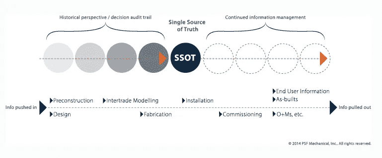
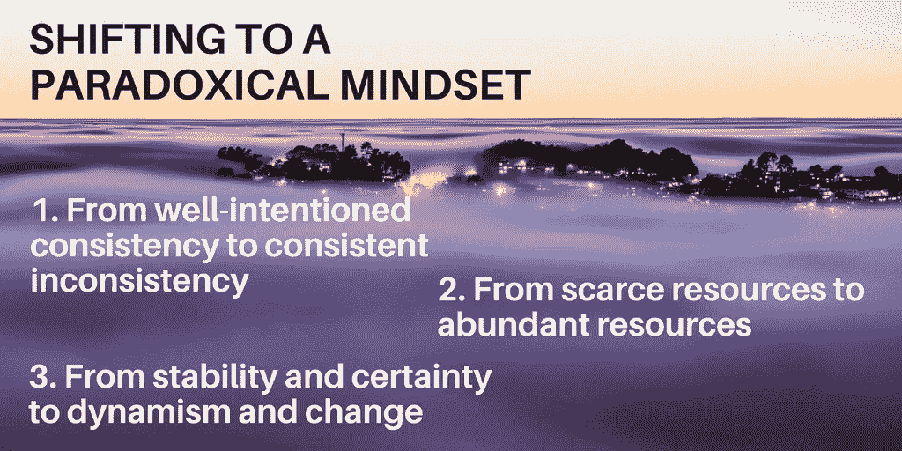

# 真相没有单一的版本

> 原文：<https://towardsdatascience.com/theres-no-single-version-of-the-truth-fe4b9857a453?source=collection_archive---------5----------------------->

我时常听到一个让我毛骨悚然的短语。这通常与一些陈词滥调的商业比喻有关(想到无耻地使用“在一天结束时”)。现在，有一个让我思考措辞在现代商业中的价值:真相的单一版本。

这个短语有不同的说法，比如真理的一个版本或者真理的单一来源。不管用哪种方式，在如今“另类事实”的氛围下，这个短语有了更深的含义。让我们解释一下这个短语的意思，以及为什么在部署这个短语时应该非常小心。

# SSOT 与信息系统设计

这个术语最初的应用是在设计捕捉和传播信息的系统时。这在访问许多不同数据流的情况下尤其相关。“[单一事实来源](https://en.wikipedia.org/wiki/Single_source_of_truth)”模型确保相关应用程序访问相同的数据源，从而提高准确性和相关性。如果没有 SSOT，由于数据来源的差异，同一问题可能会有不同的答案。

这一点在建筑系统设计等领域尤为重要，在这些领域，一个变化就会产生迅速的连锁反应。下图显示了 SSOT 在特定情况下的工作方式。事实上，该图也可以应用于在任何信息系统中组合和验证多个数据源的方式。

# 源代码与版本

这是关键的区别。拥有单一的真实来源意味着任何给定的用户都可以依赖这些数据。系统被理解为将所有相关的数据源拉进那个单一的源，然后从那个点开始的所有查询依赖于那个源。

在商业词汇中,“单一来源”已经变成了“单一版本”虽然有一个[的论点，即单一版本的真相](https://www.linkedin.com/pulse/single-source-truth-vs-version-lionel-grealou)是一个普遍接受的应用于数据集的规则，我有一个问题。单一版本的真相仍然意味着有其他版本的真相可用。单一的事物不能有多个版本。同样的数据，不同的方法可能会产生矛盾的答案。如果是这样，那就不是真理。是观点！

# 为什么你应该关心

所有伟大领袖的一项基本技能是接受大量不确定性的能力。在不断变化的宏观经济环境中，没有什么是确定的。尽管模糊不清，但企业必须经营。领导者必须在不确定且经常不稳定的环境中接受多重真理。

精彩文章“ [Both/And Leadership](https://hbr.org/2016/05/both-and-leadership) ”的作者指出了美国人的思维方式是如何框定这个国家与不确定性的关系的:

> 如果一个想法是“正确的”，它的对立面一定是错误的；如果情况似乎不是这样，那么我们必须重新定义我们的想法，以消除矛盾。

这就在灰色地带制造了一个真空。在当今西方企业的主流思维中，根本没有容纳多重真理的空间。如果一个领导者在一个想法上全力以赴，那就会减少分析其他潜在竞争想法所需的自省。

为了挑战这种似是而非的心态，文章接着提出了三个关键的转变，以适应现代商业世界的不确定性和矛盾性。坚持接受矛盾——你不能控制一切，也不应该尝试。消除稀缺思维——这阻碍了企业和员工的发展。走向充满活力和变化的状态——稳定是无法实现的幻想。

话语比以往任何时候都重要。走进时代的悖论，改变你的沟通方式，在当今的商业环境中放大你的成功。

记住这一点:如果你说“单一来源”，那么你是在谈论一个技术产品开发概念。您必须确定该来源符合 SSOT 的标准。如果你说“单一版本”，那么你真的没有说太多。你应该阐明你的意思，以避免混淆和怀疑。

我知道许多企业使用“单一版本”来让团队围绕一个共同的数据视图，但我不同意这个说法！相反，应该像命名项目一样命名数据集，并以这种方式引用它。或者称之为风景。“单一版本”暗示了一些不可能的事情！

*本文代表尼克的个人观点，不反映他所属或受雇的任何公司。*

*尼克·维维安是一名记者和交流者，对旅游事业充满热情。在过去的十年里，他在世界各地为《孤独星球》等品牌创作内容，并在 nickvivion.com 撰写了大量关于内容、技术和旅游的文章。*