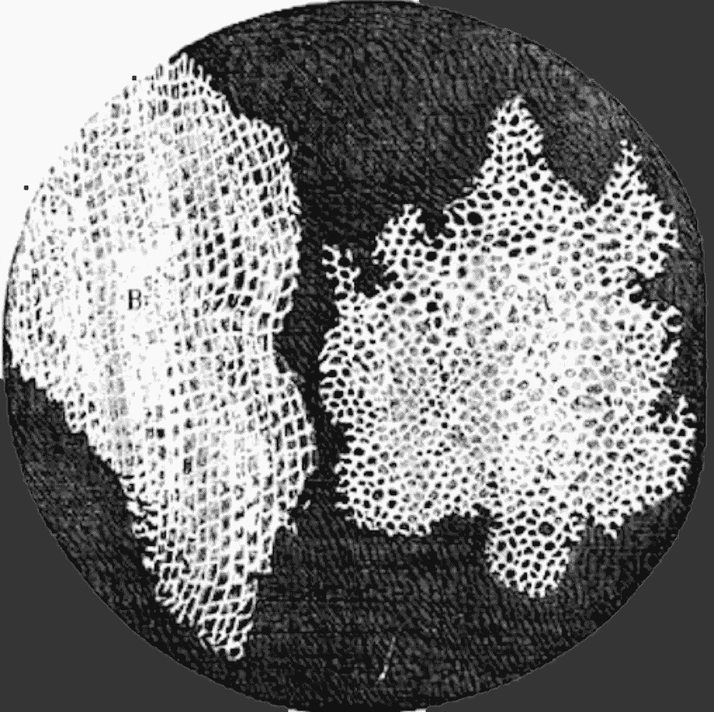
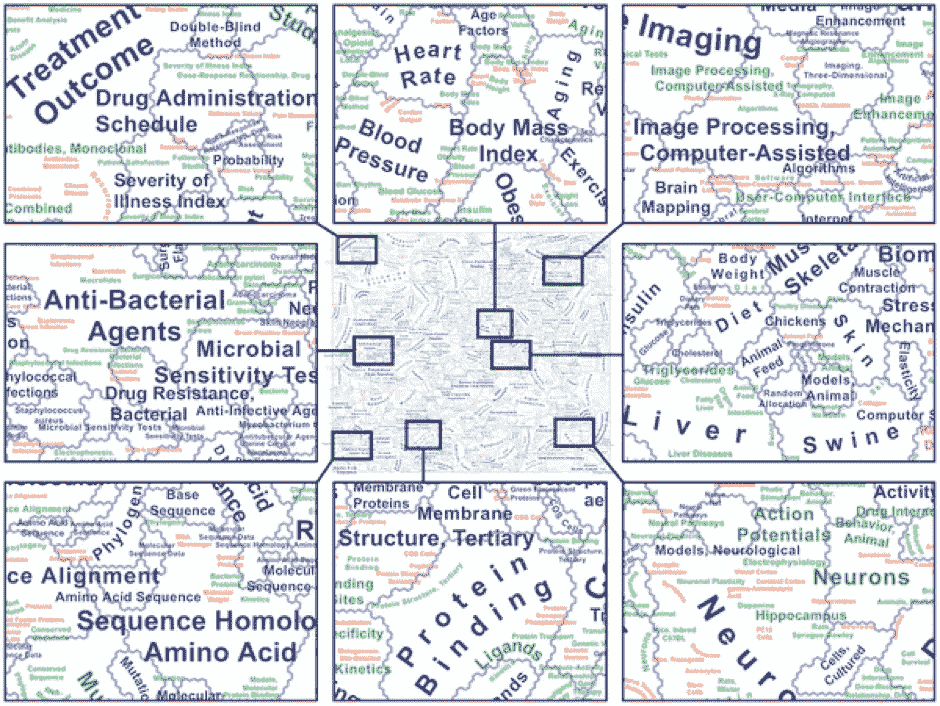
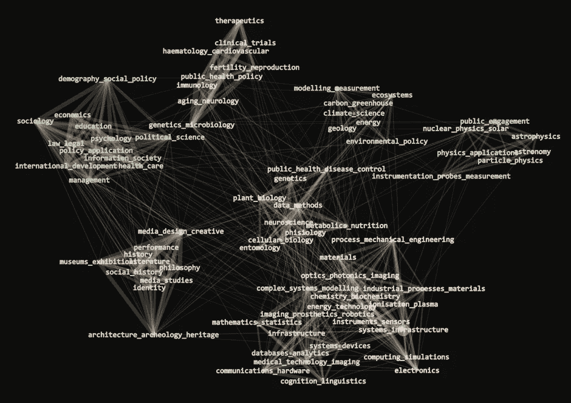

# 我们正在建立一个强大的系统来衡量科学……但是创新呢？

> 原文：<https://towardsdatascience.com/these-are-some-of-the-things-you-are-likely-to-hear-if-you-spend-time-talking-to-people-running-138a31eaea2e?source=collection_archive---------3----------------------->

Cell structure from Robert Hooke’s Micrographia (1665). Source: [Wikimedia Commons](https://commons.wikimedia.org/wiki/File:RobertHookeMicrographia1665.jpg)

> “我们的工作是创造新的联系，但我们如何证明它们的价值？”
> 
> *“测量是短期的，但我们的影响是长期的”*
> 
> *“衡量我们的方式让我们不敢冒险”*

如果你花时间与实施支持创新的项目和干预措施的人交谈，你可能会听到这些事情。这些创新实践者所说的是，用于评估他们的指标是不正确的，这使得他们的工作更加困难。

但是什么是正确的衡量标准呢？我们如何得到它们？开始测量目前不为人知的事物有什么坏处吗？

在这篇博客文章中，我通过首先查看科学研究的相邻领域的情况来探索这些问题，我认为，关于科学活动的新一波数据(科学计量学)正在以前所未有的详细程度和及时性，使测量和跟踪科学投入、过程和产出变得越来越容易。

不幸的是，在创新领域(企业、政府和第三部门应用新思想的领域)，事情的进展没有那么快，因此我们对创新如何发生以及支持创新的最佳方式的理解仍然不够。我概述了科学中情况不同的原因，并概述了生成更好的创新数据的策略，帮助我们的创新衡量(innometrics)赶上科学计量学。

# 创建科学政策的科学

在过去的几个月里，我参加了几次会议和研讨会，数据的数量和质量以及科学计量学学者为回答重大科学政策问题而部署的方法的复杂性给我留下了深刻的印象，这激发了我写这篇博客的灵感。

在去年 9 月的经合组织蓝天论坛上，我看到了关于科学合作和研究人员流动的非常有趣的介绍。我对由 Katy brner 和合作者制作和策划的知识图谱感到惊讶，他们使用先进的分析和信息设计来创建科学研究的详细地图，以及不同研究领域之间的联系。

例如，参见下面的地图(基于这篇[论文](http://journals.plos.org/plosone/article?id=10.1371/journal.pone.0058779))。它基于对超过 200 万篇论文的分析显示了医学科学子领域之间的关系。研究人员和资助者可以使用这些地图在浩瀚的科学海洋中导航，并识别潜在的有趣论文和领域之间的联系。

来源:[斯库平、比伯斯丁和伯尔纳(2013 年)](http://journals.plos.org/plosone/article?id=10.1371/journal.pone.0058779)

在欧盟委员会(European Commission)组织的一次专家研讨会上，我了解到在欧盟委员会的支持下，一个由欧洲研究人员组成的财团正在开发的科学与创新研究基础设施 [RISIS](http://risis.eu/) 。RISIS 是一组链接的数据集和一个安全的实验室，用于存储和分析科学活动的微观数据。

就在几周前，我参加了由科技公司 [Digital Science](https://www.digital-science.com/) 组织的 FuturePub 会议，会上他们的首席执行官丹尼尔·胡克(Daniel Hook)介绍了 [*协作的互联文化*](https://www.digital-science.com/resources/portfolio-reports/connected-culture-collaboration/) *，*一份报告，该报告对科学协作进行了新的分析，其数据来自[背面的](https://www.google.co.uk/webhp?sourceid=chrome-instant&ion=1&espv=2&ie=UTF-8#q=overleaf)，这是一个协作科学写作和出版的平台。

下面这张取自该报告的漂亮图表显示了不同国家机构之间的联系(红色代表北美国家，蓝色代表欧洲国家，紫色代表南美国家，黄色代表西亚国家)。作者指出，欧洲国家之间的高水平合作部分是由欧盟研究基金推动的，这鼓励了欧洲各地的研究人员一起工作。你可以想象这样的数据和可视化有助于回答重大的政策问题，比如英国退出欧盟对英国在国际研究网络中的地位的影响。

来源:[卡尔弗特和胡克(2017)](https://www.digital-science.com/resources/portfolio-reports/connected-culture-collaboration/)

我在自己的工作中受益于科学计量学的新浪潮。由英国研究委员会和创新机构 Innovate UK 资助的项目的开放数据集“研究之门” (GtR)是对我们为威尔士政府开发的创新数据仪表板 [Arloesiadur](http://www.nesta.org.uk/project/arloesiadur-innovation-dashboard-wales) 的重要投入。GtR 包含数万个项目和组织的详细链接信息。我们正在使用机器学习、自然语言处理和网络科学来分析这些数据，以跟踪研究课题和技术的出现，确定威尔士具有比较优势的领域，并发现威尔士研究人员之间合作的新机会。

下图显示了基于这些数据的研究主题的初步网络。在这个图表中，经常出现在相同项目中的研究主题被拉近了。颜色代表每个主题所在的更广泛的科学学科。尽管科学学科显而易见，但它们远非孤立。特别是，‘*media _ design _ creative’，‘management’，‘process _ mechanical _ engineering’*以及环境和生命科学研究的政策应用等应用性和实践性研究主题似乎在学科之间架起了桥梁，表明这些项目通过将学科联系起来解决实际问题而创造了价值，此外还提供了这些问题的解决方案！

资料来源:Nesta(即将出版)。

# 创新计量学落后于科学计量学

不幸的是，我们衡量新思想(包括科学研究产生的思想)应用的创新过程的能力并没有以同样的速度扩大和提高。哈桑·巴克希和我在去年经合组织蓝天会议上提交的一份工作文件[中提出了创新政策数据现状的问题，所以我现在只浏览一下:](http://www.oecd.org/sti/106%20-%20Bakhshi%20and%20Mateos-Garcia%202016%20-%20New%20Data%20for%20Innovation%20Policy.pdf)

许多当前的创新研究依赖于创新调查，例如[社区创新调查](http://ec.europa.eu/eurostat/web/microdata/community-innovation-survey)。这些(明确地说，是高质量的)调查受到样本量小和难以比较回答的困扰，它们缺乏关于商业合作和贸易的详细信息，并且不能用于识别单个企业。对于寻找具体地点、行业和网络或单个企业详细信息的研究人员和政策制定者来说，它们并不那么有用(而不是部门总量或平均值)。

专利可以填补其中的一些空白，但在以科学为基础和技术密集型的行业中，只有极小一部分企业拥有专利。[不到 1%的英国创新调查受访者认为专利对于保护他们的创新非常重要。](https://www.gov.uk/government/statistics/uk-innovation-survey-2015-statistical-annex-and-interactive-report)

通过通常由国家统计机构维护的安全数据实验室，可以越来越多地获得关于公司财务业绩的微观管理数据。不幸的是，这些数据告诉了我们很多关于公司业绩的信息，却没有告诉我们多少关于创新的信息。[【2】](http://www.nesta.org.uk/#_edn2)和以前一样，他们缺乏关于商业网络的信息，并且(可以理解的)是匿名的。

# 如何解释这些差异？

我们拥有比创新更好的科学数据，原因很简单:科学活动更容易衡量，衡量的内容更公开地共享，共享的内容更容易整合，以获得对科学系统更统一的看法。

让我们依次讨论这两件事。

1.关于**测量的容易程度**:虽然很少有人会认为科学是一个简单的系统(如果有疑问，回到上面的图表)，但它的输出不如创新那样多样化。简单地说，学术研究者产生论文。[【3】](http://www.nesta.org.uk/#_edn3)相比之下，创新包括新产品、服务、流程、商业模式、组织方式和“软”创新，这些创新在不同行业之间有很大差异。没有一个像 Scopus 这样的数据库可以让人们去寻找关于这些创新的信息。

科学货币引文的高可见性也使得在学术界比在工业界更容易绘制合作和影响网络，在工业界，许多(如果不是大多数的话)信息流和人员不会留下书面痕迹，或者在许多独立或专有的数据集中留下一点痕迹，如企业用来跟踪销售和购买的客户关系系统，或 LinkedIn 等专业网络。

2.这让我们想到了推动新一轮科学计量学浪潮的科学体系的另一个特征:**开放性**。科学由少数(主要)公共和第三部门组织资助，这些组织收集大量关于“投入”(资金、科学工作者的特征、项目描述等)的运营数据。)，而且[越来越开放](http://www.economist.com/news/science-and-technology/21719438-about-change-findings-medical-research-are-disseminated-too)以降低知识获取和再利用的壁垒。在期刊付费墙之外获取论文也变得越来越容易。创新方面的情况非常不同，政府在发布创新项目参与者的数据方面速度较慢，拥有宝贵创新数据的公司没有多少动力发布这些数据。

3.在**整合**方面:科学系统在开发和采用唯一标识符方面取得了长足进步，这使得跨数据库连接信息成为可能:这包括用于识别内容(例如论文)的[数字对象标识符](https://www.doi.org/)、研究人员的持久数字标识符 [ORCiD](https://orcid.org/) 以及全球研究机构目录 [GRID](https://www.grid.ac/) 。由于这种元数据基础设施，科学计量学的研究人员可以顺利地从许多不同的来源汇集信息，以获得对创新系统的全面了解。这种全球标准在创新领域不太发达。例如，用于唯一标识企业的[全球法律实体标识符](https://www.gleif.org/en/) (GLEI)在英国的注册公司不到 3 万家，占英国企业人口的比例微乎其微。

# 帮助创新计量学赶上科学计量学

这东西很重要。就目前的情况而言，创新政策决策基于错误数据的风险很大，糟糕的指标会扩大，以填补良好指标缺失造成的空白，这可能会造成一个颠倒的世界，成功的项目似乎已经失败，反之亦然。

毫不奇怪，糟糕的创新数据也减缓了大数据、数据科学和人工智能(AI)方法在创新政策和实践中的使用。相比之下，更大更好的科学计量数据集正在推动一个新兴的科技场景，包括数字科学(我之前提到过)，以及其他创业公司，如[仁慈的 AI](http://benevolent.ai/) 、 [Meta](https://meta.com/) 或 [Yewno](http://yewno.com/about/) ，他们都在使用人工智能来加强科学发现和合作。

更糟糕的是，对创新的错误衡量在科学政策中产生了负面溢出效应，因为低质量的创新指标使得衡量公共投资对科学的影响变得更加困难，越来越多地基于经济增长和就业的前景。甚至还存在这样的风险，即缺乏关于科学研究推动创新的微妙方式的信息，可能会导致政策制定者关注科学影响的更粗糙的衡量标准，如从大学到工业的衍生产品或知识产权许可。

这可不行。我们知道，创新对于提高生产率、重新平衡经济、减少经济不平等和应对巨大的社会和环境挑战至关重要，但这需要有效的政策来支持创新，并基于正确的数据和指标来监管创新。正如欧盟专员卡洛斯·莫达斯(Carlos Moedas)在经合组织蓝天会议(OECD Blue Sky conference)的演讲中指出的那样，“数据是(创新)政策运行的燃料。没有它，我们无法知道我们是否做出了正确的决定。

# 我们如何前进？

有三个广泛的行动领域，与我上面提出的衡量、开放和整合的思想相关。

**首先，我们需要扩展新数据源和数据科学方法的使用，以衡量和规划创新。**和其他人一样，创新者在网站和服务中留下数字足迹，他们用这些网站和服务来筹集资金、建立关系网、合作、招聘、营销和销售。我们需要积极分析这些来源，以衡量创新投入、活动和产出。这就是我们在诸如[科技国家](http://www.nesta.org.uk/blog/tech-nation-2016-findings)、[创意地理](http://www.nesta.org.uk/publications/geography-creativity-uk)或 [Arloesiadur](http://www.nesta.org.uk/project/arloesiadur-innovation-dashboard-wales) 等项目中所做的，并取得了可喜的成果。现在我们需要开始推动这些方法进入政策主流，并围绕它们的使用建立信任。我们与 NIESR 和其他合作伙伴在国家统计局建立的经济统计卓越中心所做的工作正是以此为目标。

另一个更好地衡量创新的潜在策略是用网络数据“即时预测”商业创新。例如，人们可以进行一项大型调查来衡量商业创新，然后在其他更及时匹配的数据源中寻找这些指标的良好预测者，如受访者的网站(用机器学习的语言来说，我们将在通过调查标记的数据集中训练一个模型)。然后，我们可以使用我们所了解的代理和度量之间的联系来估计我们没有调查的其他业务(但显示创新“信号”)具有创新性的可能性，并比大型和昂贵的调查更快和更频繁地跟踪情况的变化。

**其次，我们需要找到一种方法来打开当前关闭的重要创新数据集**。这适用于公共部门，几乎在默认情况下，公共部门应该公开参与创新项目的公司的数据(这是创新英国已经在通过研究之门做的事情)，以及商业注册，甚至在合理的范围内，公开行政数据集。专门为创造高质量数据而设计的政府干预，例如由[创新增长实验室](http://www.nesta.org.uk/project/innovation-growth-lab-igl)倡导和运行的干预，是这种混合的重要元素。

在私营部门方面，一些平台如 GitHub、Meetup 或 Twitter 对其数据相当开放，可以通过开放应用编程接口(API)访问这些数据。LinkedIn 等其他网站非常封闭，它们的数据提供了研究劳动力流动、商业网络和创新能力的绝佳机会。

是否有任何法规、激励措施和技术系统(包括通过安全数据服务共享数据)可以到位，以鼓励更系统地共享这些信息，为创新和经济政策提供信息？

第三，我们需要整合数据集，以获得创新系统的统一视图。如果 YouTube 或苹果应用商店中存在关于内容创新的数据，GitHub 等协作编码网站中存在关于数字创新的数据，Glassdoor 等工作评论网站中存在关于组织创新的数据，我们如何全面衡量创新？

为了有效地合并所有这些数据集，我们需要唯一的标识符来告诉我们，GitHub 中的创新创业公司 X 与参与创新计划 Y 和加速器 Z 的公司是同一家，与科学中已经存在的公司是同一家。政府和数据平台还能做些什么来鼓励像 GLEI 这样的商业标识符的使用呢？那么个体创新者的唯一标识符呢？比如，它可能帮助我们追踪个体轨迹，以绘制思想传播图，并衡量创新项目的长期影响。在这里，我们可以从公共部门的解决方案开始，比如在北欧国家实现了如此多伟大创新研究的个人身份号码，以及私人部门的解决方案，比如 LinkedIn 或 Twitter 等平台上的社交用户 id。

# 结尾和警告:指标只是开始

我们需要更多更好的数据来制定创新政策，我相信，受科学计量学进步的启发，上述议程会有所帮助。然而，为了产生影响，需要使用我们开发的新指标，并且要聪明地使用。

正是在这一点上，我或许应该缓和一下我对科学领域形势的乐观态度，在这个领域，学者们早就[表达了对痴迷于指标](http://www.hefce.ac.uk/pubs/rereports/year/2015/metrictide/)，以及[简化影响因子或大学排名](http://www.nature.com/news/bibliometrics-the-leiden-manifesto-for-research-metrics-1.17351)的过度和扭曲影响的担忧。世界的复杂性将永远压倒我们描绘它的能力，而科学、技术和企业创造力所固有的不确定性将永远挫败我们预测和控制它的愿望。

然而，无知并非福佑，很少有人会认为应对所有这些挑战的方法是停止测量。答案是继续衡量，更好地衡量，谦虚地衡量，理解度量的局限性，通过使用和使用我们所学的东西来学习。这些过程是科学方法的核心，可以帮助我们更好地理解和支持科学以及创新。

[*此博客最初发布于 Nesta 网站*](http://www.nesta.org.uk/blog/we-are-building-formidable-system-measuring-science-what-about-innovation)

*收到了詹姆斯·菲普斯的有益评论。*

*说明这篇博客的图像是在罗伯特·胡克的* [*显微照片*](https://ceb.nlm.nih.gov/proj/ttp/flash/hooke/hooke.html) *中通过早期显微镜看到的细胞结构，这是如何利用更好的测量来揭示复杂性而不是消除复杂性的例子。*

# 尾注

[【1】](http://www.nesta.org.uk/#_ednref1)科学计量学是“科学”和“计量学”的结合体。它指的是对科学的衡量，通常使用出版物或专利等科技产出。

[【2】](http://www.nesta.org.uk/#_ednref2)说到这里，有人把微观行政数据和创新调查数据、创新计划数据进行匹配，效果很大。

诚然，书籍或艺术品等其他产出在艺术和人文学科中也很重要。