# 这些是真正的堆栈溢出趋势:使用页面视图

> 原文：<https://towardsdatascience.com/these-are-the-real-stack-overflow-trends-use-the-pageviews-c439903cd1a?source=collection_archive---------5----------------------->

## 直到今天，获得 Stack Overflow 的季度浏览量并不容易。了解如何获取这些指标，并开始使用我们的交互式仪表盘。

在这篇文章中，我将向你展示如何获得 Stack Overflow 上每个标签的季度浏览量，以及为什么它很重要。如果您只是想开始玩这些数字，这个交互式 Data Studio 仪表板已经为您准备好了:

Update chart 2019–01, see previous results and how-to below

Original results 2018–06, see updated above

# TensorFlow 真的比 Git 更受关注吗？

根据堆栈溢出[趋势工具](https://insights.stackoverflow.com/trends?tags=git%2Ctensorflow) `tensorflow`现在比`git`更流行:

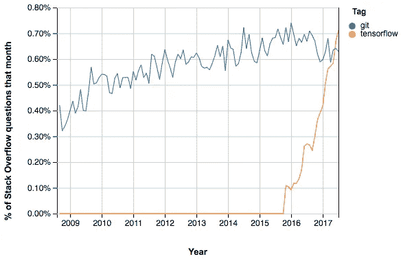

有意义吗？虽然`tensorflow`值得很多关注，但`git`是最受程序员欢迎的工具之一——在机器学习社区内外。事实证明，该工具测量每个标签的新问题数量，而这只是故事的一半。如果我们可以比较每个标签的页面浏览量百分比和问题百分比，会怎么样？

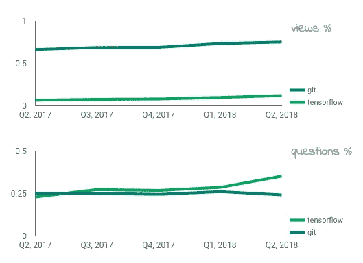

Top chart: Percentage of views that ‘git’ gets on Stack Overflow, vs ‘tensorflow’. Bottom chart: Percentage of new questions for each tag on Stack Overflow. Turns out ‘git’ gets way less new questions, but way more views.

发生了什么:看看图表——即使每个季度为`tensorflow`创造了更多的问题，标有`git`的问题获得了至少 6 倍的浏览量。

我们可以看到`.net`对`firebase`、`c++`对`r`以及`.net`对`typescript`的类似趋势:

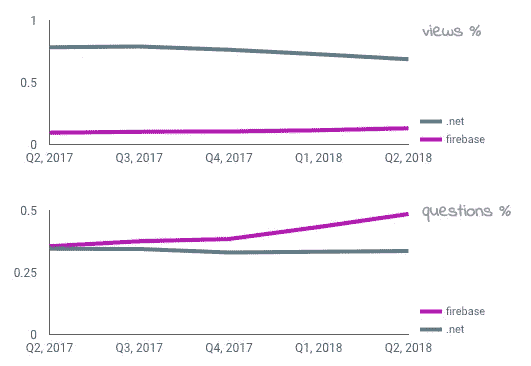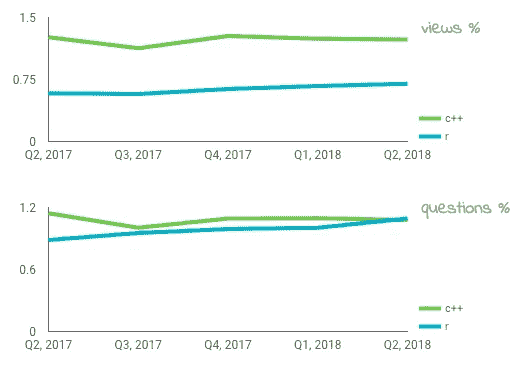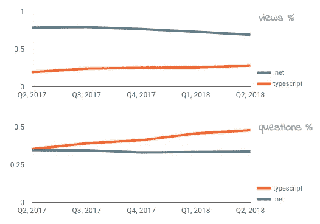

These charts show that in '`.net’` vs '`firebase’`, '`c++’` vs '`r’`, and '`.net’` vs '`typescript' one of the technologies gets more pageviews, while the other gets more new questions.`

您可以在这里看到，衡量新问题的数量只能说明问题的一半。如果你是 Stack Overflow 博客的粉丝，你会发现在许多故事中，甚至[他们也使用了%的浏览量](https://stackoverflow.blog/2017/10/10/impressive-growth-r/)。但是获得堆栈溢出时每个标签每个季度的查看次数并不容易，直到今天:

*   Stack Overflow 提供了他们的[趋势工具](https://insights.stackoverflow.com/trends?tags=javafx%2Cjava-8)，但是它只关注新问题的数量。
*   Stack Overflow 提供了[数据交换](https://data.stackexchange.com/stackoverflow/query/new)服务，在这里人们可以发布和运行任意的 SQL 查询。编写一个查询来计算新问题的 [#很容易，但是要找到历史浏览量是不可能的。](http://data.stackexchange.com/stackoverflow/query/3978/most-popular-stackoverflow-tags-in-may-2010)
*   Stack Overflow 还发布了他们数据的季度转储，这些数据[我们在 BigQuery](https://medium.com/google-cloud/google-bigquery-public-datasets-now-include-stack-overflow-q-a-5a8a7e371b52) 上分享，供任何人分析。同样，很容易找到每个季度的问题数量，但不可能找到历史的视图数量。
*   但是，如果您有每个堆栈溢出转储的副本，然后在它们之间进行数学运算来计算每个标签的季度浏览量，会怎么样呢？我就是这么做的！

# 其他有趣的比较

## 前 5 名:Java、JavaScript、Python、C#、Android、PHP

*   Java 和 Javascript 一直是最受关注的——但是 JavaScript 每个季度都会收到更多的新问题。
*   Python 正在快速追赶！它得到的问题仍然比 JavaScript 少，但它得到的浏览量比 Java 和 JavaScript 多。
*   C#在页面浏览量排名前五，但在问题数量排名前五。另一方面，PHP 有很多问题，但不足以在页面浏览量排名前五。

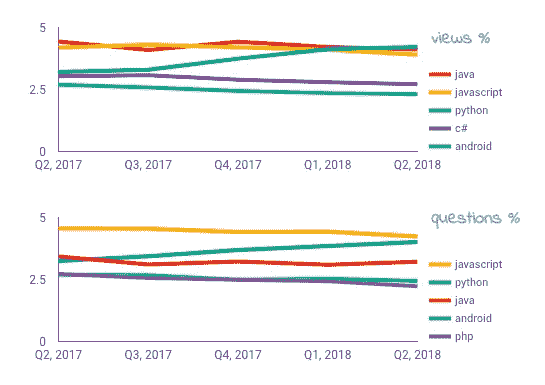

## JavaScript 框架:Angular vs Angular，React，Vue

*   如果`angularjs`要死了，谁来代替它？不是别人，正是`angular`！您可以想象这个新标签在问题数量和浏览量方面接管前一个标签有多快。
*   `reactjs`哪儿也不去，而是向右上方走。
*   `vue.js`比其他替代产品更受关注，但仍有很长的路要走。

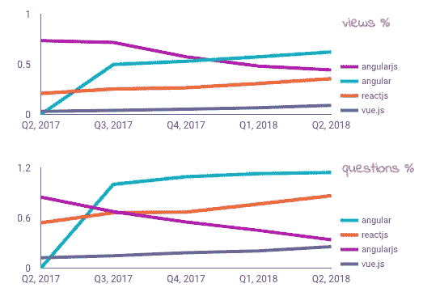

## 机器学习

*   TensorFlow 和 Keras 吸引了所有的注意力和问题。
*   PyTorch 和 MxNet 勉强注册。咖啡在 2017 年更强，但这些天融入了底部。

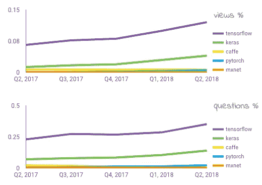

## 即将推出的语言:Swift，Go，Haskell，Kotlin，Rust

*   Swift 盖过了这一类别中的所有其他公司。
*   Go 在浏览量上比在问题数量上更有优势。
*   科特林是生长最快的。
*   哈斯克尔和拉斯特:保持强大的伙伴！

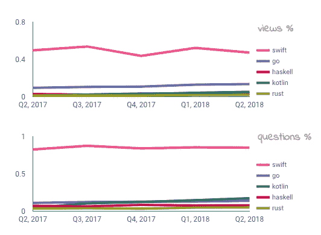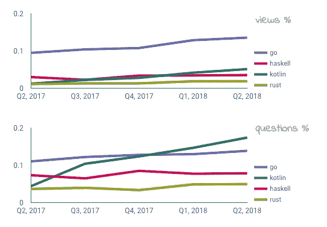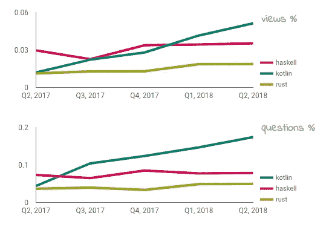

Swift, Go, Haskell, Kotlin, Rust attention on Stack Overflow — progressively removing the top ones to highlight the differences between the remaining.

## BigQuery vs 红移

我❤大查询。

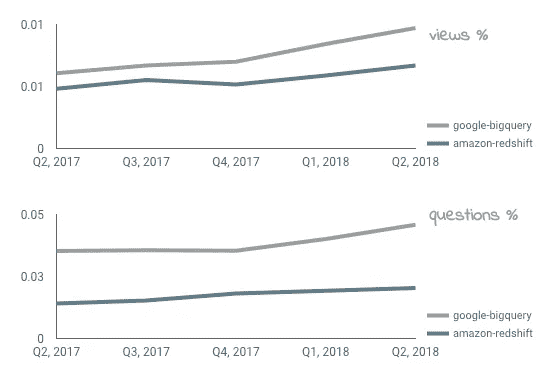

## AWS Lambda vs GCP 函数 vs Azure 函数

*   AWS 有优势，但 GCP 和 Azure 一直在向右上方移动。

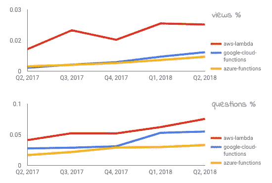

## App Engine vs Kubernetes vs Heroku

App Engine 是我最喜欢的 PaaS，但这几天关注度越来越低。与此同时，Kubernetes 不是一个 PaaS，但它不断得到更多的问题和关注。

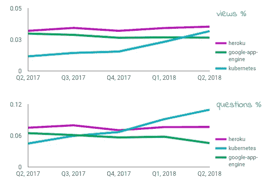

# 让我们更深入:通过页面浏览量的趋势问题

那么，我们能根据浏览量找到每个标签的首要问题吗？当然:

但是让我们把它留给我的下一篇文章。敬请期待！

## 链接

[](https://www.techrepublic.com/article/stack-overflow-data-could-reveal-googles-hidden-weapon-against-amazon-in-the-cloud/) [## 堆栈溢出数据可能揭示谷歌在云中对抗亚马逊的秘密武器

### 有许多不同的方法来评估不同技术的受欢迎程度。Redmonk 看 GitHub 和 Stack…

www.techrepublic.com](https://www.techrepublic.com/article/stack-overflow-data-could-reveal-googles-hidden-weapon-against-amazon-in-the-cloud/) 

# 操作方法

我们在 BigQuery 中使用 Stack Overflow 的数据，由谷歌云公共数据集计划每季度更新一次

[](https://medium.com/google-cloud/google-bigquery-public-datasets-now-include-stack-overflow-q-a-5a8a7e371b52) [## Google BigQuery 公共数据集现在包括堆栈溢出问答

### 2016 年 12 月 15 日星期四

medium.com](https://medium.com/google-cloud/google-bigquery-public-datasets-now-include-stack-overflow-q-a-5a8a7e371b52) 

## 每季度页面浏览量

```
#standardSQL
WITH historic_views AS (
  SELECT *, '201703' q
  FROM `fh-bigquery.stackoverflow_archive.201703_posts_questions` 
  UNION ALL
  SELECT *, '201706' q 
  FROM `fh-bigquery.stackoverflow_archive.201706_posts_questions` 
  UNION ALL
  SELECT *,  '201709' q 
  FROM `fh-bigquery.stackoverflow_archive.201709_posts_questions` 
  UNION ALL
  SELECT *, '201712' q 
  FROM `fh-bigquery.stackoverflow_archive.201712_posts_questions` 
  UNION ALL
  SELECT *, '201803' q 
  FROM `fh-bigquery.stackoverflow_archive.201803_posts_questions` 
  UNION ALL
  SELECT *, '201806' q 
  FROM `fh-bigquery.stackoverflow_archive.201806_posts_questions` 
), top_tags AS (
    SELECT value FROM UNNEST((
       SELECT APPROX_TOP_COUNT(tags, 5000)top  
       FROM `fh-bigquery.stackoverflow_archive.201803_posts_questions` 
       WHERE NOT tags LIKE '%|%'))
    WHERE count > 10
), views_per_tag AS (
  SELECT tag, COUNTIF(DATE(creation_date) BETWEEN DATE_SUB(PARSE_DATE('%Y%m',  q), INTERVAL 3 MONTH) AND PARSE_DATE('%Y%m',  q)) questions
    , SUM(view_count) views_cum, PARSE_DATE('%Y%m',  q) q
  FROM historic_views, UNNEST(SPLIT(tags, '|')) tag
  GROUP BY tag, q
), views_per_q AS (
  SELECT *, views_cum - LAG(views_cum, 1) OVER(PARTITION BY tag ORDER BY q) views
  FROM views_per_tag
), percents AS (
  SELECT *
    , 100*views/SUM(views) OVER(PARTITION BY q) views_percent
    , 100*questions/SUM(questions) OVER(PARTITION BY q) questions_percent
  FROM views_per_q
  WHERE views IS NOT null
  AND tag IN (SELECT value FROM top_tags)
) SELECT *
FROM percents
```

## 显著的趋势差异

```
#standardSQL
WITH toptags AS (
  SELECT *
  FROM `fh-bigquery.stackoverflow.201806_stacko_tags_views` 
  WHERE q='2018-06-01'
  AND tag NOT IN ('string', 'git', 'sql')
  AND views_percent>0.05
)SELECT a.tag, b.tag btag, a.views_percent - b.views_percent
FROM toptags a
JOIN toptags b
ON a.tag!=b.tag
AND a.views_percent>b.views_percent
AND a.questions_percent< b.questions_percent
ORDER by 3 DESC
```

# 后续步骤

如果你也想看看每个问题获得的[浏览量](/finding-the-real-top-stack-overflow-questions-aebf35b095f1):我发表了它。

[](/finding-the-real-top-stack-overflow-questions-aebf35b095f1) [## 真正的顶级堆栈溢出问题

### 很容易找到有史以来最大的堆栈溢出问题，但是*当前*最大的问题给了我们什么…

towardsdatascience.com](/finding-the-real-top-stack-overflow-questions-aebf35b095f1) 

想要更多的故事？查看我的[中](http://medium.com/@hoffa/)，[关注我的推特](http://twitter.com/felipehoffa)，订阅[reddit.com/r/bigquery](https://reddit.com/r/bigquery)。还有[试试 big query](https://www.reddit.com/r/bigquery/comments/3dg9le/analyzing_50_billion_wikipedia_pageviews_in_5/)——每个月你都可以从[免费获得一个完整的 TB 级分析。](https://cloud.google.com/blog/big-data/2017/01/how-to-run-a-terabyte-of-google-bigquery-queries-each-month-without-a-credit-card)

[](https://medium.com/google-cloud/bigquery-lazy-data-loading-ddl-dml-partitions-and-half-a-trillion-wikipedia-pageviews-cd3eacd657b6) [## BigQuery 惰性数据加载:DDL、DML、分区和半万亿维基百科页面视图

### 分析维基媒体公开发布的 4tb 维基百科浏览量数据集的最简单方法是什么…

medium.com](https://medium.com/google-cloud/bigquery-lazy-data-loading-ddl-dml-partitions-and-half-a-trillion-wikipedia-pageviews-cd3eacd657b6) [](https://medium.com/@hoffa/when-will-stack-overflow-reply-how-to-predict-with-bigquery-553c24b546a3) [## 堆栈溢出何时回复:如何用 BigQuery 预测

### 当你最后发布一个关于栈溢出的问题时，一个漫长的等待就开始了。有人会回答你的问题吗？会不会…

medium.com](https://medium.com/@hoffa/when-will-stack-overflow-reply-how-to-predict-with-bigquery-553c24b546a3) 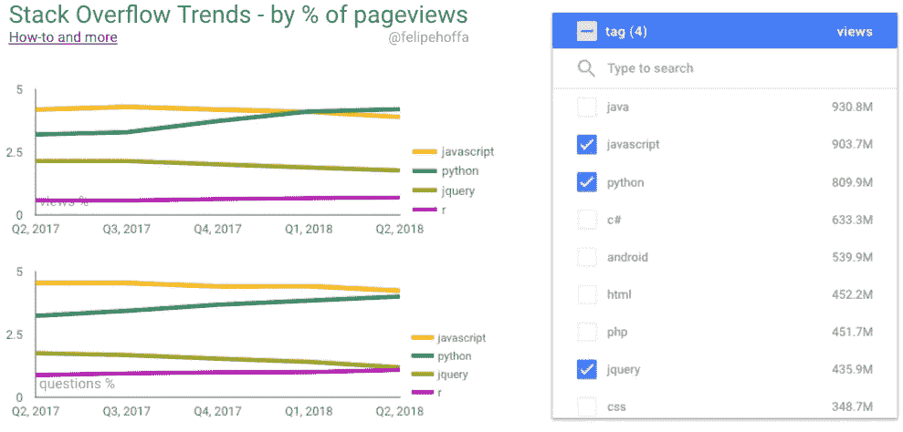