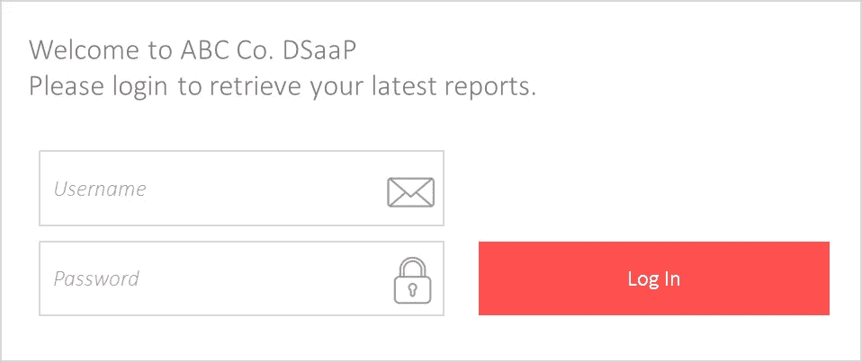
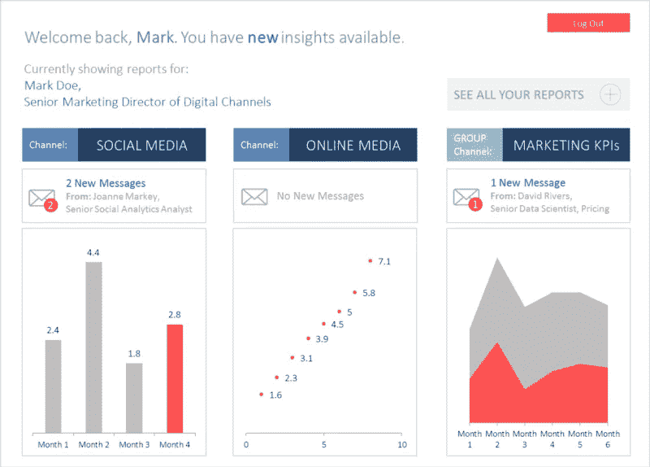
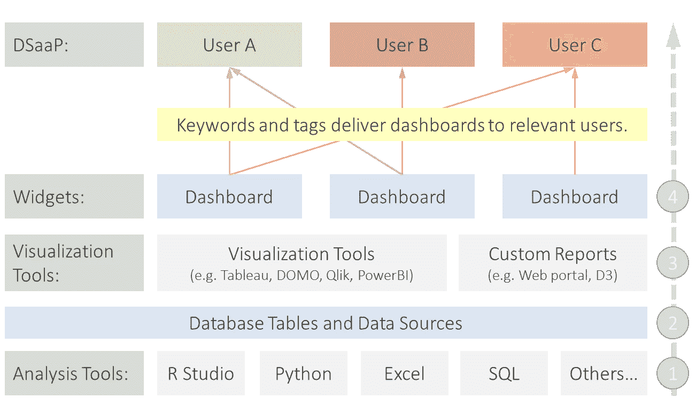

# 关于数据科学作为平台的思考

> 原文：<https://towardsdatascience.com/thinking-about-data-science-as-a-platform-f9e98277dcc6?source=collection_archive---------3----------------------->

“数据的可用性”是一个成熟的改进和发展领域。毕竟，只有人们使用数据，数据才有价值。我的博士研究表明，在决策中使用数据是一个需要更多投资的领域。

进入 **Data Science as a Platform** ，或 DSaaP *(读作 dee-sap)——*专为每位业务经理量身定制的一站式洞察、关键绩效指标和知识商店。

DSaaP 提供了将出色的用户体验(UX)与按需提供的全面洞察相结合的机会。业务经理会像每天处理电子邮件一样登录该工具，并将 DSaaP 作为他们工作的一部分。

## DSaaP 可能会是什么样子？它是如何工作的？

当我谈到 DSaaP 时，我想到了几件事。第一个是与业务用户系统(如 Active Directory)链接的登录屏幕。这是为了确保 DSaaP 可以由 IT 人员集中维护，而不是作为一个独立的工具。**见下图 1。**

Diagram 1: DSaaP login mock-up

登录到 DSaaP 系统后，用户会看到一些小部件。每个小部件都是一个仪表板，用户只能看到与其项目和小组计划相关的仪表板。

例如，负责数字渠道的营销总监可能有一个社交媒体仪表板、一个在线媒体支出仪表板和他们的营销团队 KPI 仪表板。**见下图 2。**

Diagram 2: DSaaP homepage mock-up showing different dashboard widgets

所有的小部件将是可互换的和动态的。它们将由用户和分析师共同控制。用户决定哪些数据是最重要的，因此决定了出现在主屏幕上的小部件。

分析师负责维护底层仪表板，并通过 DSaaP 系统主动向用户发送有关任何新见解、警报或重要信息的消息。

DSaaP 系统的底层架构展示了数据交换是如何工作的。**见下图 3。**

Diagram 3: DSaaP architecture example

DSaaP 系统本质上是从分析开始的(图 3 中的步骤 1)。数据科学家和分析师使用不同的工具来运行模型、执行分析项目和设置最终将被仪表板小部件需要的底层数据。

然后，这些数据被保存到业务环境中的表或数据源中(图 3 中的步骤 2)。

在那里，分析师创建数据可视化和仪表板，并显示给最终用户(图 3 中的步骤 3)。例如，这些可以是 web 应用程序中的定制版本，或者是 Tableau、Qlik、DOMO 或 PowerBI 等可视化工具中的定制版本。

可视化的位置和类型取决于仪表板主题。每个仪表板都用关键字分类或标记，DSaaP 将使用这些关键字来过滤显示给每个用户的小部件。

例如，数字渠道的高级营销总监 Mark Doe 可能会获得标有“社交媒体”、“数字广告表现”和“数字营销分析”的仪表板。

然后，分析师将仪表板发布到 DSaaP 系统(图 3 中的步骤 4 ),当用户登录门户时，这些仪表板将显示给用户。

## 最后，DSaaP 如何帮助决策？

DSaaP 为“数据可用性”提供了许多好处。下面列出了一些好处，但最终归结为三点:每个业务领导者的整体洞察力、引人入胜的用户体验和集中的工具。

**DSaaP 的主要优势**

*   提供了一种工具来访问由专家策划的见解，从而限制了访问数据时的主观偏见
*   在一个位置存储整体见解，使分析师能够将所有数据源和数据见解集中在一个位置，这样业务经理就可以花更少的时间来消化来自不同团队的见解
*   通过出色的用户界面鼓励数据使用——UX 是 DSaaP 的核心，以用户为中心的智能 UX 意味着管理人员更有可能使用该工具来收集他们做出决策所需的信息
*   提供真实的单一来源—在一个地方提供见解，消除重复工作并建立对数据的信心
*   可与任何可视化工具配合使用——DSaaP 基于小部件，具有通过 API 收集的仪表盘，或基于每个部分的最佳数据可视化工具(如 Qlik、Tableau、Domo 或自定义可视化工具)嵌入到界面的各个部分
*   有助于消除数据孤岛，构建集中工具自然有助于消除数据孤岛，分析师不得不考虑公共平台。这也意味着底层数据的位置不太重要，数据湖或关系数据库都可以输入到 DSaaP 中

DSaaP 思维已经在 Qlik、Tableau 和 DOMO 等工具中开始，但它们只是解决方案的一部分。这些工具很好地可视化了数据，但是在整个企业中扩展起来很麻烦，并且没有提供覆盖所有数据源的必要功能。DSaaP 需要更广泛，能够覆盖所有用例，从 Tableau、DOMO 或任何其他工具中引入可视化，以及由 R、Python 或 JavaScript 等程序构建的自定义可视化。

我们现在拥有了开发 DSaaP 所需的所有部件。机器学习、API、支持网络的应用和数据可视化都已经达到了 DSaaP 现在可以而且应该成为现实的地步。为决策制定开发 DSaaP 的好处是引人注目的，令人鼓舞的是，许多创新企业已经开始创建 DSaaP 的工作版本。