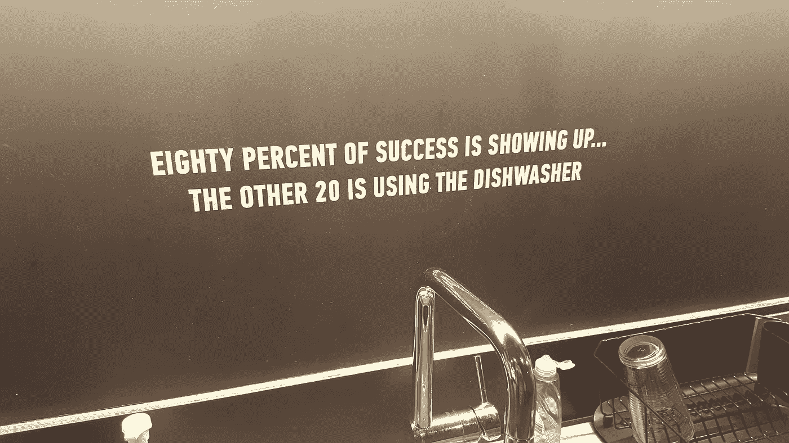

# 围绕太阳的第三天(或离深潜边缘一英尺)

> 原文：<https://towardsdatascience.com/third-day-around-the-sun-or-one-foot-off-the-edge-of-the-deep-dive-c255a0c2421c?source=collection_archive---------13----------------------->

It’s the wall’s way of saying hello.

今天是我在位于中城/东亚特兰大/庞塞高地/亚特兰大的庞塞市市场或任何他们现在称之为该地区的地方的大会最先进的艺术园区参加数据科学沉浸式项目的第三天。地理很重要。这座城市正在发生许多技术和文化变革，而这个地方是变革的核心。

我已经开始陷入疯狂，希望我不会像《现代启示录》中的库尔茨上校那样结束，尽管我的父亲和朋友会说已经太晚了。确实如此。但今年早些时候变得非常明显的是，职业和个人成长需要大规模的自由转变，这不仅是为了繁荣，也是为了在我看来即将到来的社会经济流离失所的圣经风暴中生存。几年前我听到过一句有趣的话，虽然记不清是从哪里或从谁那里听到的，但那是:

> 很快，你将不得不决定你是被机器人控制还是由你来控制它们 

那好吧。我不期望机器人来控制。但我确实预计，机器和自动化的数字结构将要做的工作，比我们人类个人所能做的要多得多。很少有人真正为这种未来的现实做好准备。如果我希望成功，我需要成为他们中的一员。

一点背景:我在各种营销管理岗位上工作了十几年。我自己注意到的是，由于技术、经济和职业人口统计的变化，不仅在营销领域蓬勃发展变得越来越困难，而且仅仅是生存(我在这里特别重复这个短语，因为营销往往引领媒体和传播变革)也变得越来越困难。尽管我热爱市场营销，并将永远热爱市场营销，但仅仅了解和应用执行市场营销战略和沟通的技术已经不足以保持对企业和其他组织的重要性。

让事情变得更具挑战性的是，学位课程不会让我去我想去的地方。我有工商管理硕士学位。在当前的商业文化氛围下，多一个硕士学位可能对我不利，而不是对我有利。我需要“穿针引线”

我在以前的全职雇主那里了解了大会。几名员工正在学习网页开发和用户体验课程。我也开始看到大会的在线广告，特别是在脸书和 LinkedIn 上。过了一年多一点(！)的研究和自我评估，以确定我是否真的需要采取行动，我决定，是的，这是必要的。参加一个受科技行业尊重的非传统数字教育校园比走传统的学位路线更有效。

我从基础开始:数据分析。我也很高兴那段时间我没有工作，因为尽管是业余课程，它却像浴缸里的海绵一样吸干了我的暑假。但这种努力和牺牲是值得的，因为它为我申请全日制数据科学沉浸式项目做了充分的准备。如果我没有选这门课，我是不可能被录取的。

所以我现在在这里。第三天上课。我的前期工作完成了一半(我在抓紧！我在抓紧时间！).从现在到 12 月 20 日，我还有很多工作要做。别担心，我会确保咖啡杯和水杯放在洗碗机里。我喜欢让事情简单、干净、整洁。