# 用深度卷积神经网络进行图像到食谱的翻译

> 原文：<https://towardsdatascience.com/this-ai-is-hungry-b2a8655528be?source=collection_archive---------0----------------------->

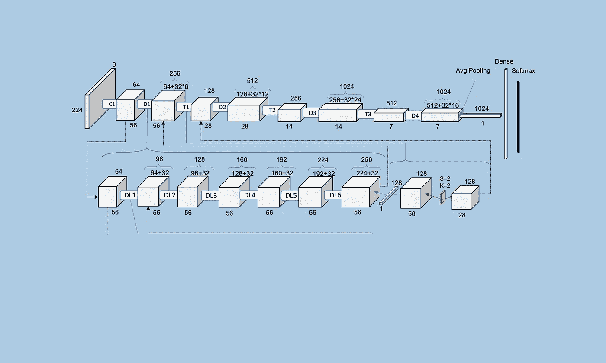

[https://github.com/Murgio/Food-Recipe-CNN](https://github.com/Murgio/Food-Recipe-CNN)

# 介绍

在这篇文章中，我们将看看如何训练一个**深度卷积神经网络**，它能够*将图像分类为食物类别*和*输出匹配的食谱*。到目前为止，我们强调选择目标领域的困难有两个方面。首先，烹饪菜肴的单个成分的分类或对象识别的进展很少。问题是，实际上没有公共处理过的数据集可用于此。第二，到目前为止，烹饪菜肴表现出内在的高度类间相似性，这使得即使对于最复杂的系统来说，推断菜肴类别也是一个困难的问题。为了应对这些挑战，我们从欧洲最受欢迎的烹饪食谱平台 chefkoch.de 中收集了一个新的数据集，其中包含> 800，000 张食物图像和> 300，000 份食谱，并在数据集上实证比较了当代机器学习模型(卷积神经网络)和更传统方法(最近邻搜索)的有效性。

# 前言

其他任何领域对人类健康的影响都不亚于营养。每天，用户在社交网络上发布不计其数的食物图片；从第一个自制的蛋糕到顶级的米其林菜肴，如果人们成功地做了一道菜，他们很乐意与世界分享他们的喜悦。事实上，无论一个人与另一个人有多么不同，好的食物几乎都会受到每个人的高度赞赏。

单个烹饪原料的分类进展很少。问题是几乎没有公开编辑过的记录。这项工作处理的问题是**自动识别**拍摄的烹饪菜肴，并随后输出适当的食谱。所选问题的难度与之前的监督分类问题之间的区别在于，食物菜肴中有很大的重叠(又名**高类间相似度**)，因为不同类别的菜肴可能仅在图像信息方面看起来非常相似(见图 1)。

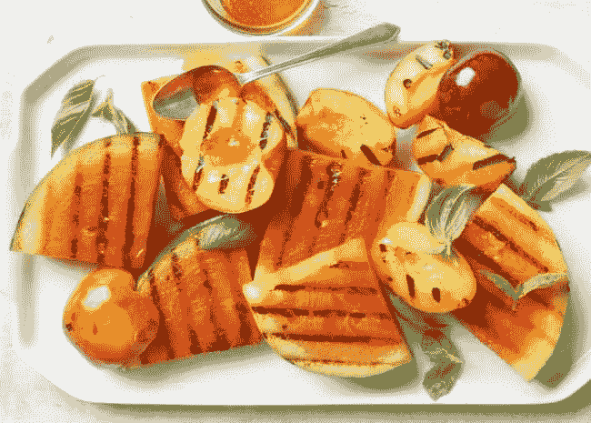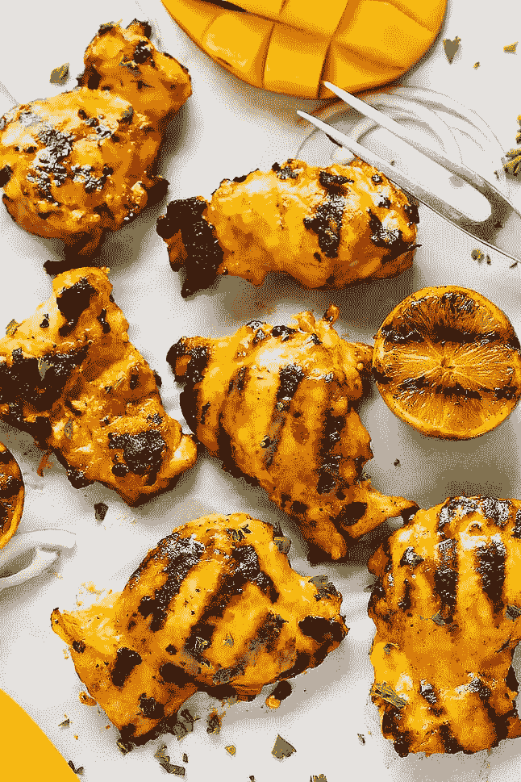

Figure 1: Images of distant categories may look similar (be it by similar cooking methods (e.g. grill marks) or an overlap of characterizations, inter alia), but sure enough, don’t taste similar!

根据座右铭*分而治之*，教程被细分为**个更小的部分**:

根据目前的状态，超过 300，000 个食谱的最大德语数据集将被搜集和分析。我们假设使用机器学习可能会克服更传统的所谓查询方法的障碍:我们使用卷积神经网络(简称 CNN)将对象识别或烹饪法庭识别与在超过 80 万张图像的记录中搜索最近邻居(下一个邻居分类)相结合。这种组合可以帮助找到更有可能的食谱，并且将分类引导到更有成效的方向，因为 CNN 的前 k 个类别与具有排序相关性的下一个相邻类别相比较。诸如 [**Kendall Tau**](https://en.wikipedia.org/wiki/Kendall_rank_correlation_coefficient) 的基于等级相关性的方法本质上测量两个项目在两个分级列表中处于相同顺序的概率。数学上，肯德尔τ计算如下

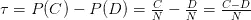

notation: Rithesh Agrawal

在哪里

*   N =总对数
*   C =一致对的数量
*   D =不一致对的数量

# 方法学

管道由以下步骤描述:

1.  每个配方 **R** 由 **K** 张图片组成。对于这些图像中的每一个，从预训练的卷积神经网络中提取特征向量 **w ∈ W** (其已经在 ILSVRC 2014 图像识别竞赛中使用 1000 个类别上的数百万个图像进行了预训练)。不严格地说，特征向量在最后一个完全连接的层中形成图像的内部表示，就在 1000 类别的 Softmax 层之前。
2.  这些特征向量 **W** 然后通过 PCA(主成分分析)从一个**N×4096**矩阵减少到一个**N×512**矩阵。结果，选择与输入图像具有最小欧几里德距离的前 k 个图像。由于计算某种成对距离度量是计算密集型的，并且不能很好地扩展，我们将注意力转向变体 ANN(近似最近邻)。
3.  此外，美国有线电视新闻网是用类别 **C** 和 **R** 食谱的图片来训练的。 **C** 是使用一种流行的主题建模技术动态确定的，该技术被称为非负矩阵工厂化(NNMF)和配方名称的语义分析。结果，我们为配方中的每个图像获得了类别上的概率分布。
4.  美国有线电视新闻网(CNN)的前 k 类(2。)与来自前 k 个光学相似图像(1。)与肯德尔τ相关。

图 2 概述了一般方法:

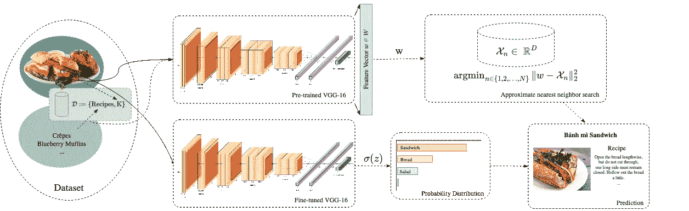

Figure 2: (a) Each image **k ∈ K** is transformed into the image embedding **w** and pairwise euclidean distances (L2 Norm) are calculated to the image query **q**. (b) The query image **q** is classified with the fine-tuned VGG-16 and the probability distribution is compared to the euclidean distances.

1│── **数据准备**
│ └──清算数据
│ └──数据扩充

2)───**数据分析和可视化，拆分数据(训练、有效、测试)**

3│── **主题建模**
│ └──潜在狄利克雷分配(LDA)
│ └──非负矩阵分解

4│── **特征提取**
│ └── k 近邻
│ └── t-SNE 可视化

5│── **迁移学习:训练预先训练好的 CNN(卷积神经网络)**
│ └── AlexNet、VGG、ResNet、GoogLeNet

6└── **用烧瓶展开**

每个部分都包含 Jupyter 笔记本，您可以在 [Github 页面](https://github.com/Murgio/Food-Recipe-CNN)上查看。

# 收集和准备数据

为了能够训练模型，人们需要足够数量的数据(所谓的数据扩充和预训练模型的微调提供了一种补救措施)。只有通过这样的数据量，训练集的泛化能力才能不断提高到一定程度，测试集中的高精度才能实现。本教程的第一部分处理特征及其关系的数据采集、分析和可视化。

> 无耻之徒:我正在开发一个 python 代码编辑器，它简化了数据分析和数据绘图。更多信息请访问:[莫比乌斯代码编辑器](https://muriz.me/products/möbius)

谷歌研究总监彼得·诺维格在 2011 年的一次采访中透露

> 我们没有更好的算法。我们只是有更多的数据。

无一例外，数据集的质量和数量都不容忽视。这就是为什么欧洲最大的烹饪平台会被刮:每个食谱，最后是 316'756 个食谱(截至 2017 年 12 月)，总共下载了 879'620 张图片。重要的是，下载时不要进行得太快，并保护有太多查询的服务器，因为否则禁止自己的 IP 地址会使数据收集更加困难。

更多的数据导致更多的维度，但更多的维度并不一定导致更好的模型及其表示。干扰学习的数据集中的偏离模式可能会被更多维度无意地放大，数据记录的概括和学习对于神经网络来说是不利的，信噪比降低。

所有 30 万份食谱按日期排序:[http://www.chefkoch.de/rs/s30o3/Rezepte.html](http://www.chefkoch.de/rs/s30o3/Rezepte.html)

做网站报废的时候，尊重 robots.txt 文件很重要。一些管理员不希望机器人访问特定的目录。[https://www.chefkoch.de/robots.txt](https://www.chefkoch.de/robots.txt)提供:

```
User-agent: * # directed to all spiders, not just scooters
Disallow: / cgi-bin
Disallow: / stats
Disallow: / pictures / photo albums /
Disallow: / forumuploads /
Disallow: / pictures / user /
Disallow: / user /
Disallow: / avatar /
Disallow: / cms /
Disallow: / products /
Disallow: / how2videos /
```

列出了我们不感兴趣的目录，因此您可以放心地继续。尽管如此，我们还是建议采取一些措施，比如随机标题和在不同请求之间留出足够长的停顿时间，以避免网站被封禁。

```
*# Chefkoch.de Website*
CHEFKOCH_URL  = 'http://www.chefkoch.de'
START_URL     = 'http://www.chefkoch.de/rs/s'
CATEGORY      = '/Rezepte.html'category_url = START_URL + '0o3' + CATEGORY

**def** _get_html(url):
    page = ''
    **while** page == '':
        **try**:
            page = requests.get(url, headers=random_headers())
        **except**:
            print('Connection refused')
            time.sleep(10)
            **continue**
    **return** page.text

**def** _get_total_pages(html):
    soup = BeautifulSoup(html, 'lxml')
    total_pages = soup.find('div', class_='ck-pagination qa-pagination').find('a', class_='qa-pagination-pagelink-last').text
    **return** int(total_pages)

html_text_total_pages = _get_html(category_url)
total_pages = _get_total_pages(html_text_total_pages)
print('Total pages: ', total_pages)Total pages:  10560
```

下一个重要步骤是选择不利于不重要数据的特征。为神经网络准备原始数据在实践中很常见。在第一遍中，下载配方名称、配方的平均应用、评级数量、难度级别、准备时间和发布日期。在第二遍中，然后是配料列表、配方文本、所有图像和配方打印的次数。有了这些功能，可以很好地描述数据记录，并帮助获得对数据集的深刻理解，这对选择算法很重要。

诸如配方名称、等级、上传配方的日期等数据。存储在 csv 文件中。如果配方有图像，缩略图会放在 search_thumbnails 文件夹中。我们将利用多重处理来确保更短的下载时间。更多信息请访问 [Python 的文档](https://docs.python.org/3.4/library/multiprocessing.html?highlight=process)

```
**def** scrap_main(url):
    print('Current url: ', url)
    html = _get_html(url)
    _get_front_page(html)
    *#sleep(randint(1, 2))*start_time = time()
**with** Pool(15) **as** p:
    p.map(scrap_main, url_list)
print("--- **%s** seconds ---" % (time() - start_time))
```

> 请注意，给定的代码已被缩短。完整的代码请访问[相应的 Jupyter 笔记本](https://github.com/Murgio/Food-Recipe-CNN/blob/master/01_rezepte_download.ipynb)。

接下来，我们需要刮成分列表，准备，标签和每个食谱的所有图像。

```
**def** write_recipe_details(data):
    dpath = DATAST_FOLDER + DFILE_NAME
    **with** open(dpath, 'a', newline='') **as** f:
        writer = csv.writer(f)
        **try**:
            writer.writerow((data['link'],
                             data['ingredients'],
                             data['zubereitung'],
                             data['tags'],
                             data['gedruckt:'],
                             data['n_pics']
                             *#data['reviews'],*
                             *#data['gespeichert:'],*
                             *#data['Freischaltung:'],*
                             *#data['author_registration_date'],*
                             *#data['author_reviews']*
                            ))
        **except**:
            writer.writerow('')
```

如果下载一切顺利，我们的数据如下所示:

*   总共 879，620 张图片(35 GB)
*   316，756 个配方
    ——其中 189，969 个包含一个或多个图片
    — —其中 107，052 个配方包含两个以上的图片
    ——126，787 个不包含图片

# **数据分析和可视化**

## 统计数字

为了获得第一印象，我们通常绘制一个热图，以获得对哪些可能的特征感兴趣的初步见解。

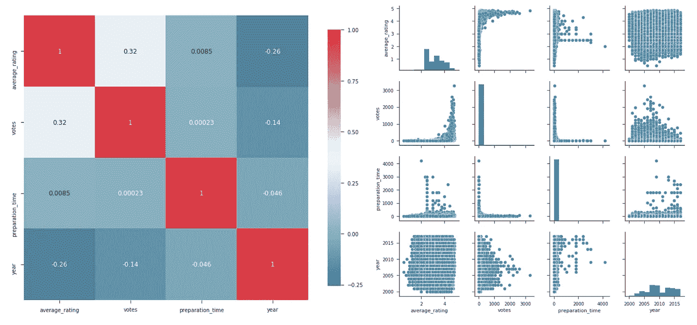

Figure 3: The heatmap gives us insight which values correlate with other values.

相关度最高的有*票*和*平均 _ 评分*。图 2 显示了第一列第二行的配对图，很明显，评分数越高，配方的评分越好。同样有趣的是准备时间和收视率数量的对比。大多数评论都是基于准备时间短的食谱。ChefKoch 社区似乎更喜欢简单的食谱。另一个想法是比较每年新上传食谱的数量。

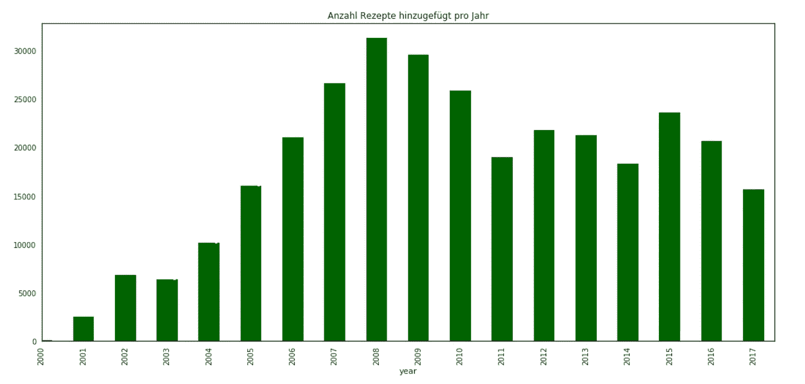

Figure 4: In the years 2008 to 2009, it has noticeably the most uploads per year. A quick search search on the internet shows that in 2008 the food price crisis had prevailed.

曲线对比(下图)显示，全球价格上涨和食谱供应之间存在虚假的相关性。我的假设是，对食谱的需求上升是因为一个人呆在家里为自己和家人做饭，以节省预算并尽可能使收支平衡。

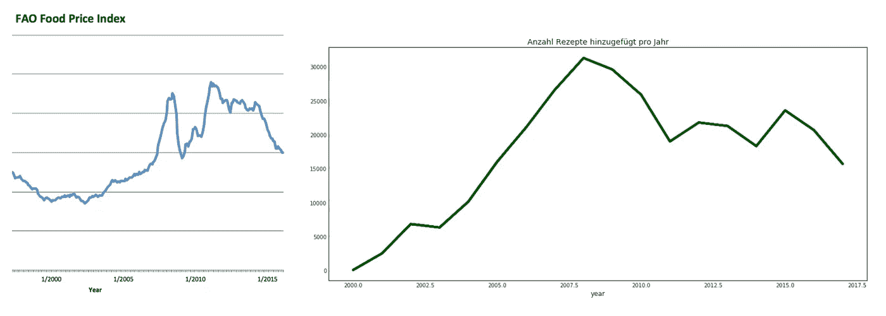

Figure 5: On the left the [index](https://de.wikipedia.org/wiki/FAO_Food_Price_Index) and on the right the number of uploaded recipes per year.

## 佐料

一共 *316'755 份食谱*分享 *3'248'846 份配料*。如果去掉所有出现不止一次的成分，就有*63’588 种独特成分*。对于成分的关联分析，使用了 APRIORI 算法。这提供了什么成分与其他成分组合出现的频率。

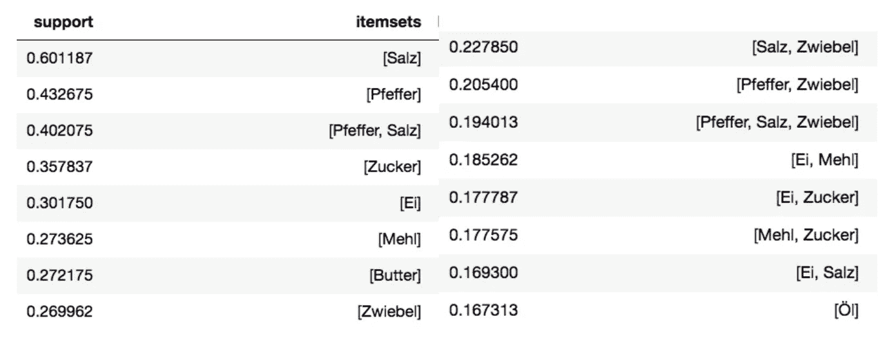

Table 1: On the left are the top 8 and on the right the top 9–16 ingredients with the highest incidence.

在所有的食谱中，盐占了 60%。在第三个位置，你可以看到第一个元组，两种成分的组合，即胡椒和盐，仅超过 40%，它们是迄今为止最常见的一对。最常见的三胞胎、四胞胎甚至五胞胎都可以在[对应的 Jupyter 笔记本](https://github.com/Murgio/Food-Recipe-CNN/blob/master/03_02_zutaten_analysis_cloud.ipynb)中找到。

*更多图形详见* [*本笔记本*](https://github.com/Murgio/Food-Recipe-CNN/blob/master/03_01_rezepte_analysis_cloud.ipynb) *。*

# 主题建模

该程序的目标是**将所有配方名称分为 n 类**。对于监督分类问题，我们必须为神经网络提供带标签的图像。有了这些标签，学习才成为可能。问题是 **Chefkoch.de 没有对他们的图片进行分类**。分割 316’755 配方名称的可能程序如下所示。

到目前为止，考虑下面的例子，其中给出了四个配方名称:

*   蘑菇披萨
*   青椒配豌豆和金枪鱼
*   海鲜披萨
*   豌豆辣椒粉

以上四个配方名称必须分为 n 类。一般来说，第一个和第三个食谱需要放在同一个类别中，可能叫做比萨饼。由于豌豆的原因，第二和第四食谱也可以被放入新的类别。但是，如何正确地对 300，000 多个食谱名称进行分类呢？

## 潜在狄利克雷分配

概率主题建模(LDA，[Blei 等人，2003])和向量空间模型(LSA，[Deerwester 等人，1990])通过将文档建模为潜在主题集上的有限混合物或通过奇异值分解(SVD)来近似单词的含义。自从 Blei 等人[2003]的开创性工作以来，已经提出了类似的方法[Jagarlamudi 等人，2012]，通过在每个主题中提供种子词来指导模型学习期望的主题。也就是说，题目是提前知道的。

一般来说，在大多数 NLP 任务中，名称体必须被清理，即停用词被移除，词被减少到它们的根。干净的词汇作为输入。

```
de_stop = get_stop_words('german')
s_stemmer = SnowballStemmer('german')
tokenizer = RegexpTokenizer(r'\w+')
final_names = []

**for** recipe_name **in** twentyeigth_iter:
    raw = recipe_name.lower()
    tokens = tokenizer.tokenize(raw)
    stop_t = [recipe_name **for** recipe_name **in** tokens **if** **not** recipe_name **in** de_stop **and** **not** recipe_name **in** filter_words_]
    stem_t = [i **for** i **in** stop_t **if** len(i)>1]
    **if** len(stem_t)==0: final_names.append(['error'])
    **else**: final_names.append(stem_t)

print('20 Cleaned Recipe names example: **\n** >>>')
pprint(final_names[:20])20 Cleaned Recipe names example: 
 >>>
[['bratapfel', 'rotkohl'],
 ['frühstückswolke'],
 ['deichgrafensalat'],
 ['geschichteter', 'kohl'],
 ['rinderlendenragout'],
 ['blaukraut'],
 ['sauerbraten'],
 ['punschtorte'],
 ['oberländer'],
 ['mcmoes', 'pasta'],
 ['geschnetzeltes'],
 ['ahorn', 'bacon', 'butter'],
 ['endiviensalat'],
 ['rote', 'linsen', 'gemüse'],
 ['kotelett', 'gratin'],
 ['rotkohl'],
 ['remouladensauce'],
 ['nudeln'],
 ['kohlsuppe'],
 ['gemüse', 'hackfleischauflauf']]
```

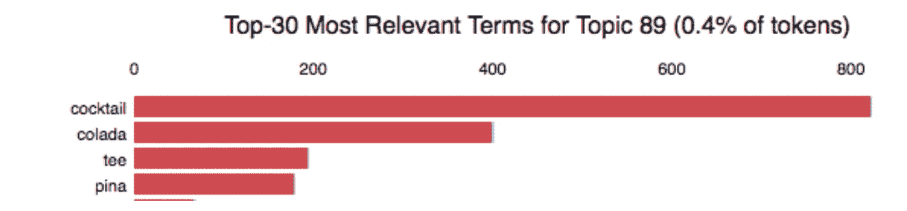

Figure 6: 300 topics were set as condition. The model for Topic 89 provides good results: drinks are detected and summarized.

为了简单起见，不讨论精确的数学定义。因此，我们有一个概率列表，可以确定模型符合主题的程度。例如:' 0.363 * '干贝'+ 0.165 * '麻辣'+ 0.124 * '夏日'+ 0.006 * "塔布莱"+ 0.004 * "燕麦饼干"。

在 Github Repo 的 [04_01_topic_modeling.ipynb 中可以找到一个交互式图表来浏览 300 个主题中的每一个。](https://github.com/Murgio/Food-Recipe-CNN/blob/master/04_01_topic_modeling.ipynb)

## 非负矩阵分解

第一步是计算 tf-idf(词频-逆文档频)。考虑到在整个文本语料库中的重要性，这仅仅代表了菜谱名称中的一个单词的**重要性。最重要的四个词是:**

1.【T4 沙拉(2935.18)】2。意大利面(2429.36)
3。托泰(2196.21)
4。蛋糕(1970.08)

NMF 算法将 tf-idf 作为输入，并且**同时执行降维和聚类**。这一努力为前 4 个主题提供了出色的结果，如下所示:

**话题#0:**
*意面 carbonara alla olio aglio al sabo puttanesca di mare*
**话题#1:**
*沙拉什锦玉米瓜菊苣 bulgur 萝卜芹菜 q* uinoa 不冷不热
**话题#2:**
*面条中国亚洲米氏亚洲炒锅乌冬面罗勒黑光*
**话题#3: 【T28**

因为我们不是疯子，所以我们从 0 开始索引。

使用 t-SNE 可以将结果可视化。重要的是，具有几个维度的记录被简化为 2D，这允许为每个配方名称找到一个坐标。

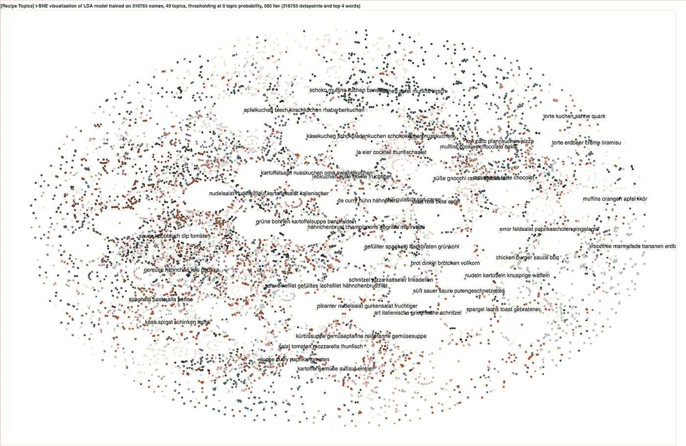

Figure 7: For further information visit the [corresponding Jupyter Notebook](https://github.com/Murgio/Food-Recipe-CNN/blob/master/04_02_topic_modeling_tsne_cloud.ipynb).

# **特征提取**

对于 CNN，首先对图像信息进行汇总，以减少参数的数量。我们假设 CNN 中的第一层识别图片中的粗略结构。越深入到最后一个 Softmax 层，学习到的特征就越精细。我们可以利用这一点，采用预先训练的 CNN，这些 CNN 已经用数百万张图片进行了训练，并删除最后几层，用我们自己的数据来训练它们。这为我们节省了数百万个参数，从而减少了计算时间。这里选择的 CNN 是 VGG-16，它在 2014 年的分类比赛中接受了 1000 个类别的训练。

如果去掉最后一层，我们就得到倒数第二层的特征提取器。这形成了 n×4096 矩阵，其中 n 是输入图片的数量。

```
features = []
**for** image_path **in** tqdm(images):
    img, x = get_image(image_path);
    feat = feat_extractor.predict(x)[0]
    features.append(feat)
```

我们让 VGG-16 计算我们所有图像的向量。这个向量可以说是图片的指纹 **:** 神经网络构建的内部表示。

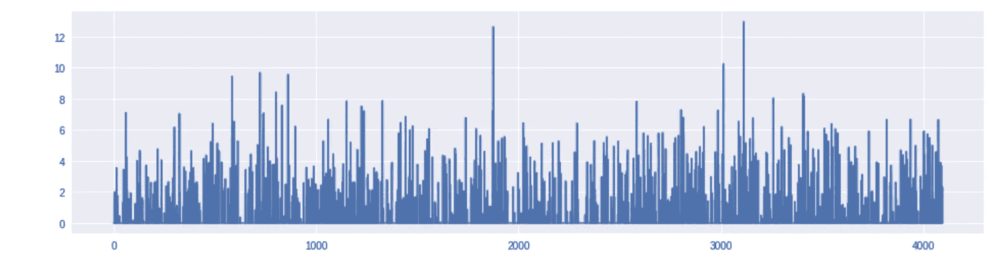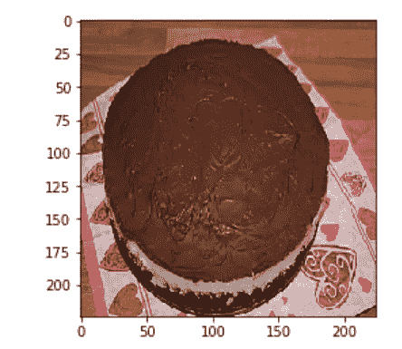

Figure 8: (a) Left-side is plot the 4096 vector calculated from the cake on the right (b).

现在，我们所要做的就是将每个新的给定输入图像通过 VGG-16，获得指纹向量，并使用近似最近邻搜索计算最近邻。我将为此使用的库是[法尔康](https://github.com/FALCONN-LIB/FALCONN)。FALCONN 是一个带有最近邻搜索算法的库。**FALCONN 中的算法基于** [**局部敏感哈希**](https://en.wikipedia.org/wiki/Locality-sensitive_hashing)**【LSH】**，这是一类流行的高维空间最近邻搜索方法。FALCONN 的目标是为基于 LSH 的数据结构提供非常高效且经过充分测试的实现。

目前，FALCONN 支持两个 LSH 家族的余弦相似性:超平面 LSH 和十字多面体 LSH。这两个散列族都是用多探针 LSH 实现的，以便最大限度地减少内存使用。此外，FALCONN 针对密集和稀疏数据进行了优化。尽管 FALCONN 是为余弦相似性而设计的，但它通常可用于欧氏距离下的最近邻搜索或最大内积搜索。

为了测试 choosen ANN 方法，我们传递了左边的布朗尼图像(图 9)，并如预期的那样收到了看起来相似的菜肴。

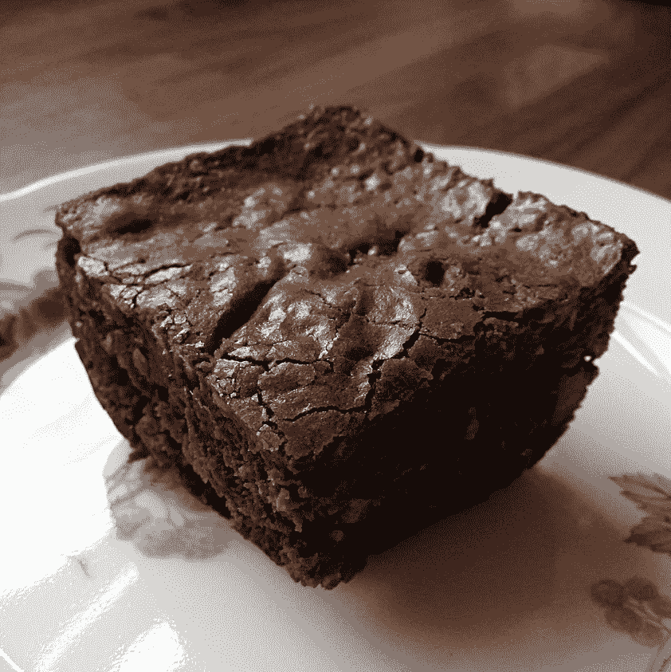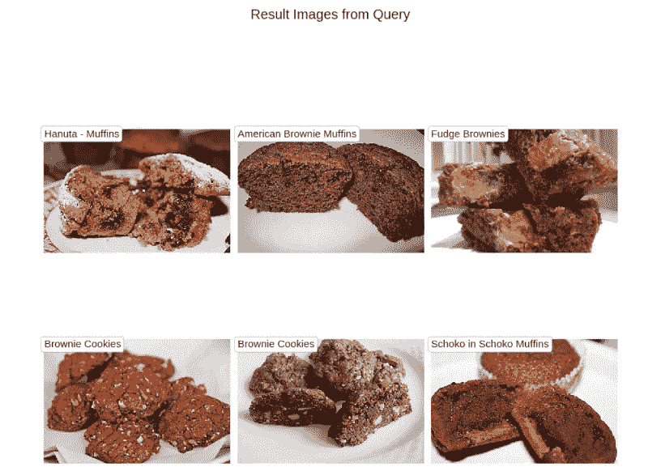

我们甚至可以创建一个图像网格来查看神经网络的解释。下图只是整个图像的一小部分。你可以看到有相似特征的烹饪菜肴靠得更近。整个网格可以在这里找到[。](https://github.com/Murgio/Food-Recipe-CNN/blob/master/output/tsne/20000-tSNE-grid-recipes.jpg)

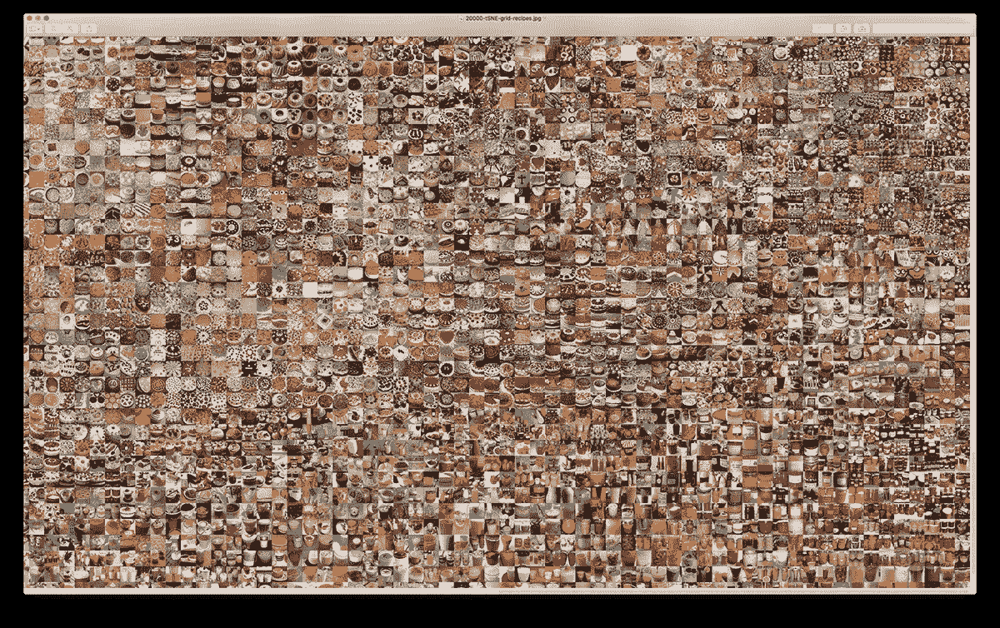

Figure 10: Similar cooking dishes are closer to each other.

# 结论

我们引入了一个新的数据集，将烹饪图像和相应的食谱结合在一起。我们强调了选择的食物领域和预先存在的图像分类任务之间的差异，并通过实验研究了卷积神经网络和近似最近邻方法的有效性。

如何在没有预训练的情况下从头开始训练自己的神经网络，并使用 Flask 将我们的系统变成 web 应用程序(第五部分和第六部分)，将在下一篇教程中讨论。